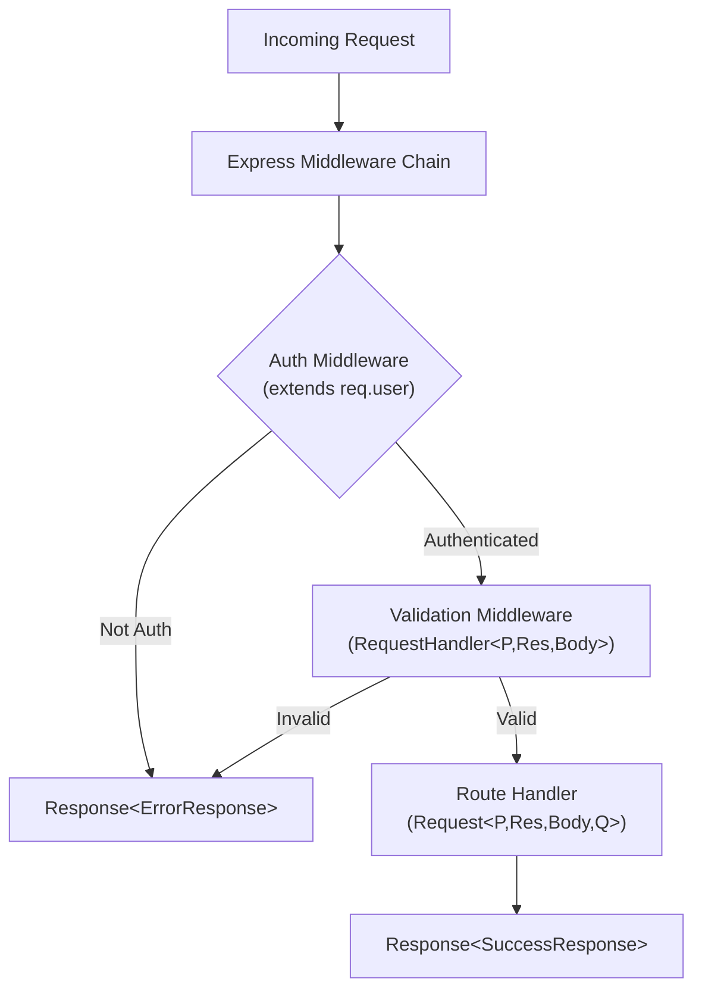

# How to Type Express Request and Response in TypeScript

Every Express + TypeScript project I've worked on hits the same wall within the first week: someone tries to access `req.user` and TypeScript yells at them. Or they want to type the request body on a POST route and can't figure out where the generic goes. Or  my personal favorite  they type `res.json()` but there's no autocomplete for the shape of the response they're sending back.

Express was built in the JavaScript era. Its types exist, but they're... not what you'd call intuitive. The `Request` type alone has four generic parameters, and the docs don't exactly spell out what each one does.

I've typed Express request and response objects across maybe a dozen projects at this point, and I've found a set of patterns that actually work without making you want to throw your keyboard. Here's all of them.

## The Request Type: Four Generics You Need to Know

The Express `Request` type signature looks like this:

```typescript
interface Request<
  P = ParamsDictionary,    // route params (req.params)
  ResBody = any,           // response body (rarely used on Request)
  ReqBody = any,           // request body (req.body)
  ReqQuery = ParsedQs      // query string (req.query)
> extends http.IncomingMessage { }
```

Most people don't realize `Request` takes four generics. And honestly, you usually only care about three of them  `P`, `ReqBody`, and `ReqQuery`. The `ResBody` on the Request type is kind of vestigial; it's more useful on the `Response` type.

Here's how to use them in practice:

```typescript
import { Request, Response } from 'express';

// Type the route params
interface UserParams {
  id: string; // route params are always strings
}

// Type the request body
interface CreateUserBody {
  name: string;
  email: string;
  role: 'admin' | 'user';
}

// Type the query string
interface UserQuery {
  page?: string;
  limit?: string;
  sort?: 'name' | 'email' | 'createdAt';
}

// PUT /users/:id  typed params + body
app.put(
  '/users/:id',
  (req: Request<UserParams, {}, CreateUserBody>, res: Response) => {
    const { id } = req.params;     // string  typed
    const { name, email } = req.body; // typed
    // ...
  }
);

// GET /users?page=1&limit=10  typed query
app.get(
  '/users',
  (req: Request<{}, {}, {}, UserQuery>, res: Response) => {
    const { page, limit, sort } = req.query; // typed
    // ...
  }
);
```

> **Tip:** Route params are always `string` in Express, even if the value looks like a number. Don't type `id` as `number`  you'll need to parse it yourself with `parseInt()` or a validation library.

| Generic Position | Maps To | Example Type |
|-----------------|---------|-------------|
| `P` (1st) | `req.params` | `{ id: string }` |
| `ResBody` (2nd) | Response body shape | `{ user: User }` |
| `ReqBody` (3rd) | `req.body` | `{ name: string; email: string }` |
| `ReqQuery` (4th) | `req.query` | `{ page?: string; sort?: string }` |

That second generic for `ResBody` is awkward on the `Request`  it makes more sense when typing the `Response`, which we'll cover next.

## Typing the Response: `Response<T>`

The `Response` type is cleaner. It takes one generic that types what you pass to `res.json()` or `res.send()`:

```typescript
interface UserResponse {
  id: number;
  name: string;
  email: string;
}

interface ErrorResponse {
  error: string;
  details?: string[];
}

app.get(
  '/users/:id',
  (
    req: Request<UserParams>,
    res: Response<UserResponse | ErrorResponse>
  ) => {
    const user = findUser(req.params.id);

    if (!user) {
      // TypeScript knows this must match ErrorResponse
      return res.status(404).json({ error: 'User not found' });
    }

    // TypeScript knows this must match UserResponse
    res.json(user);

    // This would error  wrong shape
    // res.json({ wrong: 'field' });
  }
);
```

This is genuinely useful. It means you can't accidentally send a response with a shape your frontend isn't expecting. Pair this with typed API clients on the frontend (see our [Axios typing guide](/blog/type-axios-response-data-typescript)) and you've got end-to-end type safety across the wire.

## Extending Request for Auth: The `req.user` Problem

This is the one everybody fights with. You add Passport or a custom auth middleware, and now `req.user` exists at runtime but TypeScript doesn't know about it. The typical approach is declaration merging:

```typescript
// types/express.d.ts
declare global {
  namespace Express {
    interface Request {
      user?: {
        id: string;
        email: string;
        role: 'admin' | 'user';
      };
    }
  }
}

export {}; // This file must be a module
```

Once this file exists in your project (and is included in your `tsconfig.json`'s `include` array), every `Request` in your app will have `req.user` available:

```typescript
app.get('/profile', (req: Request, res: Response) => {
  if (!req.user) {
    return res.status(401).json({ error: 'Not authenticated' });
  }

  // req.user is narrowed  no undefined
  console.log(req.user.email);
});
```

A word of caution though: declaration merging is global. It affects every route, not just the ones behind your auth middleware. I've seen teams use a different approach  a custom typed request  when they want per-route control:

```typescript
interface AuthenticatedRequest extends Request {
  user: {
    id: string;
    email: string;
    role: 'admin' | 'user';
  };
}

// Only use AuthenticatedRequest on protected routes
app.get('/profile', (req: AuthenticatedRequest, res: Response) => {
  // req.user is guaranteed  no optional check needed
  console.log(req.user.email);
});
```

Both approaches work. I personally prefer declaration merging for consistency, but the custom interface approach is cleaner if you have lots of different "enriched" request types (user, tenant, session, etc.).

## Typed Middleware with RequestHandler

Express exports a `RequestHandler` type that bundles the `req`, `res`, and `next` types together. It's handy for typing standalone middleware functions:

```typescript
import { RequestHandler } from 'express';

// A middleware that validates request body
const validateCreateUser: RequestHandler<
  {},                    // params
  ErrorResponse,         // response body (for error case)
  CreateUserBody         // request body
> = (req, res, next) => {
  const { name, email } = req.body; // typed as CreateUserBody

  if (!name || !email) {
    return res.status(400).json({
      error: 'Name and email are required',
    });
  }

  next();
};

app.post('/users', validateCreateUser, createUserHandler);
```

`RequestHandler` accepts the same generics as `Request` in the same order. The benefit is you don't have to manually annotate `req`, `res`, and `next`  they're all inferred.



## Putting It All Together: A Typed Route Module

Here's what a real-world typed Express route file looks like when you combine everything:

```typescript
import { Router, Request, Response, RequestHandler } from 'express';

// --- Types ---
interface UserParams { id: string }
interface CreateUserBody { name: string; email: string }
interface UserQuery { page?: string; limit?: string }
interface UserResponse { id: number; name: string; email: string }
interface ListResponse { users: UserResponse[]; total: number }
interface ErrorResponse { error: string }

// --- Middleware ---
const requireAuth: RequestHandler = (req, res, next) => {
  if (!req.user) {
    return res.status(401).json({ error: 'Unauthorized' });
  }
  next();
};

// --- Routes ---
const router = Router();

router.get(
  '/',
  (req: Request<{}, ListResponse, {}, UserQuery>, res: Response<ListResponse>) => {
    const page = parseInt(req.query.page ?? '1', 10);
    const limit = parseInt(req.query.limit ?? '20', 10);
    // ... fetch users
    res.json({ users: [], total: 0 });
  }
);

router.post(
  '/',
  requireAuth,
  (req: Request<{}, UserResponse, CreateUserBody>, res: Response<UserResponse | ErrorResponse>) => {
    const { name, email } = req.body;
    // ... create user
    res.status(201).json({ id: 1, name, email });
  }
);

router.get(
  '/:id',
  (req: Request<UserParams>, res: Response<UserResponse | ErrorResponse>) => {
    // req.params.id is typed as string
    res.json({ id: 1, name: 'Alice', email: 'alice@test.com' });
  }
);

export default router;
```

If you're converting an existing JavaScript Express app to TypeScript, I'd recommend doing it route file by route file. Start with the ones that have the most bugs or the most complex request shapes. And if you want a head start on converting the syntax, [SnipShift's JS to TypeScript converter](https://snipshift.dev/js-to-ts) can handle the boilerplate  it'll add type annotations to your route handlers and infer interface shapes from your request/response usage.

## Common Gotchas

A few things I've learned the hard way:

**`req.body` is `any` by default**  even with `@types/express` installed. You have to explicitly type it via the generic or it's useless. Don't assume the types package does this for you.

**`req.query` values are always `string | string[] | ParsedQs | undefined`**  Express uses the `qs` library under the hood, which can parse nested objects. If you just want flat string params, type your query interface with `string` values and cast carefully.

**`res.json()` doesn't validate at runtime**  TypeScript makes sure you're sending the right *shape*, but it won't stop you from sending `null` fields or missing data if your logic has bugs. Consider pairing with [Zod validation](/blog/common-typescript-mistakes) for runtime guarantees.

For a deeper look at building a full REST API with Express and TypeScript, check out our [REST API TypeScript guide](/blog/rest-api-typescript-express-guide). And if you're still getting comfortable with TypeScript generics in general, the [generics explained](/blog/typescript-generics-explained) post breaks down the concept from scratch.

The Express type system isn't perfect  it was bolted on after the fact, and it shows. But with the patterns above, you can get 95% of the type safety you'd get from a TypeScript-first framework like Hono or tRPC. And sometimes that's all you need.
