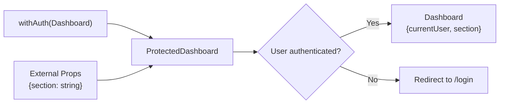

# How to Type a Higher-Order Component (HOC) in TypeScript

I'll be honest  I almost didn't write this post. Higher-order components have been falling out of favor for years, and in 2026, most new React code uses hooks instead. But HOCs aren't dead. They show up in older codebases, in certain library patterns, and in specific cases where hooks genuinely can't do the job. And when you need to type a higher-order component in TypeScript, the generics can get genuinely hairy.

So let's do this. I'll show you the generic HOC pattern, explain how injected props work, and then we'll talk about when you should actually use a HOC versus just writing a hook.

## What a HOC Actually Is (Quick Refresher)

A higher-order component is a function that takes a component and returns a new component with additional behavior or props. That's it. It's just a function.

```typescript
// Pseudocode structure
function withSomething(WrappedComponent) {
  return function EnhancedComponent(props) {
    // add behavior, inject props, whatever
    return <WrappedComponent {...props} extraProp={value} />;
  };
}
```

The tricky part with TypeScript is getting the generic types right so that:
1. The HOC preserves the original component's prop types
2. Injected props are removed from the enhanced component's public API
3. Everything works with strict mode enabled

## The Basic Typed HOC Pattern

Let's start with a real example  a `withLoading` HOC that shows a spinner while data is loading:

```typescript
import { ComponentType } from "react";

// Props that the HOC injects into the wrapped component
interface WithLoadingInjectedProps {
  isLoading: boolean;
}

// The HOC function
function withLoading<P extends WithLoadingInjectedProps>(
  WrappedComponent: ComponentType<P>
) {
  // The enhanced component's props = original props minus injected props
  type ExternalProps = Omit<P, keyof WithLoadingInjectedProps> & {
    isLoading: boolean;
  };

  function WithLoadingComponent(props: ExternalProps) {
    if (props.isLoading) {
      return <div className="spinner">Loading...</div>;
    }

    // We need the assertion because TypeScript can't verify
    // that ExternalProps + injected props = P
    return <WrappedComponent {...(props as unknown as P)} />;
  }

  WithLoadingComponent.displayName = `withLoading(${
    WrappedComponent.displayName || WrappedComponent.name || "Component"
  })`;

  return WithLoadingComponent;
}
```

Let me break down the generics:

- `P extends WithLoadingInjectedProps`  the wrapped component's props must include the injected props. This ensures the inner component actually expects the props the HOC provides.
- `Omit<P, keyof WithLoadingInjectedProps>`  the enhanced component's external props are the original props minus whatever the HOC injects. Consumers shouldn't have to pass `isLoading` twice.
- The `as unknown as P` assertion is ugly but necessary. TypeScript's type system can't prove that `Omit<P, K> & K === P` in the general case. This is a known limitation.

Usage:

```typescript
interface UserProfileProps {
  name: string;
  email: string;
  isLoading: boolean;
}

function UserProfile({ name, email, isLoading }: UserProfileProps) {
  return (
    <div>
      <h2>{name}</h2>
      <p>{email}</p>
    </div>
  );
}

const UserProfileWithLoading = withLoading(UserProfile);

// Consumer only passes the non-injected props
// isLoading is still part of ExternalProps here because
// the HOC needs it to decide whether to show the spinner
<UserProfileWithLoading name="Alice" email="alice@example.com" isLoading={false} />
```

## A TypeScript Higher-Order Component That Injects Props

Here's a more practical example  a `withAuth` HOC that injects the current user:

```typescript
import { ComponentType } from "react";

interface User {
  id: string;
  name: string;
  role: "admin" | "editor" | "viewer";
}

// These props get injected by the HOC
interface WithAuthInjectedProps {
  currentUser: User;
}

function withAuth<P extends WithAuthInjectedProps>(
  WrappedComponent: ComponentType<P>
) {
  type ExternalProps = Omit<P, keyof WithAuthInjectedProps>;

  function WithAuthComponent(props: ExternalProps) {
    const currentUser = useAuth(); // from your auth context/hook

    if (!currentUser) {
      return <Navigate to="/login" />;
    }

    return (
      <WrappedComponent
        {...(props as unknown as P)}
        currentUser={currentUser}
      />
    );
  }

  WithAuthComponent.displayName = `withAuth(${
    WrappedComponent.displayName || WrappedComponent.name || "Component"
  })`;

  return WithAuthComponent;
}
```

The key difference: `ExternalProps` uses `Omit` to remove `currentUser` from the public API. The enhanced component no longer expects `currentUser` as a prop  the HOC provides it internally.

```typescript
interface AdminDashboardProps {
  currentUser: User;
  section: string;
}

function AdminDashboard({ currentUser, section }: AdminDashboardProps) {
  return (
    <div>
      <h1>Welcome, {currentUser.name}</h1>
      <p>Viewing: {section}</p>
    </div>
  );
}

const ProtectedDashboard = withAuth(AdminDashboard);

// Only need to pass 'section'  currentUser is injected
<ProtectedDashboard section="analytics" />
```



## Composing Multiple HOCs

You can stack HOCs, though the types get progressively harder to read:

```typescript
// Each HOC strips its injected props and passes the rest through
const EnhancedComponent = withAuth(
  withLoading(
    withTheme(BaseComponent)
  )
);
```

This compiles, but it's hard to follow. A `compose` utility helps:

```typescript
// Simple two-HOC compose (for more, use a library like lodash/fp)
function compose<P1, P2, P3>(
  hoc1: (c: ComponentType<P1>) => ComponentType<P2>,
  hoc2: (c: ComponentType<P3>) => ComponentType<P1>
): (c: ComponentType<P3>) => ComponentType<P2> {
  return (component) => hoc1(hoc2(component));
}
```

But honestly? If you're composing more than two HOCs, you should probably be using hooks instead. Which brings us to the real question.

## HOCs vs Hooks in 2026: When to Use Which

Here's my honest take: **default to hooks.** HOCs were the primary pattern for sharing logic before hooks existed. Now that hooks are here and mature, they're better for the vast majority of use cases.

| Aspect | HOCs | Hooks |
|--------|------|-------|
| TypeScript ergonomics | Challenging  requires `Omit`, assertions | Natural  just typed return values |
| Composability | Nested wrappers, prop name conflicts | Just call multiple hooks |
| Debugging (DevTools) | Wrapper hell  `withAuth(withTheme(withLoading(...)))` | Flat component tree |
| Conditional logic | Component-level only | Can use inside conditionals (with rules) |
| Accessing wrapped component's ref | Requires `forwardRef` wrapping | No issue |
| Third-party component enhancement | HOCs work when you can't modify the component | Hooks require modifying the component |

That last row is the important one. HOCs are still useful when you need to enhance a component you can't modify  a third-party component, a component from another team's package, or a component generated by a tool.

```typescript
// You can't add a hook to a third-party component
// But you CAN wrap it with a HOC
const TrackedButton = withAnalytics(ExternalLibrary.Button);
```

A few other cases where HOCs still make sense:

- **Route guards**  wrapping page components with auth checks (though middleware is increasingly handling this)
- **Error boundaries**  wrapping components to catch rendering errors (class components under the hood)
- **Library integration**  some libraries like React DnD and Redux `connect` still use HOCs internally

But for sharing stateful logic, data fetching, subscriptions, event handlers? Hooks. Every time.

> **Tip:** If you're maintaining a codebase with existing HOCs and they're well-typed and working, there's no rush to rewrite them as hooks. "If it ain't broke" applies here. But for new code, reach for hooks first.

## Converting a HOC to a Hook

If you do want to migrate, here's what the `withAuth` HOC looks like as a hook:

```typescript
// The hook version  much simpler to type
function useRequireAuth(): User {
  const currentUser = useAuth();
  const navigate = useNavigate();

  useEffect(() => {
    if (!currentUser) {
      navigate("/login");
    }
  }, [currentUser, navigate]);

  return currentUser!;
}

// Usage in a component
function AdminDashboard({ section }: { section: string }) {
  const currentUser = useRequireAuth();

  return (
    <div>
      <h1>Welcome, {currentUser.name}</h1>
      <p>Viewing: {section}</p>
    </div>
  );
}
```

No generics gymnastics. No `Omit`. No type assertions. The hook returns a typed value, and the component uses it directly. TypeScript's inference handles everything.

If you've got a JavaScript codebase with HOCs that need TypeScript types, [SnipShift's JS to TypeScript converter](https://snipshift.dev/js-to-ts) can analyze the prop flow through your HOCs and generate the right generic types. It's one of those cases where automated conversion saves genuine headaches  the `Omit` and `extends` patterns aren't obvious if you're writing them by hand for the first time.

## The Bottom Line

Higher-order components in TypeScript are possible, well-understood, and sometimes the right tool. But they're no longer the default tool. The generic pattern  `ComponentType<P>`, `Omit<P, keyof InjectedProps>`, the inevitable type assertion  works, but it's fiddly compared to hooks.

My rule of thumb: if you're writing new shared logic, use a hook. If you need to wrap a component you can't modify, use a HOC. If you're maintaining existing HOCs that work fine, leave them alone.

For more on the TypeScript patterns that come up in React  especially the generic component pattern that HOCs rely on  check out our guide on [generic React components](/blog/generic-react-component-typescript). And if you're deciding how to declare the components your HOCs wrap, our [React.FC vs function declaration](/blog/react-fc-vs-function-declaration) comparison covers the trade-offs.

Write the code your team can maintain. Sometimes that's a hook. Sometimes  rarely, but sometimes  it's a well-typed HOC.
