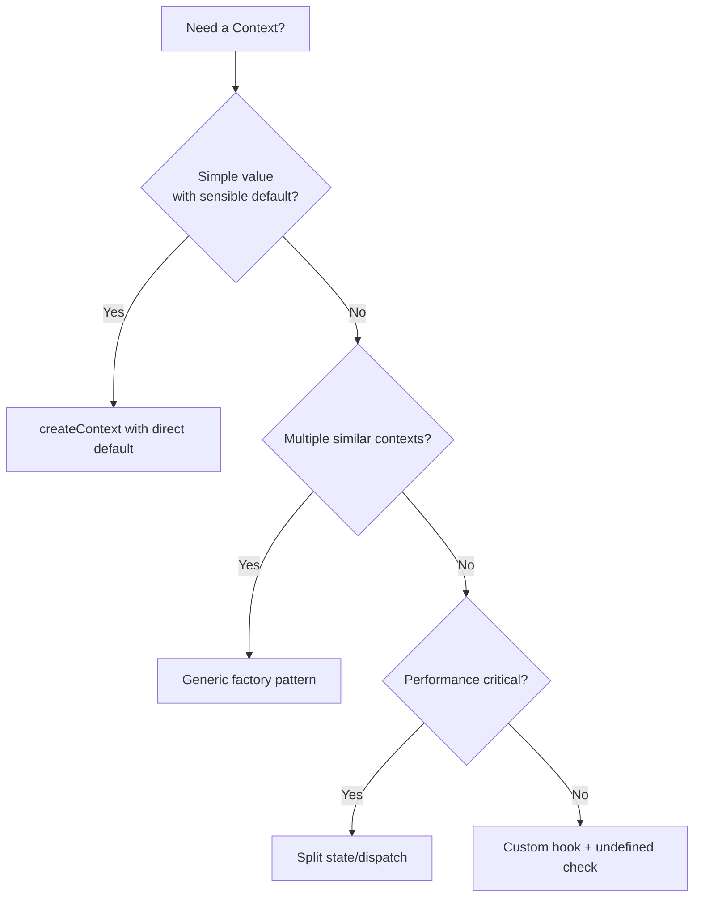

# How to Type a React Context with TypeScript (No More 'any')

Every React codebase I've worked on in the last few years has had at least one context typed as `any`. Usually more. And I get it  when you're trying to type React Context with TypeScript for the first time, the API fights you at every step. The initial value problem alone has probably caused more `as any` casts than any other pattern in React.

But here's the thing: once you learn three or four patterns, Context typing becomes almost mechanical. You stop guessing, stop fighting the compiler, and actually get the safety you switched to TypeScript for in the first place.

I'm going to walk you through every pattern I use  from basic typed contexts to the custom hook approach that eliminates null checks entirely. If you've ever stared at a `createContext` call wondering what to pass as the default value, this one's for you.

## The Problem: createContext and Its Awkward Default Value

Let's start with the fundamental issue. `createContext` requires a default value, and that default value determines the type if you don't provide a generic:

```typescript
// This gives you Context<string>  fine if your context is just a string
const MyContext = createContext("default");

// But what about complex objects?
const UserContext = createContext(???); // what goes here?
```

Most of the time, your context holds an object  user data, theme settings, auth state. And there's no sensible "default" for that. You can't create a fake user just to satisfy the initial value. So developers reach for the escape hatch:

```typescript
// The "I give up" approach
const UserContext = createContext<User | undefined>(undefined);
```

This technically works. But now every consumer of `UserContext` has to deal with `undefined`:

```typescript
const user = useContext(UserContext);
// user is User | undefined
// Every. Single. Time.
user?.name; // optional chaining everywhere
```

That gets old fast, especially when you know the provider always supplies a value. You've wrapped your entire app in `<UserProvider>`  the context is never actually undefined at runtime. But TypeScript doesn't know that.

## The Custom Hook Pattern (The One You Actually Want)

This is the pattern I use on every project now. It's become sort of an industry standard, and for good reason  it solves the undefined problem cleanly and gives you a much better developer experience.

```typescript
import { createContext, useContext, useState, ReactNode } from "react";

// 1. Define your context type
interface AuthContextType {
  user: User | null;
  login: (credentials: Credentials) => Promise<void>;
  logout: () => void;
  isLoading: boolean;
}

// 2. Create with undefined default (but don't export this)
const AuthContext = createContext<AuthContextType | undefined>(undefined);

// 3. Custom hook with runtime check
export function useAuth(): AuthContextType {
  const context = useContext(AuthContext);
  if (context === undefined) {
    throw new Error("useAuth must be used within an AuthProvider");
  }
  return context; // TypeScript narrows this to AuthContextType
}

// 4. Provider component
export function AuthProvider({ children }: { children: ReactNode }) {
  const [user, setUser] = useState<User | null>(null);
  const [isLoading, setIsLoading] = useState(false);

  const login = async (credentials: Credentials) => {
    setIsLoading(true);
    // ... auth logic
    setIsLoading(false);
  };

  const logout = () => {
    setUser(null);
  };

  return (
    <AuthContext.Provider value={{ user, login, logout, isLoading }}>
      {children}
    </AuthContext.Provider>
  );
}
```

The magic is in the custom hook. That `if (context === undefined)` check does two things:

1. **At runtime**, it gives you a clear error message if someone forgets the provider  way better than "Cannot read property 'user' of undefined"
2. **At compile time**, TypeScript narrows the type. After the check, `context` is `AuthContextType`, not `AuthContextType | undefined`

So consumers get a clean API:

```typescript
function Dashboard() {
  const { user, logout } = useAuth(); // no undefined, no null checks
  return <button onClick={logout}>Logout {user?.name}</button>;
}
```

No optional chaining on the context itself. No type assertions. Just clean, typed access.

## Type React Context with TypeScript: The Generic Pattern

What if you need a reusable context factory? Say you're building a component library and need multiple contexts that follow the same pattern. You can make the whole thing generic:

```typescript
import { createContext, useContext, ReactNode } from "react";

function createStrictContext<T>(name: string) {
  const Context = createContext<T | undefined>(undefined);

  function useStrictContext(): T {
    const context = useContext(Context);
    if (context === undefined) {
      throw new Error(
        `use${name} must be used within a ${name}Provider`
      );
    }
    return context;
  }

  function Provider({
    value,
    children,
  }: {
    value: T;
    children: ReactNode;
  }) {
    return <Context.Provider value={value}>{children}</Context.Provider>;
  }

  return [Provider, useStrictContext] as const;
}
```

Now creating a typed context is a one-liner:

```typescript
const [ThemeProvider, useTheme] = createStrictContext<ThemeContextType>("Theme");
const [AuthProvider, useAuth] = createStrictContext<AuthContextType>("Auth");
```

I picked this pattern up from a team I worked with about two years ago, and I've used it on every project since. It eliminates so much boilerplate.

## Handling Multiple Contexts Without Losing Your Mind

Real apps don't have one context. They have five. Or ten. And nesting providers can get gnarly:

```tsx
// The "provider pyramid of doom"
function App() {
  return (
    <ThemeProvider>
      <AuthProvider>
        <NotificationProvider>
          <FeatureFlagProvider>
            <CartProvider>
              <App />
            </CartProvider>
          </FeatureFlagProvider>
        </NotificationProvider>
      </AuthProvider>
    </ThemeProvider>
  );
}
```

There are a couple of ways to clean this up. The one I prefer is a `composeProviders` utility:

```typescript
import { ComponentType, ReactNode } from "react";

type Provider = ComponentType<{ children: ReactNode }>;

function composeProviders(...providers: Provider[]) {
  return function ComposedProviders({ children }: { children: ReactNode }) {
    return providers.reduceRight(
      (child, ProviderComponent) => (
        <ProviderComponent>{child}</ProviderComponent>
      ),
      children
    );
  };
}

// Usage
const AllProviders = composeProviders(
  ThemeProvider,
  AuthProvider,
  NotificationProvider,
  FeatureFlagProvider,
  CartProvider
);

function App() {
  return (
    <AllProviders>
      <MainContent />
    </AllProviders>
  );
}
```

The typing here is a bit loose  we're relying on each provider only needing `children` as a prop. If your providers need additional props, you'll need a different approach. But for the common case where providers grab their own data internally, this works great.

## Context with Separate State and Dispatch

Here's a pattern that trips people up when they try to type React Context with TypeScript: splitting state and dispatch into separate contexts. This is actually a performance optimization  components that only dispatch actions don't re-render when state changes.

```typescript
interface TodoState {
  todos: Todo[];
  filter: "all" | "active" | "completed";
}

type TodoAction =
  | { type: "ADD_TODO"; payload: string }
  | { type: "TOGGLE_TODO"; payload: number }
  | { type: "SET_FILTER"; payload: TodoState["filter"] };

// Two separate contexts
const TodoStateContext = createContext<TodoState | undefined>(
  undefined
);
const TodoDispatchContext = createContext<
  React.Dispatch<TodoAction> | undefined
>(undefined);

// Two separate hooks
export function useTodoState(): TodoState {
  const context = useContext(TodoStateContext);
  if (!context) {
    throw new Error("useTodoState must be used within TodoProvider");
  }
  return context;
}

export function useTodoDispatch(): React.Dispatch<TodoAction> {
  const context = useContext(TodoDispatchContext);
  if (!context) {
    throw new Error(
      "useTodoDispatch must be used within TodoProvider"
    );
  }
  return context;
}
```

The provider wraps both:

```typescript
function TodoProvider({ children }: { children: ReactNode }) {
  const [state, dispatch] = useReducer(todoReducer, {
    todos: [],
    filter: "all",
  });

  return (
    <TodoStateContext.Provider value={state}>
      <TodoDispatchContext.Provider value={dispatch}>
        {children}
      </TodoDispatchContext.Provider>
    </TodoStateContext.Provider>
  );
}
```

If you want to go deeper on typing `useReducer` with discriminated unions, check out our guide on [how to type useReducer in TypeScript](/blog/type-usereducer-typescript)  it pairs perfectly with this context pattern.

> **Tip:** Splitting state and dispatch contexts is only worth it if you have components that dispatch without reading state. For small contexts, a single context is simpler and totally fine.

## Common Patterns at a Glance

Here's a quick reference for the patterns we've covered:

| Pattern | When to Use | Complexity |
|---------|------------|------------|
| Direct generic `createContext<T>(defaultValue)` | Simple, single-value contexts | Low |
| Custom hook with undefined check | Most contexts (this should be your default) | Low |
| Generic factory (`createStrictContext`) | Multiple contexts with same pattern | Medium |
| Split state/dispatch contexts | Performance-sensitive contexts with many consumers | Medium |
| `composeProviders` utility | Apps with 4+ nested providers | Low |



## Avoiding the 'as any' Temptation

I want to call out a few anti-patterns I see all the time, because old habits die hard:

```typescript
// ❌ Don't do this  you lose all type safety
const UserContext = createContext<any>(null);

// ❌ Don't do this either  non-null assertion is lying to the compiler
const UserContext = createContext<UserType>(null!);

// ❌ And definitely don't do this
const UserContext = createContext({} as UserType);
```

That last one is particularly sneaky. It compiles, it won't throw at the provider level, but if any component accidentally renders outside the provider, it'll get an empty object that satisfies the type checker but blows up at runtime. You'll get `undefined is not a function` instead of a clear error message.

The custom hook pattern with the runtime check is better in every way. Use it.

If you're migrating a JavaScript React app to TypeScript and need to add types to a bunch of contexts quickly, [SnipShift's JS to TypeScript converter](https://snipshift.dev/js-to-ts) can handle the mechanical parts  inferring types from your existing usage and generating proper interfaces. It's especially handy for those 20-property context objects where writing the interface by hand is just tedious.

## What About Server Components?

Quick note for 2026: if you're working with React Server Components, context doesn't work in server components. Contexts are a client-side concept. You'll need to mark your provider with `"use client"` and only use `useContext` (or your custom hooks) in client components.

This doesn't change any of the typing patterns above  it's just a runtime constraint to be aware of. Your types stay exactly the same.

## Wrapping Up

Honestly, typing React Context isn't hard once you internalize one pattern: **create with undefined, wrap in a custom hook, throw if missing**. That's the whole trick. Everything else  the generic factory, split contexts, composed providers  those are optimizations on top of that core idea.

If you're also working through a broader TypeScript migration, our guide on [how to convert JavaScript to TypeScript](/blog/convert-javascript-to-typescript) covers the full file-by-file strategy. And if you're typing your components, you might find our [React.FC vs function declaration](/blog/react-fc-vs-function-declaration) comparison useful for deciding how to declare them.

The `any` days are over. Your contexts deserve real types.
