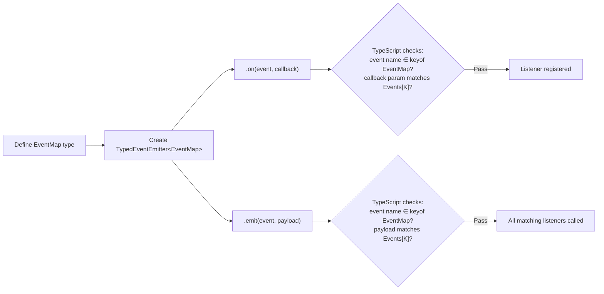

# How to Create a Type-Safe Event Emitter in TypeScript

Event emitters are everywhere. WebSocket messages, state changes, plugin systems, logging hooks  anytime you need decoupled components to communicate, you're probably reaching for some variation of pub/sub. The problem? Most event emitter implementations in JavaScript treat event names as `string` and payloads as `any`, which means you lose every bit of type safety at the exact point where bugs love to hide.

I've tracked down more than a few production issues that boiled down to "we renamed an event but forgot to update one listener" or "the payload shape changed and nobody told the subscriber." A **type-safe event emitter** makes these bugs impossible  TypeScript catches them at compile time.

Here's how to build one from scratch.

## The Event Map Pattern

The key insight is defining a **map** of event names to their payload types. This is what TypeScript uses to enforce correctness everywhere:

```typescript
// Define your events as a type map
type AppEvents = {
  userLogin: { userId: string; timestamp: number };
  userLogout: { userId: string };
  notification: { message: string; level: "info" | "warn" | "error" };
  themeChange: "light" | "dark";
};
```

Each key is an event name, each value is the payload type. Simple concept, but it powers everything that follows.

## Building the Type-Safe Event Emitter

Here's the full implementation. Read through it once  I'll break it down after:

```typescript
type EventMap = Record<string, any>;
type EventCallback<T> = (payload: T) => void;

class TypedEventEmitter<Events extends EventMap> {
  private listeners: {
    [K in keyof Events]?: Set<EventCallback<Events[K]>>;
  } = {};

  on<K extends keyof Events>(
    event: K,
    callback: EventCallback<Events[K]>
  ): () => void {
    if (!this.listeners[event]) {
      this.listeners[event] = new Set();
    }
    this.listeners[event]!.add(callback);

    // Return an unsubscribe function
    return () => this.off(event, callback);
  }

  off<K extends keyof Events>(
    event: K,
    callback: EventCallback<Events[K]>
  ): void {
    this.listeners[event]?.delete(callback);
  }

  emit<K extends keyof Events>(event: K, payload: Events[K]): void {
    this.listeners[event]?.forEach((callback) => callback(payload));
  }

  once<K extends keyof Events>(
    event: K,
    callback: EventCallback<Events[K]>
  ): () => void {
    const wrapper = (payload: Events[K]) => {
      callback(payload);
      this.off(event, wrapper);
    };
    return this.on(event, wrapper);
  }

  removeAllListeners<K extends keyof Events>(event?: K): void {
    if (event) {
      this.listeners[event] = new Set();
    } else {
      this.listeners = {};
    }
  }
}
```

The magic is the generic constraint `Events extends EventMap`. When you instantiate this class with a specific event map, TypeScript locks everything down.

## Using the Emitter

```typescript
const emitter = new TypedEventEmitter<AppEvents>();

// TypeScript knows the payload type for each event
emitter.on("userLogin", (payload) => {
  // payload is { userId: string; timestamp: number }  fully typed
  console.log(`User ${payload.userId} logged in at ${payload.timestamp}`);
});

emitter.on("notification", (payload) => {
  // payload is { message: string; level: "info" | "warn" | "error" }
  if (payload.level === "error") {
    console.error(payload.message);
  }
});

// This works  correct event name and payload shape
emitter.emit("userLogin", { userId: "abc-123", timestamp: Date.now() });

// TypeScript error: Property 'timestamp' is missing
// emitter.emit("userLogin", { userId: "abc-123" });

// TypeScript error: Argument of type '"userSignup"' is not assignable
// emitter.emit("userSignup", { userId: "abc-123" });
```

That last example is the real win. If someone renames `userLogin` to `userSignIn`, every `emit` and `on` call with the old name lights up red. No runtime surprises, no grep-and-pray refactoring.

## How It Flows



## The Unsubscribe Pattern

You might have noticed that `on()` returns a cleanup function. This is intentional  it's way cleaner than forcing callers to keep a reference to the callback for later removal:

```typescript
// Clean pattern: save the unsubscribe function
const unsubscribe = emitter.on("themeChange", (theme) => {
  document.body.className = theme;
});

// Later, when you're done listening
unsubscribe();
```

This works beautifully with React's `useEffect`:

```typescript
useEffect(() => {
  const unsub = emitter.on("notification", (payload) => {
    showToast(payload.message, payload.level);
  });

  return unsub; // Cleanup on unmount
}, []);
```

No dangling listeners. No memory leaks. The cleanup function captures the exact callback reference, so you don't need to hoist it into a variable.

## Extending Node.js EventEmitter

If you're in a Node.js environment and want to keep compatibility with the built-in `EventEmitter` while adding type safety, you can extend it:

```typescript
import { EventEmitter } from "events";

class TypedNodeEmitter<
  Events extends Record<string, any[]>
> extends EventEmitter {
  emit<K extends keyof Events>(
    event: K,
    ...args: Events[K]
  ): boolean {
    return super.emit(event as string, ...args);
  }

  on<K extends keyof Events>(
    event: K,
    listener: (...args: Events[K]) => void
  ): this {
    return super.on(event as string, listener);
  }

  off<K extends keyof Events>(
    event: K,
    listener: (...args: Events[K]) => void
  ): this {
    return super.off(event as string, listener);
  }
}

// Note: Node.js events use argument arrays, not single payloads
type ServerEvents = {
  connection: [socket: Socket, id: string];
  error: [error: Error];
  close: [];
};

const server = new TypedNodeEmitter<ServerEvents>();
server.on("connection", (socket, id) => {
  // socket: Socket, id: string  both typed
});
```

The key difference here is that Node's `EventEmitter` uses **argument lists** (tuples), not single payloads. So the event map values are arrays. It's a bit more verbose, but it matches Node's API perfectly.

> **Tip:** If your project has existing JavaScript event emitters and you're migrating to TypeScript, [SnipShift's JS to TS converter](https://snipshift.dev/js-to-ts) can generate the initial type annotations  though you'll still want to manually define your event maps, since those represent your API contract.

## The mitt Alternative

If you don't want to roll your own, **mitt** is a tiny (200 bytes) event emitter library that's already type-safe:

```typescript
import mitt from "mitt";

type Events = {
  userLogin: { userId: string };
  themeChange: "light" | "dark";
};

const emitter = mitt<Events>();

emitter.on("userLogin", (payload) => {
  // payload is { userId: string }
});

// mitt also supports wildcard listeners
emitter.on("*", (type, payload) => {
  console.log(`Event: ${type}`, payload);
});
```

| Feature | Custom `TypedEventEmitter` | `mitt` |
|---|---|---|
| **Size** | ~30 lines, no dependency | ~200 bytes minified |
| **Type safety** | Full | Full |
| **Wildcard listeners** | Not built-in (easy to add) | Built-in with `*` |
| **`once()` support** | Built-in | Not built-in (easy to add) |
| **Node.js compat** | Via extension class | Browser-focused |
| **Unsubscribe pattern** | Returns cleanup function | Returns `void` (use `off`) |

Honestly, for most projects, mitt is the pragmatic choice. I only build my own when I need custom behavior  like `once()`, middleware hooks, or async listeners. But understanding the pattern is valuable regardless, because it teaches you a lot about how TypeScript generics work in practice.

## A Real-World Example: Form State Machine

Here's a pattern I've used in production  a form that communicates state changes through typed events:

```typescript
type FormEvents = {
  fieldChange: { field: string; value: unknown };
  validate: { field: string; errors: string[] };
  submit: { data: Record<string, unknown> };
  submitSuccess: { id: string };
  submitError: { error: string; retryable: boolean };
};

const formBus = new TypedEventEmitter<FormEvents>();

// Validation plugin listens for field changes
formBus.on("fieldChange", ({ field, value }) => {
  const errors = validateField(field, value);
  formBus.emit("validate", { field, errors });
});

// Analytics plugin listens for submissions
formBus.on("submit", ({ data }) => {
  trackEvent("form_submitted", { fieldCount: Object.keys(data).length });
});

// Error handler with typed payload
formBus.on("submitError", ({ error, retryable }) => {
  if (retryable) {
    showRetryDialog(error);
  } else {
    showErrorBanner(error);
  }
});
```

Each plugin only knows about the events it cares about, and TypeScript guarantees the contracts between them. Add a new event? Every emitter and listener is checked. Change a payload shape? Compiler tells you exactly what broke.

## Wrapping Up

A type-safe event emitter is one of those patterns that pays for itself almost immediately. The implementation is small  under 50 lines  and the payoff is huge: refactoring events becomes safe, payload mismatches are caught at compile time, and your IDE autocompletes event names and payload shapes.

If you're working with TypeScript generics more broadly, our guide on [TypeScript generics explained](/blog/typescript-generics-explained) covers the fundamentals. And for more patterns around type safety, check out [discriminated unions](/blog/typescript-discriminated-unions-pattern)  they pair really well with event systems for modeling state transitions.

Whether you roll your own or use mitt, the important thing is that your event names and payloads are typed. Stringly-typed events are a bug factory. Don't ship them.
