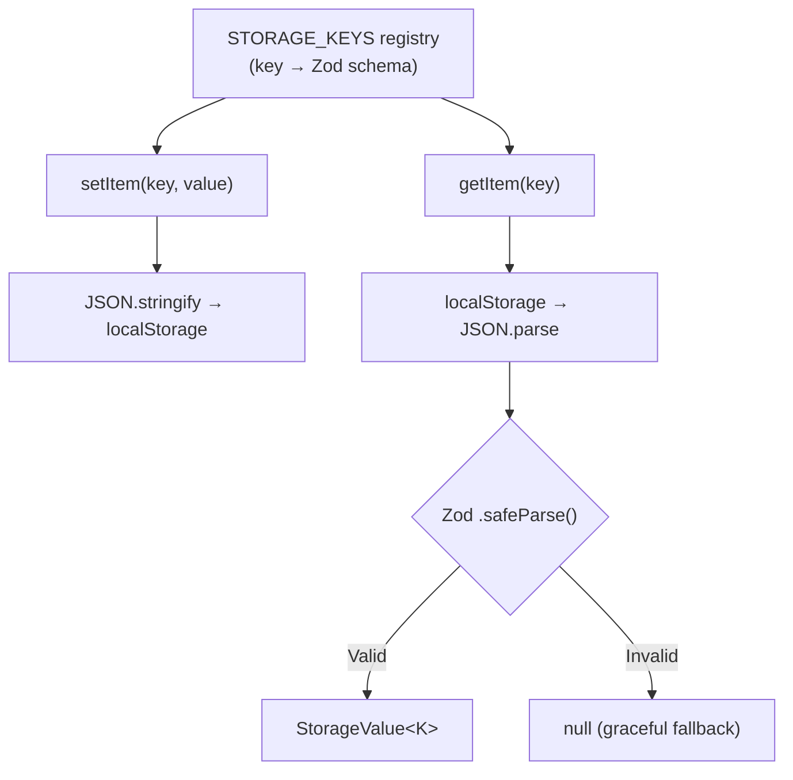

# How to Type localStorage and sessionStorage in TypeScript (Type-Safe Wrapper)

Here's the dirty secret about localStorage in TypeScript projects: almost nobody types it correctly. They call `localStorage.getItem('user')`, get back `string | null`, do a `JSON.parse()` on it, and now they have `any`. All that TypeScript safety? Gone. One `JSON.parse()` and you're back to JavaScript.

I've seen this pattern in codebases with hundreds of TypeScript files, strict mode enabled, zero `any` in the business logic  and then `JSON.parse(localStorage.getItem('settings')!)` sitting right there in a utility file. It's the kind of thing that works fine until someone changes the stored object shape and forgets to update the code that reads it.

The fix is a typed wrapper. It takes about 30 lines. And once you have it, every storage read and write in your app is type-safe with autocomplete. Let me show you.

## The Problem: `getItem` Returns `string | null`

The browser's `localStorage` API is fundamentally untyped:

```typescript
const value = localStorage.getItem('user');
// value is string | null  always

const parsed = JSON.parse(value!);
// parsed is 'any'  TypeScript can't know what was stored
```

There's no way to tell TypeScript "the value stored under the key 'user' is always a `User` object." The Storage API doesn't support generics, and `JSON.parse()` returns `any` by design. So you need to build a layer on top.

## The Generic Typed Wrapper

Here's the core wrapper  it's surprisingly simple:

```typescript
export function getStorageItem<T>(key: string): T | null {
  if (typeof window === 'undefined') return null; // SSR safety

  const item = localStorage.getItem(key);
  if (item === null) return null;

  try {
    return JSON.parse(item) as T;
  } catch {
    return null;
  }
}

export function setStorageItem<T>(key: string, value: T): void {
  if (typeof window === 'undefined') return;
  localStorage.setItem(key, JSON.stringify(value));
}

export function removeStorageItem(key: string): void {
  if (typeof window === 'undefined') return;
  localStorage.removeItem(key);
}
```

Usage:

```typescript
interface UserPreferences {
  theme: 'light' | 'dark';
  language: string;
  notifications: boolean;
}

// Write  T is inferred from the value
setStorageItem('preferences', {
  theme: 'dark',
  language: 'en',
  notifications: true,
});

// Read  pass the type explicitly
const prefs = getStorageItem<UserPreferences>('preferences');
// prefs is UserPreferences | null  typed
if (prefs) {
  console.log(prefs.theme); // 'light' | 'dark'  autocomplete works
}
```

This is already a huge improvement. But it has a flaw: the `as T` assertion in `getStorageItem` trusts that what's in storage matches `T`. If someone manually edits localStorage or a previous version of your app stored a different shape, you'll get a runtime mismatch that TypeScript didn't catch.

## Adding Zod Validation: Trust Nothing

For production code, I validate on read. Zod makes this trivial:

```typescript
import { z, ZodType } from 'zod';

export function getValidatedItem<T>(
  key: string,
  schema: ZodType<T>
): T | null {
  if (typeof window === 'undefined') return null;

  const item = localStorage.getItem(key);
  if (item === null) return null;

  try {
    const parsed = JSON.parse(item);
    const result = schema.safeParse(parsed);
    return result.success ? result.data : null;
  } catch {
    return null;
  }
}
```

Now you define the schema and get both validation and type inference:

```typescript
const PreferencesSchema = z.object({
  theme: z.enum(['light', 'dark']),
  language: z.string(),
  notifications: z.boolean(),
});

type UserPreferences = z.infer<typeof PreferencesSchema>;

const prefs = getValidatedItem('preferences', PreferencesSchema);
// prefs is UserPreferences | null
// AND it's been validated at runtime  no stale/corrupt data
```

If localStorage contains `{ theme: 'blue' }`, the validation fails gracefully and returns `null` instead of letting invalid data leak into your app. That's the difference between "works in dev" and "works in production."

> **Tip:** If you want to generate Zod schemas from your existing data shapes, [SnipShift's JSON to Zod converter](https://snipshift.dev/json-to-zod) can help  paste a sample JSON object and get a Zod schema back instantly.

## The Full Type-Safe Storage Module

Here's the pattern I use in production  a single module that handles typed reads, writes, and validation:

```typescript
import { z, ZodType } from 'zod';

// --- Storage keys registry ---
// Define all your storage keys and their schemas in one place
const STORAGE_KEYS = {
  preferences: z.object({
    theme: z.enum(['light', 'dark']),
    language: z.string(),
    notifications: z.boolean(),
  }),
  authToken: z.string(),
  onboardingComplete: z.boolean(),
  recentSearches: z.array(z.string()),
  cart: z.object({
    items: z.array(z.object({
      id: z.string(),
      quantity: z.number(),
    })),
    updatedAt: z.number(),
  }),
} as const;

type StorageKeys = typeof STORAGE_KEYS;
type StorageKey = keyof StorageKeys;
type StorageValue<K extends StorageKey> = z.infer<StorageKeys[K]>;

// --- Typed storage functions ---
export function getItem<K extends StorageKey>(
  key: K
): StorageValue<K> | null {
  if (typeof window === 'undefined') return null;

  const raw = localStorage.getItem(key);
  if (raw === null) return null;

  try {
    const parsed = JSON.parse(raw);
    const result = STORAGE_KEYS[key].safeParse(parsed);
    return result.success ? (result.data as StorageValue<K>) : null;
  } catch {
    return null;
  }
}

export function setItem<K extends StorageKey>(
  key: K,
  value: StorageValue<K>
): void {
  if (typeof window === 'undefined') return;
  localStorage.setItem(key, JSON.stringify(value));
}

export function removeItem(key: StorageKey): void {
  if (typeof window === 'undefined') return;
  localStorage.removeItem(key);
}
```

Now the key name *and* the value type are linked:

```typescript
// Key autocompletes to valid storage keys
setItem('preferences', {
  theme: 'dark',
  language: 'en',
  notifications: true,
}); // typed and validated

// This errors  wrong value type for this key
// setItem('authToken', { theme: 'dark' });

// This errors  invalid key
// setItem('nonexistent', 'value');

// Read is automatically typed based on the key
const prefs = getItem('preferences');
// prefs is { theme: 'light' | 'dark'; language: string; notifications: boolean } | null

const token = getItem('authToken');
// token is string | null
```



## Handling SSR: The `window` Problem

If you're using Next.js, Nuxt, Remix, or any framework with server-side rendering, `localStorage` doesn't exist on the server. You'll get a `ReferenceError: window is not defined` crash.

Every function in the wrapper above checks `typeof window === 'undefined'` and returns `null` early. This is the simplest approach. Some alternatives:

```typescript
// Option 1: Check at the module level
const isClient = typeof window !== 'undefined';

// Option 2: Lazy initialization
function getStorage(): Storage | null {
  if (typeof window === 'undefined') return null;
  return window.localStorage;
}

// Option 3: React hook (best for component usage)
function useLocalStorage<K extends StorageKey>(key: K) {
  const [value, setValue] = useState<StorageValue<K> | null>(() => {
    return getItem(key);
  });

  const set = useCallback((newValue: StorageValue<K>) => {
    setItem(key, newValue);
    setValue(newValue);
  }, [key]);

  const remove = useCallback(() => {
    removeItem(key);
    setValue(null);
  }, [key]);

  return [value, set, remove] as const;
}
```

The React hook approach is my favorite for component code because it syncs React state with localStorage and handles SSR automatically via `useState`'s initializer function.

| Approach | SSR Safe | React State Sync | Validated |
|----------|----------|-----------------|-----------|
| Raw `localStorage` | No | No | No |
| Generic wrapper (`as T`) | Yes | No | No |
| Zod-validated wrapper | Yes | No | Yes |
| `useLocalStorage` hook | Yes | Yes | Yes |

## sessionStorage Too

Everything above works identically for `sessionStorage`  just swap `localStorage` for `sessionStorage`. If you want both, parameterize the storage type:

```typescript
function getItem<K extends StorageKey>(
  key: K,
  storage: 'local' | 'session' = 'local'
): StorageValue<K> | null {
  if (typeof window === 'undefined') return null;
  const store = storage === 'local' ? localStorage : sessionStorage;
  const raw = store.getItem(key);
  // ... rest is the same
}
```

## The Quick Version

If you don't want the full registry pattern and just want the simplest typed wrapper:

```typescript
export const typedStorage = {
  get<T>(key: string): T | null {
    if (typeof window === 'undefined') return null;
    try {
      const item = localStorage.getItem(key);
      return item ? (JSON.parse(item) as T) : null;
    } catch {
      return null;
    }
  },

  set<T>(key: string, value: T): void {
    if (typeof window === 'undefined') return;
    localStorage.setItem(key, JSON.stringify(value));
  },

  remove(key: string): void {
    if (typeof window === 'undefined') return;
    localStorage.removeItem(key);
  },
};

// Usage
const user = typedStorage.get<User>('user');
typedStorage.set('user', { id: 1, name: 'Alice' });
```

Ten lines, SSR-safe, generic types. Not validated at runtime, but infinitely better than raw `JSON.parse()` returning `any`.

If you're converting a JavaScript project to TypeScript and have `localStorage` calls scattered everywhere, [SnipShift's JS to TypeScript converter](https://snipshift.dev/js-to-ts) can help convert the individual files. Then wrap them with the pattern above for true type safety.

For more TypeScript patterns like this, check out our [TypeScript generics guide](/blog/typescript-generics-explained)  generics are what make this whole wrapper possible. And if you're building React components that consume this storage, our [custom hook typing guide](/blog/type-custom-hook-return-typescript) covers how to properly type hooks that return multiple values.

localStorage is a simple API. But "simple" doesn't mean "safe." A 30-line wrapper is the difference between trusting whatever random JSON is sitting in the browser and actually knowing what your app is working with. Write the wrapper. Your types will thank you.
