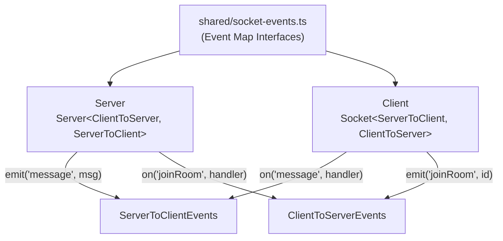

# How to Type Socket.io Events in TypeScript (Client and Server)

Socket.io's TypeScript support is one of those things that technically exists but practically nobody uses correctly. I've reviewed codebases with hundreds of socket events, and almost every single one had `any` flowing through the emit/on handlers. The event names were untyped strings, the payloads were untyped objects, and the acknowledgment callbacks  if they even existed  were completely untyped.

And I get why. The Socket.io docs mention TypeScript typing on about half a page, with a couple of examples that don't cover the real-world cases. How do you share types between client and server? How do you type acknowledgment callbacks? What about namespace-specific events?

I'm going to walk through all of it. By the end, every `emit()` and `on()` in your project will be fully typed  wrong event names and wrong payloads will be compile-time errors, not runtime surprises.

## The Core Concept: Event Maps

Socket.io's type system is built on **event map interfaces**. An event map is just a TypeScript interface where each key is an event name and each value is the function signature for that event's handler:

```typescript
// Shared event definitions  used by BOTH client and server
interface ServerToClientEvents {
  userJoined: (user: { id: string; name: string }) => void;
  message: (msg: { from: string; text: string; timestamp: number }) => void;
  roomUpdate: (users: string[]) => void;
  error: (message: string) => void;
}

interface ClientToServerEvents {
  joinRoom: (roomId: string) => void;
  sendMessage: (text: string) => void;
  leaveRoom: () => void;
  typing: (isTyping: boolean) => void;
}
```

Notice the direction: `ServerToClientEvents` defines what the server can *send* to clients. `ClientToServerEvents` defines what clients can *send* to the server. This distinction is critical  it prevents you from accidentally emitting an event in the wrong direction.

## Server-Side Typing

On the server, you pass the event maps as generics to the `Server` constructor:

```typescript
import { Server, Socket } from 'socket.io';
import { createServer } from 'http';

const httpServer = createServer();
const io = new Server<
  ClientToServerEvents,  // what clients send TO the server
  ServerToClientEvents   // what the server sends TO clients
>(httpServer);

io.on('connection', (socket) => {
  // socket.on() is typed  only ClientToServerEvents are valid
  socket.on('joinRoom', (roomId) => {
    // roomId is string  typed from the event map
    socket.join(roomId);

    // socket.emit() is typed  only ServerToClientEvents are valid
    socket.emit('userJoined', {
      id: socket.id,
      name: 'Anonymous',
    });

    // This would error  wrong event direction
    // socket.emit('sendMessage', 'hello');

    // This would error  wrong payload shape
    // socket.emit('userJoined', 'just a string');
  });

  socket.on('sendMessage', (text) => {
    // text is string  typed
    io.emit('message', {
      from: socket.id,
      text,
      timestamp: Date.now(),
    });
  });
});
```

Every `on()` handler autocompletes with valid event names. Every `emit()` call enforces the correct payload shape. Try emitting an event that doesn't exist in the map and TypeScript blocks it.

## Client-Side Typing

On the client, the generics are *reversed*  because the client sends `ClientToServerEvents` and receives `ServerToClientEvents`:

```typescript
import { io, Socket } from 'socket.io-client';

// Note: generics are FLIPPED compared to the server
const socket: Socket<ServerToClientEvents, ClientToServerEvents> = io(
  'http://localhost:3000'
);

// socket.on() listens for ServerToClientEvents
socket.on('message', (msg) => {
  // msg is { from: string; text: string; timestamp: number }  typed
  console.log(`${msg.from}: ${msg.text}`);
});

socket.on('userJoined', (user) => {
  // user is { id: string; name: string }  typed
  console.log(`${user.name} joined`);
});

// socket.emit() sends ClientToServerEvents
socket.emit('joinRoom', 'room-123');
socket.emit('sendMessage', 'Hello everyone!');

// This would error  'message' is a server-to-client event
// socket.emit('message', { from: 'me', text: 'hi', timestamp: 0 });
```

The type inversion is the part that confuses people the most. Just remember: the first generic is "what I receive," the second is "what I send."

| Constructor | 1st Generic (receive) | 2nd Generic (send) |
|------------|----------------------|-------------------|
| `Server<C, S>` | `ClientToServerEvents` | `ServerToClientEvents` |
| `Socket<S, C>` (client) | `ServerToClientEvents` | `ClientToServerEvents` |

## Sharing Types Between Client and Server

The whole point of typed events is that client and server agree on the contract. To share types, extract them into a shared package or file:

```typescript
// shared/socket-events.ts
export interface ServerToClientEvents {
  userJoined: (user: { id: string; name: string }) => void;
  message: (msg: ChatMessage) => void;
  roomUpdate: (users: string[]) => void;
  error: (message: string) => void;
}

export interface ClientToServerEvents {
  joinRoom: (roomId: string) => void;
  sendMessage: (text: string) => void;
  leaveRoom: () => void;
  typing: (isTyping: boolean) => void;
}

export interface ChatMessage {
  from: string;
  text: string;
  timestamp: number;
}
```

Then import on both sides:

```typescript
// server.ts
import type { ClientToServerEvents, ServerToClientEvents } from '../shared/socket-events';
const io = new Server<ClientToServerEvents, ServerToClientEvents>(httpServer);

// client.ts
import type { ClientToServerEvents, ServerToClientEvents } from '../shared/socket-events';
const socket: Socket<ServerToClientEvents, ClientToServerEvents> = io('...');
```

In a monorepo, you'd put `shared/` in a shared package. In a simpler setup, just share the file. The key is one source of truth for event definitions.



## Acknowledgment Callbacks

Acknowledgments let the receiver send data back to the emitter  like a response to a request. Typing them requires adding a callback parameter to your event signature:

```typescript
interface ClientToServerEvents {
  joinRoom: (
    roomId: string,
    callback: (response: { success: boolean; users: string[] }) => void
  ) => void;

  sendMessage: (
    text: string,
    callback: (response: { messageId: string }) => void
  ) => void;
}
```

Server-side usage:

```typescript
socket.on('joinRoom', (roomId, callback) => {
  // callback is typed  must pass { success: boolean; users: string[] }
  socket.join(roomId);

  const users = getRoomUsers(roomId);
  callback({ success: true, users });

  // This would error  wrong shape
  // callback({ ok: true });
});
```

Client-side usage:

```typescript
socket.emit('joinRoom', 'room-123', (response) => {
  // response is { success: boolean; users: string[] }  typed
  if (response.success) {
    console.log(`Joined with ${response.users.length} users`);
  }
});
```

This is probably the most under-used Socket.io feature. Acknowledgments replace the common pattern of emitting an event and then listening for a separate "response" event  which is race-condition-prone and hard to type correctly.

## Namespace Typing

If you use Socket.io namespaces, each namespace can have its own event maps:

```typescript
// Chat namespace events
interface ChatServerToClient {
  message: (msg: ChatMessage) => void;
  typing: (user: string) => void;
}

interface ChatClientToServer {
  sendMessage: (text: string) => void;
  startTyping: () => void;
  stopTyping: () => void;
}

// Notification namespace events
interface NotifServerToClient {
  notification: (notif: { title: string; body: string }) => void;
  badge: (count: number) => void;
}

interface NotifClientToServer {
  markRead: (notifId: string) => void;
}

// Server setup
const chatNamespace = io.of('/chat') as Namespace<
  ChatClientToServer,
  ChatServerToClient
>;

const notifNamespace = io.of('/notifications') as Namespace<
  NotifClientToServer,
  NotifServerToClient
>;

// Client
const chatSocket: Socket<ChatServerToClient, ChatClientToServer> =
  io('http://localhost:3000/chat');

const notifSocket: Socket<NotifServerToClient, NotifClientToServer> =
  io('http://localhost:3000/notifications');
```

Each namespace gets its own type boundaries. You can't accidentally emit a chat event on the notification namespace.

## Inter-Server Events

If you're running multiple Socket.io servers with the Redis adapter (for horizontal scaling), there's a fourth event map for server-to-server communication:

```typescript
interface InterServerEvents {
  ping: () => void;
  syncState: (state: AppState) => void;
}

const io = new Server<
  ClientToServerEvents,
  ServerToClientEvents,
  InterServerEvents  // third generic
>(httpServer);
```

Most projects don't need this, but if you're scaling beyond a single server, it's nice to know the type system covers it.

## Common Patterns and Tips

**Use `satisfies` for event payloads**  when constructing complex payloads, `satisfies` catches shape errors without widening the type:

```typescript
socket.emit('message', {
  from: socket.id,
  text: 'hello',
  timestamp: Date.now(),
} satisfies ChatMessage);
```

**Type the `socket.data` property**  Socket.io lets you attach arbitrary data to a socket. By default it's `any`. You can type it:

```typescript
interface SocketData {
  userId: string;
  username: string;
  room: string;
}

const io = new Server<
  ClientToServerEvents,
  ServerToClientEvents,
  InterServerEvents,
  SocketData  // fourth generic
>(httpServer);

io.on('connection', (socket) => {
  socket.data.userId = 'abc';  // typed
  socket.data.whatever = 'x';  // Error
});
```

**Don't forget `disconnect`**  the `disconnect` event is built-in and always available. You don't need to add it to your event maps. Same for `connect`, `connect_error`, and other built-in events.

> **Tip:** If you're converting an existing JavaScript Socket.io project to TypeScript and have dozens of events to catalog, start by grepping for all `socket.emit` and `socket.on` calls. Map each unique event name and its payload into your event map interfaces. [SnipShift's JS to TypeScript converter](https://snipshift.dev/js-to-ts) can help with the individual handler files  paste your socket handler code and get typed versions back.

For more on TypeScript generics (which power this entire system), see our [generics guide](/blog/typescript-generics-explained). If you're building the REST API alongside your WebSocket layer, the [Express request/response typing guide](/blog/type-express-request-response-typescript) covers that side. And for a broader look at converting your JavaScript codebase, check out our [JS to TypeScript migration guide](/blog/convert-javascript-to-typescript).

Socket.io typing might seem like overkill at first  "it's just events, I know what they do." But the moment you rename a field in a payload and the compiler flags every broken handler across both client and server, you'll understand why it's worth the 20 minutes of setup. Type your sockets. You won't regret it.
