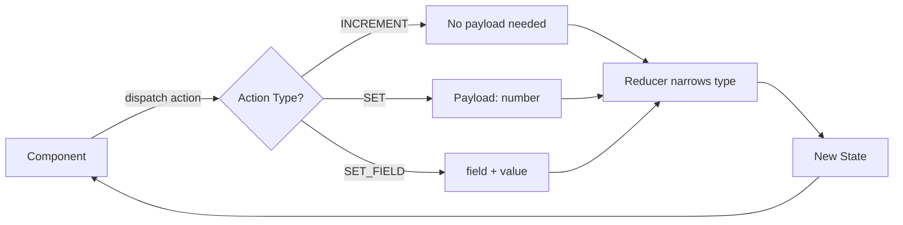

# How to Type useReducer in TypeScript (With Discriminated Unions)

If you've ever typed a reducer's action parameter as `any` and thought "I'll fix this later," you're not alone. I've seen production codebases where the entire reducer pattern  one of the few places TypeScript can genuinely save you from bugs  was completely untyped. Actions flying around with no contract, dispatch calls passing whatever they wanted. It defeats the whole purpose.

The good news? Typing `useReducer` in TypeScript is one of those things that's way easier than it looks. The secret weapon is **discriminated unions**  a TypeScript feature that was basically designed for this exact pattern. Once you get it, you'll wonder why you ever did it any other way.

## The Basics: State and Action Types

Let's start simple. A counter reducer  the "hello world" of useReducer:

```typescript
interface CounterState {
  count: number;
}

// This is a discriminated union  the 'type' field is the discriminant
type CounterAction =
  | { type: "INCREMENT" }
  | { type: "DECREMENT" }
  | { type: "SET"; payload: number };

function counterReducer(
  state: CounterState,
  action: CounterAction
): CounterState {
  switch (action.type) {
    case "INCREMENT":
      return { count: state.count + 1 };
    case "DECREMENT":
      return { count: state.count - 1 };
    case "SET":
      // TypeScript knows action.payload is a number here
      return { count: action.payload };
    default:
      return state;
  }
}
```

The key insight: when you switch on `action.type`, TypeScript **narrows** the type in each case branch. In the `"SET"` case, it knows `action` is `{ type: "SET"; payload: number }`, so `action.payload` is typed as `number`. Not `any`. Not `number | undefined`. Just `number`.

This narrowing is why discriminated unions are so powerful for reducers. You get autocompletion on the payload, compile-time errors if you forget a field, and exhaustiveness checking if you set it up right.

## Using It with useReducer

The hook itself requires minimal ceremony:

```typescript
function Counter() {
  const [state, dispatch] = useReducer(counterReducer, { count: 0 });

  return (
    <div>
      <span>{state.count}</span>
      <button onClick={() => dispatch({ type: "INCREMENT" })}>+</button>
      <button onClick={() => dispatch({ type: "DECREMENT" })}>-</button>
      <button onClick={() => dispatch({ type: "SET", payload: 0 })}>
        Reset
      </button>
    </div>
  );
}
```

TypeScript infers the types from `counterReducer`. You don't need to pass generics to `useReducer`  it picks up the state and action types automatically. And if you try to dispatch an invalid action:

```typescript
// ❌ Error: Type '"MULTIPLY"' is not assignable to type '"INCREMENT" | "DECREMENT" | "SET"'
dispatch({ type: "MULTIPLY" });

// ❌ Error: Property 'payload' is missing in type '{ type: "SET" }'
dispatch({ type: "SET" });

// ❌ Error: Type 'string' is not assignable to type 'number'
dispatch({ type: "SET", payload: "five" });
```

All caught at compile time. That's exactly what you want.

## Type useReducer in TypeScript: A Real-World Example

Counters are great for demos, but let's look at something closer to what you'd actually build. Here's a form reducer with multiple field types:

```typescript
interface FormState {
  name: string;
  email: string;
  role: "admin" | "editor" | "viewer";
  isSubmitting: boolean;
  error: string | null;
}

type FormAction =
  | { type: "SET_FIELD"; field: keyof FormState; value: string }
  | { type: "SET_ROLE"; payload: FormState["role"] }
  | { type: "SUBMIT_START" }
  | { type: "SUBMIT_SUCCESS" }
  | { type: "SUBMIT_ERROR"; payload: string }
  | { type: "RESET" };

const initialState: FormState = {
  name: "",
  email: "",
  role: "viewer",
  isSubmitting: false,
  error: null,
};
```

Notice a few things about these action types:

- **`SET_FIELD`** uses `keyof FormState` to constrain which fields can be set. This means `dispatch({ type: "SET_FIELD", field: "nonexistent", value: "test" })` won't compile.
- **`SET_ROLE`** uses `FormState["role"]`  an indexed access type  so the payload is automatically `"admin" | "editor" | "viewer"`. If you add a new role to `FormState`, the action type updates automatically.
- Some actions have no payload at all (`SUBMIT_START`, `RESET`). That's perfectly fine.

The reducer:

```typescript
function formReducer(
  state: FormState,
  action: FormAction
): FormState {
  switch (action.type) {
    case "SET_FIELD":
      return { ...state, [action.field]: action.value, error: null };
    case "SET_ROLE":
      return { ...state, role: action.payload };
    case "SUBMIT_START":
      return { ...state, isSubmitting: true, error: null };
    case "SUBMIT_SUCCESS":
      return { ...state, isSubmitting: false };
    case "SUBMIT_ERROR":
      return { ...state, isSubmitting: false, error: action.payload };
    case "RESET":
      return initialState;
  }
}
```

One thing I like about this approach: I dropped the `default` case entirely. When every case returns, TypeScript can verify that all action types are handled. If you add a new action to the union and forget to handle it, the function's return type won't match `FormState` and you'll get an error. That's exhaustiveness checking working for you.

## Exhaustive Checking with the `never` Trick

If you want to be explicit about exhaustiveness  especially in reducers where the `default` case is genuinely unexpected  there's a well-known pattern using `never`:

```typescript
function assertNever(value: never): never {
  throw new Error(`Unexpected value: ${value}`);
}

function formReducer(state: FormState, action: FormAction): FormState {
  switch (action.type) {
    case "SET_FIELD":
      return { ...state, [action.field]: action.value };
    case "SET_ROLE":
      return { ...state, role: action.payload };
    // ... other cases
    default:
      // If all cases are handled, action is narrowed to 'never'
      // If you add a new action and forget a case, this line errors
      return assertNever(action);
  }
}
```

I don't always use this  it depends on the team and how strict we want to be. But for critical reducers that manage auth state or payment flows, it's a nice safety net.

## The Async Actions Pattern

Here's where things get interesting. `useReducer` itself is synchronous  you can't do async work inside a reducer. But you can build an async dispatch wrapper around it:

```typescript
type AsyncAction =
  | FormAction
  | { type: "FETCH_USER"; payload: string }; // user ID

function useFormReducer() {
  const [state, dispatch] = useReducer(formReducer, initialState);

  const asyncDispatch = async (action: AsyncAction) => {
    if (action.type === "FETCH_USER") {
      dispatch({ type: "SUBMIT_START" });
      try {
        const response = await fetch(`/api/users/${action.payload}`);
        const user = await response.json();
        dispatch({ type: "SET_FIELD", field: "name", value: user.name });
        dispatch({ type: "SET_FIELD", field: "email", value: user.email });
        dispatch({ type: "SUBMIT_SUCCESS" });
      } catch (error) {
        dispatch({
          type: "SUBMIT_ERROR",
          payload: error instanceof Error ? error.message : "Unknown error",
        });
      }
    } else {
      dispatch(action);
    }
  };

  return [state, asyncDispatch] as const;
}
```

The `as const` at the end is important  without it, TypeScript infers the return type as `(FormState | typeof asyncDispatch)[]` instead of the tuple `[FormState, typeof asyncDispatch]`. That `as const` tells TypeScript "this is a fixed-length tuple, not a variable-length array."

> **Tip:** If you find yourself building complex async dispatch wrappers, consider whether a dedicated state management library like Zustand might serve you better. useReducer shines for synchronous, predictable state transitions. Once you're managing loading states, error handling, and API calls, you're sort of building your own state manager.

## Typing Dispatch as a Prop

When you need to pass `dispatch` down to child components, type it explicitly:

```typescript
import { Dispatch } from "react";

interface FormControlsProps {
  dispatch: Dispatch<FormAction>;
  isSubmitting: boolean;
}

function FormControls({ dispatch, isSubmitting }: FormControlsProps) {
  return (
    <button
      disabled={isSubmitting}
      onClick={() => dispatch({ type: "SUBMIT_START" })}
    >
      Submit
    </button>
  );
}
```

`React.Dispatch<FormAction>` is the correct type. Don't try to manually type it as a function  use the built-in generic.

If you're pairing this with React Context  which is common for larger state trees  our guide on [how to type React Context with TypeScript](/blog/type-react-context-typescript) covers the pattern for putting dispatch into a context with proper typing.

## Quick Reference: Action Pattern Comparison

| Pattern | Use When | Example |
|---------|----------|---------|
| Simple string type | Few actions, no payloads | `{ type: "INCREMENT" }` |
| String type + payload | Actions carry data | `{ type: "SET"; payload: number }` |
| Computed field keys | Dynamic field updates | `{ type: "SET_FIELD"; field: keyof State; value: string }` |
| Indexed access types | Payload matches a state field's type | `{ payload: State["role"] }` |
| Nested discriminated unions | Action groups/categories | `{ type: "form"; action: FormAction }` |



## One More Thing: The `useReducer` Overloads

TypeScript's type definitions for `useReducer` have a few overloads. The one most people don't know about is the initializer function variant:

```typescript
function init(initialCount: number): CounterState {
  return { count: initialCount };
}

const [state, dispatch] = useReducer(counterReducer, 0, init);
```

The third argument is a function that transforms the second argument into the initial state. This is typed correctly out of the box  `init` must accept `number` (the type of `0`) and return `CounterState`. If you're converting a JavaScript codebase that uses this pattern, [SnipShift's JS to TypeScript converter](https://snipshift.dev/js-to-ts) can pick up on the initializer and generate the right types automatically.

## The Bottom Line

Type your reducer actions as discriminated unions. Always. It's one of those rare cases where TypeScript's type system maps perfectly onto a runtime pattern  the `type` field discriminant, the switch statement, the narrowed payloads. It's like they were made for each other. (They kind of were.)

Start with your action union type, let TypeScript infer the rest from your reducer function, and you'll get autocomplete, exhaustiveness checking, and payload validation for free. If you're also working with [generic React components](/blog/generic-react-component-typescript), the same discriminated union pattern works great for component variant props too.

No more `any`. Your reducers deserve better.
