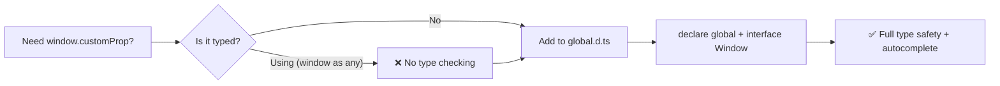

# How to Type window and document in TypeScript (Global Types)

Sooner or later, every TypeScript developer writes something like this:

```typescript
window.analytics.track("page_view");
```

And TypeScript immediately yells at you:

```
Property 'analytics' does not exist on type 'Window & typeof globalThis'.
```

You know `analytics` is there  the tracking script loads it globally. But TypeScript doesn't, because the `Window` interface in TypeScript's built-in type definitions only includes standard browser APIs. Your custom properties, third-party globals, and injected scripts aren't part of that definition.

The temptation is to write `(window as any).analytics.track(...)` and move on. Don't. There's a proper way to type window and document in TypeScript that takes about 60 seconds and gives you full autocomplete and type safety.

## How to Extend the Window Interface

Create a declaration file  I usually call it `global.d.ts` or `window.d.ts`  and use `declare global` to extend the `Window` interface:

```typescript
// global.d.ts
declare global {
  interface Window {
    analytics: {
      track: (event: string, properties?: Record<string, unknown>) => void;
      identify: (userId: string, traits?: Record<string, unknown>) => void;
      page: () => void;
    };
    __INITIAL_STATE__: Record<string, unknown>;
    gtag: (...args: unknown[]) => void;
  }
}

export {};
```

Now `window.analytics.track("page_view")` works with full type checking and autocomplete. No `any` needed.

A few things to note:

- The `declare global` block tells TypeScript you're augmenting the global scope, not creating a new module
- The `export {}` at the bottom is required  it makes the file a module, which is necessary for `declare global` to work properly
- You're extending the existing `Window` interface, not replacing it  all the standard properties (`window.location`, `window.document`, etc.) are still there

> **Tip:** If you've already learned how to type `process.env` with module augmentation, this is the exact same pattern applied to browser globals. Check out our [guide to typing process.env](/blog/type-process-env-typescript) for the Node.js equivalent.

## Common Window and Document Properties You Might Need to Type

Here's a quick reference for globals that commonly need custom typing:

| Property | Typical Use | Example Type |
|----------|------------|--------------|
| `window.analytics` | Segment, Mixpanel | `{ track: (event: string, props?: object) => void }` |
| `window.gtag` | Google Analytics 4 | `(...args: unknown[]) => void` |
| `window.dataLayer` | Google Tag Manager | `Record<string, unknown>[]` |
| `window.__NEXT_DATA__` | Next.js hydration | `{ props: Record<string, unknown> }` |
| `window.__INITIAL_STATE__` | SSR state hydration | `Record<string, unknown>` |
| `window.FB` | Facebook SDK | `{ init: (opts: object) => void; ... }` |
| `document.monetization` | Web Monetization API | `EventTarget & { state: string }` |

You don't need to type all of these upfront. Add them as you encounter TypeScript errors  that way your declaration file only contains globals your app actually uses.

## The `lib` Option in tsconfig.json

TypeScript knows about `window` and `document` because of the `lib` compiler option. By default, when you target a browser environment, TypeScript includes the DOM type definitions:

```json
{
  "compilerOptions": {
    "lib": ["ES2022", "DOM", "DOM.Iterable"]
  }
}
```

- `"DOM"` gives you `Window`, `Document`, `HTMLElement`, and all the standard browser APIs
- `"DOM.Iterable"` adds iterable support for DOM collections (`NodeList`, `HTMLCollection`, etc.)

If you're writing a Node.js-only library and don't want `window` or `document` types to even exist, remove `"DOM"` from `lib`. This is actually a useful safety check  if you accidentally reference `window` in a server-side module, TypeScript will catch it at compile time instead of letting it blow up at runtime.

```json
{
  "compilerOptions": {
    "lib": ["ES2022"]
  }
}
```

With this config, any reference to `window` or `document` is a compile error. Exactly what you want for backend code.

## The `typeof window !== 'undefined'` Guard for SSR

If you're working with Next.js, Remix, Astro, or any framework that renders on the server, you've probably hit this:

```
ReferenceError: window is not defined
```

On the server, there is no `window`. There is no `document`. If your code runs in both environments  which is increasingly common with server components and SSR  you need to guard against this.

The standard pattern:

```typescript
function getScreenWidth(): number | null {
  if (typeof window === "undefined") {
    return null; // We're on the server
  }
  return window.innerWidth;
}
```

The `typeof window === "undefined"` check is the canonical way to detect a server environment. Don't use `!window` or `window === undefined`  those will throw a `ReferenceError` in environments where `window` literally doesn't exist as a variable. The `typeof` operator is safe because it doesn't try to access the variable's value.

For React components, the common pattern is to check in `useEffect` (which only runs on the client):

```typescript
import { useEffect, useState } from "react";

function useWindowSize() {
  const [size, setSize] = useState({ width: 0, height: 0 });

  useEffect(() => {
    // Safe  useEffect only runs in the browser
    const handleResize = () => {
      setSize({ width: window.innerWidth, height: window.innerHeight });
    };

    handleResize(); // Set initial size
    window.addEventListener("resize", handleResize);
    return () => window.removeEventListener("resize", handleResize);
  }, []);

  return size;
}
```

> **Warning:** Don't access `window` or `document` at the module level (outside of functions) in code that might run on the server. Even a simple `const width = window.innerWidth` at the top of a file will crash during SSR. Always wrap it in a function or `useEffect`.

If you're working with Next.js server and client components, our [server vs client components guide](/blog/server-vs-client-components-nextjs) goes deeper into when and where browser APIs are available.

## Avoid `as any` on Window  Here's Why

I've reviewed codebases where every `window` access looks like this:

```typescript
(window as any).analytics.track("event");
(window as any).customConfig.apiUrl;
(window as any).FB.init({ appId: "123" });
```

This is worse than it looks. You get zero autocomplete, zero type checking, and zero protection against typos. If someone renames the `customConfig` property to `appConfig`, none of these lines will show an error  they'll just silently fail at runtime.

The `declare global` approach takes 2 minutes to set up and eliminates this entire class of bugs. There's really no excuse for `(window as any)` in a TypeScript codebase in 2026.



If you're converting a JavaScript project to TypeScript and need to replace a bunch of untyped `window` accesses with proper type declarations, [SnipShift's JS to TypeScript converter](https://snipshift.dev/js-to-ts) can help generate typed interfaces from your existing code. It's a good starting point for figuring out what types your globals actually need.

For more on adding TypeScript to an existing React project (including setting up declaration files), check out our [adding TypeScript to React guide](/blog/add-typescript-to-react-project). And if you're running into other common TypeScript error messages, our [common TypeScript mistakes guide](/blog/common-typescript-mistakes) covers the fixes you'll need most often.

The pattern is always the same: create a `.d.ts` file, use `declare global`, extend the interface, add `export {}`. Once you've done it once, you'll never reach for `as any` on `window` again.

Explore more free developer tools at [SnipShift.dev](https://snipshift.dev).
