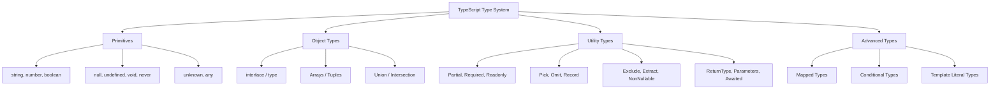

# TypeScript Type Cheatsheet: Every Type You'll Actually Use

I keep a typescript cheatsheet pinned in my notes app. Not because I have a bad memory  but because TypeScript has enough types and utility functions that nobody memorizes them all. And every time I need `NonNullable` or `Extract`, I'd rather glance at a reference than open the docs.

So here's mine. Every type I've actually used in production code, organized by category with quick examples. Bookmark this  you'll come back to it.

## Primitive Types

The building blocks. You probably know these, but here's the complete list:

| Type | Example | Notes |
|------|---------|-------|
| `string` | `'hello'` | Text values |
| `number` | `42`, `3.14` | All numbers (no int/float distinction) |
| `boolean` | `true`, `false` | |
| `null` | `null` | Explicit absence of value |
| `undefined` | `undefined` | Variable declared but not assigned |
| `bigint` | `100n` | Arbitrary precision integers |
| `symbol` | `Symbol('id')` | Unique identifiers |
| `void` |  | Function that returns nothing |
| `never` |  | Function that never returns (throws, infinite loop) |
| `unknown` |  | Type-safe `any`  must narrow before using |
| `any` |  | Escape hatch  disables type checking (avoid) |

```typescript
// Common patterns
let name: string = 'Alice';
let age: number = 30;
let isActive: boolean = true;
let nothing: null = null;
let notSet: undefined = undefined;

// void  for functions with no return
function logMessage(msg: string): void {
  console.log(msg);
}

// never  function that always throws
function throwError(msg: string): never {
  throw new Error(msg);
}

// unknown  type-safe any
function processInput(data: unknown): string {
  if (typeof data === 'string') return data;
  if (typeof data === 'number') return String(data);
  throw new Error('Unsupported type');
}
```

## Object Types

```typescript
// Object shape (inline)
let user: { name: string; age: number };

// Interface (preferred for objects)
interface User {
  id: string;
  name: string;
  email: string;
  role: 'admin' | 'user';
  createdAt: Date;
}

// Optional properties
interface Config {
  apiUrl: string;
  timeout?: number;       // optional
  retries?: number;       // optional
}

// Readonly properties
interface Point {
  readonly x: number;
  readonly y: number;
}

// Index signature
interface StringMap {
  [key: string]: string;
}

// Record shorthand (same as index signature)
type StringMap2 = Record<string, string>;
```

## Array and Tuple Types

```typescript
// Arrays
let numbers: number[] = [1, 2, 3];
let names: Array<string> = ['Alice', 'Bob'];   // generic syntax (same thing)
let matrix: number[][] = [[1, 2], [3, 4]];

// Readonly arrays
let frozen: readonly number[] = [1, 2, 3];
let frozen2: ReadonlyArray<string> = ['a', 'b'];

// Tuples  fixed-length arrays with specific types per position
let pair: [string, number] = ['age', 30];
let triple: [number, number, number] = [255, 128, 0];

// Named tuples (TypeScript 4.0+)
type Coordinate = [x: number, y: number];
type RGB = [red: number, green: number, blue: number];

// Optional tuple elements
type Response = [number, string, Error?];
// Valid: [200, 'OK'] or [500, 'Error', new Error('fail')]
```

## Union and Intersection Types

```typescript
// Union  value is ONE of these types
type Status = 'idle' | 'loading' | 'success' | 'error';
type ID = string | number;
type Result = User | null;

// Discriminated union  the powerful pattern
type ApiState<T> =
  | { status: 'idle' }
  | { status: 'loading' }
  | { status: 'success'; data: T }
  | { status: 'error'; error: string };

// Intersection  combines multiple types
type WithTimestamp = { createdAt: Date; updatedAt: Date };
type UserWithTimestamp = User & WithTimestamp;
```

## Function Types

```typescript
// Function type annotation
type Callback = () => void;
type Transform = (input: string) => string;
type Predicate<T> = (item: T) => boolean;
type AsyncFetch<T> = (url: string) => Promise<T>;

// Function with overloads
function parse(input: string): number;
function parse(input: number): string;
function parse(input: string | number): string | number {
  return typeof input === 'string' ? Number(input) : String(input);
}

// Generic function
function identity<T>(value: T): T {
  return value;
}

// Arrow function with generics
const toArray = <T>(value: T): T[] => [value];
```

## Utility Types (The Important Ones)

These ship with TypeScript and are used constantly in real code. This is the most reference-worthy section of the typescript cheatsheet.

### Transformation Utilities

| Utility | What It Does | Example |
|---------|-------------|---------|
| `Partial<T>` | All properties become optional | `Partial<User>`  for patch/update operations |
| `Required<T>` | All properties become required | `Required<Config>`  validated configuration |
| `Readonly<T>` | All properties become readonly | `Readonly<State>`  immutable state |
| `Pick<T, K>` | Select specific properties | `Pick<User, 'id' \| 'name'>` |
| `Omit<T, K>` | Remove specific properties | `Omit<User, 'createdAt'>` |

```typescript
interface User {
  id: string;
  name: string;
  email: string;
  role: 'admin' | 'user';
  createdAt: Date;
}

// Partial  for updates (all fields optional)
type UserUpdate = Partial<User>;
// { id?: string; name?: string; email?: string; ... }

// Pick  select only what you need
type UserSummary = Pick<User, 'id' | 'name'>;
// { id: string; name: string }

// Omit  remove auto-generated fields
type CreateUser = Omit<User, 'id' | 'createdAt'>;
// { name: string; email: string; role: 'admin' | 'user' }

// Combine them
type UserPatch = Partial<Omit<User, 'id' | 'createdAt'>>;
// All fields except id and createdAt, all optional
```

### String Utilities

| Utility | What It Does | Example |
|---------|-------------|---------|
| `Record<K, V>` | Object with key type K and value type V | `Record<string, number>` |
| `Exclude<T, U>` | Remove types from a union | `Exclude<Status, 'error'>` |
| `Extract<T, U>` | Keep only matching types from a union | `Extract<Status, 'idle' \| 'loading'>` |
| `NonNullable<T>` | Remove `null` and `undefined` | `NonNullable<string \| null>` → `string` |

```typescript
type Status = 'idle' | 'loading' | 'success' | 'error';

// Exclude  remove types
type ActiveStatus = Exclude<Status, 'idle' | 'error'>;
// 'loading' | 'success'

// Extract  keep only matching
type ErrorOrIdle = Extract<Status, 'idle' | 'error'>;
// 'idle' | 'error'

// NonNullable  strip null/undefined
type MaybeString = string | null | undefined;
type DefiniteString = NonNullable<MaybeString>;
// string

// Record  typed object
type UserRoles = Record<string, 'admin' | 'user'>;
// { [key: string]: 'admin' | 'user' }
```

### Function Utilities

| Utility | What It Does | Example |
|---------|-------------|---------|
| `ReturnType<T>` | Extract return type of a function | `ReturnType<typeof fetchUser>` |
| `Parameters<T>` | Extract parameter types as a tuple | `Parameters<typeof greet>` |
| `Awaited<T>` | Unwrap a Promise type | `Awaited<Promise<User>>` → `User` |
| `ConstructorParameters<T>` | Extract constructor parameter types | For class-based patterns |
| `InstanceType<T>` | Extract instance type of a class | `InstanceType<typeof MyClass>` |

```typescript
async function fetchUser(id: string): Promise<User> { /* ... */ }

type FetchReturn = ReturnType<typeof fetchUser>;    // Promise<User>
type FetchParams = Parameters<typeof fetchUser>;     // [id: string]
type FetchResult = Awaited<ReturnType<typeof fetchUser>>; // User
```

## Mapped Types

Build new types by transforming existing ones:

```typescript
// Make all properties optional (this is how Partial works)
type MyPartial<T> = {
  [K in keyof T]?: T[K];
};

// Make all properties readonly
type MyReadonly<T> = {
  readonly [K in keyof T]: T[K];
};

// Make all values strings
type Stringified<T> = {
  [K in keyof T]: string;
};

// Rename keys with template literals
type Getters<T> = {
  [K in keyof T as `get${Capitalize<string & K>}`]: () => T[K];
};

interface Person {
  name: string;
  age: number;
}

type PersonGetters = Getters<Person>;
// { getName: () => string; getAge: () => number }
```

## Template Literal Types

String manipulation at the type level:

```typescript
// Basic template literal
type Greeting = `Hello, ${string}`;
// Matches: "Hello, Alice", "Hello, world", etc.

// Event handler naming
type EventName = 'click' | 'focus' | 'blur';
type EventHandler = `on${Capitalize<EventName>}`;
// 'onClick' | 'onFocus' | 'onBlur'

// CSS property pattern
type CSSUnit = 'px' | 'em' | 'rem' | '%';
type CSSValue = `${number}${CSSUnit}`;
// '16px', '1.5em', '100%', etc.

// Built-in string manipulation types
type Upper = Uppercase<'hello'>;       // 'HELLO'
type Lower = Lowercase<'HELLO'>;       // 'hello'
type Cap = Capitalize<'hello'>;        // 'Hello'
type Uncap = Uncapitalize<'Hello'>;    // 'hello'
```

## Conditional Types

Type-level if/else:

```typescript
// Basic conditional
type IsString<T> = T extends string ? true : false;

type A = IsString<'hello'>; // true
type B = IsString<42>;      // false

// Infer keyword  extract types from inside other types
type UnwrapPromise<T> = T extends Promise<infer U> ? U : T;
type UnwrapArray<T> = T extends (infer E)[] ? E : T;

type X = UnwrapPromise<Promise<string>>; // string
type Y = UnwrapArray<number[]>;          // number

// Practical: extract props type from a component
type PropsOf<T> = T extends React.ComponentType<infer P> ? P : never;
```

## React-Specific Types

Quick reference for the types you use most in React + TypeScript:

```typescript
// Component props
interface MyComponentProps {
  children: React.ReactNode;         // anything renderable
  element: React.ReactElement;       // a single React element
  style?: React.CSSProperties;      // inline styles
  className?: string;
  onClick?: React.MouseEventHandler<HTMLButtonElement>;
  onChange?: React.ChangeEventHandler<HTMLInputElement>;
  ref?: React.Ref<HTMLDivElement>;
}

// Extending HTML attributes
interface ButtonProps extends React.ButtonHTMLAttributes<HTMLButtonElement> {
  variant: 'primary' | 'secondary';
}

// ForwardRef component
const Input = React.forwardRef<HTMLInputElement, InputProps>(
  (props, ref) => <input ref={ref} {...props} />
);

// Context
const MyContext = React.createContext<MyContextValue | null>(null);

// Hooks
const [state, setState] = useState<User | null>(null);
const ref = useRef<HTMLInputElement>(null);
const callback = useCallback((id: string) => {}, []);
```

For complete hook typing patterns, our [React hooks types guide](/blog/typescript-react-hooks-types) has detailed examples. And for event handler types specifically, check the [React event handlers reference](/blog/react-typescript-event-handlers).



## When to Look Beyond This Cheatsheet

This covers the types you'll use 95% of the time. For the other 5%  recursive types, variadic tuple types, const type parameters, satisfies operator  the [TypeScript handbook](https://www.typescriptlang.org/docs/handbook/) is the definitive reference.

If you're converting JavaScript code and want to see what types your code should use, [SnipShift's converter](https://snipshift.dev/js-to-ts) generates properly typed TypeScript from JavaScript  it's a practical way to learn which types apply to your actual code patterns.

And if you're starting a TypeScript migration, our [complete conversion guide](/blog/convert-javascript-to-typescript) and [migration strategy](/blog/typescript-migration-strategy) will get you from zero to fully typed. Keep this cheatsheet handy while you're converting  you'll reference it a lot.
