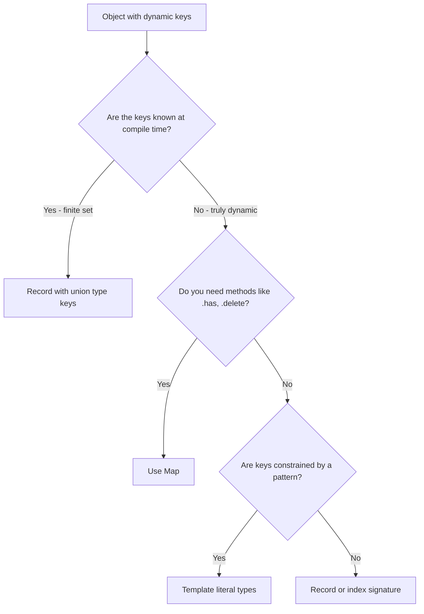

# How to Type an Object with Dynamic Keys in TypeScript

You've got an object where the keys aren't known ahead of time. Maybe it's an API response with user IDs as keys. Maybe it's a configuration map that varies per environment. Maybe it's a cache where the keys are computed at runtime. Whatever the case, TypeScript's type system needs to know what it's dealing with  and typing "an object with dynamic keys" is one of those things that's simple in JavaScript and surprisingly nuanced in TypeScript.

I've used at least four different approaches to this problem in production code, and each one has trade-offs. Let me walk you through all of them so you can pick the right one for your situation.

## Index Signatures: The Classic Approach

The most basic way to type **typescript dynamic keys** is with an index signature:

```typescript
interface UserScores {
  [userId: string]: number;
}

const scores: UserScores = {
  user_1: 95,
  user_2: 87,
  user_3: 72,
};

scores["user_4"] = 100; // Fine  any string key works
```

The `[userId: string]: number` part says "this object can have any string key, and every value is a number." The `userId` name is just for documentation  it doesn't affect behavior.

But index signatures have a subtle problem. TypeScript assumes that *every* key you access exists:

```typescript
const score = scores["nonexistent_user"]; // TypeScript says: number
// Reality: undefined
```

TypeScript infers `number`, not `number | undefined`. So you can access a key that doesn't exist, and TypeScript won't warn you. You'll get `undefined` at runtime and a type that says otherwise.

**The fix:** Enable `noUncheckedIndexedAccess` in your `tsconfig.json`:

```json
{
  "compilerOptions": {
    "noUncheckedIndexedAccess": true
  }
}
```

Now TypeScript returns `number | undefined` for indexed access, forcing you to handle the missing-key case:

```typescript
const score = scores["nonexistent_user"]; // TypeScript says: number | undefined

if (score !== undefined) {
  console.log(score.toFixed(2)); // Safe  narrowed to number
}
```

I'd recommend this setting for any new project. It catches real bugs.

## `Record<K, V>`: The Utility Type

`Record` is TypeScript's built-in utility type for objects with dynamic keys. It's cleaner syntax for the same idea:

```typescript
// These are equivalent
interface Approach1 {
  [key: string]: number;
}
type Approach2 = Record<string, number>;
```

Where `Record` really shines is when you want to constrain the *keys* to a specific set:

```typescript
type Theme = "light" | "dark" | "system";

const themeColors: Record<Theme, string> = {
  light: "#ffffff",
  dark: "#1a1a1a",
  system: "#f0f0f0",
};

// Missing a key? TypeScript catches it:
const broken: Record<Theme, string> = {
  light: "#ffffff",
  dark: "#1a1a1a",
  // Error: Property 'system' is missing
};
```

This is probably the most common pattern I reach for. `Record<string, T>` for truly dynamic keys, `Record<UnionType, T>` for keys from a known set.



## `Map` vs Plain Objects

For truly dynamic keys  where keys are added and removed at runtime  `Map` is often a better fit than a plain object:

```typescript
const userCache = new Map<string, User>();

userCache.set("user_1", { id: 1, name: "Alice" });
userCache.set("user_2", { id: 2, name: "Bob" });

// Map.get() correctly returns User | undefined
const user = userCache.get("user_1"); // User | undefined  honest type!
```

Here's when to pick each:

| Feature | Plain Object | `Map` |
|---------|-------------|-------|
| Key types | `string \| number \| symbol` | Any type (objects, functions, etc.) |
| Iteration order | Insertion order (mostly) | Guaranteed insertion order |
| Size | `Object.keys(obj).length` | `map.size` (O(1)) |
| Performance for frequent add/delete | Slower (engine optimization for shapes) | Faster |
| Serializable to JSON | Yes, directly | No, needs conversion |
| Type safety on access | Lies (says value exists) | Honest (`T \| undefined`) |
| Prototype pollution risk | Yes (if not careful) | No |

My rule: if the object is a data structure with lots of insertions and deletions at runtime  a cache, a lookup table, a registry  use `Map`. If it's a JSON-shaped object that gets serialized or passed to an API, use a plain object with `Record`.

## Template Literal Types for Constrained Keys

This is where things get kind of magical. TypeScript's template literal types let you define dynamic key *patterns*:

```typescript
type CSSVariable = `--${string}`;

const vars: Record<CSSVariable, string> = {
  "--primary-color": "#3b82f6",
  "--font-size": "16px",
  "--spacing-md": "1rem",
};

// Error: doesn't match the pattern
vars["backgroundColor"] = "red"; // Type '"backgroundColor"' is not assignable to type '`--${string}`'
```

You can get even more specific with union types inside the template:

```typescript
type Breakpoint = "sm" | "md" | "lg" | "xl";
type MediaQuery = `min-${Breakpoint}` | `max-${Breakpoint}`;

const breakpoints: Record<MediaQuery, string> = {
  "min-sm": "(min-width: 640px)",
  "max-sm": "(max-width: 639px)",
  "min-md": "(min-width: 768px)",
  "max-md": "(max-width: 767px)",
  "min-lg": "(min-width: 1024px)",
  "max-lg": "(max-width: 1023px)",
  "min-xl": "(min-width: 1280px)",
  "max-xl": "(max-width: 1279px)",
};
```

Every possible key is checked at compile time. Miss one and TypeScript tells you. Add an invalid one and TypeScript tells you. This is the kind of thing that makes TypeScript genuinely valuable  catching mismatches between your code and your data structure before anything runs.

## Real-World Example: Typing an API Response

Let me show you a practical scenario. Say you're building a dashboard and the API returns data grouped by date:

```typescript
// The API returns something like:
// { "2026-03-01": { views: 1200, clicks: 340 }, "2026-03-02": { views: 980, clicks: 210 } }

interface DayMetrics {
  views: number;
  clicks: number;
}

// Option 1: Simple Record  accepts any string key
type MetricsResponse = Record<string, DayMetrics>;

// Option 2: Template literal for date-shaped keys
type DateString = `${number}-${number}-${number}`;
type StrictMetricsResponse = Record<DateString, DayMetrics>;
```

The template literal version won't catch invalid dates like `"2026-13-45"`, but it will catch keys that aren't date-shaped at all  like `"total"` or `"metadata"`. It's a balance between precision and practicality.

Now, safely consuming this response:

```typescript
async function fetchMetrics(): Promise<MetricsResponse> {
  const res = await fetch("/api/metrics");
  return res.json();
}

async function displayMetrics() {
  const metrics = await fetchMetrics();

  // With noUncheckedIndexedAccess, this is safe
  const today = metrics["2026-03-25"];
  if (today) {
    console.log(`Views: ${today.views}, Clicks: ${today.clicks}`);
  }

  // Iterating over dynamic keys
  for (const [date, data] of Object.entries(metrics)) {
    console.log(`${date}: ${data.views} views`);
  }
}
```

If you're working with JSON APIs and need to generate TypeScript interfaces from response data, [SnipShift's JSON to TypeScript converter](https://snipshift.dev/json-to-typescript) can do this automatically  paste a sample response and it generates proper interfaces with the right index signatures. It handles nested objects, arrays, and optional fields, which saves a lot of manual typing.

## Combining Patterns: Known + Dynamic Keys

Sometimes an object has a mix of fixed keys and dynamic keys. TypeScript handles this with intersection types:

```typescript
interface ApiResponse {
  status: "ok" | "error";
  timestamp: number;
  [key: string]: unknown; // Additional dynamic data
}

const response: ApiResponse = {
  status: "ok",
  timestamp: Date.now(),
  users: [{ id: 1 }],   // Extra dynamic key  fine
  metadata: { page: 1 }, // Another one  also fine
};
```

The catch is that the index signature's value type must be compatible with all the fixed properties. Since `"ok" | "error"` and `number` are both assignable to `unknown`, this works. If the index signature were `[key: string]: string`, the `timestamp: number` property would conflict.

> **Tip:** When mixing fixed and dynamic keys, use `unknown` as the index signature value type and narrow at the access site. It's the safest approach that doesn't constrain your fixed property types.

## Picking the Right Approach

After using all of these patterns in production, here's my decision framework:

- **Keys from a known union** → `Record<Union, ValueType>`  strictest, best autocomplete
- **Keys follow a pattern** → Template literal types with `Record`  good balance of flexibility and safety
- **Truly unknown string keys, JSON-shaped data** → `Record<string, T>` or index signature  with `noUncheckedIndexedAccess` enabled
- **Runtime add/delete operations** → `Map<K, V>`  better performance, honest types
- **Mix of known and unknown keys** → Interface with index signature

For more on TypeScript's type system, our [guide on TypeScript generics](/blog/typescript-generics-explained) covers how to make these patterns reusable across your codebase. And if you're deciding between `interface` and `type` for your object types, our [interface vs type comparison](/blog/typescript-interface-vs-type) breaks down the practical differences. You might also want to check out the [SnipShift tools homepage](https://snipshift.dev) for more developer converters that can speed up your TypeScript workflow.
