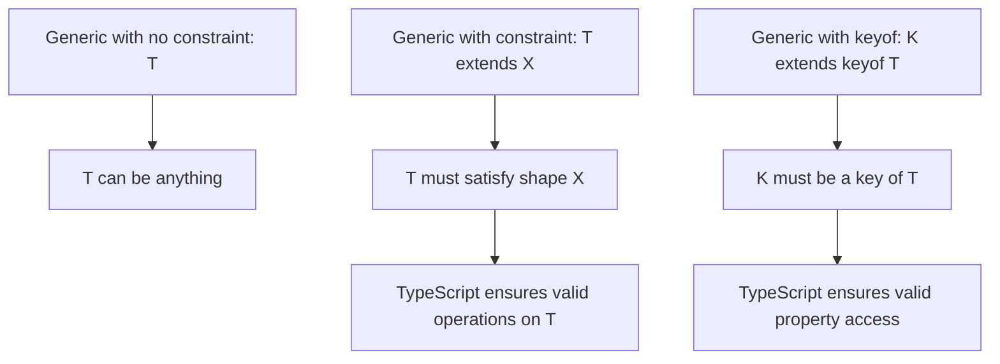

# TypeScript Generics Explained (With Real-World Examples)

Generics are the feature that separates "I use TypeScript" from "I understand TypeScript." And honestly? They're also the feature that makes most developers' eyes glaze over when they first encounter them. I remember staring at `<T extends keyof K>` for the first time and thinking "I'll just use `any` instead."

Don't do that. Generics are not as complicated as they look, and once they click, you'll start seeing places to use them everywhere. This is typescript generics explained the way I wish someone had explained them to me  starting with the basics and building up to the advanced patterns, with real code you'd actually write in a production app.

## What Generics Are (And Why They Exist)

A generic is a type that takes a parameter. That's it. Just like a function takes value parameters, a generic type takes type parameters.

Here's the problem generics solve. Say you want a function that returns the first element of an array:

```typescript
// Without generics  you lose type information
function first(arr: any[]): any {
  return arr[0];
}

const num = first([1, 2, 3]);    // type: any (not number!)
const str = first(['a', 'b']);    // type: any (not string!)
```

The function works, but TypeScript has no idea what the return type is. You put a `number[]` in and get `any` out. That's useless  you might as well be writing JavaScript.

Now with generics:

```typescript
// With generics  type information flows through
function first<T>(arr: T[]): T {
  return arr[0];
}

const num = first([1, 2, 3]);    // type: number
const str = first(['a', 'b']);    // type: string
```

The `<T>` says "this function takes a type parameter called T." When you call `first([1, 2, 3])`, TypeScript infers that `T = number` based on the argument. So the return type becomes `number` instead of `any`.

That's the core idea. Everything else builds on this.

## Generic Functions

The most common use of generics. You've probably already used them without realizing  `Array.map`, `Promise.then`, `useState` in React  they're all generic functions.

### Basic Generic Function

```typescript
function identity<T>(value: T): T {
  return value;
}

// TypeScript infers T from the argument
const result = identity(42);       // type: number
const result2 = identity('hello'); // type: string

// You can also specify T explicitly
const result3 = identity<string>('hello'); // type: string
```

### Multiple Type Parameters

Functions can take more than one type parameter:

```typescript
function pair<A, B>(first: A, second: B): [A, B] {
  return [first, second];
}

const p = pair('hello', 42); // type: [string, number]
```

### A Real-World Example: API Fetcher

Here's a pattern I use in almost every project:

```typescript
async function fetchApi<T>(
  endpoint: string,
  options?: RequestInit
): Promise<T> {
  const response = await fetch(`/api${endpoint}`, options);

  if (!response.ok) {
    throw new Error(`API error: ${response.status}`);
  }

  return response.json() as Promise<T>;
}

// Usage  the generic parameter tells TypeScript what the API returns
interface User {
  id: string;
  name: string;
  email: string;
}

const user = await fetchApi<User>('/users/123');
// user.name  TypeScript knows this is a string
// user.foo   TypeScript flags this as an error
```

Without the generic, `fetchApi` would return `Promise<any>` and you'd lose all type safety on the response. With the generic, you declare "this endpoint returns a User" and TypeScript enforces it throughout your code.

## Generic Interfaces

Interfaces can be generic too. This is how you create reusable data structures:

```typescript
// A paginated API response  works for any data type
interface PaginatedResponse<T> {
  data: T[];
  meta: {
    page: number;
    perPage: number;
    totalPages: number;
    totalItems: number;
  };
}

// Now use it with specific types
type UserListResponse = PaginatedResponse<User>;
type ProductListResponse = PaginatedResponse<Product>;

async function fetchUsers(page: number): Promise<PaginatedResponse<User>> {
  return fetchApi<PaginatedResponse<User>>(`/users?page=${page}`);
}
```

One interface, infinite reuse. Without generics, you'd need to write separate interfaces for `PaginatedUserResponse`, `PaginatedProductResponse`, `PaginatedOrderResponse`... you get the idea.

### Generic Classes

Same concept, applied to classes:

```typescript
class Stack<T> {
  private items: T[] = [];

  push(item: T): void {
    this.items.push(item);
  }

  pop(): T | undefined {
    return this.items.pop();
  }

  peek(): T | undefined {
    return this.items[this.items.length - 1];
  }

  get size(): number {
    return this.items.length;
  }
}

const numberStack = new Stack<number>();
numberStack.push(1);
numberStack.push(2);
numberStack.push('three'); // Error! Argument of type 'string' is not assignable

const stringStack = new Stack<string>();
stringStack.push('hello'); // Fine
```

## Constraints: Limiting What T Can Be

Sometimes you don't want `T` to be *any* type  you want it to be a type that has certain properties. That's where constraints come in.

```typescript
// Without constraint  this doesn't compile
function getLength<T>(item: T): number {
  return item.length; // Error: Property 'length' does not exist on type 'T'
}

// With constraint  T must have a length property
function getLength<T extends { length: number }>(item: T): number {
  return item.length; // Works!
}

getLength('hello');        // Fine  strings have length
getLength([1, 2, 3]);     // Fine  arrays have length
getLength({ length: 10 }); // Fine  has length property
getLength(42);             // Error  numbers don't have length
```

The `extends` keyword in a generic means "T must be assignable to this type." It's not inheritance  it's a constraint.

### The `keyof` Constraint

One of the most useful constraint patterns. It ensures a string parameter is actually a key of an object:

```typescript
function getProperty<T, K extends keyof T>(obj: T, key: K): T[K] {
  return obj[key];
}

const user = { name: 'Alice', age: 30, email: 'alice@example.com' };

getProperty(user, 'name');    // type: string  TypeScript knows!
getProperty(user, 'age');     // type: number
getProperty(user, 'address'); // Error: 'address' is not a key of user
```

This is genuinely powerful. Without the `keyof` constraint, you'd either need to use `any` for the key parameter (losing safety) or manually enumerate valid keys (tedious and fragile).



### Real-World Constraint: Form Validation

Here's a pattern from a form validation library I built:

```typescript
type ValidationRule<T> = {
  validate: (value: T) => boolean;
  message: string;
};

type FormRules<T extends Record<string, unknown>> = {
  [K in keyof T]?: ValidationRule<T[K]>[];
};

interface LoginForm {
  email: string;
  password: string;
  rememberMe: boolean;
}

const loginRules: FormRules<LoginForm> = {
  email: [
    { validate: (v) => v.length > 0, message: 'Email is required' },
    { validate: (v) => v.includes('@'), message: 'Invalid email' },
    // v is typed as 'string' because email is string in LoginForm
  ],
  password: [
    { validate: (v) => v.length >= 8, message: 'Minimum 8 characters' },
  ],
  // TypeScript ensures you can only add rules for fields that exist in LoginForm
  // And each rule's validate function receives the correct type for that field
};
```

The constraint `T extends Record<string, unknown>` ensures the form type is an object. The mapped type `[K in keyof T]` ensures rules only exist for real form fields. And `ValidationRule<T[K]>` ensures each rule's validator receives the correct type for its field. Generics doing a lot of heavy lifting here.

## Default Type Parameters

Just like function parameters can have defaults, so can type parameters:

```typescript
interface ApiOptions<T = unknown> {
  endpoint: string;
  method?: 'GET' | 'POST' | 'PUT' | 'DELETE';
  body?: T;
}

// Without specifying T  body is unknown
const getOptions: ApiOptions = {
  endpoint: '/users',
};

// With T specified  body is typed
const postOptions: ApiOptions<{ name: string; email: string }> = {
  endpoint: '/users',
  method: 'POST',
  body: { name: 'Alice', email: 'alice@example.com' },
};
```

Default type parameters are useful when you want a generic type to be convenient for simple cases while still flexible for complex ones.

## Conditional Types

This is where generics get really interesting  and, admittedly, where they start looking kind of intimidating. Conditional types let you express type logic:

```typescript
// Basic conditional type
type IsString<T> = T extends string ? 'yes' : 'no';

type A = IsString<string>;  // 'yes'
type B = IsString<number>;  // 'no'
```

The syntax mirrors the ternary operator: `T extends X ? Y : Z`. If `T` is assignable to `X`, the type is `Y`; otherwise it's `Z`.

### Extracting Types with `infer`

The `infer` keyword lets you extract types from within other types:

```typescript
// Extract the return type of a function
type ReturnOf<T> = T extends (...args: any[]) => infer R ? R : never;

type A = ReturnOf<() => string>;           // string
type B = ReturnOf<(x: number) => boolean>; // boolean

// Extract the element type of an array
type ElementOf<T> = T extends (infer E)[] ? E : never;

type C = ElementOf<string[]>;   // string
type D = ElementOf<number[]>;   // number

// Extract the resolved type of a Promise
type Unwrap<T> = T extends Promise<infer U> ? U : T;

type E = Unwrap<Promise<string>>;  // string
type F = Unwrap<number>;           // number (not a promise, returns as-is)
```

You might recognize these  TypeScript ships with built-in versions: `ReturnType<T>`, `Parameters<T>`, `Awaited<T>`. They're all implemented with conditional types and `infer`.

### Distributive Conditional Types

When a conditional type acts on a union, it distributes across each member:

```typescript
type ToArray<T> = T extends any ? T[] : never;

type A = ToArray<string | number>;
// Distributes to: string[] | number[]
// NOT: (string | number)[]
```

This is useful but also a common source of confusion. If you don't want distribution, wrap the type in a tuple:

```typescript
type ToArrayNonDist<T> = [T] extends [any] ? T[] : never;

type B = ToArrayNonDist<string | number>;
// (string | number)[]
```

## Practical Patterns You'll Actually Use

Let me wrap up with patterns I reach for regularly in real projects.

### Pattern 1: Type-Safe Event Emitter

```typescript
type EventMap = {
  'user:login': { userId: string; timestamp: number };
  'user:logout': { userId: string };
  'error': { code: number; message: string };
};

class TypedEmitter<T extends Record<string, any>> {
  private handlers: Partial<{
    [K in keyof T]: ((payload: T[K]) => void)[];
  }> = {};

  on<K extends keyof T>(event: K, handler: (payload: T[K]) => void): void {
    if (!this.handlers[event]) this.handlers[event] = [];
    this.handlers[event]!.push(handler);
  }

  emit<K extends keyof T>(event: K, payload: T[K]): void {
    this.handlers[event]?.forEach((handler) => handler(payload));
  }
}

const emitter = new TypedEmitter<EventMap>();

emitter.on('user:login', (payload) => {
  // payload is typed as { userId: string; timestamp: number }
  console.log(payload.userId);
});

emitter.emit('user:login', { userId: '123', timestamp: Date.now() }); // OK
emitter.emit('user:login', { userId: '123' }); // Error  missing timestamp
emitter.emit('nonexistent', {}); // Error  not a valid event
```

### Pattern 2: Builder Pattern

```typescript
class QueryBuilder<T extends Record<string, unknown>> {
  private conditions: string[] = [];
  private selectedFields: (keyof T)[] = [];

  select<K extends keyof T>(...fields: K[]): QueryBuilder<Pick<T, K>> {
    this.selectedFields = fields as any;
    return this as any;
  }

  where<K extends keyof T>(
    field: K,
    operator: '=' | '>' | '<' | 'LIKE',
    value: T[K]
  ): this {
    this.conditions.push(`${String(field)} ${operator} '${value}'`);
    return this;
  }
}

interface Product {
  id: number;
  name: string;
  price: number;
  category: string;
}

const query = new QueryBuilder<Product>()
  .select('name', 'price')
  .where('category', '=', 'electronics')
  .where('price', '<', 100);
// Fully type-safe  field names and value types are all checked
```

### Pattern 3: Factory Function with Type Map

```typescript
interface ShapeMap {
  circle: { radius: number };
  rectangle: { width: number; height: number };
  triangle: { base: number; height: number };
}

function createShape<K extends keyof ShapeMap>(
  kind: K,
  params: ShapeMap[K]
): ShapeMap[K] & { kind: K } {
  return { ...params, kind };
}

const circle = createShape('circle', { radius: 5 });
// type: { radius: number } & { kind: 'circle' }

const rect = createShape('rectangle', { width: 10, height: 20 });
// type: { width: number; height: number } & { kind: 'rectangle' }

createShape('circle', { width: 10 }); // Error  circle needs radius, not width
```

## When NOT to Use Generics

I should mention this because I've definitely over-used generics in the past. Don't use them when:

- **A specific type works fine.** If a function only ever processes `User` objects, type it as `User`, not `T`.
- **You're only using `T` once.** If the generic parameter appears only in the input or only in the output, you probably don't need it  a specific type or union would be clearer.
- **It makes the code harder to read.** A generic with three constraints and two conditional types might be technically correct, but if your teammates can't understand it, it's not good code.

The best use of generics is when they eliminate duplication while preserving type safety. If you're adding a generic just because you can, step back and ask if it actually helps.

If you're converting JavaScript code to TypeScript and trying to figure out where generics fit in, tools like [SnipShift's converter](https://snipshift.dev/js-to-ts) can sometimes suggest generic patterns where they make sense  especially for utility functions that work with multiple types.

For a quick-reference of all the built-in utility types that use generics under the hood (`Partial<T>`, `Required<T>`, `Pick<T, K>`, `Omit<T, K>`, etc.), check out our [TypeScript cheatsheet](/blog/typescript-cheatsheet). And if you're specifically working with React, our guide on [typing React hooks](/blog/typescript-react-hooks-types) shows how generics work with `useState`, `useRef`, and custom hooks.
