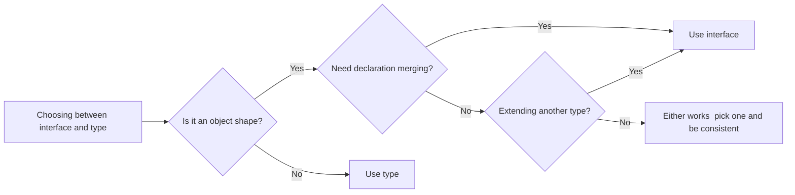

# TypeScript interface vs type: When to Use Which (With Examples)

This question comes up in almost every TypeScript codebase I've worked on. Someone on the team writes an interface. Someone else writes a type. A third person opens a PR and asks "should this be an interface or a type?" And then the whole team spends 45 minutes debating something that probably doesn't matter as much as they think it does.

But there *are* real differences. And in specific situations, one is genuinely better than the other. So let me break down the typescript interface vs type debate once and for all  with examples that actually show you when each one shines.

## The Short Answer

If you're in a hurry:

- **Use `interface`** for object shapes, especially when you want to extend them or when you're building a library/API that others will consume.
- **Use `type`** for everything else  unions, intersections, mapped types, conditional types, primitives, tuples.

If you're not in a hurry, keep reading. The nuances matter.

## What Can Each One Do?

Let's start with what they share. Both `interface` and `type` can describe the shape of an object:

```typescript
// Interface
interface User {
  id: string;
  name: string;
  email: string;
}

// Type
type User = {
  id: string;
  name: string;
  email: string;
};
```

For this basic case, they're functionally identical. You can use either one as a type annotation, as a function parameter, as a generic constraint  doesn't matter. The TypeScript compiler treats them the same way.

But that's where the similarity ends. Here's what each one can do that the other can't (or does differently):

| Feature | `interface` | `type` |
|---------|-----------|--------|
| Object shapes | Yes | Yes |
| Extend/inherit | `extends` keyword | Intersection (`&`) |
| Declaration merging | Yes | No |
| Union types | No | Yes |
| Mapped types | No | Yes |
| Conditional types | No | Yes |
| Primitive aliases | No | Yes |
| Tuple types | No | Yes |
| `implements` in classes | Yes | Yes (with object types) |

That table tells most of the story. But let me walk through the important differences with real code.

## Declaration Merging: Interface's Superpower

This is the single biggest behavioral difference between `interface` and `type`. If you declare two interfaces with the same name, TypeScript merges them automatically:

```typescript
interface Window {
  myCustomProperty: string;
}

// TypeScript merges this with the built-in Window interface
// Now window.myCustomProperty is a valid, typed property
```

This is incredibly useful when you're augmenting third-party types or global objects. Every time you've added a custom property to `window`, `process.env`, or `express.Request`, you were relying on declaration merging.

Types can't do this. If you try to declare two types with the same name, you get a compile error:

```typescript
type Config = { apiUrl: string };
type Config = { timeout: number }; // Error: Duplicate identifier 'Config'
```

> **Tip:** Declaration merging is powerful but can also be confusing. If you're working on a team, make sure everyone knows it exists  otherwise someone will spend an hour trying to figure out why an interface has properties they didn't add.

### When Declaration Merging Matters

- **Library authors**: If you're publishing an npm package, use interfaces for any types that consumers might need to extend. They can augment your interfaces in their own code without modifying your package.
- **Module augmentation**: Adding types to `process.env`, extending Express's `Request` type, adding global declarations.
- **Plugin systems**: If your app has a plugin architecture, interfaces let plugins extend the core type definitions.

If you're not doing any of these things  which is most application code  declaration merging probably isn't relevant to your decision.

## Extends vs Intersection

Both interfaces and types support composition, but the syntax is different:

```typescript
// Interface uses 'extends'
interface Animal {
  name: string;
  legs: number;
}

interface Dog extends Animal {
  breed: string;
  bark(): void;
}

// Type uses intersection '&'
type Animal = {
  name: string;
  legs: number;
};

type Dog = Animal & {
  breed: string;
  bark(): void;
};
```

They look equivalent, and for simple cases they are. But there's a subtle difference in how they handle conflicts:

```typescript
// Interface  this is an ERROR
interface A {
  x: number;
}

interface B extends A {
  x: string; // Error: Type 'string' is not assignable to type 'number'
}

// Type intersection  this COMPILES (but creates 'never')
type A = { x: number };
type B = A & { x: string }; // x is 'number & string' which is 'never'
```

With `extends`, TypeScript catches the conflict immediately  you get a clear error message at the point of declaration. With intersection, TypeScript silently computes `number & string = never`, and you only find out something's wrong when you try to use `x` and nothing satisfies the type.

I've been bitten by this more than once. A team member intersected two types that had a property name collision, and the resulting `never` type caused bizarre errors three files away. If we'd used `extends`, the error would've been caught at the source.

**My opinion**: for inheritance-style composition  where one type "is a" more specific version of another  `extends` gives you better error messages. Use interfaces for that pattern.

## Where Types Win: Unions and Advanced Types

Here's where the `type` keyword really pulls ahead. You simply can't do these things with interfaces:

### Union Types

```typescript
type Status = 'idle' | 'loading' | 'success' | 'error';

type Result<T> = { success: true; data: T } | { success: false; error: string };

type EventHandler = (() => void) | ((event: MouseEvent) => void);
```

Unions are one of TypeScript's most powerful features. Discriminated unions in particular are a pattern I use in almost every project:

```typescript
type ApiState<T> =
  | { status: 'idle' }
  | { status: 'loading' }
  | { status: 'success'; data: T }
  | { status: 'error'; error: string };

function renderState(state: ApiState<User[]>) {
  switch (state.status) {
    case 'idle':
      return <p>Ready to search</p>;
    case 'loading':
      return <Spinner />;
    case 'success':
      return <UserList users={state.data} />; // TypeScript knows data exists here
    case 'error':
      return <ErrorMessage message={state.error} />; // TypeScript knows error exists here
  }
}
```

If you're not using discriminated unions yet, seriously, start. They eliminate an entire class of bugs around state management. And they're only possible with `type`.

### Mapped Types

```typescript
type Readonly<T> = {
  readonly [K in keyof T]: T[K];
};

type Optional<T> = {
  [K in keyof T]?: T[K];
};

type StringMap<T> = {
  [K in keyof T]: string;
};
```

### Conditional Types

```typescript
type IsString<T> = T extends string ? true : false;

type Unwrap<T> = T extends Promise<infer U> ? U : T;

type NonNullable<T> = T extends null | undefined ? never : T;
```

These advanced type-level operations are exclusively in the `type` domain. If you're doing any kind of generic type manipulation  and most non-trivial TypeScript codebases do  you'll be using `type` aliases.

For a deeper look at generics and conditional types, our guide on [TypeScript generics explained](/blog/typescript-generics-explained) covers everything from basic generic functions to advanced constraint patterns.

### Primitive and Tuple Aliases

```typescript
// Primitive aliases  can't do this with interface
type ID = string;
type Coordinate = [number, number];
type Callback = (error: Error | null, result: string) => void;
```

Interfaces can only describe object shapes (and function signatures, technically). If you need to alias a primitive, tuple, or function type, `type` is your only option.

## Performance: Does It Actually Matter?

You'll sometimes hear that interfaces are "faster" than types for the TypeScript compiler. This was more relevant a few years ago, but let me give you the current picture.

The TypeScript team has said that interfaces create a cached, named type in the type checker, while type aliases for complex intersections can result in types that need to be recomputed. In practice, this means:

- **Simple object types**: No measurable difference. Use whichever you prefer.
- **Large intersection chains**: Types with many `&` intersections can be slightly slower to check than deeply extended interfaces. But we're talking about marginal differences in compile time  relevant for very large codebases, not for most projects.
- **Recursive types**: Types handle recursive definitions better in recent TypeScript versions.



My honest take: unless your project has 500,000+ lines of TypeScript and you've profiled the type checker, don't make this decision based on performance. Make it based on readability and capability.

## My Recommendations

After years of going back and forth on this, here's where I've landed:

**Use `interface` when:**
- You're defining the shape of an object or class
- You want `extends` for clean inheritance hierarchies
- You're writing a library and consumers might need to augment your types
- You're augmenting third-party types (Express, Window, etc.)

**Use `type` when:**
- You need a union type (this alone covers a huge number of cases)
- You're aliasing a primitive, tuple, or function signature
- You're using mapped types, conditional types, or template literal types
- You're composing types with intersections in a one-off way

**The meta-rule:** Pick a default for your team and document it. I've worked on teams that defaulted to `interface` and teams that defaulted to `type`, and both were fine. What matters is consistency, not which one you pick.

Some teams use ESLint's `@typescript-eslint/consistent-type-definitions` rule to enforce their choice. It's a reasonable thing to lint for  one less thing to debate in code reviews.

## The Real Answer

The typescript interface vs type debate is one of those questions that seems important when you're learning TypeScript but matters less and less as you gain experience. The patterns where each one is objectively better are fairly narrow:

- Need declaration merging? Interface.
- Need a union? Type.
- Need to extend a third-party type? Interface.
- Need a mapped or conditional type? Type.

For everything else, flip a coin. Or rather, check what your codebase already does and be consistent with that. Your future teammates will thank you for the consistency more than they'll care about which keyword you chose.

If you're converting a JavaScript codebase and trying to figure out whether to use interfaces or types for your newly created type definitions, [SnipShift's converter](https://snipshift.dev/js-to-ts) generates interfaces for object shapes and types for unions by default  which aligns with what most style guides recommend.

For a full reference of all TypeScript types you'll use day to day  including utility types, generics, and mapped types  check out our [TypeScript type cheatsheet](/blog/typescript-cheatsheet). And if you're just getting started with TypeScript in general, our [complete conversion guide](/blog/convert-javascript-to-typescript) walks through the full migration process.
