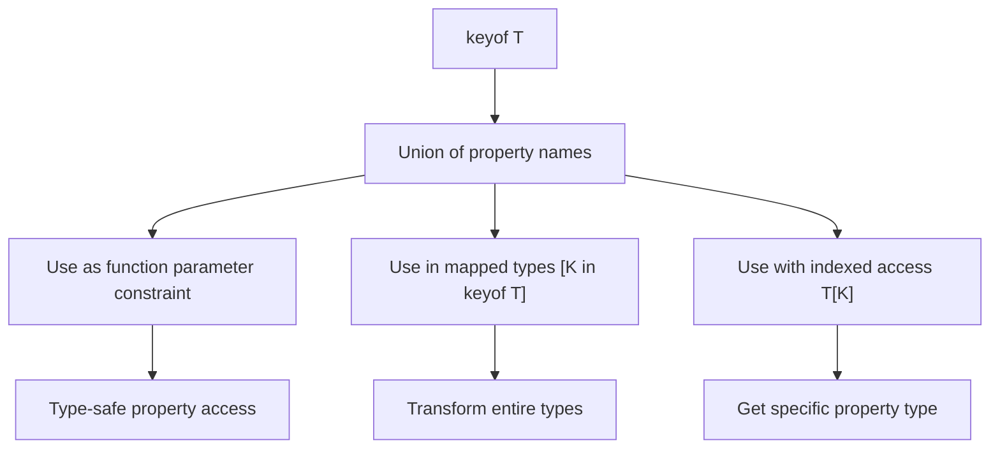

# What Is 'keyof' in TypeScript and How Do You Actually Use It?

The `keyof` operator in TypeScript does something simple  it takes a type and gives you a union of its property names. That sounds boring. But it's one of the most useful building blocks in the type system, and once you understand it, a bunch of patterns that seemed magical suddenly make sense.

I use `keyof` almost daily. It's behind type-safe getters, constrained generics, dynamic property access, and half of TypeScript's built-in utility types. If you've ever wondered how `Pick<T, K>` or `Record<K, V>` work under the hood, `keyof` is the answer.

## `keyof` with Interfaces

The simplest use case. Given an interface, `keyof` returns a union of its keys as string literal types:

```typescript
interface User {
  id: number;
  name: string;
  email: string;
  isActive: boolean;
}

type UserKeys = keyof User; // "id" | "name" | "email" | "isActive"
```

That's it. `UserKeys` is the type `"id" | "name" | "email" | "isActive"`. Not `string`  the specific literal strings that are valid property names.

This means you can constrain a variable to only accept valid keys:

```typescript
function getUserField(user: User, field: keyof User) {
  return user[field];
}

getUserField(user, "name");    // Works
getUserField(user, "email");   // Works
getUserField(user, "address"); // Error! "address" is not in keyof User
```

TypeScript catches invalid property names at compile time. In JavaScript, that `"address"` access would silently return `undefined` and probably cause a bug three function calls later.

## `keyof typeof` for Objects

Here's where people get confused. `keyof` works on *types*, not values. If you have a plain object and want its keys as a type, you need `keyof typeof`:

```typescript
const config = {
  apiUrl: "https://api.example.com",
  timeout: 5000,
  retries: 3,
};

// This doesn't work  config is a value, not a type
// type Keys = keyof config; // Error!

// This works  typeof converts the value to its type first
type ConfigKeys = keyof typeof config; // "apiUrl" | "timeout" | "retries"
```

`typeof config` gives you the type `{ apiUrl: string; timeout: number; retries: number }`. Then `keyof` extracts the keys. Two operations chained together.

I see this pattern everywhere in codebases that define configuration as plain objects rather than interfaces  which is honestly most codebases I work on.

```typescript
const ROUTES = {
  home: "/",
  about: "/about",
  dashboard: "/dashboard",
  settings: "/settings",
} as const;

type RouteName = keyof typeof ROUTES; // "home" | "about" | "dashboard" | "settings"
type RoutePath = (typeof ROUTES)[RouteName]; // "/" | "/about" | "/dashboard" | "/settings"
```

The `as const` keeps the values as literal types. `keyof typeof` gives you the keys. And the indexed access `(typeof ROUTES)[RouteName]` gives you the values. This is how you build type-safe route systems without duplicating strings.

## Generic Constraints with `keyof`

This is where `keyof` goes from useful to essential. Combined with generics, it lets you write functions that are both flexible and type-safe.

```typescript
function getProperty<T, K extends keyof T>(obj: T, key: K): T[K] {
  return obj[key];
}

const user: User = { id: 1, name: "Alice", email: "alice@test.com", isActive: true };

const name = getProperty(user, "name");      // string
const id = getProperty(user, "id");          // number
const active = getProperty(user, "isActive"); // boolean
```

Notice the return type  `T[K]`. TypeScript knows that if you pass `"name"` as the key, the return type is `string`. If you pass `"id"`, it's `number`. The generic constraint `K extends keyof T` ensures you can only pass valid keys, and the indexed access type `T[K]` ensures the return type matches.

This is exactly how Lodash's `_.get()` works under the hood (well, a simplified version). And it's how TypeScript's built-in `Pick` is defined:

```typescript
// This is literally how Pick<T, K> is defined in TypeScript
type Pick<T, K extends keyof T> = {
  [P in K]: T[P];
};
```

## Building a Type-Safe Getter Function

Let me show you a more practical version of the getter pattern  one that handles nested objects:

```typescript
function pluck<T, K extends keyof T>(items: T[], key: K): T[K][] {
  return items.map(item => item[key]);
}

const users: User[] = [
  { id: 1, name: "Alice", email: "a@test.com", isActive: true },
  { id: 2, name: "Bob", email: "b@test.com", isActive: false },
];

const names = pluck(users, "name");   // string[]
const ids = pluck(users, "id");       // number[]
const emails = pluck(users, "email"); // string[]
```

The return type `T[K][]` means "an array of whatever type that property has." TypeScript infers it automatically from the key you pass. Try doing that with plain JavaScript  you'd need runtime checks or just accept `any[]`.

## Dynamic Property Access

One of the most common places `keyof` shows up is when you're accessing object properties dynamically  and TypeScript is complaining about it.

```typescript
interface Theme {
  primary: string;
  secondary: string;
  background: string;
  text: string;
}

const theme: Theme = {
  primary: "#007bff",
  secondary: "#6c757d",
  background: "#ffffff",
  text: "#212529",
};

// Without keyof  TypeScript complains
function getColor(name: string): string {
  return theme[name]; // Error! 'string' can't index Theme
}

// With keyof  type-safe
function getColor(name: keyof Theme): string {
  return theme[name]; // Works
}

getColor("primary");   // "#007bff"
getColor("accent");    // Error! Not a valid key
```

> **Tip:** If you're migrating a JavaScript codebase that uses a lot of dynamic property access  `obj[someVariable]` patterns  TypeScript will flag these everywhere. Adding `keyof` constraints is the right fix. [SnipShift's JS to TypeScript converter](https://snipshift.dev/js-to-ts) can help with the initial conversion, and then you can add `keyof` constraints to tighten up the types.

## `keyof` with Mapped Types

`keyof` is the engine behind mapped types  one of TypeScript's most powerful features. You can iterate over keys to transform a type:

```typescript
// Make all properties optional
type MyPartial<T> = {
  [K in keyof T]?: T[K];
};

// Make all properties readonly
type MyReadonly<T> = {
  readonly [K in keyof T]: T[K];
};

// Make all properties nullable
type Nullable<T> = {
  [K in keyof T]: T[K] | null;
};

type NullableUser = Nullable<User>;
// { id: number | null; name: string | null; email: string | null; isActive: boolean | null }
```

The `[K in keyof T]` syntax says "for each key K in T, create a property." This is how `Partial<T>`, `Required<T>`, `Readonly<T>`, and `Pick<T, K>` all work internally.

## Quick Reference

| Pattern | What It Does | Example Result |
|---------|-------------|----------------|
| `keyof Interface` | Keys of an interface | `"id" \| "name" \| "email"` |
| `keyof typeof obj` | Keys of a value's type | `"apiUrl" \| "timeout"` |
| `K extends keyof T` | Constrain generic to valid keys | Only accepts real property names |
| `T[K]` | Type of property K on T | `string` if K is `"name"` |
| `[K in keyof T]` | Map over all keys | Used in Partial, Readonly, etc. |



## Common Gotcha: `keyof` on `any` and `object`

A quick heads-up on edge cases:

```typescript
type A = keyof any;     // string | number | symbol
type B = keyof object;  // never (object has no known keys)
type C = keyof {};       // never (empty object, no keys)
```

`keyof any` returns all possible property key types  which is `string | number | symbol`. That's useful in generic constraints where you want to accept any valid key. `keyof object` returns `never` because `object` has no specific properties. These rarely cause issues in practice, but they've confused me during debugging more than once.

## Putting It All Together

Here's a real-world example that combines several patterns  a type-safe event emitter:

```typescript
interface EventMap {
  login: { userId: string; timestamp: number };
  logout: { userId: string };
  pageView: { url: string; referrer?: string };
}

class TypedEmitter {
  private handlers: Partial<Record<keyof EventMap, Function[]>> = {};

  on<K extends keyof EventMap>(event: K, handler: (data: EventMap[K]) => void) {
    if (!this.handlers[event]) this.handlers[event] = [];
    this.handlers[event]!.push(handler);
  }

  emit<K extends keyof EventMap>(event: K, data: EventMap[K]) {
    this.handlers[event]?.forEach(fn => fn(data));
  }
}

const emitter = new TypedEmitter();

emitter.on("login", (data) => {
  console.log(data.userId);    // string  fully typed
  console.log(data.timestamp); // number  fully typed
});

emitter.emit("pageView", { url: "/home" }); // Works
emitter.emit("login", { url: "/home" });    // Error! Wrong payload shape
```

Every event name is validated. Every payload is typed. Every handler gets the right parameter type. All powered by `keyof`.

The `keyof` operator isn't glamorous, but it's the foundation that most advanced TypeScript patterns are built on. Master it, and patterns like [conditional types](/blog/typescript-conditional-types-practical), [template literal types](/blog/typescript-template-literal-types), and [generics](/blog/typescript-generics-explained) all click into place.

For more on TypeScript's type system, check out our guide on [interface vs type](/blog/typescript-interface-vs-type) and [the satisfies operator](/blog/typescript-satisfies-operator-explained). And if you're just getting started with TypeScript, [SnipShift's converter](https://snipshift.dev/js-to-ts) is a good way to see how your JavaScript maps to typed TypeScript.
