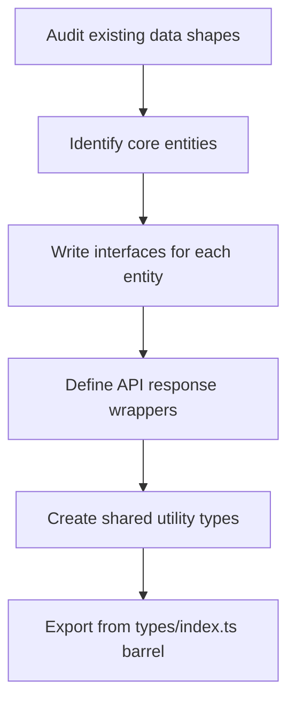

# TypeScript Migration: The 5-Step Strategy That Actually Works

I've watched three different teams attempt TypeScript migrations in the last two years. Two of them failed  not because TypeScript is hard, but because they didn't have a plan. They just started renaming files and hoped for the best. Spoiler: hope is not a typescript migration strategy.

The third team  the one that succeeded  followed a five-step process that I've since refined and used on two more projects. It's not flashy. There's no magic tool that does everything for you. But it works, and it works on codebases of every size from 5,000 lines to 200,000 lines.

Here's the process, step by step.

## Step 1: Add TypeScript Without Changing a Single File

This sounds almost too simple, but it's the most important step. You're going to install TypeScript, create a `tsconfig.json`, and make absolutely sure your existing JavaScript code still builds and runs exactly as before.

```bash
# Install TypeScript and any framework-specific tools
npm install --save-dev typescript

# If you're using React
npm install --save-dev @types/react @types/react-dom

# If you're using Node
npm install --save-dev @types/node

# Generate a tsconfig
npx tsc --init
```

Now configure your `tsconfig.json` for coexistence  JavaScript and TypeScript side by side:

```json
{
  "compilerOptions": {
    "target": "ES2020",
    "module": "ESNext",
    "moduleResolution": "bundler",
    "allowJs": true,
    "checkJs": false,
    "strict": false,
    "noImplicitAny": false,
    "esModuleInterop": true,
    "skipLibCheck": true,
    "outDir": "./dist",
    "rootDir": "./src",
    "jsx": "react-jsx",
    "sourceMap": true
  },
  "include": ["src"],
  "exclude": ["node_modules", "dist"]
}
```

The key settings: `allowJs: true` lets the compiler process JavaScript files. `checkJs: false` prevents TypeScript from type-checking those JS files. And `strict: false` keeps the error count at zero while you're getting started.

Run your build. Run your tests. Everything should pass exactly as it did before. If anything breaks at this stage, fix it before moving on. You're building a foundation here  it needs to be solid.

> **Tip:** Add a `typecheck` script to your `package.json`: `"typecheck": "tsc --noEmit"`. You'll be running this constantly during the migration to check for errors without actually compiling anything.

## Step 2: Create Your Core Types

Before you rename a single file, sit down and define the types that represent the core of your application. Every codebase has them  the user object, the API response format, the configuration shape, the database models.

This is the highest-ROI work in the entire migration. Once these types exist, every file conversion becomes ten times easier because you're importing real types instead of inventing them on the fly.

```typescript
// src/types/user.ts
export interface User {
  id: string;
  email: string;
  displayName: string;
  avatarUrl: string | null;
  role: UserRole;
  createdAt: string; // ISO 8601
  updatedAt: string;
}

export type UserRole = 'admin' | 'editor' | 'viewer';

// src/types/api.ts
export interface ApiResponse<T> {
  data: T;
  meta: {
    page: number;
    perPage: number;
    total: number;
  };
}

export interface ApiError {
  code: string;
  message: string;
  details?: Record<string, string[]>;
}
```

A few guidelines for this step:

- **Don't try to type everything.** Focus on the 10-20 types that get used everywhere. You can add the rest as you convert files.
- **Use a dedicated `types/` directory.** Keeps things organized and makes imports clean.
- **Prefer interfaces for object shapes.** You can extend them later if needed. (If you want the full breakdown on when to use each, check out our guide on [TypeScript interface vs type](/blog/typescript-interface-vs-type).)
- **Model what your API actually returns**, not what you wish it returned. If your API sends dates as strings, type them as `string`, not `Date`. You can add transformation layers later.



## Step 3: Convert Files in Dependency Order

Now the actual migration starts. But you're not just randomly picking files  you're converting them in dependency order, starting from the leaves and working inward.

Think of your codebase as a tree. The leaves are files that don't import anything from your project  utility functions, constants, helpers. The trunk is your main application logic. The roots are your entry points.

**Start with the leaves.**

### The Conversion Order

1. **Constants and configuration**  These are usually just exported objects. Trivial to type.
2. **Utility functions**  Pure functions with clear inputs and outputs. Easy wins.
3. **Data access / API layer**  Functions that fetch data. Now you can use your core types from Step 2.
4. **Business logic / services**  The meaty stuff. Usually depends on utilities and the API layer.
5. **UI components**  Convert these last. They depend on everything else, and by now everything else is typed.

For each file:

```bash
# 1. Rename the file
git mv src/utils/formatDate.js src/utils/formatDate.ts

# 2. Run the type checker
npm run typecheck

# 3. Fix errors in THAT file only
# 4. Run tests
npm test

# 5. Commit
git commit -m "chore: convert formatDate to TypeScript"
```

One file per commit. Small, reviewable diffs. If something breaks, you know exactly which file caused it.

> **Warning:** Don't try to convert files that import from unconverted files in the same commit. Convert the dependencies first. Otherwise you end up in a rabbit hole of cascading type errors across five different files.

### Handling Tricky Files

Some files just don't want to be converted. Maybe they use deeply dynamic patterns, or they interact with an untyped library in weird ways. When you hit one of these:

1. **Don't block the whole migration.** Skip it and come back later.
2. **Create a `.d.ts` declaration file** as a temporary bridge:

```typescript
// src/legacy/weirdModule.d.ts
declare module './weirdModule' {
  export function doWeirdThing(input: unknown): unknown;
  export const config: Record<string, any>;
}
```

3. **Track skipped files** in a migration doc or issue tracker. Don't let them fall through the cracks.

If you want to quickly see what the TypeScript version of a tricky function should look like, [SnipShift's JS to TypeScript converter](https://snipshift.dev/js-to-ts) can give you a solid starting point  it's especially good at inferring parameter types and return types from usage patterns.

## Step 4: Fix Errors Incrementally

Once all your files are renamed to `.ts`, it's time to start tightening the screws. This is where you go from "TypeScript that compiles" to "TypeScript that actually catches bugs."

### Phase 4a: Enable `noImplicitAny`

This single flag will generate the most errors of any setting. It tells TypeScript that every variable, parameter, and return value needs an explicit type  no more silent `any` defaults.

```json
{
  "compilerOptions": {
    "noImplicitAny": true
  }
}
```

Run `npm run typecheck` and brace yourself. You'll see errors like:

```
Parameter 'event' implicitly has an 'any' type.
Parameter 'data' implicitly has an 'any' type.
```

Fix these in batches. A good rhythm is 20-30 errors per session. Don't try to fix them all at once  that's how you burn out.

For errors where you genuinely don't know the type yet, use an explicit `any` with a TODO:

```typescript
// TODO(migration): type this properly after auditing the legacy billing API
function processBilling(data: any): void {
  // ...
}
```

Explicit `any` is different from implicit `any`. It says "I know this is untyped, and I'm choosing to deal with it later." That's honest. Implicit `any` is "I didn't even notice this was untyped." That's dangerous.

### Phase 4b: Enable `strictNullChecks`

This is the flag that catches the billion-dollar mistake  null reference errors. Once you enable it, TypeScript will force you to handle `null` and `undefined` everywhere they might appear.

```typescript
// Before strictNullChecks  this compiles fine
function getUser(id: string): User {
  return users.find(u => u.id === id); // Could be undefined!
}

// After strictNullChecks  TypeScript catches the bug
function getUser(id: string): User | undefined {
  return users.find(u => u.id === id);
}

// Or if you want to throw on missing:
function getUser(id: string): User {
  const user = users.find(u => u.id === id);
  if (!user) throw new Error(`User ${id} not found`);
  return user;
}
```

This phase tends to surface real bugs. I've seen `strictNullChecks` catch null access issues that had been causing intermittent production errors for months. One team I worked with found seven actual bugs just from enabling this one flag.

### Phase 4c: Enable Remaining Strict Flags

Once `noImplicitAny` and `strictNullChecks` are clean, you're most of the way there. The remaining strict flags  `strictBindCallApply`, `strictFunctionTypes`, `strictPropertyInitialization`, `noImplicitThis`, `useUnknownInCatchVariables`, and `alwaysStrict`  tend to produce far fewer errors.

You can enable them one at a time, or just flip `strict: true` and handle what comes up. At this point in the migration, it's usually a manageable number.

| Strict Flag | Typical Error Count | What It Catches |
|------------|-------------------|----------------|
| `noImplicitAny` | High (hundreds) | Untyped parameters, variables |
| `strictNullChecks` | Medium (dozens) | Null/undefined access |
| `strictFunctionTypes` | Low | Function parameter contravariance |
| `strictBindCallApply` | Low | Incorrect bind/call/apply usage |
| `strictPropertyInitialization` | Medium | Uninitialized class properties |
| `noImplicitThis` | Low | Ambiguous `this` context |

## Step 5: Enable Strict Mode and Clean Up

You've made it. All files are `.ts`. All the strict flags are on. Now it's cleanup time.

### Remove Migration Artifacts

```bash
# Find all remaining migration TODOs
grep -rn "TODO.*migration\|MigrationAny\|TODO.*any" src/ --include="*.ts" --include="*.tsx"
```

Go through these one by one and replace them with proper types. This is actually kind of satisfying  each one you fix makes the codebase slightly better.

### Update Your tsconfig.json

Your final `tsconfig.json` should look something like this:

```json
{
  "compilerOptions": {
    "target": "ES2020",
    "module": "ESNext",
    "moduleResolution": "bundler",
    "strict": true,
    "noUncheckedIndexedAccess": true,
    "esModuleInterop": true,
    "skipLibCheck": true,
    "outDir": "./dist",
    "rootDir": "./src",
    "jsx": "react-jsx",
    "sourceMap": true,
    "declaration": true
  },
  "include": ["src"],
  "exclude": ["node_modules", "dist"]
}
```

Notice what's gone: `allowJs` is removed (no more JavaScript files to allow). `checkJs` is gone. All the individual strict flags are replaced by `strict: true`.

I also like adding `noUncheckedIndexedAccess`  it's not part of `strict`, but it forces you to handle the case where an array or object index might return `undefined`. It catches real bugs.

### Add CI Enforcement

Add a type-check step to your CI pipeline so types are verified on every pull request:

```yaml
# .github/workflows/typecheck.yml
name: Type Check
on: [pull_request]
jobs:
  typecheck:
    runs-on: ubuntu-latest
    steps:
      - uses: actions/checkout@v4
      - uses: actions/setup-node@v4
        with:
          node-version: '20'
      - run: npm ci
      - run: npm run typecheck
```

This is your safety net. No one can accidentally introduce type errors or sneak in an `any` without someone noticing.

## How Long Does This Take?

Every team asks this, and the honest answer is: it depends. But here's a rough framework based on migrations I've been involved with:

| Codebase Size | Team Size | Rough Timeline |
|--------------|-----------|----------------|
| < 10,000 lines | 1-2 devs | 2-4 weeks |
| 10,000-50,000 lines | 2-4 devs | 1-3 months |
| 50,000-200,000 lines | 3-6 devs | 3-6 months |
| 200,000+ lines | Full team | 6-12 months |

These assume you're doing the migration alongside feature work  not a dedicated full-time effort. If you can dedicate people to the migration, cut these timelines roughly in half.

The key thing is consistency. Converting 5 files a day is way better than converting 100 files in a weekend and then not touching it for a month. Build the habit into your sprint process.

For a detailed walkthrough of what a large-scale migration actually looks like in practice, including team coordination and tooling decisions, check out our post on [migrating a 50,000-line JavaScript codebase to TypeScript](/blog/large-typescript-migration).

## The Strategy Recap

Five steps. That's it.

1. **Add TypeScript**  install it, configure it, change nothing else
2. **Create core types**  define the interfaces your whole app uses
3. **Convert file by file**  leaves first, trunk last, one commit per file
4. **Fix errors incrementally**  `noImplicitAny`, then `strictNullChecks`, then the rest
5. **Enable strict mode**  clean up migration debt, add CI enforcement

No big bang. No blocked sprints. No multi-thousand-line PRs that nobody wants to review. Just steady, measurable progress toward a fully typed codebase.

The typescript migration strategy that works isn't the clever one  it's the boring one. Small steps, every day, until one morning you run `npm run typecheck` and see zero errors with `strict: true`. And that feeling? Absolutely worth it.

If you want to get started right now, try converting your first file with [SnipShift's converter](https://snipshift.dev/js-to-ts)  paste in some JavaScript and see what the TypeScript version looks like. It's a good way to build intuition before you start the full migration.

For the comprehensive guide covering every gotcha you'll hit along the way, head over to our [complete JavaScript to TypeScript conversion guide](/blog/convert-javascript-to-typescript).
