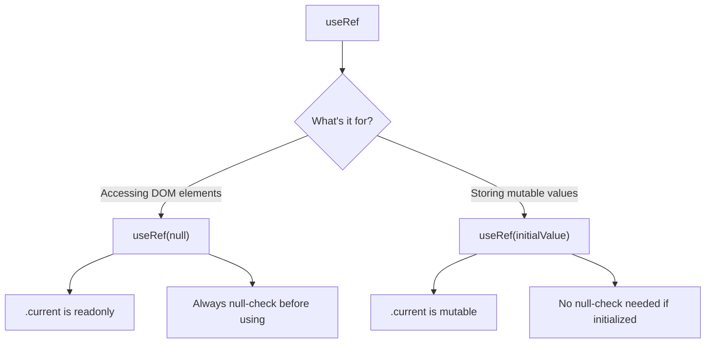

# How to Type useState, useRef, and useEffect in TypeScript

React hooks and TypeScript work remarkably well together  most of the time, TypeScript just infers the right type and you don't have to think about it. But there are specific cases where inference falls short and you need to provide explicit types. After a year of googling the same typescript react hooks types over and over, I finally wrote them all down.

Here's the complete reference for typing every common React hook.

## useState

### When Inference Works (Most Cases)

TypeScript infers the state type from the initial value. You don't need to add anything:

```typescript
const [count, setCount] = useState(0);              // number
const [name, setName] = useState('');                // string
const [isOpen, setIsOpen] = useState(false);         // boolean
const [items, setItems] = useState(['a', 'b']);      // string[]
```

Just pass a value and TypeScript figures it out. Don't add generics when you don't need them  it's just noise.

### When You Need a Generic

There are three specific situations where you need to tell TypeScript the type explicitly:

**1. State that starts as `null` but will hold a value later:**

```typescript
const [user, setUser] = useState<User | null>(null);
const [error, setError] = useState<Error | null>(null);
const [selectedItem, setSelectedItem] = useState<Product | null>(null);
```

Without the generic, TypeScript would infer the type as `null`  and then `setUser(someUser)` would be an error because `null` doesn't include `User`.

**2. Empty arrays where TypeScript can't infer the element type:**

```typescript
const [users, setUsers] = useState<User[]>([]);
const [messages, setMessages] = useState<Message[]>([]);
const [ids, setIds] = useState<string[]>([]);
```

`useState([])` gives you `never[]`  an array that can't hold anything. The generic tells TypeScript what the array will eventually contain.

**3. Union types or specific string literals:**

```typescript
const [status, setStatus] = useState<'idle' | 'loading' | 'error'>('idle');
const [theme, setTheme] = useState<'light' | 'dark'>('light');
const [step, setStep] = useState<1 | 2 | 3>(1);
```

Without the generic, `useState('idle')` infers `string`, not the union. The generic restricts it to only the valid values.

### The useState Cheatsheet

| Scenario | Syntax | Inferred Type |
|----------|--------|--------------|
| Number | `useState(0)` | `number` |
| String | `useState('')` | `string` |
| Boolean | `useState(false)` | `boolean` |
| Nullable object | `useState<User \| null>(null)` | `User \| null` |
| Empty array | `useState<Item[]>([])` | `Item[]` |
| String union | `useState<'a' \| 'b'>('a')` | `'a' \| 'b'` |
| Object | `useState({ x: 0, y: 0 })` | `{ x: number; y: number }` |

## useRef

`useRef` has two distinct use cases, and they're typed differently. This trips up more people than anything else in React TypeScript.

### DOM Refs  For Accessing Elements

When you want to reference a DOM element (to focus an input, measure a div, scroll a container):

```typescript
const inputRef = useRef<HTMLInputElement>(null);
const divRef = useRef<HTMLDivElement>(null);
const canvasRef = useRef<HTMLCanvasElement>(null);

// In JSX
<input ref={inputRef} />
<div ref={divRef} />

// Accessing the element  always null-check first
const focusInput = () => {
  inputRef.current?.focus();
};

// Or with a guard
const getWidth = () => {
  if (divRef.current) {
    return divRef.current.offsetWidth; // TypeScript knows it's HTMLDivElement
  }
  return 0;
};
```

**The key:** pass `null` as the initial value. This creates a `RefObject<HTMLInputElement>` where `current` is read-only  React manages the `.current` value.

Common HTML element types:
- `HTMLInputElement`  `<input>`
- `HTMLTextAreaElement`  `<textarea>`
- `HTMLDivElement`  `<div>`
- `HTMLButtonElement`  `<button>`
- `HTMLFormElement`  `<form>`
- `HTMLCanvasElement`  `<canvas>`
- `HTMLVideoElement`  `<video>`

### Mutable Refs  For Storing Values

When you want to store a value that persists across renders without causing re-renders (timers, previous values, flags):

```typescript
// Timer ref
const timerRef = useRef<ReturnType<typeof setTimeout> | null>(null);

const startTimer = () => {
  timerRef.current = setTimeout(() => {
    console.log('Timer fired');
  }, 1000);
};

const stopTimer = () => {
  if (timerRef.current) {
    clearTimeout(timerRef.current);
    timerRef.current = null;
  }
};

// Previous value ref
const prevCountRef = useRef<number>(0);

useEffect(() => {
  prevCountRef.current = count;
}, [count]);

// Render count ref
const renderCount = useRef(0);
renderCount.current += 1;
```

**The difference from DOM refs:** For mutable refs, you typically initialize with a value (or `null` included in the generic type). The `current` property is mutable  you set it directly.

> **Tip:** Use `ReturnType<typeof setTimeout>` for timer refs instead of `number` or `NodeJS.Timeout`. It works in both browser and Node environments without platform-specific types.



## useEffect

`useEffect` itself doesn't need type annotations  its signature is fixed. But there are patterns worth knowing.

### Basic Effect

```typescript
// No types needed  TypeScript knows the signature
useEffect(() => {
  document.title = `Count: ${count}`;
}, [count]);
```

### Effect with Cleanup

```typescript
useEffect(() => {
  const handler = (event: KeyboardEvent) => {
    if (event.key === 'Escape') setIsOpen(false);
  };

  window.addEventListener('keydown', handler);

  // Cleanup function  TypeScript ensures this returns void
  return () => {
    window.removeEventListener('keydown', handler);
  };
}, []);
```

### Async Effect Pattern

`useEffect` can't be async directly. This is a React constraint, not a TypeScript one  but TypeScript helps enforce it:

```typescript
// WRONG  TypeScript error: effect can't return Promise<void>
useEffect(async () => {
  const data = await fetchUsers();
  setUsers(data);
}, []);

// RIGHT  define async function inside
useEffect(() => {
  const loadUsers = async () => {
    try {
      const data = await fetchUsers();
      setUsers(data);
    } catch (err) {
      setError(err instanceof Error ? err.message : 'Failed to load');
    }
  };

  loadUsers();
}, []);
```

### Effect with Abort Controller

For cancellable fetch requests  a production pattern everyone should use:

```typescript
useEffect(() => {
  const controller = new AbortController();

  const fetchData = async () => {
    try {
      const response = await fetch('/api/users', {
        signal: controller.signal,
      });
      const data: User[] = await response.json();
      setUsers(data);
    } catch (err) {
      if (err instanceof DOMException && err.name === 'AbortError') {
        return; // Expected  component unmounted
      }
      setError('Fetch failed');
    }
  };

  fetchData();

  return () => controller.abort();
}, []);
```

## Other Hooks Quick Reference

### useCallback

Usually inferred from the function signature:

```typescript
// Inferred  no annotation needed
const handleClick = useCallback(() => {
  console.log(count);
}, [count]);

// With parameters  annotate the parameter types
const handleSearch = useCallback((query: string) => {
  fetchResults(query);
}, []);

// When the callback type matters for a child component
const handleSelect = useCallback((item: Item) => {
  setSelected(item);
}, []);
```

### useMemo

Same as `useCallback`  usually inferred:

```typescript
// Inferred as number
const total = useMemo(() => items.reduce((sum, item) => sum + item.price, 0), [items]);

// Inferred as FilteredItem[]
const filtered = useMemo(
  () => items.filter(item => item.status === 'active'),
  [items]
);

// Explicit when needed
const config = useMemo<ChartConfig>(() => ({
  data: processData(rawData),
  options: { responsive: true },
}), [rawData]);
```

### useContext

Type the context value when you create it:

```typescript
interface AuthContext {
  user: User | null;
  login: (email: string, password: string) => Promise<void>;
  logout: () => void;
}

const AuthContext = createContext<AuthContext | null>(null);

// Custom hook with null guard
function useAuth(): AuthContext {
  const context = useContext(AuthContext);
  if (!context) {
    throw new Error('useAuth must be used within AuthProvider');
  }
  return context;
}
```

### useReducer

Type the state and action:

```typescript
interface State {
  count: number;
  error: string | null;
}

type Action =
  | { type: 'increment' }
  | { type: 'decrement' }
  | { type: 'reset'; payload: number }
  | { type: 'error'; payload: string };

function reducer(state: State, action: Action): State {
  switch (action.type) {
    case 'increment':
      return { ...state, count: state.count + 1 };
    case 'decrement':
      return { ...state, count: state.count - 1 };
    case 'reset':
      return { ...state, count: action.payload, error: null };
    case 'error':
      return { ...state, error: action.payload };
  }
}

const [state, dispatch] = useReducer(reducer, { count: 0, error: null });

dispatch({ type: 'increment' });        // OK
dispatch({ type: 'reset', payload: 5 }); // OK
dispatch({ type: 'unknown' });           // Error!
```

The discriminated union on `Action` ensures you can only dispatch valid actions with the correct payloads.

## Custom Hooks

When you write custom hooks, type the return value:

```typescript
function useLocalStorage<T>(key: string, initialValue: T): [T, (value: T) => void] {
  const [stored, setStored] = useState<T>(() => {
    const item = localStorage.getItem(key);
    return item ? (JSON.parse(item) as T) : initialValue;
  });

  const setValue = (value: T) => {
    setStored(value);
    localStorage.setItem(key, JSON.stringify(value));
  };

  return [stored, setValue];
}

// Usage  T is inferred from initialValue
const [theme, setTheme] = useLocalStorage('theme', 'light');
// theme: string, setTheme: (value: string) => void
```

The generic `<T>` makes the hook reusable for any value type while keeping everything type-safe.

If you're converting existing JavaScript React hooks to TypeScript, [SnipShift's converter](https://snipshift.dev/js-to-ts) handles hook typing well  it adds the right generics and parameter types based on usage.

For event handler types that go alongside hooks in components, our [React event handler types reference](/blog/react-typescript-event-handlers) has every event type you'll need. And for the full component conversion process (props, children, refs), see our [JSX to TSX guide](/blog/jsx-to-tsx-react-typescript).
