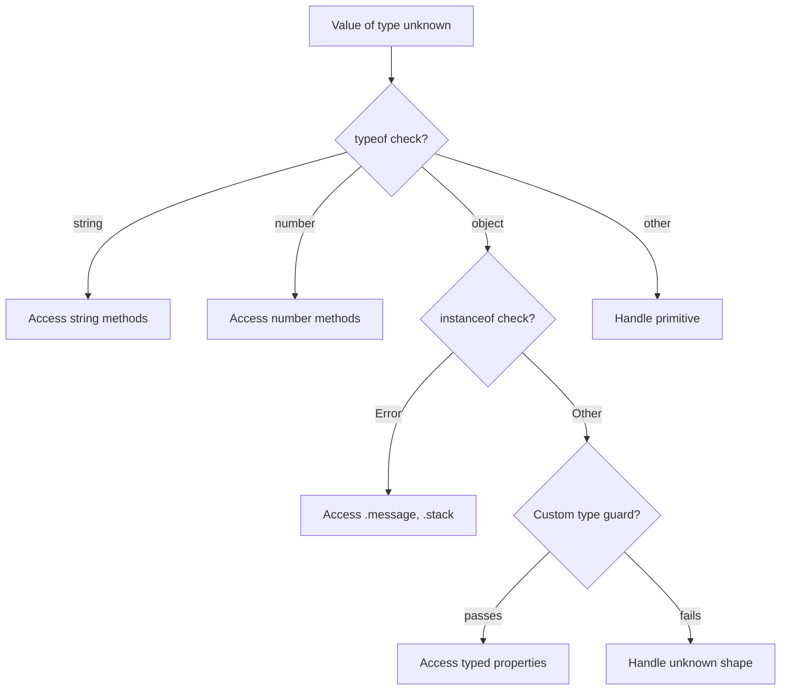

# What Is the Difference Between 'unknown' and 'any' in TypeScript?

I've been doing TypeScript code reviews for a few years now, and there's one pattern that makes me pause every single time: someone using `any` when they clearly meant `unknown`. These two types look similar on the surface  they both accept any value  but they behave in fundamentally different ways. And picking the wrong one can quietly undermine your entire type system.

Here's the short version: `any` turns off type checking. `unknown` keeps it on but demands you prove what the type is before using it. That one difference changes everything.

Let me show you what I mean.

## How `any` Works (And Why It's a Problem)

When you type something as `any`, you're essentially telling TypeScript: "Don't check this. I don't care what type it is. Let me do whatever I want with it."

```typescript
let value: any = "hello";

// TypeScript lets you do ALL of this without complaint
value.foo.bar.baz;     // No error
value.toUpperCase();   // No error
value();               // No error
value[0];              // No error
```

None of those operations are guaranteed to work at runtime. But TypeScript won't warn you about any of them. The `any` type is a complete opt-out from type safety.

And here's the really insidious part  `any` is contagious. It spreads through your codebase:

```typescript
let data: any = fetchSomething();
let name = data.user.name; // name is now 'any' too
let upper = name.toUpperCase(); // still 'any'
let result = processName(upper); // if processName accepts string, no error
```

One `any` at the top propagated through three assignments. You've effectively turned off type checking for an entire chain of operations. I've seen codebases where a single `any` in a utility function silently disabled type safety for hundreds of call sites.

## How `unknown` Works (The Safe Alternative)

The `unknown` type was introduced in TypeScript 3.0, and it's the type-safe counterpart to `any`. It accepts any value  just like `any`  but it won't let you *do* anything with that value until you prove what type it is.

```typescript
let value: unknown = "hello";

// TypeScript blocks ALL of this
value.toUpperCase();   // Error: 'value' is of type 'unknown'
value();               // Error: 'value' is of type 'unknown'
value.foo;             // Error: 'value' is of type 'unknown'
```

You have to narrow the type first:

```typescript
let value: unknown = "hello";

if (typeof value === "string") {
  // Now TypeScript knows it's a string
  console.log(value.toUpperCase()); // Works fine: "HELLO"
}
```

This is *exactly* how you should handle values whose types you don't know at compile time. You accept the value, then you verify what it is before using it. It's the difference between "I don't know what this is and I don't care" (`any`) and "I don't know what this is *yet*, but I'll figure it out" (`unknown`).

## The Comparison Table

Here's a side-by-side breakdown of **typescript unknown vs any**:

| Feature | `any` | `unknown` |
|---------|-------|-----------|
| Accepts any value | Yes | Yes |
| Assignable to other types | Yes (no check) | No (must narrow first) |
| Property access allowed | Yes (unchecked) | No (must narrow first) |
| Function calls allowed | Yes (unchecked) | No (must narrow first) |
| Type safety preserved | No | Yes |
| Contagious to other variables | Yes | No |
| Use case | Legacy code, quick prototyping | Any value from external sources |
| Introduced in | TypeScript 1.0 | TypeScript 3.0 |

The key takeaway: `unknown` forces you to do the work of type checking. `any` lets you skip it. In almost every case, doing the work is the right call.

## Type Narrowing with `unknown`: The Patterns You Need

Working with `unknown` means mastering type narrowing. Here are the patterns I use most:

### typeof Guards

```typescript
function processValue(val: unknown) {
  if (typeof val === "string") {
    return val.trim(); // TypeScript knows: string
  }
  if (typeof val === "number") {
    return val.toFixed(2); // TypeScript knows: number
  }
  return String(val);
}
```

### instanceof Checks

```typescript
function handleError(err: unknown) {
  if (err instanceof Error) {
    console.error(err.message); // TypeScript knows: Error
    console.error(err.stack);
  } else {
    console.error("Unknown error:", err);
  }
}
```

This `handleError` pattern is especially relevant. Since TypeScript 4.4, `catch` clause variables default to `unknown` when `useUnknownInCatchVariables` is enabled. So you'll be writing this kind of narrowing code a lot.

### Custom Type Guards

For more complex shapes  like API responses  you'll want custom type guard functions:

```typescript
interface User {
  id: number;
  name: string;
  email: string;
}

function isUser(val: unknown): val is User {
  return (
    typeof val === "object" &&
    val !== null &&
    "id" in val &&
    "name" in val &&
    "email" in val
  );
}

// Usage
const data: unknown = await response.json();

if (isUser(data)) {
  // TypeScript now treats data as User
  console.log(data.name);
}
```



## Real-World Scenarios: When to Use Each

### Use `unknown` for: External Data

Anything that comes from *outside* your TypeScript code should be `unknown`:

```typescript
// API responses
async function fetchUser(id: string): Promise<unknown> {
  const res = await fetch(`/api/users/${id}`);
  return res.json();
}

// User input from forms or query params
function parseSearchParams(raw: unknown): SearchFilters {
  // validate and narrow before using
}

// JSON parsing
function safeJsonParse(text: string): unknown {
  return JSON.parse(text);
}
```

This is the pattern that'll save you. API responses can change. User input is unpredictable. JSON can contain anything. Typing these as `unknown` forces you to validate before using  which is what you should be doing anyway.

### Use `any` for: Almost Nothing

I'm going to be a bit opinionated here: there are very few legitimate uses for `any` in modern TypeScript. But a few still exist:

```typescript
// Migrating a large JS codebase incrementally
// Temporarily using any to get things compiling
let legacyConfig: any = loadOldConfig();

// Working with a library that has genuinely broken types
const brokenLib: any = require("some-old-package");

// Type-level gymnastics where any is the escape hatch
type JsonPrimitive = string | number | boolean | null;
type JsonValue = JsonPrimitive | JsonArray | JsonObject;
interface JsonObject { [key: string]: JsonValue }
interface JsonArray extends Array<JsonValue> {}
```

If you're migrating a JavaScript codebase to TypeScript and finding yourself reaching for `any` too often, tools like [SnipShift's JS to TypeScript converter](https://snipshift.dev/js-to-ts) can generate proper typed interfaces instead of leaving you with `any` everywhere. It infers types from your actual code patterns, which is a lot better than slapping `any` on things and calling it a day.

### The Migration Path: `any` → `unknown`

If you've got an existing codebase littered with `any`, here's a practical approach I've used:

1. **Enable `noImplicitAny`** in `tsconfig.json`  this stops new `any` from creeping in
2. **Search for explicit `any` annotations**  `grep -r ": any" src/`
3. **Replace with `unknown` one file at a time**  fix the type errors that surface
4. **Add `useUnknownInCatchVariables`**  forces proper error handling in catch blocks

Don't try to do it all at once. A team I worked with set a goal of eliminating 10 `any` annotations per sprint. Within a quarter, they'd cut their `any` count by 80% and caught two bugs in the process that had been hiding behind loose types.

## The ESLint Rules That Help

If you're serious about keeping `any` out of your codebase, `@typescript-eslint` has your back:

```json
{
  "rules": {
    "@typescript-eslint/no-explicit-any": "error",
    "@typescript-eslint/no-unsafe-assignment": "warn",
    "@typescript-eslint/no-unsafe-member-access": "warn",
    "@typescript-eslint/no-unsafe-call": "warn"
  }
}
```

The `no-explicit-any` rule will flag any `any` annotations in your code. The `no-unsafe-*` rules catch the places where `any` has spread through assignments and method calls.

> **Tip:** Start with these rules set to `"warn"` on existing projects, then gradually move to `"error"` as you clean up. Going straight to `"error"` on a legacy codebase will give you hundreds of failures and nobody will want to fix them.

## The Bottom Line

Think of `any` and `unknown` like this: `any` is telling airport security "just let me through, I'm fine." `unknown` is going through the scanner like everyone else. Both get you on the plane  but one of them is how the system is supposed to work.

In almost every situation where you're tempted to write `any`, what you actually want is `unknown` plus type narrowing. It's a bit more code upfront, but it's code that catches bugs before your users do.

For a deeper look at TypeScript's type system, check out our guide on [TypeScript generics](/blog/typescript-generics-explained)  generics and `unknown` work beautifully together for building type-safe utilities. And if you're just starting your TypeScript journey, our [JavaScript to TypeScript conversion guide](/blog/convert-javascript-to-typescript) covers the full migration path, including how to handle all those `any` types you'll inevitably encounter along the way.
