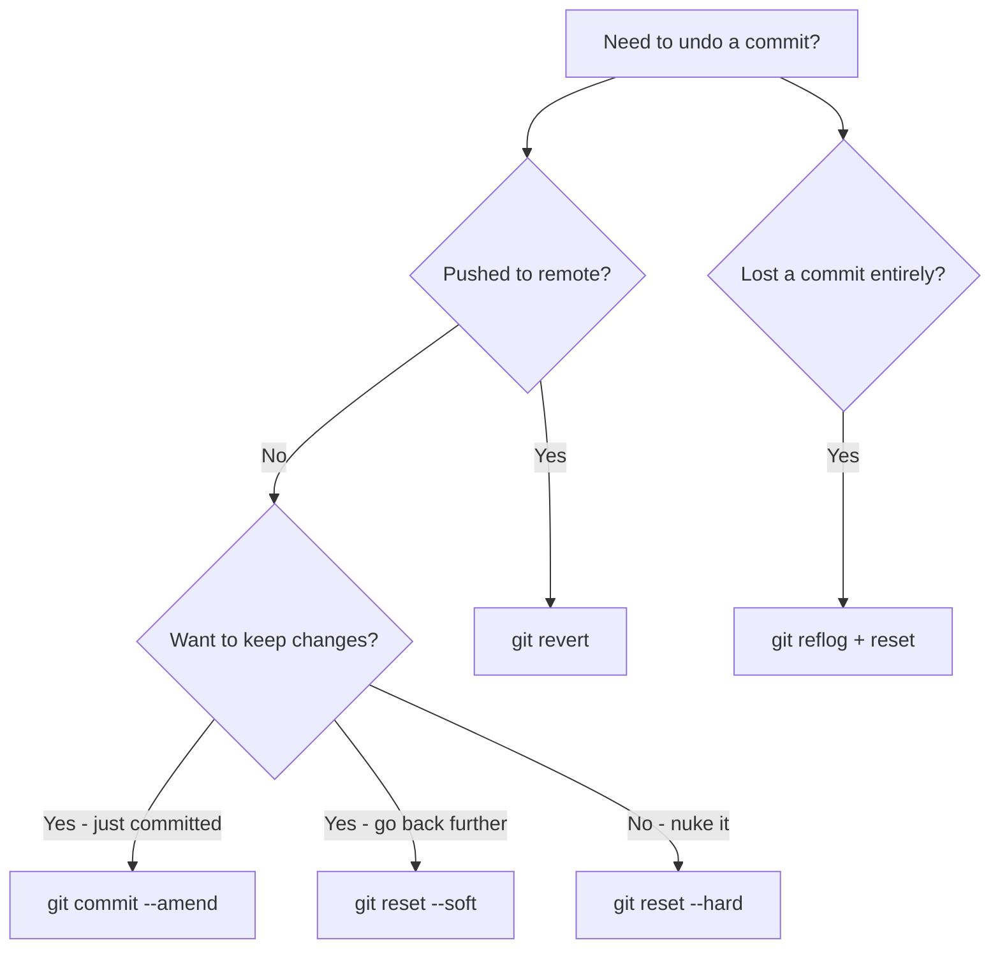
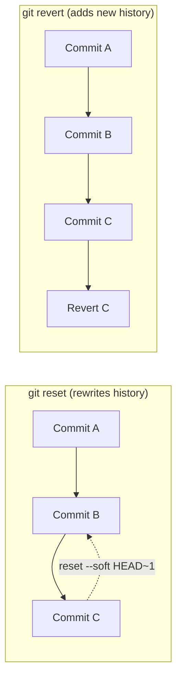

# How to Undo a Git Commit (Every Scenario Covered)

You just hit `git commit` and immediately realized something's wrong. Maybe you forgot a file. Maybe the commit message has a typo. Or maybe you committed directly to `main` and your stomach just dropped.

We've all been there. I've personally fat-fingered commits at 11pm on a Friday more times than I'd like to admit. The good news? Git is ridiculously forgiving  if you know which undo button to press.

The bad news? There are like five different ways to **undo a git commit**, and picking the wrong one can make things worse. So let me walk you through every scenario, from "I just committed two seconds ago" to "I've lost everything and I'm questioning my career choices."

## The Decision Tree: Which Undo Do You Need?

Before we get into the commands, here's the quick mental model I use. Ask yourself two questions:

1. **Have you pushed the commit?** If yes, your options narrow significantly.
2. **Do you want to keep the changes?** This determines whether you reset soft or hard.



That diagram covers about 95% of real-world undo scenarios. Let me break each one down.

## Scenario 1: "I Just Committed  Let Me Fix That Real Quick"

This is the most common one. You committed, then immediately noticed a typo in the message, or you forgot to stage a file. The fix is `--amend`.

### Fixing the commit message

```bash
git commit --amend -m "The correct commit message"
```

That's it. This replaces your last commit with a new one that has the updated message. The old commit is gone  well, technically it's still in the reflog, but for all practical purposes it's replaced.

### Adding a forgotten file

```bash
git add forgotten-file.ts
git commit --amend --no-edit
```

The `--no-edit` flag keeps your original commit message. The forgotten file gets rolled into the last commit as if it was always there.

> **Warning:** Only use `--amend` on commits you haven't pushed yet. Amending a pushed commit rewrites history, and that causes headaches for anyone who's already pulled your branch. If you've pushed, skip to the `revert` section.

### When to use `--amend`

- You literally just committed (seconds ago)
- The commit hasn't been pushed
- You need to fix the message or add/remove files from the commit
- You don't want an extra "fix typo" commit cluttering the log

## Scenario 2: "I Need to Go Back, But Keep My Changes"

Sometimes `--amend` isn't enough. Maybe you made two commits that should have been one, or you committed to the wrong branch and want to move those changes elsewhere. This is where `git reset --soft` shines.

```bash
# Undo the last commit, keep changes staged
git reset --soft HEAD~1
```

What this does: it moves the `HEAD` pointer back one commit, but leaves all your changes in the staging area. It's like un-committing  your files are exactly where they were right before you ran `git commit`.

You can go back further too:

```bash
# Undo the last 3 commits, keep all changes staged
git reset --soft HEAD~3
```

This is incredibly useful when you realize you want to reorganize your last few commits. All the changes from those commits land back in your staging area, and you can re-commit them however you want.

### The "committed to wrong branch" rescue

This is a pattern I use probably once a month:

```bash
# Oops, committed to main instead of feature branch
git reset --soft HEAD~1          # Undo the commit, keep changes staged
git stash                        # Stash the changes
git checkout feature-branch      # Switch to the right branch
git stash pop                    # Apply the changes
git commit -m "The actual commit" # Commit on the right branch
```

Could you cherry-pick instead? Sure. But I find this flow more intuitive when you haven't pushed yet.

## Scenario 3: "Nuke Everything  I Don't Want These Changes"

Sometimes you just want to pretend the last commit (or commits) never happened. No staged changes, no modified files. Clean slate. That's `git reset --hard`.

```bash
# Undo the last commit AND discard all changes
git reset --hard HEAD~1
```

**This is destructive.** The changes from that commit are gone. Not staged, not in your working directory. Gone. Well, not completely gone  the reflog has your back for about 90 days  but for all practical purposes, those changes are history.

```bash
# Go back to a specific commit
git reset --hard abc1234
```

You can also reset to a specific commit hash if you know exactly where you want to land.

> **Warning:** Triple-check before running `reset --hard`. There's no "are you sure?" prompt. I've seen teammates lose hours of work because they `reset --hard` without thinking. If there's even a tiny chance you might want those changes, use `--soft` instead and just delete the files manually. At least that way you have a moment to reconsider.

### When to use `--hard` vs `--soft`

| Command | Keeps changes staged? | Keeps working directory? | Destructive? |
|---------|----------------------|-------------------------|-------------|
| `git reset --soft HEAD~1` | Yes | Yes | No |
| `git reset --mixed HEAD~1` | No | Yes | Partially |
| `git reset --hard HEAD~1` | No | No | Yes |

The `--mixed` option is actually the default if you just type `git reset HEAD~1` without a flag. It unstages the changes but keeps them in your working directory. Sort of a middle ground that honestly I don't use very often, but it's good to know about.

## Scenario 4: "I Already Pushed  How Do I Undo Publicly?"

Here's where things get real. You've pushed a commit to a shared branch. Maybe it introduced a bug, maybe it shouldn't have been merged yet. You can't rewrite history on a public branch without making enemies. So you use `git revert`.

```bash
# Create a NEW commit that undoes the changes from the specified commit
git revert HEAD
```

`git revert` doesn't delete anything. It creates a brand new commit that applies the inverse of the target commit. If the original commit added a line, the revert commit removes it. History is preserved, nobody's branch gets messed up, and the change is clearly documented.

```bash
# Revert a specific commit by hash
git revert abc1234

# Revert multiple commits (creates one revert commit per original)
git revert HEAD~3..HEAD
```

### Revert vs Reset: The Key Difference

This trips people up. Here's the mental model:

- **Reset** rewrites history (moves the branch pointer backward). Use on local/unpushed branches.
- **Revert** adds new history (creates an undo commit). Use on shared/pushed branches.



If you work on a team, `revert` is almost always the safer choice for anything that's been pushed. Rewriting shared history with `reset` or `push --force` is one of those things that can ruin someone's afternoon  and their trust in you.

### Dealing with merge conflicts during revert

Sometimes `git revert` will hit merge conflicts, especially if later commits built on top of the one you're reverting. When that happens:

```bash
# Fix the conflicts manually, then
git add .
git revert --continue
```

Or if you realize midway that you don't want to revert after all:

```bash
git revert --abort
```

No harm done.

## Scenario 5: "I Lost a Commit and I'm Panicking"

Deep breath. If the commit ever existed in your local repo  even if you `reset --hard` past it  Git probably still has it. Enter `git reflog`.

```bash
git reflog
```

The reflog is Git's secret diary. It records every time `HEAD` moves  commits, resets, checkouts, rebases, everything. And it keeps this log for 90 days by default.

The output looks something like this:

```bash
abc1234 HEAD@{0}: reset: moving to HEAD~1
def5678 HEAD@{1}: commit: Add user authentication
ghi9012 HEAD@{2}: commit: Fix navbar styling
```

See that `def5678`? That's the commit you "lost." To get it back:

```bash
# Option 1: Reset back to the lost commit
git reset --hard def5678

# Option 2: Create a new branch from the lost commit
git branch recovery-branch def5678
```

I personally prefer Option 2  creating a recovery branch  because it doesn't overwrite your current state. You can inspect the recovered commit, cherry-pick what you need, and delete the branch when you're done.

> **Tip:** The reflog is local only. It doesn't get pushed to remotes, and it doesn't exist on fresh clones. So if you cloned a repo, made no commits locally, and want to recover something  the reflog won't help. But for anything you've done on your machine, it's a lifesaver.

## The Complete Undo Cheat Sheet

Here's the table I keep bookmarked. Every time I need to undo something in Git, I check this first:

| Scenario | Command | Keeps Changes? | Safe for Pushed? |
|----------|---------|---------------|-----------------|
| Fix last commit message | `git commit --amend -m "new msg"` | Yes | No |
| Add file to last commit | `git add file && git commit --amend --no-edit` | Yes | No |
| Undo commit, keep staged | `git reset --soft HEAD~1` | Yes (staged) | No |
| Undo commit, keep unstaged | `git reset HEAD~1` | Yes (unstaged) | No |
| Undo commit, discard everything | `git reset --hard HEAD~1` | No | No |
| Undo a pushed commit | `git revert <hash>` | N/A (new commit) | Yes |
| Recover a lost commit | `git reflog` + `git reset <hash>` | Yes | No |

That covers pretty much every undo scenario you'll encounter in day-to-day development. Bookmark it, print it, tattoo it on your forearm  whatever works.

## A Few Things I've Learned the Hard Way

After years of undoing my own mistakes in Git, here are some patterns that have stuck:

**Always check `git log --oneline` before any destructive operation.** Make sure you know exactly what you're about to undo. I've accidentally reset past the wrong commit more than once because I was rushing.

**When in doubt, create a backup branch.** Before any reset or rebase, just run `git branch backup-branch`. It takes one second and gives you a safety net. If things go sideways, your original state is right there.

**Use `git stash` as a quick save.** If you're about to do something you're not sure about, stash your working changes first. It's the Git equivalent of saving before the boss fight. And if you want to level up your stash game, check out our guide on [advanced git stash techniques](/blog/git-stash-like-a-pro).

**Don't force push to shared branches.** Seriously. Use `revert`. If you absolutely must force push, communicate with your team first. A `git push --force-with-lease` is slightly safer than `--force` since it checks that no one else has pushed in the meantime  but it's still risky.

If you're working on cleaning up your workflow, learning to write better commit messages upfront can save you from needing to undo as often. We've got a full breakdown of [conventional commit message formats](/blog/git-commit-message-conventions) that pairs well with this. And if you want to automate quality checks before commits even happen, take a look at [setting up Git hooks with Husky](/blog/git-hooks-husky-lint-staged).

For those moments when you need to quickly convert a config file format while setting up your Git workflow  say, transforming a JSON config to YAML for a CI pipeline  [SnipShift's converter tools](https://snipshift.dev) can save you a few minutes of manual reformatting.

Git's undo system is powerful, but it's not always obvious. The key takeaway: **if it's local, you can rewrite history freely. If it's been pushed, add new history with revert.** And if all else fails, the reflog has your back. You almost never truly lose work in Git  you just temporarily forget where it went.
