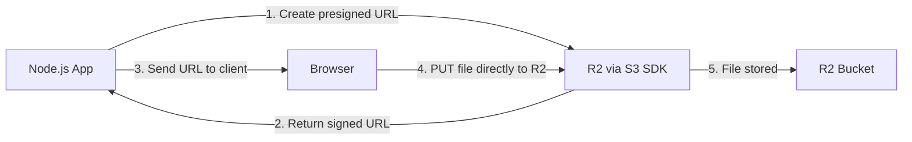

# How to Upload Files to Cloudflare R2 from Node.js (S3-Compatible)

I switched a project from AWS S3 to Cloudflare R2 about eight months ago, primarily because of egress costs. S3 charges you every time someone downloads a file  and for an app serving user-uploaded images, that bill was getting painful. R2 has zero egress fees. Same API, dramatically cheaper for read-heavy workloads.

The best part? R2 is S3-compatible, which means you use the same `@aws-sdk/client-s3` package you already know. The switch was shockingly easy  change an endpoint URL and some credentials, and everything just worked.

## Setting Up Your R2 Bucket

Head to the [Cloudflare dashboard](https://dash.cloudflare.com), navigate to **R2 Object Storage**, and create a bucket. A few things to decide:

- **Bucket name**  lowercase, no spaces. Something like `my-app-uploads`
- **Location hint**  pick the region closest to your users (this is a hint, not a hard assignment  R2 distributes globally)

Next, create an API token. Go to **R2 → Manage R2 API Tokens → Create API token**. Give it:
- **Object Read & Write** permissions
- Scope it to your specific bucket (don't use account-wide tokens in production)

You'll get an **Access Key ID**, **Secret Access Key**, and your **Account ID**. Save all three.

Your `.env` should look like:

```bash
R2_ACCOUNT_ID=your-account-id
R2_ACCESS_KEY_ID=your-access-key-id
R2_SECRET_ACCESS_KEY=your-secret-access-key
R2_BUCKET_NAME=my-app-uploads
```

## Connecting with the AWS SDK

Install the S3 client:

```bash
npm install @aws-sdk/client-s3 @aws-sdk/s3-request-presigner
```

Create your R2 client:

```typescript
// lib/r2.ts
import { S3Client } from "@aws-sdk/client-s3";

export const r2Client = new S3Client({
  region: "auto",
  endpoint: `https://${process.env.R2_ACCOUNT_ID}.r2.cloudflarestorage.com`,
  credentials: {
    accessKeyId: process.env.R2_ACCESS_KEY_ID!,
    secretAccessKey: process.env.R2_SECRET_ACCESS_KEY!,
  },
});
```

That's it. The `region: "auto"` and the R2-specific endpoint are the only differences from a standard S3 setup. Every S3 operation you know works the same way.

## How the Upload Flow Works



There are two approaches: upload through your server, or generate a presigned URL and let the client upload directly. The presigned URL approach is almost always better for production  it keeps large files off your server and reduces bandwidth costs.

## Direct Server Upload

For small files or server-to-server transfers, uploading through your Node.js app is simple:

```typescript
// lib/r2.ts
import { PutObjectCommand, GetObjectCommand, DeleteObjectCommand } from "@aws-sdk/client-s3";
import { r2Client } from "./r2";

const BUCKET = process.env.R2_BUCKET_NAME!;

export async function uploadFile(
  key: string,
  body: Buffer | ReadableStream,
  contentType: string
) {
  const command = new PutObjectCommand({
    Bucket: BUCKET,
    Key: key,
    Body: body,
    ContentType: contentType,
  });

  return r2Client.send(command);
}

export async function getFile(key: string) {
  const command = new GetObjectCommand({
    Bucket: BUCKET,
    Key: key,
  });

  return r2Client.send(command);
}

export async function deleteFile(key: string) {
  const command = new DeleteObjectCommand({
    Bucket: BUCKET,
    Key: key,
  });

  return r2Client.send(command);
}
```

Usage in an API route:

```typescript
// app/api/upload/route.ts
import { NextResponse } from "next/server";
import { uploadFile } from "@/lib/r2";
import { randomUUID } from "crypto";

export async function POST(request: Request) {
  const formData = await request.formData();
  const file = formData.get("file") as File;

  if (!file) {
    return NextResponse.json({ error: "No file provided" }, { status: 400 });
  }

  const buffer = Buffer.from(await file.arrayBuffer());
  const key = `uploads/${randomUUID()}-${file.name}`;

  await uploadFile(key, buffer, file.type);

  return NextResponse.json({ key, url: `/api/files/${key}` });
}
```

## Presigned URLs (The Better Approach for Production)

For client-side uploads  which you should use for anything user-facing  generate a presigned URL that lets the browser upload directly to R2:

```typescript
// lib/r2.ts
import { PutObjectCommand } from "@aws-sdk/client-s3";
import { getSignedUrl } from "@aws-sdk/s3-request-presigner";
import { r2Client } from "./r2";

const BUCKET = process.env.R2_BUCKET_NAME!;

export async function getPresignedUploadUrl(
  key: string,
  contentType: string,
  expiresIn = 3600 // 1 hour
) {
  const command = new PutObjectCommand({
    Bucket: BUCKET,
    Key: key,
    ContentType: contentType,
  });

  return getSignedUrl(r2Client, command, { expiresIn });
}
```

API route to generate the URL:

```typescript
// app/api/upload-url/route.ts
import { NextResponse } from "next/server";
import { getPresignedUploadUrl } from "@/lib/r2";
import { randomUUID } from "crypto";

export async function POST(request: Request) {
  const { filename, contentType } = await request.json();

  const key = `uploads/${randomUUID()}-${filename}`;
  const url = await getPresignedUploadUrl(key, contentType);

  return NextResponse.json({ url, key });
}
```

Client-side upload:

```typescript
async function uploadFile(file: File) {
  // 1. Get presigned URL from your API
  const res = await fetch("/api/upload-url", {
    method: "POST",
    headers: { "Content-Type": "application/json" },
    body: JSON.stringify({
      filename: file.name,
      contentType: file.type,
    }),
  });
  const { url, key } = await res.json();

  // 2. Upload directly to R2
  await fetch(url, {
    method: "PUT",
    headers: { "Content-Type": file.type },
    body: file,
  });

  return key; // Store this in your database
}
```

This pattern keeps your server lean. The file goes straight from the user's browser to R2  your server only handles generating the signed URL, which is a tiny JSON response.

## Multipart Upload for Large Files

For files over 100MB (or honestly, anything over 10MB where you want progress tracking), use multipart upload:

```typescript
import {
  CreateMultipartUploadCommand,
  UploadPartCommand,
  CompleteMultipartUploadCommand,
} from "@aws-sdk/client-s3";
import { r2Client } from "./r2";

const BUCKET = process.env.R2_BUCKET_NAME!;
const PART_SIZE = 10 * 1024 * 1024; // 10MB per part

export async function multipartUpload(key: string, buffer: Buffer, contentType: string) {
  // 1. Initiate the upload
  const { UploadId } = await r2Client.send(
    new CreateMultipartUploadCommand({
      Bucket: BUCKET,
      Key: key,
      ContentType: contentType,
    })
  );

  // 2. Upload parts
  const parts: { ETag: string; PartNumber: number }[] = [];
  const totalParts = Math.ceil(buffer.length / PART_SIZE);

  for (let i = 0; i < totalParts; i++) {
    const start = i * PART_SIZE;
    const end = Math.min(start + PART_SIZE, buffer.length);

    const { ETag } = await r2Client.send(
      new UploadPartCommand({
        Bucket: BUCKET,
        Key: key,
        UploadId,
        PartNumber: i + 1,
        Body: buffer.subarray(start, end),
      })
    );

    parts.push({ ETag: ETag!, PartNumber: i + 1 });
  }

  // 3. Complete the upload
  await r2Client.send(
    new CompleteMultipartUploadCommand({
      Bucket: BUCKET,
      Key: key,
      UploadId,
      MultipartUpload: { Parts: parts },
    })
  );
}
```

> **Tip:** R2's minimum part size is 5MB (except for the last part). If you set `PART_SIZE` smaller than that, you'll get an error that's not super obvious. I learned this one the hard way.

## R2 vs S3: Cost Comparison

Here's the real reason most people are looking at R2. The numbers are pretty compelling:

| | Cloudflare R2 | AWS S3 Standard |
|---|---|---|
| Storage | $0.015/GB/month | $0.023/GB/month |
| Class A ops (writes) | $4.50/million | $5.00/million |
| Class B ops (reads) | $0.36/million | $0.40/million |
| **Egress (data out)** | **$0.00** | **$0.09/GB** |
| Free tier storage | 10 GB/month | 5 GB (12 months) |

That egress line is the killer feature. If you're serving 1TB of downloads per month, S3 charges you ~$90 in egress alone. R2 charges you nothing. For image-heavy apps, file sharing platforms, or anything with significant download traffic, the savings are substantial.

> **Warning:** R2 doesn't have every S3 feature. Notably, there's no S3 Select, no Object Lock (yet), and no cross-region replication (R2 handles distribution differently). For most upload/download use cases, you won't miss these. But check your requirements before migrating.

## TypeScript Types for Your R2 Operations

If you're building a typed wrapper around your R2 operations  and you should  here are the types I use:

```typescript
// types/storage.ts
export interface UploadResult {
  key: string;
  url: string;
  contentType: string;
  size: number;
}

export interface PresignedUrlResult {
  uploadUrl: string;
  key: string;
  expiresAt: Date;
}

export interface StorageConfig {
  bucket: string;
  maxFileSize: number; // in bytes
  allowedTypes: string[];
}
```

If you're converting existing JavaScript S3 code to TypeScript, [SnipShift's JS to TypeScript converter](https://snipshift.dev/js-to-ts) can generate these interfaces from your existing code patterns. It's especially useful when you've got a bunch of untyped AWS SDK calls scattered across your codebase.

For more on handling file uploads in Node.js generally  validation, streaming, security considerations  our [file uploads in Node.js guide](/blog/handle-file-uploads-nodejs) covers the patterns that apply regardless of which storage provider you use. And if you're managing the environment variables for all these credentials, our [env files management guide](/blog/manage-multiple-env-files) has you covered.

## Wrapping Up

R2 is genuinely one of the easiest infrastructure migrations I've done. Swap the endpoint, update credentials, zero egress fees. The S3 compatibility means your existing code, libraries, and mental models all transfer directly. And for the vast majority of file storage use cases  user uploads, media serving, backups  it's strictly cheaper than S3 with no real feature trade-offs.

Start with presigned URLs for client uploads, use multipart for anything over 10MB, and enjoy never seeing an egress line item on your bill again. Browse more developer tools at [SnipShift](https://snipshift.dev) to speed up the rest of your stack.
