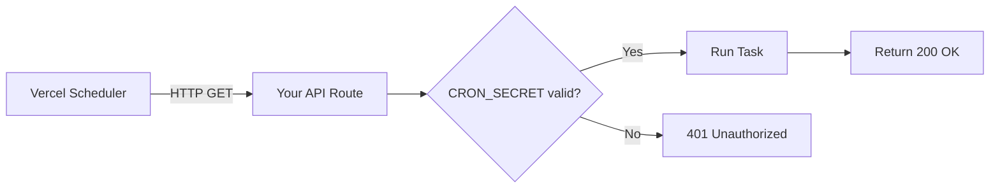

# How to Add Cron Jobs to a Next.js App on Vercel

The first time I needed a scheduled task on Vercel, I assumed there'd be a dashboard button somewhere  "Add Cron Job," click, done. There wasn't. Instead, you configure it through a JSON file, write an API route, handle authentication manually, and deal with execution time limits that differ based on your plan. Not exactly what I'd call discoverable.

But once you know the setup, **Vercel cron jobs** actually work pretty well for most use cases  cache warming, sending daily digests, cleaning up stale data, syncing with external APIs. Here's the full walkthrough, including the parts the docs gloss over.

## How Vercel Cron Jobs Work

The concept is simple: Vercel calls one of your API routes on a schedule you define. That's it. There's no separate cron service  Vercel's infrastructure sends an HTTP request to your endpoint at the specified interval.



The schedule is defined in `vercel.json`, and the route handler lives in your Next.js app just like any other API route. The key thing to understand: Vercel is the caller. Your route needs to verify that the request actually came from Vercel (via `CRON_SECRET`) and not from some random bot hitting your endpoint.

## Step 1: Define the Schedule in vercel.json

Create or update your `vercel.json` at the project root:

```json
{
  "crons": [
    {
      "path": "/api/cron/daily-cleanup",
      "schedule": "0 6 * * *"
    }
  ]
}
```

The `schedule` field uses standard cron syntax. If you haven't written cron expressions in a while, here's a quick refresher:

```
┌───────── minute (0-59)
│ ┌─────── hour (0-23)
│ │ ┌───── day of month (1-31)
│ │ │ ┌─── month (1-12)
│ │ │ │ ┌─ day of week (0-6, Sunday = 0)
│ │ │ │ │
* * * * *
```

Some common schedules:

| Schedule | Cron Expression | Notes |
|----------|----------------|-------|
| Every hour | `0 * * * *` | On the hour |
| Every 6 hours | `0 */6 * * *` | At :00 every 6h |
| Daily at 6 AM UTC | `0 6 * * *` | UTC, not local time |
| Every Monday at 9 AM UTC | `0 9 * * 1` | Weekly |
| Every 15 minutes | `*/15 * * * *` | Pro/Enterprise only |

> **Warning:** All cron schedules run in **UTC**. There's no timezone configuration. If you need something to run at 9 AM EST, that's `0 14 * * *` (UTC-5)  and don't forget daylight saving shifts it to UTC-4 part of the year. I've been burned by this more than once.

### Limits by Plan

This is the part that catches people off guard:

| Plan | Min Interval | Max Execution Time | Max Cron Jobs |
|------|-------------|-------------------|---------------|
| Hobby | 1 day | 10 seconds | 2 |
| Pro | 1 minute | 60 seconds | 40 |
| Enterprise | 1 minute | 900 seconds | 100 |

Yes, Hobby plans can only run cron jobs **once per day** with a **10-second timeout**. If you're trying to run something every hour on a free plan, it simply won't work. And that 10-second limit means your task better be fast  no batch-processing thousands of records.

## Step 2: Create the API Route Handler

Create your API route. In the App Router, that's a `route.ts` file:

```typescript
// app/api/cron/daily-cleanup/route.ts
import { NextResponse } from "next/server";

export async function GET(request: Request) {
  // Verify the request is from Vercel's cron scheduler
  const authHeader = request.headers.get("authorization");

  if (authHeader !== `Bearer ${process.env.CRON_SECRET}`) {
    return NextResponse.json(
      { error: "Unauthorized" },
      { status: 401 }
    );
  }

  try {
    // Your actual task logic here
    const deletedCount = await cleanupStaleRecords();

    return NextResponse.json({
      success: true,
      deleted: deletedCount,
      timestamp: new Date().toISOString(),
    });
  } catch (error) {
    console.error("Cron job failed:", error);
    return NextResponse.json(
      { error: "Internal server error" },
      { status: 500 }
    );
  }
}

async function cleanupStaleRecords(): Promise<number> {
  // Example: delete records older than 30 days
  // Replace with your actual database logic
  const thirtyDaysAgo = new Date();
  thirtyDaysAgo.setDate(thirtyDaysAgo.getDate() - 30);

  // const result = await db.delete(sessions)
  //   .where(lt(sessions.createdAt, thirtyDaysAgo));
  // return result.rowCount;

  return 0;
}
```

A few things to notice:

- **GET, not POST.** Vercel cron hits your endpoint with a GET request.
- **Authorization header.** Vercel sends `Bearer <CRON_SECRET>` automatically. You just need to verify it.
- **Return a response.** Always return 200 for success. Vercel logs non-200 responses as failures.

## Step 3: Set Up CRON_SECRET

Generate a random secret and add it as an environment variable in Vercel:

```bash
# Generate a secure random string
openssl rand -base64 32
```

Then in your Vercel dashboard: **Settings → Environment Variables → Add**

```
Key: CRON_SECRET
Value: your-generated-secret-here
Environments: Production (and Preview if needed)
```

Vercel automatically sends this secret in the `Authorization` header when calling your cron endpoint. You don't need to configure this anywhere  it just uses the `CRON_SECRET` env var by convention.

> **Tip:** Also add `CRON_SECRET` to your `.env.local` for testing locally. You can test your cron route with curl: `curl -H "Authorization: Bearer your-secret" http://localhost:3000/api/cron/daily-cleanup`

## Step 4: Deploy and Monitor

Push your changes. After deployment, you can verify your cron jobs are registered in the Vercel dashboard under **Settings → Cron Jobs**. You should see your endpoints listed with their schedules.

To monitor execution, check **Logs** in the Vercel dashboard. Cron executions show up as regular function invocations, but they'll have the cron schedule metadata attached. Failed executions (non-200 responses or timeouts) are flagged.

There's no built-in alerting for failed cron jobs on Hobby or Pro plans, though. If your daily cleanup silently fails for a week, you won't know unless you check the logs. For anything mission-critical, I'd recommend pairing this with an uptime monitoring service  our [guide to free uptime monitoring](/blog/free-uptime-monitoring-setup) covers how to set that up.

## A More Realistic Example: Cache Revalidation

Here's a pattern I use a lot  revalidating cached data on a schedule:

```typescript
// app/api/cron/revalidate-feed/route.ts
import { revalidateTag } from "next/cache";
import { NextResponse } from "next/server";

export async function GET(request: Request) {
  const authHeader = request.headers.get("authorization");

  if (authHeader !== `Bearer ${process.env.CRON_SECRET}`) {
    return NextResponse.json({ error: "Unauthorized" }, { status: 401 });
  }

  // Revalidate all data tagged with "feed"
  revalidateTag("feed");
  revalidateTag("trending");

  return NextResponse.json({
    revalidated: true,
    tags: ["feed", "trending"],
    timestamp: new Date().toISOString(),
  });
}
```

```json
{
  "crons": [
    {
      "path": "/api/cron/revalidate-feed",
      "schedule": "*/15 * * * *"
    }
  ]
}
```

This revalidates your cached data every 15 minutes without needing webhook triggers from your CMS or database. Clean and simple.

## When Vercel Cron Isn't Enough: Alternatives

Vercel cron has real limitations. 10-second timeouts on Hobby, no retry logic, no job queuing. If you need more, here are the alternatives worth considering:

| Feature | Vercel Cron | QStash | Inngest |
|---------|-------------|--------|---------|
| Min interval (free) | 1 day | 1 minute | 1 minute |
| Max execution | 10s–900s | Unlimited (async) | 2 hours (step functions) |
| Retries | None | Automatic with backoff | Automatic |
| Job queuing | No | Yes | Yes |
| Event-driven | No | Yes | Yes |
| Pricing | Included | Free tier (500 msgs/day) | Free tier (25K runs/mo) |

**QStash** (by Upstash) is probably the easiest alternative. It sends HTTP requests to your endpoints on a schedule, with automatic retries and dead-letter queues. You can replace your `vercel.json` cron config entirely and get more flexibility.

**Inngest** is better if you need complex workflows  multi-step jobs, fan-out, rate limiting, or jobs that take longer than Vercel's function timeout. It's a different paradigm (event-driven rather than cron-based), but it handles the "run this long task reliably" problem much better.

For either option, you'd configure your JSON payloads or environment variables for the scheduling service. If you're working with JSON configs and want to quickly convert between JSON and YAML formats for different tools, [SnipShift's JSON to YAML converter](https://snipshift.dev/json-to-yaml) can save you some time  especially when porting configs between systems that expect different formats.

## Common Mistakes

A few things I've seen go wrong with **Vercel cron job Next.js** setups:

1. **Forgetting CRON_SECRET.** Your endpoint works locally but returns 401 in production because you didn't add the env var.
2. **Using POST instead of GET.** Vercel sends GET requests. If your route only exports a POST handler, it'll 405.
3. **Exceeding the timeout.** Your function works locally but times out in production because Hobby gives you 10 seconds and your database query takes 12.
4. **Not handling errors.** If your cron throws an unhandled exception, Vercel logs a 500 but you get no notification. Always wrap your logic in try/catch.

The setup is simple once you've done it once. Define the schedule in `vercel.json`, write the route handler, verify the secret, deploy. For basic scheduled tasks  revalidation, cleanup, digest emails  it works well. Just know the limits, and reach for QStash or Inngest when you outgrow them.

For more on structuring your Next.js API routes, check out our [Node.js project structure guide](/blog/node-js-project-structure). And if you're managing different environments for staging vs production cron configs, our [multiple .env files guide](/blog/manage-multiple-env-files) has you covered.
