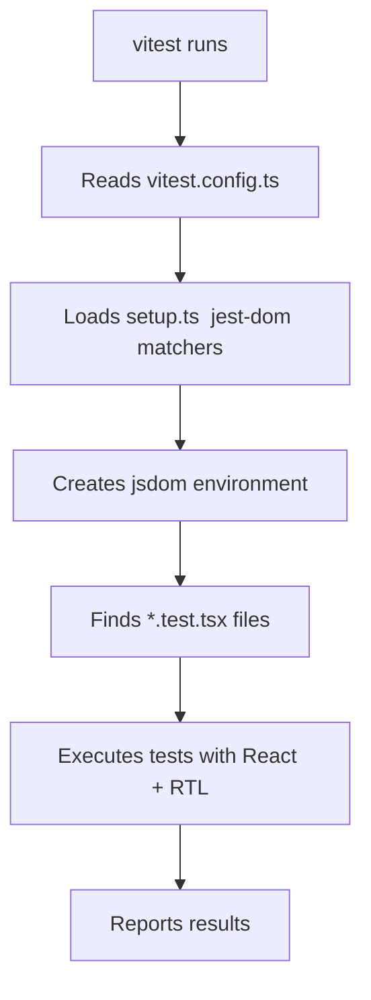

# How to Set Up Vitest with React Testing Library and TypeScript

Setting up testing for a React + TypeScript project shouldn't take an entire afternoon, but somehow it always does. You install Vitest, then React Testing Library, then realize you need jsdom, then your matchers aren't typed, then `toBeInTheDocument()` throws a TypeScript error even though it clearly works at runtime... it's a whole thing.

I've set up this exact vitest React Testing Library TypeScript combo on probably a dozen projects at this point, and I've got it down to a repeatable process. Here's the setup that works, from zero to running your first test.

## Install Everything

You need five packages. Not three, not seven  five.

```bash
npm install -D vitest @testing-library/react @testing-library/jest-dom @testing-library/user-event jsdom
```

Here's what each one does:

| Package | Purpose |
|---------|---------|
| `vitest` | The test runner. Fast, Vite-native, Jest-compatible API. |
| `@testing-library/react` | Renders React components and provides query utilities (`getByText`, `getByRole`, etc.) |
| `@testing-library/jest-dom` | Extra matchers like `toBeInTheDocument()`, `toBeVisible()`, `toHaveTextContent()` |
| `@testing-library/user-event` | Simulates real user interactions (click, type, tab)  better than `fireEvent` |
| `jsdom` | Browser environment for Node.js. Vitest needs this to render React components. |

If you're using React 19 or later, make sure your `@testing-library/react` version is v16+. Older versions don't support the new React APIs properly.

## Configure Vitest

Create a `vitest.config.ts` in your project root. You could put this in your `vite.config.ts` instead, but I prefer a separate file  keeps concerns clean.

```typescript
// vitest.config.ts
import { defineConfig } from "vitest/config";
import react from "@vitejs/plugin-react";

export default defineConfig({
  plugins: [react()],
  test: {
    environment: "jsdom",
    globals: true,
    setupFiles: ["./src/test/setup.ts"],
    css: true,
    include: ["src/**/*.{test,spec}.{ts,tsx}"],
  },
});
```

Let me walk through the important bits:

- **`environment: "jsdom"`**  tells Vitest to simulate a browser. Without this, `document` and `window` don't exist and React can't render anything.
- **`globals: true`**  makes `describe`, `it`, `expect`, and `vi` available without importing them. Just like Jest. This is optional  some people prefer explicit imports for clarity, but I find it's less friction with globals enabled.
- **`setupFiles`**  runs before every test file. This is where we'll set up jest-dom matchers.
- **`css: true`**  processes CSS imports instead of ignoring them. Set to `false` if you don't need CSS in tests and want faster runs.

## Create the Setup File

This is the file that makes `toBeInTheDocument()` and friends work:

```typescript
// src/test/setup.ts
import "@testing-library/jest-dom/vitest";
```

That's it. One line. The `/vitest` entry point automatically extends Vitest's `expect` with all the jest-dom matchers AND registers the proper TypeScript types.

> **Tip:** If you're on an older version of `@testing-library/jest-dom` (before v6.6), the import path was just `@testing-library/jest-dom` without the `/vitest` suffix  but that required extra type wrangling. Upgrade to the latest and use the `/vitest` path. Saves a headache.

## TypeScript Configuration

You need to tell TypeScript about Vitest's global types. Add this to your `tsconfig.json` (or a `tsconfig.test.json` if you prefer):

```json
{
  "compilerOptions": {
    "types": ["vitest/globals"]
  }
}
```

This gives you type checking for `describe`, `it`, `expect`, `vi`, and all the other globals. Without it, TypeScript will complain that `describe` is not defined even though your tests run fine.

If you don't want to modify your main tsconfig, create a `tsconfig.test.json`:

```json
{
  "extends": "./tsconfig.json",
  "compilerOptions": {
    "types": ["vitest/globals"]
  },
  "include": ["src/**/*.test.ts", "src/**/*.test.tsx", "src/test/**/*"]
}
```

## Write Your First Test

Let's test an actual component. Here's a simple one:

```tsx
// src/components/Greeting.tsx
interface GreetingProps {
  name: string;
}

export function Greeting({ name }: GreetingProps) {
  return (
    <div>
      <h1>Hello, {name}!</h1>
      <p>Welcome back.</p>
    </div>
  );
}
```

And the test:

```tsx
// src/components/Greeting.test.tsx
import { render, screen } from "@testing-library/react";
import { Greeting } from "./Greeting";

describe("Greeting", () => {
  it("renders the name", () => {
    render(<Greeting name="Sarah" />);

    expect(screen.getByText("Hello, Sarah!")).toBeInTheDocument();
    expect(screen.getByText("Welcome back.")).toBeInTheDocument();
  });

  it("renders with different names", () => {
    render(<Greeting name="TypeScript" />);

    expect(
      screen.getByRole("heading", { name: /hello, typescript/i })
    ).toBeInTheDocument();
  });
});
```

Run it:

```bash
npx vitest run
```

Or for watch mode during development:

```bash
npx vitest
```



## Testing User Interactions

React Testing Library's `fireEvent` works, but `userEvent` is better  it simulates real browser behavior (focus, keystrokes, click sequences) instead of just dispatching DOM events.

```tsx
// src/components/Counter.test.tsx
import { render, screen } from "@testing-library/react";
import userEvent from "@testing-library/user-event";
import { Counter } from "./Counter";

describe("Counter", () => {
  it("increments when clicked", async () => {
    const user = userEvent.setup();
    render(<Counter />);

    const button = screen.getByRole("button", { name: /increment/i });
    expect(screen.getByText("Count: 0")).toBeInTheDocument();

    await user.click(button);

    expect(screen.getByText("Count: 1")).toBeInTheDocument();
  });

  it("handles text input", async () => {
    const user = userEvent.setup();
    render(<Counter />);

    const input = screen.getByRole("textbox");
    await user.type(input, "hello");

    expect(input).toHaveValue("hello");
  });
});
```

Notice `userEvent.setup()` is called before each test. This creates a fresh user event instance. And all interactions are `async`  that's intentional. Real user actions are asynchronous (focus changes, event propagation), and `userEvent` models that correctly.

## Add Scripts to package.json

```json
{
  "scripts": {
    "test": "vitest run",
    "test:watch": "vitest",
    "test:coverage": "vitest run --coverage"
  }
}
```

For coverage, you'll need to install a provider:

```bash
npm install -D @vitest/coverage-v8
```

## Common Issues and Fixes

**"ReferenceError: document is not defined"**  You forgot `environment: "jsdom"` in your vitest config. Or you have a test file outside the `include` pattern that's not picking up the config.

**"toBeInTheDocument is not a function"**  Your setup file isn't loading. Check the `setupFiles` path in `vitest.config.ts`. Also make sure you're importing `@testing-library/jest-dom/vitest`, not just `@testing-library/jest-dom`.

**TypeScript errors on `expect(...).toBeInTheDocument()`**  Add `"vitest/globals"` to your `types` array in tsconfig. If you're also using the jest-dom types, the `/vitest` import in setup.ts should handle it automatically.

**Tests pass but are slow**  Make sure you're not accidentally running in `happy-dom` mode and re-creating the DOM for every test. Vitest reuses the jsdom instance by default, but some configs mess this up.

**React act() warnings**  Wrap state updates in `act()`, or better yet, use `userEvent` which handles this for you. If you're still seeing warnings with userEvent, you probably have an unresolved promise or timer  check for missing `await`s.

> **Warning:** If you're coming from Jest, most things work the same. But `vi.mock()` hoisting behaves slightly differently than `jest.mock()`. Vitest hoists `vi.mock` calls to the top of the file, but the factory function runs in module scope. If you're doing complex mocking, check the Vitest docs on module mocking.

## Why Vitest over Jest?

I get asked this a lot. Short answer: if you're already using Vite, Vitest is a no-brainer  same config, same transforms, native speed. If you're not using Vite, Vitest is still great because it's faster for TypeScript projects (no Babel transform step) and the DX is excellent. The watch mode with its UI is genuinely nice.

That said, Jest is battle-tested and has a bigger ecosystem. If your project is already on Jest and working fine, there's no urgent reason to switch. But for new projects? I'd pick Vitest every time.

If you're also setting up TypeScript for the first time on this project, [SnipShift's JS to TS converter](https://snipshift.dev/js-to-ts) can help convert your existing JavaScript components and test files. And for configuring the TypeScript compiler itself, our [tsconfig.json reference](/blog/tsconfig-json-every-option-explained) covers every option. You might also want to set up [ESLint with flat config](/blog/eslint-flat-config-typescript-2026) to lint your test files alongside your source code. All our tools are free at [snipshift.dev](https://snipshift.dev).
