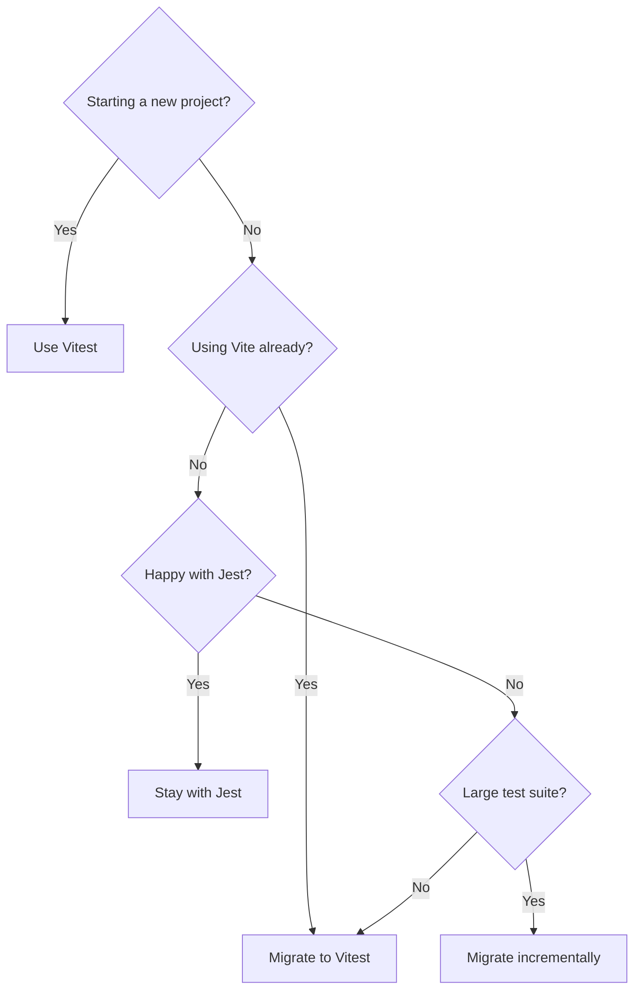

# Vitest vs Jest in 2026: Which Testing Framework Should You Use?

If you asked me this question three years ago, I'd have said "Jest, obviously." It was the default. Every tutorial used it. Every boilerplate shipped with it. Picking Jest was like picking React  you didn't really need to justify it.

But it's 2026, and the testing ecosystem has shifted in a pretty major way. Vitest has gone from "that interesting Vite-based test runner" to a legitimate first choice for new projects  and increasingly, for existing ones too. I've migrated two production codebases from Jest to Vitest in the past year, and both times the team's reaction was some version of "why didn't we do this sooner?"

So here's my honest take on the Vitest vs Jest debate, based on actually using both in real projects. Not benchmarks from a README  real day-to-day experience.

## Speed: Vitest Wins, and It's Not Close

Let's get the obvious one out of the way. Vitest is faster than Jest. Like, noticeably faster.

On a mid-size React project I work on (~800 test files, ~3,200 individual tests), here's what cold-start test runs look like:

| Metric | Jest | Vitest |
|--------|------|--------|
| **Cold start (all tests)** | ~38 seconds | ~12 seconds |
| **Watch mode re-run (single file)** | ~2.1 seconds | ~0.3 seconds |
| **Watch mode re-run (affected tests)** | ~4.8 seconds | ~0.9 seconds |
| **CI full suite** | ~52 seconds | ~18 seconds |

The watch mode difference is the one you *feel* most. When you save a file and your test result appears in 300ms instead of 2 seconds, it changes how you work. You test more often. You write smaller tests. The feedback loop gets tight enough that testing actually becomes enjoyable rather than something you do right before pushing.

Why is Vitest faster? It uses Vite's transform pipeline under the hood, which means it shares the same blazing-fast ESBuild-powered compilation that makes Vite's dev server so quick. Jest, by contrast, still relies on its own transform chain  which works fine, but carries years of architectural decisions that weren't optimized for speed.

## Configuration: Night and Day

Here's what setting up Vitest looks like in a new project:

```bash
npm install -D vitest
```

That's the whole setup for most projects. Vitest reads your `vite.config.ts` (if you have one) and inherits all the same aliases, plugins, and transforms. If your app builds with Vite, your tests just work.

Jest setup in 2026 still typically involves:

```bash
npm install -D jest @jest/globals ts-jest @types/jest
```

Plus a `jest.config.ts` file. Plus transform configuration if you're using ESM. Plus module name mapper config if you have path aliases. Plus separate babel config in some cases. It's not *terrible*, but it's friction that adds up  especially when onboarding new team members.

> **Tip:** If you're setting up a new project from scratch and using Vite as your build tool, Vitest is the obvious choice. The shared config alone saves you hours over the lifetime of the project.

## ESM Support: Vitest Is Native, Jest Still Struggles

This is the one that really pushed me toward Vitest. ECMAScript Modules (ESM)  the `import/export` syntax that's been the standard for years  has always been a pain point with Jest. Jest was built in the CommonJS era, and while they've added experimental ESM support, it still feels bolted on.

With Vitest, ESM just works. No flags. No experimental modes. No `--experimental-vm-modules`. You write `import` and `export` like you would in any modern JavaScript file, and it runs.

```javascript
// This just works in Vitest. No config needed.
import { describe, it, expect } from 'vitest';
import { myFunction } from '../src/myFunction.js';

describe('myFunction', () => {
  it('does the thing', () => {
    expect(myFunction('input')).toBe('output');
  });
});
```

With Jest, you'd either need to use CommonJS `require()`, configure `ts-jest` with specific ESM settings, or run Node with experimental flags. I've watched senior engineers spend entire afternoons debugging Jest ESM issues. Life's too short for that.

## TypeScript Support

Both frameworks support TypeScript, but the experience is different.

**Vitest** handles TypeScript natively through Vite's transform pipeline. You write `.test.ts` files, import your `.ts` source files, and everything compiles on the fly. No additional packages, no separate `tsconfig.test.json` (unless you want one).

**Jest** needs `ts-jest` or `@swc/jest` as a transformer. Both work, but it's another dependency to install, configure, and keep updated. And if your `tsconfig` has paths configured, you need to mirror those in your Jest config's `moduleNameMapper`. It's the kind of thing that works great once set up but is annoying to troubleshoot when it breaks.

If you're working on a TypeScript project  or planning to migrate your JavaScript to TypeScript (tools like [SnipShift's JS to TS converter](https://snipshift.dev/js-to-ts) can help with that)  Vitest's zero-config TypeScript support is a real advantage.

## Watch Mode and Developer Experience

Jest's watch mode was revolutionary when it came out. The ability to press `p` to filter by filename, `t` to filter by test name, and have tests re-run on save  that was a game changer.

Vitest took everything Jest did well here and improved on it. The watch mode is faster (as we covered), and Vitest's UI mode (`vitest --ui`) gives you a browser-based dashboard where you can see test results, filter, and even see a visual graph of test file dependencies. It's genuinely nice.

Both frameworks support:
- Re-running only changed tests
- Filtering by filename or test name
- Inline error messages with diffs
- Test coverage reporting

But Vitest adds a few extras:
- **Browser-based UI** for visual test exploration
- **Benchmark mode** (`vitest bench`) built right in
- **Workspace support** for monorepos, out of the box
- **Snapshot inline** updating that's just a bit smoother

Jest has its own advantages in watch mode  the interactive menu is slightly more discoverable if you're new to it. But the speed difference means Vitest's watch mode just *feels* more responsive.

## IDE Integration

Both frameworks have excellent VS Code extensions. The Jest extension (`vscode-jest`) has been around for years and is mature and reliable. The Vitest extension (`vitest-explorer`) has caught up quickly and provides essentially the same experience  inline test results, click-to-run individual tests, and gutter decorations showing pass/fail.

If you're using WebStorm or another JetBrains IDE, both are supported natively. No real difference here.

One thing I'll note: because Vitest is faster, the inline test results in your IDE update quicker. It sounds minor, but when you're doing red-green-refactor TDD cycles, those sub-second updates keep you in flow state.

## Ecosystem and Community

Jest still has the larger ecosystem. There are more plugins, more Stack Overflow answers, and more blog posts about it. If you Google a testing problem, the top result is probably a Jest solution.

But Vitest is Jest-compatible by design. The API is almost identical  `describe`, `it`, `expect`, `vi.fn()` (instead of `jest.fn()`), `vi.mock()` (instead of `jest.mock()`). Most Jest knowledge transfers directly.

| Feature | Jest | Vitest |
|---------|------|--------|
| **npm weekly downloads** | ~30M+ | ~15M+ |
| **GitHub stars** | ~44K | ~14K |
| **API compatibility** |  | ~95% Jest-compatible |
| **Plugin ecosystem** | Huge | Growing fast |
| **Stack Overflow answers** | Extensive | Moderate, growing |
| **First-party coverage** | Built-in (Istanbul/V8) | Built-in (Istanbul/V8) |
| **Snapshot testing** | Yes | Yes |
| **Mocking** | `jest.fn()`, `jest.mock()` | `vi.fn()`, `vi.mock()` |
| **Concurrent tests** | Yes | Yes (better DX) |
| **Type-checking in tests** | Via ts-jest | Via tsc or `vitest typecheck` |

## Migration Path: Jest to Vitest

If you have an existing Jest project, migrating to Vitest is  in my experience  one of the least painful framework migrations you can do. Here's the gist:

1. Install Vitest and remove Jest
2. Rename your config (or delete it if you use Vite)
3. Find-and-replace `jest.fn()` → `vi.fn()` and `jest.mock()` → `vi.mock()`
4. Update imports to pull from `vitest` instead of `@jest/globals`
5. Run your tests

There's even a codemod (`jest-to-vitest`) that automates most of step 3 and 4. On the two migrations I did, about 90% of tests passed without any changes beyond the automated find-and-replace. The remaining 10% were edge cases around custom Jest transforms or unusual mock patterns.



## So Which One Should You Pick?

Here's my honest recommendation:

**Choose Vitest if:**
- You're starting a new project (especially with Vite)
- You want faster test execution with zero config
- You're working with ESM and don't want to fight compatibility issues
- You're using TypeScript and want native support without extra packages

**Choose Jest if:**
- You have a large, stable test suite and no compelling reason to migrate
- Your team knows Jest deeply and the switching cost isn't worth it
- You're in an ecosystem that tightly integrates with Jest (like some older React Native setups)
- You need a specific Jest plugin that doesn't have a Vitest equivalent yet

For most teams starting fresh in 2026, I'd pick Vitest without hesitation. It's faster, simpler to configure, and designed for how we actually write JavaScript today. Jest still works great  it's a mature, well-maintained tool  but Vitest has become my default, and I don't see that changing.

If you're just getting started with testing in general, our [beginner's guide to JavaScript testing](/blog/start-testing-javascript-beginner) walks you through writing your first test from scratch. And once you've picked your framework, understanding [what to test at each layer](/blog/testing-pyramid-web-application) will help you build a test suite that actually catches bugs instead of just inflating coverage numbers.

One last thing  whichever framework you choose, the code you write matters more than the tool that runs it. A thoughtful test in Jest is worth more than a bad test in Vitest. [Writing tests that don't break on refactor](/blog/tests-that-dont-break-on-refactor) is a skill worth developing regardless of your test runner.

Pick a framework, write some tests, ship with confidence. That's really all there is to it.
