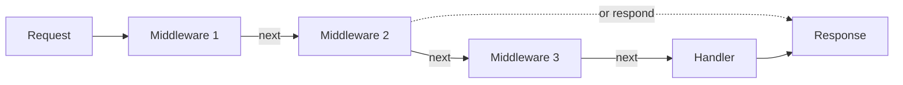

# What Is Middleware? (Explained for Developers Who Nod Along but Don't Really Get It)

I'm going to be honest  I nodded along about middleware for a solid year before I actually understood what was happening. Someone would say "just add a middleware" and I'd think "yes, of course, the middleware, naturally" while silently panicking.

If that's you right now, no judgment. Let's actually break this down.

## The Simplest Explanation

Middleware is **code that runs between receiving a request and sending a response**. That's it. It's the middle part. The -ware in the middle.

When a request hits your server, it doesn't jump straight to your route handler. It passes through a chain of functions first. Each function can:
1. **Do something** (log the request, check authentication, parse the body)
2. **Pass the request along** to the next function in the chain
3. **Stop the chain** and send a response (like rejecting an unauthorized request)

Here's the most basic middleware you can write in Express:

```typescript
function myMiddleware(req: Request, res: Response, next: NextFunction) {
  console.log('A request came in!');
  next(); // pass it along to the next function
}
```

That `next()` call is the key. It says "I'm done, pass the request to whoever's next." If you don't call `next()`, the request just... hangs. The client waits forever. The response never sends. Don't forget `next()`.

## The Onion Model

People love to explain middleware with the "onion model," and honestly, it's a pretty good analogy. Each middleware wraps around the next one, like layers of an onion.


The request travels *inward* through each layer, hits the route handler at the center, and then the response travels *outward* back through the layers. Some middleware does work on the way in (checking auth), some on the way out (adding headers to the response), and some on both sides (timing how long the request took).

In Express specifically, the model is more of a linear pipeline than a true onion  each middleware runs in the order you register it, and `next()` moves you forward. But the concept is the same.

## Real Middleware Examples

Let's look at actual middleware you'd use in production. Not toy examples  real ones.

### 1. Request Logging

Every API should log incoming requests. Here's a simple logger:

```typescript
import { Request, Response, NextFunction } from 'express';

function requestLogger(req: Request, res: Response, next: NextFunction) {
  const start = Date.now();

  // This runs AFTER the response is sent (on the way "out")
  res.on('finish', () => {
    const duration = Date.now() - start;
    console.log(`${req.method} ${req.path} ${res.statusCode} ${duration}ms`);
  });

  next(); // continue to the next middleware
}

// Register it
app.use(requestLogger);
```

Notice the trick  we hook into the response's `finish` event to log *after* the response is sent. That way we can include the status code and duration. The middleware runs on both the "in" and "out" path.

### 2. Authentication

This is probably the most common middleware you'll write. Check if the user is who they say they are:

```typescript
import jwt from 'jsonwebtoken';

function authenticate(req: Request, res: Response, next: NextFunction) {
  const authHeader = req.headers.authorization;

  if (!authHeader?.startsWith('Bearer ')) {
    return res.status(401).json({ error: 'No token provided' });
    // Note: no next() call  we're stopping the chain here
  }

  const token = authHeader.split(' ')[1];

  try {
    const payload = jwt.verify(token, process.env.JWT_SECRET!);
    req.user = payload as { id: string; role: string };
    next(); // Token is valid, continue
  } catch {
    return res.status(401).json({ error: 'Invalid token' });
  }
}

// Use it on specific routes
app.get('/profile', authenticate, getProfile);
app.get('/public-info', getPublicInfo); // No auth needed here
```

See how `authenticate` either calls `next()` (authenticated, keep going) or sends a 401 response (not authenticated, stop here). That's the core pattern  middleware as gatekeepers.

### 3. CORS (Cross-Origin Resource Sharing)

CORS headers tell browsers whether a frontend on a different domain is allowed to call your API. Most people just install the `cors` package, but here's what it's actually doing:

```typescript
function cors(req: Request, res: Response, next: NextFunction) {
  res.setHeader('Access-Control-Allow-Origin', 'https://myapp.com');
  res.setHeader('Access-Control-Allow-Methods', 'GET, POST, PUT, DELETE');
  res.setHeader('Access-Control-Allow-Headers', 'Content-Type, Authorization');

  // Preflight requests (OPTIONS) should return immediately
  if (req.method === 'OPTIONS') {
    return res.status(204).end();
  }

  next();
}
```

This middleware runs on every request, adds the headers, and passes it along. For OPTIONS preflight requests, it short-circuits the chain.

### 4. Error Handling

Express has a special kind of middleware for errors  it takes *four* arguments instead of three:

```typescript
function errorHandler(
  err: Error,
  req: Request,
  res: Response,
  next: NextFunction
) {
  console.error(`Error: ${err.message}`, { path: req.path, stack: err.stack });

  if (err.name === 'ValidationError') {
    return res.status(400).json({ error: err.message });
  }

  if (err.name === 'UnauthorizedError') {
    return res.status(401).json({ error: 'Unauthorized' });
  }

  // Fallback for unexpected errors
  res.status(500).json({ error: 'Internal server error' });
}

// Error handlers go LAST
app.use(errorHandler);
```

That four-argument signature is how Express knows this is an error handler, not regular middleware. When any middleware or route handler calls `next(error)` or throws, Express skips the remaining normal middleware and jumps straight to the error handler.

> **Tip:** Error handling middleware must be registered *after* your routes. Order matters in Express.

## The Order Matters

This is a point that trips up a lot of people. Middleware runs in the order you register it. If you put your auth middleware after your routes, it never runs:

```typescript
// ❌ Wrong order  routes fire before auth
app.get('/secret', getSecretData);
app.use(authenticate); // Too late, /secret already matched

// ✅ Correct order  auth runs first
app.use(authenticate);
app.get('/secret', getSecretData);
```

Here's a typical order for a production Express app:

```typescript
const app = express();

// 1. Security headers (runs on every request, first)
app.use(helmet());

// 2. CORS
app.use(cors({ origin: 'https://myapp.com' }));

// 3. Body parsing
app.use(express.json({ limit: '10mb' }));

// 4. Request logging
app.use(requestLogger);

// 5. Routes (some with auth, some without)
app.use('/api/auth', authRoutes);       // public
app.use('/api/users', authenticate, userRoutes);  // protected
app.use('/api/admin', authenticate, requireRole('admin'), adminRoutes);

// 6. 404 handler
app.use((req, res) => res.status(404).json({ error: 'Not found' }));

// 7. Error handler (always last)
app.use(errorHandler);
```

## Writing Custom Middleware with TypeScript

Let's build something slightly more interesting  a rate limiter middleware with proper TypeScript types:

```typescript
import { Request, Response, NextFunction } from 'express';

interface RateLimitOptions {
  windowMs: number;  // Time window in milliseconds
  maxRequests: number;  // Max requests per window
}

function rateLimit({ windowMs, maxRequests }: RateLimitOptions) {
  const requests = new Map<string, { count: number; resetAt: number }>();

  return function rateLimitMiddleware(
    req: Request,
    res: Response,
    next: NextFunction
  ) {
    const ip = req.ip ?? 'unknown';
    const now = Date.now();
    const record = requests.get(ip);

    if (!record || now > record.resetAt) {
      requests.set(ip, { count: 1, resetAt: now + windowMs });
      return next();
    }

    if (record.count >= maxRequests) {
      res.setHeader('Retry-After', Math.ceil((record.resetAt - now) / 1000));
      return res.status(429).json({ error: 'Too many requests' });
    }

    record.count++;
    next();
  };
}

// Usage
app.use('/api', rateLimit({ windowMs: 60_000, maxRequests: 100 }));
```

The pattern here is a **factory function**  `rateLimit()` takes configuration and *returns* the actual middleware function. This is how most configurable middleware works. `cors()`, `helmet()`, `express.json()`  they all follow this pattern.

> **Tip:** When you're testing middleware with cURL commands, [SnipShift's cURL to Code tool](https://snipshift.dev/curl-to-code) can convert those test commands into fetch or axios calls  useful for building automated integration tests.

## Middleware in Fastify and Hono

The concept is the same in other frameworks, but the API differs.

**Fastify** uses "hooks" instead of middleware:

```typescript
// Fastify hook (same concept, different name)
fastify.addHook('onRequest', async (request, reply) => {
  const token = request.headers.authorization;
  if (!token) {
    reply.code(401).send({ error: 'Unauthorized' });
  }
});
```

**Hono** uses a more functional approach:

```typescript
// Hono middleware
app.use('/api/*', async (c, next) => {
  const start = Date.now();
  await next();
  const duration = Date.now() - start;
  c.header('X-Response-Time', `${duration}ms`);
});
```

Hono's middleware is `async` by default and uses `await next()`, which makes the onion model very explicit  code before `await next()` runs on the way in, code after runs on the way out.

## The Middleware Mental Model

If there's one thing to take away from this, it's this: middleware is just functions in a chain. Each one gets to look at the request, optionally modify it, and decide whether to keep going or stop. That's all the magic there is.



Once you see middleware as "functions that run in order," the rest is just details. Auth middleware is a function that checks a token. Logging middleware is a function that writes to stdout. CORS middleware is a function that sets headers. None of them are magic.

If you're building an API and want to see how middleware fits into the bigger picture, check out our [REST API with TypeScript and Express guide](/blog/rest-api-typescript-express-guide)  it uses all of these patterns in a full working example.

And for a comparison of how middleware works across different Node.js frameworks, our [Express vs Fastify vs Hono comparison](/blog/express-fastify-hono-comparison) covers the middleware ecosystem differences in detail.
