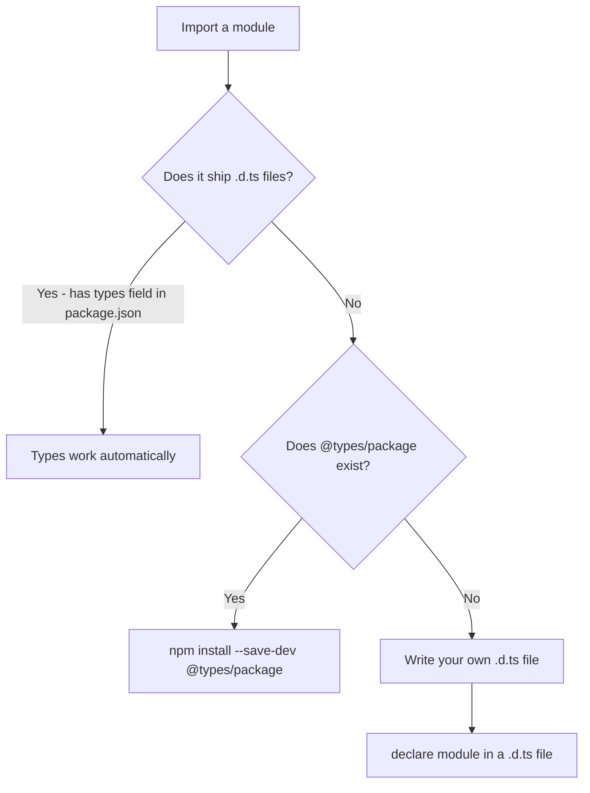

# What Is a TypeScript Declaration File (.d.ts)?

Here's something that confused me for way too long when I was learning TypeScript: you install a package, import it, and TypeScript somehow *knows* all the function signatures, return types, and interfaces  even though the package is written in JavaScript. Where is that type information coming from?

The answer is **declaration files**  those `.d.ts` files you've probably seen floating around in your `node_modules` folder. They're one of those things that works invisibly until it doesn't, and then you're Googling "typescript declaration file d.ts" at 11pm trying to figure out why your types are broken.

So let's clear this up properly.

## What Declaration Files Actually Are

A `.d.ts` file is a TypeScript file that contains *only* type information. No runtime code. No logic. Just descriptions of what types, functions, classes, and interfaces exist in a module.

Think of it like a menu at a restaurant. The menu tells you what dishes are available and what's in them  but it doesn't contain the actual food. A declaration file tells TypeScript what a module exports and what shapes those exports have  but it doesn't contain the actual implementation.

Here's a simple example. Say you have a JavaScript utility:

```javascript
// math-utils.js
export function add(a, b) {
  return a + b;
}

export function multiply(a, b) {
  return a * b;
}
```

The corresponding declaration file would be:

```typescript
// math-utils.d.ts
export declare function add(a: number, b: number): number;
export declare function multiply(a: number, b: number): number;
```

No function bodies  just the type signatures. TypeScript reads the `.d.ts` file to understand what `math-utils` exports, while the JavaScript runtime uses the actual `.js` file.

## Where Declaration Files Come From

There are three main sources of `.d.ts` files, and understanding which one you're dealing with saves a lot of confusion:

### 1. Bundled With the Package

Many modern TypeScript-first packages ship their own declaration files. When a library author compiles their TypeScript code, they set `"declaration": true` in their `tsconfig.json`, and the compiler generates `.d.ts` files alongside the JavaScript output.

You can tell if a package bundles its own types by checking its `package.json` for a `"types"` or `"typings"` field:

```json
{
  "name": "zod",
  "main": "./lib/index.js",
  "types": "./lib/index.d.ts"
}
```

Packages like Zod, Prisma, and tRPC all bundle their types. You install them and everything just works  no extra steps.

### 2. DefinitelyTyped (@types packages)

Lots of popular packages are written in JavaScript and don't include type declarations. That's where **DefinitelyTyped** comes in  it's a massive community-maintained repository of declaration files for thousands of packages.

When you install `@types/express` or `@types/lodash`, you're downloading declaration files from DefinitelyTyped:

```bash
npm install --save-dev @types/express
```

TypeScript automatically looks in `node_modules/@types/` for type declarations, so these just work once installed.

> **Tip:** The DefinitelyTyped repo on GitHub has over 9,000 type packages. If a popular JavaScript library exists, there's a good chance someone has written types for it. But quality varies  some `@types` packages are meticulously maintained, others haven't been updated in years.

### 3. You Write Them Yourself

When there's no bundled types and no `@types` package, you write your own declaration file. This is more common than you'd think  internal company packages, niche npm packages, or legacy code you're migrating all fall into this bucket.



## How to Create Your Own Declaration File

Let's say you're using a package called `legacy-charts` that has no types anywhere. Here's how to add them yourself.

### The Quick Way: Module Declaration

Create a file  I usually call it `types/legacy-charts.d.ts` or just drop a `declarations.d.ts` in my project root:

```typescript
// declarations.d.ts
declare module "legacy-charts" {
  export interface ChartOptions {
    width: number;
    height: number;
    title?: string;
    animate?: boolean;
  }

  export function createChart(
    element: HTMLElement,
    options: ChartOptions
  ): void;

  export function updateData(
    chartId: string,
    data: number[]
  ): void;
}
```

Now you can import from `legacy-charts` and get full autocomplete and type checking.

If you're in a hurry and just need the error to go away, the minimal version is:

```typescript
declare module "legacy-charts";
```

This tells TypeScript "this module exists" without describing its shape. Everything imported from it will be typed as `any`. Not great for type safety, but it unblocks you.

### The Proper Way: A Separate .d.ts File

For more complex packages or when you want proper type coverage, create a dedicated declaration file:

```typescript
// types/legacy-charts/index.d.ts

export as namespace LegacyCharts;

export interface ChartConfig {
  type: "bar" | "line" | "pie";
  responsive: boolean;
  plugins?: Plugin[];
}

export interface Plugin {
  name: string;
  init(chart: ChartInstance): void;
}

export interface ChartInstance {
  readonly id: string;
  update(data: DataSet): void;
  destroy(): void;
}

export interface DataSet {
  labels: string[];
  values: number[];
}

export function create(
  container: HTMLElement,
  config: ChartConfig,
  data: DataSet
): ChartInstance;
```

Then make sure TypeScript can find it. Add to `tsconfig.json`:

```json
{
  "compilerOptions": {
    "typeRoots": ["./types", "./node_modules/@types"]
  },
  "include": ["src/**/*", "types/**/*"]
}
```

## Global Declarations

Sometimes you need to declare types that exist in the global scope  things like environment variables, global utility functions added by a framework, or augmenting existing global types.

### Declaring Global Variables

```typescript
// globals.d.ts
declare global {
  interface Window {
    analytics: {
      track(event: string, data?: Record<string, unknown>): void;
    };
  }

  // Environment variables
  namespace NodeJS {
    interface ProcessEnv {
      NODE_ENV: "development" | "production" | "test";
      DATABASE_URL: string;
      API_KEY: string;
    }
  }
}

// This empty export makes it a module  required for declare global
export {};
```

That `export {}` at the bottom looks weird, but it's necessary. Without it, TypeScript treats the file as a script (not a module), and `declare global` only works inside a module. It's one of those TypeScript quirks you just have to know.

### Declaring Non-Code Imports

If you're importing CSS modules, images, or other non-TypeScript files, you need global declarations for those too:

```typescript
// assets.d.ts
declare module "*.css" {
  const classes: { readonly [key: string]: string };
  export default classes;
}

declare module "*.svg" {
  import type { FC, SVGProps } from "react";
  const SVGComponent: FC<SVGProps<SVGSVGElement>>;
  export default SVGComponent;
}

declare module "*.png" {
  const src: string;
  export default src;
}
```

## Generating Declaration Files From Your Own Code

If you're writing a TypeScript library that others will consume, you should ship declaration files. The compiler can generate them automatically:

```json
{
  "compilerOptions": {
    "declaration": true,
    "declarationDir": "./dist/types",
    "emitDeclarationOnly": false
  }
}
```

| tsconfig Option | What It Does |
|----------------|--------------|
| `declaration` | Generates `.d.ts` files alongside `.js` output |
| `declarationDir` | Outputs `.d.ts` files to a specific directory |
| `declarationMap` | Generates source maps for `.d.ts` files (useful for "Go to Definition") |
| `emitDeclarationOnly` | Only outputs `.d.ts` files, no `.js` (useful with external bundlers) |
| `stripInternal` | Excludes items tagged with `@internal` JSDoc from declarations |

Then point to them in your `package.json`:

```json
{
  "name": "my-library",
  "main": "./dist/index.js",
  "types": "./dist/types/index.d.ts",
  "files": ["dist"]
}
```

> **Warning:** If you're publishing a package, always test your declaration files by installing your package in a separate project. I've shipped broken `.d.ts` files more than once because the `declarationDir` path didn't match the `types` field in `package.json`. Embarrassing, but it happens.

## Common Gotchas With Declaration Files

**The file isn't being picked up.** Make sure it's covered by your `tsconfig.json`'s `include` pattern. A `.d.ts` file sitting in a directory that TypeScript ignores won't do anything.

**Types conflict between `@types` and bundled types.** If a package starts shipping its own types but you still have the `@types` version installed, you might get duplicate identifier errors. Uninstall the `@types` package.

**`declare module` vs `declare namespace`.** Use `declare module` for external packages you import. Use `declare namespace` for global namespaces. Mixing them up causes confusing errors.

**Your IDE shows types but the build fails (or vice versa).** Your editor might be using a different `tsconfig.json` than your build script. Check that both are pointing to the same configuration.

## Where This Fits in Your TypeScript Journey

Declaration files are the glue between TypeScript's type system and the JavaScript ecosystem. Most of the time they work invisibly in the background  you `npm install`, the types are there, and your editor gives you autocomplete. But when they break or don't exist, knowing how they work gives you the power to fix it yourself.

If you're converting a JavaScript project to TypeScript and need to generate types for your existing code, [SnipShift's JS to TypeScript converter](https://snipshift.dev/js-to-ts) can help bootstrap the process  it infers types from your JavaScript patterns and generates properly typed output that you can use as a starting point for your own declarations.

For more on TypeScript's type system, check out our guide on [TypeScript generics](/blog/typescript-generics-explained)  once you're writing declaration files for generic functions, you'll need that knowledge. And if you're dealing with "cannot find module" errors related to missing declarations, our [troubleshooting guide](/blog/fix-cannot-find-module-typescript) walks through every possible cause and fix.
