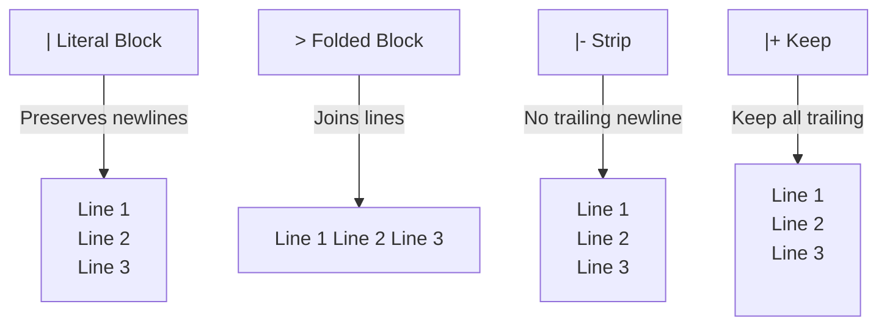

# YAML Syntax: The Complete Guide for Developers

I have a confession: I used YAML for three years before I actually understood it. I'd copy config files from Stack Overflow, fiddle with indentation until things stopped breaking, and move on. Sound familiar?

The problem with YAML is that it *looks* simple. And it is  until you hit multiline strings, anchors, or the Norway problem (yes, that's a real thing, and I'll explain it). Then you're staring at a config file wondering why `off` became `false` and your entire deployment is busted.

This **YAML syntax guide** covers everything you need to confidently write and debug YAML files  whether that's Docker Compose configs, GitHub Actions workflows, Kubernetes manifests, or any other tool in the YAML ecosystem.

## What Is YAML?

YAML stands for "YAML Ain't Markup Language" (a recursive acronym, because developers think they're funny). It's a data serialization format  basically a way to represent structured data in a human-readable text file.

Think of YAML as JSON's more relaxed cousin. Same data structures  objects, arrays, strings, numbers  but without the curly braces and quotes everywhere. Here's the same data in both formats:

```json
{
  "name": "my-app",
  "version": "2.1.0",
  "dependencies": ["express", "postgres", "redis"],
  "config": {
    "port": 3000,
    "debug": true
  }
}
```

```yaml
name: my-app
version: "2.1.0"
dependencies:
  - express
  - postgres
  - redis
config:
  port: 3000
  debug: true
```

Less visual noise, easier to scan. That's the whole pitch for YAML over JSON. The trade-off is that indentation matters  get it wrong and the structure changes silently.

If you ever need to convert between the two, [SnipShift's JSON to YAML converter](https://snipshift.dev/json-to-yaml) and [YAML to JSON converter](https://snipshift.dev/yaml-to-json) handle it instantly. Really useful when you're debugging a YAML file and want to see its actual structure as JSON.

## Scalars: Strings, Numbers, and Booleans

Scalars are the simplest values  single pieces of data.

### Strings

```yaml
# All of these are valid strings
name: hello world
title: "quoted string"
description: 'single quoted'
```

Most of the time, you don't need quotes. YAML infers the type. But there are cases where quotes are essential:

```yaml
# Without quotes, these get misinterpreted
version: "3.8"      # Without quotes: float 3.8, not string "3.8"
zipcode: "01onal"   # Without quotes: octal number attempt
colon_value: "key: value"  # Contains a colon  needs quotes
```

My rule of thumb: **quote version numbers and anything that might look like a number or boolean.** It's defensive but saves debugging time.

### Numbers

```yaml
integer: 42
negative: -17
float: 3.14
scientific: 6.022e23
hex: 0xFF        # 255
octal: 0o77      # 63
infinity: .inf
not_a_number: .nan
```

### Booleans

```yaml
enabled: true
disabled: false
```

Seems simple, right? Here's where it gets weird.

## The Norway Problem (and Other Boolean Gotchas)

This is probably the most infamous YAML gotcha. In YAML 1.1 (still used by many tools), the following values are all interpreted as booleans:

```yaml
# These are ALL booleans in YAML 1.1
truthy: yes    # true
falsy: no      # false
also_true: on  # true
also_false: off # false
upper: YES     # true
title: True    # true
```

Now imagine you're building a list of country codes:

```yaml
countries:
  - GB
  - FR
  - DE
  - NO    # Norway? Nope. This is boolean false.
```

That's the Norway problem. `NO` gets parsed as `false`, not as the string "NO." The fix is simple  quote it:

```yaml
countries:
  - GB
  - FR
  - DE
  - "NO"
```

YAML 1.2 (used by newer parsers) fixed this by only recognizing `true` and `false` as booleans. But many tools still use YAML 1.1 parsers, so you need to be aware of it.

> **Warning:** This isn't just an academic problem. I've seen production configs break because someone used `on` and `off` for feature toggles without quotes, and the parser turned them into `true` and `false`. Then a downstream service expected string values and crashed. Always quote strings that could be misinterpreted.

Here's a reference table of YAML's type coercion surprises:

| YAML Value | What You Think | What It Actually Is |
|-----------|---------------|-------------------|
| `yes` | String "yes" | Boolean `true` (YAML 1.1) |
| `no` | String "no" | Boolean `false` (YAML 1.1) |
| `on` | String "on" | Boolean `true` (YAML 1.1) |
| `off` | String "off" | Boolean `false` (YAML 1.1) |
| `3.8` | String "3.8" | Float `3.8` |
| `1e10` | String "1e10" | Float `10000000000` |
| `null` | String "null" | Null |
| `~` | String "~" | Null |
| `010` | Number 10 | Octal `8` (some parsers) |

When in doubt, quote it.

## Sequences (Arrays/Lists)

Sequences are YAML's version of arrays. Two syntax options:

```yaml
# Block style (most common in config files)
fruits:
  - apple
  - banana
  - cherry

# Flow style (inline, looks like JSON)
fruits: [apple, banana, cherry]
```

Block style is more readable for longer lists. Flow style is fine for short, simple values  but I see it misused in Docker Compose files where readability suffers. Stick with block style for config files.

Nested sequences work as you'd expect:

```yaml
matrix:
  - [1, 2, 3]
  - [4, 5, 6]
  - [7, 8, 9]

# Or in block style
matrix:
  -
    - 1
    - 2
    - 3
  -
    - 4
    - 5
    - 6
```

## Mappings (Objects/Dictionaries)

Mappings are key-value pairs  YAML's version of objects:

```yaml
# Block style
server:
  host: localhost
  port: 8080
  ssl: true

# Flow style
server: {host: localhost, port: 8080, ssl: true}
```

You can nest mappings inside sequences and vice versa:

```yaml
servers:
  - name: web-01
    host: 10.0.0.1
    roles:
      - frontend
      - api

  - name: db-01
    host: 10.0.0.2
    roles:
      - database
```

This is the bread and butter of every Docker Compose file, GitHub Actions workflow, and Kubernetes manifest. If you can read nested mappings and sequences, you can read 90% of YAML files in the wild. For practical examples, check out our [Docker Compose beginner's guide](/blog/docker-compose-beginners-guide) or [GitHub Actions tutorial](/blog/github-actions-first-workflow).

## Multiline Strings: `|` and `>`

This is where YAML truly shines  and also where people get confused. There are two multiline operators:

### Literal Block `|`  Preserves Newlines

```yaml
script: |
  echo "Line 1"
  echo "Line 2"
  echo "Line 3"
```

Result: `"echo \"Line 1\"\necho \"Line 2\"\necho \"Line 3\"\n"`

Every newline in the YAML becomes a newline in the string. Perfect for shell scripts, SQL queries, or any content where line breaks matter.

### Folded Block `>`  Joins Lines

```yaml
description: >
  This is a long description
  that spans multiple lines
  but gets folded into one.
```

Result: `"This is a long description that spans multiple lines but gets folded into one.\n"`

Newlines become spaces, except for blank lines which become actual newlines. Use this for long text that you want to wrap in your YAML file for readability but treat as a single paragraph.

### Chomping Indicators

You can control the trailing newline with `-` (strip) or `+` (keep):

```yaml
# Default: single trailing newline
default: |
  text here

# Strip: no trailing newline
stripped: |-
  text here

# Keep: preserve all trailing newlines
kept: |+
  text here


```

I use `|-` the most  it gives me a clean multiline string without a trailing newline. Especially useful in GitHub Actions for multi-line `run` commands:

```yaml
- name: Build and deploy
  run: |-
    npm run build
    npm run test
    npm run deploy
```



## Anchors and Aliases  DRY YAML

Anchors (`&`) and aliases (`*`) let you define a value once and reuse it elsewhere. Think of them as variables:

```yaml
# Define defaults with an anchor
defaults: &default-settings
  timeout: 30
  retries: 3
  log_level: info

# Reuse with aliases
development:
  <<: *default-settings
  log_level: debug   # Override one value

production:
  <<: *default-settings
  timeout: 60
  retries: 5

staging:
  <<: *default-settings
```

The `<<` is the **merge key**  it inserts all key-value pairs from the referenced anchor. Any keys you specify after the merge override the anchor's values.

Here's a more practical example from a Docker Compose file:

```yaml
x-common-env: &common-env
  NODE_ENV: production
  LOG_FORMAT: json
  TZ: UTC

services:
  api:
    image: myapp/api
    environment:
      <<: *common-env
      PORT: 4000

  worker:
    image: myapp/worker
    environment:
      <<: *common-env
      QUEUE_NAME: default
```

Both services share the common environment variables, but each can add their own. Without anchors, you'd duplicate those three lines in every service definition. In a large Compose file with 10+ services, that duplication gets painful fast.

> **Tip:** In Docker Compose, keys starting with `x-` (like `x-common-env`) are extension fields  Compose ignores them. They're a perfect place to stash anchors.

### Simple Anchors (Without Merge)

You don't always need the merge key. For simple values:

```yaml
max_connections: &max_conn 100

database:
  connections: *max_conn

cache:
  connections: *max_conn
```

## Comments

YAML supports single-line comments with `#`. There's no multi-line comment syntax.

```yaml
# This is a comment
server:
  host: localhost  # Inline comment
  port: 8080
  # The following is disabled for now
  # ssl: true
```

Unlike JSON, which has zero comment support, YAML treats comments as a first-class feature. It's one of the main reasons people prefer YAML for configuration files  you can actually document *why* a value is set the way it is, right next to the value.

## Common Gotchas (Beyond Norway)

### Indentation Must Be Spaces

YAML does not allow tabs for indentation. Spaces only. Two spaces per level is the convention, but any consistent amount works. Mix tabs and spaces and your parser will reject the file outright  which is actually better than silently misinterpreting it.

### Colons Need a Space After Them

```yaml
# Valid
key: value

# Invalid  parsed as a single string "key:value"
key:value
```

### Empty Values Are Null

```yaml
key:
```

This sets `key` to `null`, not to an empty string. If you want an empty string:

```yaml
key: ""
```

### Duplicate Keys

```yaml
name: Alice
name: Bob
```

Which one wins? It depends on the parser. Most use the last value (`Bob`), but the YAML spec says duplicate keys are forbidden. Don't rely on this behavior.

### Numbers with Leading Zeros

```yaml
code: 0123
```

Some parsers treat this as octal (83 in decimal). Others treat it as the integer 123. Quote it if you mean the string "0123":

```yaml
code: "0123"
```

## YAML vs JSON vs TOML  When to Use What

| Feature | YAML | JSON | TOML |
|---------|------|------|------|
| Comments | Yes | No | Yes |
| Readability | High | Medium | High |
| Multiline strings | Yes (native) | No (escape `\n`) | Yes |
| Anchors/reuse | Yes | No | No |
| Widely supported | Very | Universal | Growing |
| Gotchas | Many | Few | Some |
| Common use | DevOps configs | APIs, data exchange | Rust/Go configs |

Hot take: I think YAML's readability advantage over JSON is real but overstated. The gotchas I've outlined in this article are a genuine productivity tax. If your tool supports both, and your config is simple, JSON is honestly fine. But for complex configs with comments and multiline strings  Docker Compose, GitHub Actions, Kubernetes  YAML is the clear winner.

## Validating and Converting YAML

When you're debugging a tricky YAML file, it helps to see the parsed result as JSON. [SnipShift's YAML to JSON converter](https://snipshift.dev/yaml-to-json) lets you paste YAML and instantly see how it gets parsed  booleans, nulls, type coercions and all. Going the other direction, the [JSON to YAML converter](https://snipshift.dev/json-to-yaml) is useful when you have data in JSON and need to embed it in a YAML config.

YAML is one of those formats that you'll use almost daily once you start working with containers, CI/CD, or infrastructure-as-code. The syntax is small  mappings, sequences, scalars, multiline strings, and anchors cover 99% of what you'll encounter. Just remember to quote your strings when in doubt, use spaces not tabs, and never trust unquoted values that look like booleans.

If you're putting this knowledge to practice with Docker or CI/CD, check out our [Docker Compose beginner's guide](/blog/docker-compose-beginners-guide) and [GitHub Actions tutorial](/blog/github-actions-first-workflow)  both are heavy on practical YAML examples.
