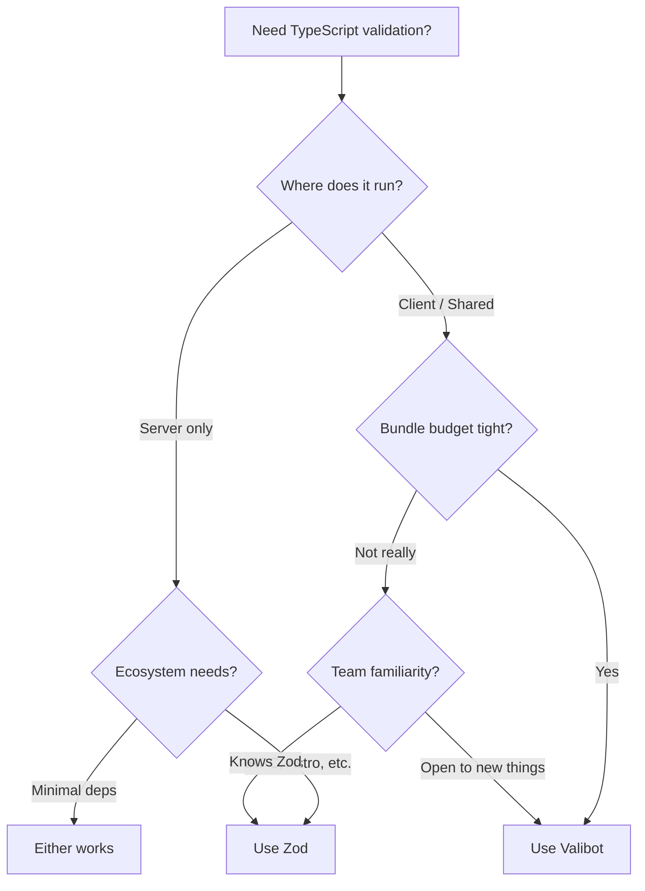

# Zod vs Valibot: Which TypeScript Validation Library Is Lighter?

I've been using Zod for about three years now. It's in every project I touch  API validation, form schemas, config parsing. So when a colleague dropped Valibot into a PR last year with the comment "same thing but 10x smaller," I was skeptical. Surely there's a catch, right?

Turns out, the story is more nuanced than "Valibot is just smaller Zod." Both libraries solve the same core problem  runtime validation with TypeScript type inference  but they make fundamentally different architectural decisions that matter depending on your project. Let me break down what I've found after using both in production.

## The Bundle Size Elephant in the Room

Let's get the headline number out of the way. This is the main reason people even consider Valibot over Zod.

| Library | Full Bundle (minified + gzipped) | Typical Usage Bundle |
|---------|--------------------------------|---------------------|
| Zod | ~14.5 kB | ~14.5 kB (no tree-shaking) |
| Valibot | ~7.5 kB (full) | **~1-3 kB** (tree-shaken) |

That "typical usage" column is where it gets interesting. Zod uses a class-based, method-chaining API  `z.string().min(3).email()`. Every method lives on the class prototype, so your bundler can't strip unused validators. You pay for the entire library even if you only use `z.string()` and `z.number()`.

Valibot takes a functional, pipe-based approach. Each validator is a standalone function import. Your bundler only includes what you actually call.

```typescript
// Zod  you get the whole library regardless
import { z } from 'zod';

const UserSchema = z.object({
  name: z.string().min(1),
  email: z.string().email(),
  age: z.number().int().positive(),
});

type User = z.infer<typeof UserSchema>;
```

```typescript
// Valibot  only imported functions end up in your bundle
import * as v from 'valibot';

const UserSchema = v.object({
  name: v.pipe(v.string(), v.minLength(1)),
  email: v.pipe(v.string(), v.email()),
  age: v.pipe(v.number(), v.integer(), v.minValue(1)),
});

type User = v.InferOutput<typeof UserSchema>;
```

For a server-rendered app where bundle size barely matters? The difference is negligible. But if you're shipping validation logic to the browser  say, a client-side form library or a shared schema package  that 10+ kB difference adds up fast, especially on mobile.

## API Design: Chaining vs Pipes

Here's where personal preference kicks in hard.

Zod's method chaining feels natural if you've spent time with builders or ORMs like Prisma. Everything flows left to right, and your editor autocomplete shows you exactly what's available at each step.

Valibot's pipe-based approach is more... functional. If you're coming from a background where `pipe()` and `compose()` are second nature, you'll feel right at home. If not, it takes a day or two to adjust.

```typescript
// Zod: chaining feels like sentences
const schema = z.string().min(3).max(100).regex(/^[a-z]+$/);

// Valibot: pipes feel like data flowing through transforms
const schema = v.pipe(
  v.string(),
  v.minLength(3),
  v.maxLength(100),
  v.regex(/^[a-z]+$/)
);
```

Honestly? After a week with Valibot, the pipe syntax felt just as natural. But I'll admit  Zod's chaining is easier to teach to junior developers. There's less conceptual overhead.

## TypeScript Inference Quality

Both libraries produce excellent TypeScript types from schemas. This is the whole point  define your schema once, get runtime validation AND compile-time types.

```typescript
// Both handle complex nested types beautifully
const OrderSchema = z.object({
  id: z.string().uuid(),
  items: z.array(z.object({
    productId: z.string(),
    quantity: z.number().int().positive(),
    price: z.number().positive(),
  })),
  status: z.enum(['pending', 'shipped', 'delivered']),
  metadata: z.record(z.string(), z.unknown()).optional(),
});

// z.infer<typeof OrderSchema> gives you exactly what you'd expect
```

I haven't hit a case where one library inferred types better than the other. Both handle unions, discriminated unions, recursive types, and generics well. Zod's `.transform()` and Valibot's `v.transform()` both correctly narrow output types after transformation. This one's a tie.

## Ecosystem and Community

And this is where Zod pulls ahead  significantly.

Zod has become the de facto standard for TypeScript validation. The ecosystem around it is massive:

- **react-hook-form** has `@hookform/resolvers` with first-class Zod support
- **tRPC** uses Zod schemas natively for input validation
- **Next.js** server actions commonly validate with Zod
- **Astro** content collections use Zod
- **Conform**, **Formik adapters**, **OpenAPI generators**  they all speak Zod

Valibot support is growing, but it's not there yet. Some adapter libraries exist, and react-hook-form added a Valibot resolver, but you'll still find yourself writing glue code in places where Zod just works out of the box.

> **Tip:** If you're already generating Zod schemas from JSON data, [DevShift's JSON to Zod converter](https://devshift.dev/json-to-zod) handles the boilerplate  paste your JSON, get a typed Zod schema back. Handy when you're prototyping API responses.

## Decision Framework

Here's how I think about the choice:



My general take:

- **Choose Zod** if you need ecosystem compatibility, your team already knows it, or you're building something that integrates with tRPC/Astro/Next.js server actions. The 14 kB cost is worth the convenience.
- **Choose Valibot** if bundle size is a genuine constraint (client-side libraries, shared packages, edge functions with size limits), or if you're starting a new project with no ecosystem lock-in.

## What About Performance?

Runtime validation speed is roughly comparable. Valibot claims to be faster in some benchmarks, but we're talking microseconds of difference per validation call. Unless you're validating millions of objects per second  which, if you are, you probably need a different approach entirely  performance isn't a differentiator here.

Where Valibot has a real edge is cold start time in serverless environments. Smaller bundle means faster parsing, which matters when your Lambda or edge function boots from scratch.

## The Honest Recommendation

I still reach for Zod first in most projects. The ecosystem advantage is real, the API is well-documented, and my team knows it. When someone asks "what validation library should I use?" my default answer is still Zod.

But I've started using Valibot for two specific cases: shared packages that ship to the browser, and edge functions where every kilobyte counts. In those contexts, Valibot's tree-shaking is a genuine advantage, not just a benchmark flex.

If you're working with `.env` files and want typed environment variables with validation, [DevShift's Env to Types tool](https://devshift.dev/env-to-types) can generate both Zod and Valibot schemas from your `.env` file  saves you from writing that boilerplate by hand.

The good news? Both libraries are excellent. Both have active maintainers, solid TypeScript support, and clean APIs. You're not making a bad choice either way. Just pick the one that fits your constraints and move on to the actual problem you're trying to solve.

If you're still on the fence, start with Zod. If you later hit bundle size issues, migrating to Valibot isn't painful  the concepts map almost 1:1. That's a pretty good safety net.

Check out our guide on [common TypeScript mistakes](/blog/common-typescript-mistakes) if you're setting up validation for the first time  getting your types right from the start saves a lot of debugging later. And if you're curious about other tool comparisons, our [Vitest vs Jest breakdown](/blog/vitest-vs-jest-2026) covers similar "incumbent vs challenger" territory in the testing space.
