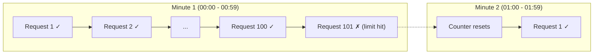
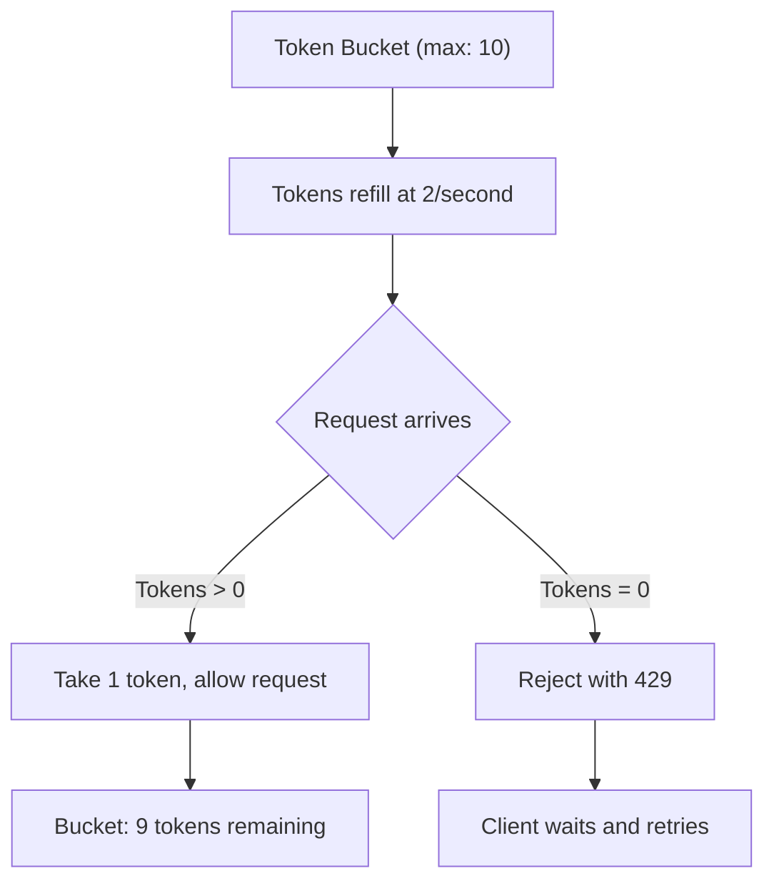

# Rate Limiting Explained: How to Protect Your API

It was 3am on a Tuesday when I got paged. Our API was crawling  response times spiked from 50ms to 8 seconds. The database was maxed out. After twenty minutes of frantic debugging, I found the culprit: a single client was hitting our `/search` endpoint 400 times per second. They'd written a script to scrape product data and didn't bother adding any delay between requests.

We didn't have rate limiting. We paid for it with two hours of degraded service and a very tense post-mortem meeting.

Rate limiting is one of those things that seems unnecessary until you need it. And when you need it, you need it *badly.* This guide covers API rate limiting explained from both sides  how to implement it on your server and how to handle it as a client.

## What Is Rate Limiting?

Rate limiting controls how many requests a client can make to your API within a given time window. That's it. The concept is simple. The implementation details are where things get interesting.

The three most common algorithms are:

1. **Fixed Window**  Count requests in fixed time buckets
2. **Sliding Window**  A smoother version of fixed window
3. **Token Bucket**  The most flexible and widely used

Let's look at each one, because the differences actually matter in practice.

## Fixed Window Rate Limiting

The simplest approach. Divide time into fixed windows (say, 1-minute blocks) and count how many requests each client makes in each window.



### Node.js Implementation

```typescript
// Simple in-memory fixed window rate limiter
const rateLimitStore = new Map<string, { count: number; resetAt: number }>();

function fixedWindowRateLimit(
  clientId: string,
  limit: number = 100,
  windowMs: number = 60_000
): { allowed: boolean; remaining: number; resetAt: number } {
  const now = Date.now();
  const record = rateLimitStore.get(clientId);

  // Current window start (aligned to window boundaries)
  const windowStart = Math.floor(now / windowMs) * windowMs;
  const resetAt = windowStart + windowMs;

  if (!record || record.resetAt <= now) {
    // New window  reset counter
    rateLimitStore.set(clientId, { count: 1, resetAt });
    return { allowed: true, remaining: limit - 1, resetAt };
  }

  if (record.count >= limit) {
    return { allowed: false, remaining: 0, resetAt: record.resetAt };
  }

  record.count++;
  return { allowed: true, remaining: limit - record.count, resetAt: record.resetAt };
}
```

### The Problem: Burst at Window Boundaries

Fixed window has a well-known flaw. If a client sends 100 requests at 00:59 and another 100 at 01:00, they've made 200 requests in 2 seconds while technically staying within the "100 per minute" limit. The window reset creates a burst opportunity.

```
00:58  ──────────────  00:59  │  01:00  ──────────────  01:01
       nothing              100 req  │  100 req
                                     │
                        Window boundary resets counter
```

For many APIs, this is fine. For APIs protecting a database from overload, this 2x burst can be a problem.

## Sliding Window Rate Limiting

The sliding window algorithm smooths out the boundary problem by looking at a rolling time window instead of fixed buckets.

The trick is to use a weighted average of the current and previous window:

```typescript
function slidingWindowRateLimit(
  clientId: string,
  limit: number = 100,
  windowMs: number = 60_000
): { allowed: boolean; remaining: number } {
  const now = Date.now();
  const windowStart = Math.floor(now / windowMs) * windowMs;
  const elapsed = now - windowStart;
  const weight = elapsed / windowMs; // How far into current window (0-1)

  const currentKey = `${clientId}:${windowStart}`;
  const previousKey = `${clientId}:${windowStart - windowMs}`;

  const currentCount = windowCounts.get(currentKey) || 0;
  const previousCount = windowCounts.get(previousKey) || 0;

  // Weighted estimate: full current window + proportional previous window
  const estimatedCount = currentCount + previousCount * (1 - weight);

  if (estimatedCount >= limit) {
    return { allowed: false, remaining: 0 };
  }

  windowCounts.set(currentKey, currentCount + 1);
  return { allowed: true, remaining: Math.floor(limit - estimatedCount - 1) };
}
```

This is what Cloudflare and many CDNs use. It's a good balance between accuracy and simplicity  not perfectly smooth, but much better than fixed windows at preventing boundary bursts.

## Token Bucket Rate Limiting

The token bucket is my favorite algorithm, and it's the most widely used in production. It's what AWS, Google Cloud, and Stripe use internally.

The mental model: imagine a bucket that holds tokens. Every request costs one token. Tokens are added to the bucket at a fixed rate. If the bucket is empty, the request is rejected.



What makes token bucket special is **bursting.** A client that's been idle accumulates tokens, so they can handle a sudden burst of requests. But sustained high traffic will drain the bucket.

### Node.js Implementation

```typescript
interface TokenBucket {
  tokens: number;
  lastRefill: number;
}

const buckets = new Map<string, TokenBucket>();

function tokenBucketRateLimit(
  clientId: string,
  maxTokens: number = 10,
  refillRate: number = 2 // tokens per second
): { allowed: boolean; remaining: number; retryAfter: number | null } {
  const now = Date.now();
  let bucket = buckets.get(clientId);

  if (!bucket) {
    bucket = { tokens: maxTokens, lastRefill: now };
    buckets.set(clientId, bucket);
  }

  // Refill tokens based on elapsed time
  const elapsed = (now - bucket.lastRefill) / 1000; // seconds
  bucket.tokens = Math.min(maxTokens, bucket.tokens + elapsed * refillRate);
  bucket.lastRefill = now;

  if (bucket.tokens < 1) {
    // Calculate how long until one token is available
    const waitTime = (1 - bucket.tokens) / refillRate;
    return {
      allowed: false,
      remaining: 0,
      retryAfter: Math.ceil(waitTime),
    };
  }

  bucket.tokens -= 1;
  return {
    allowed: true,
    remaining: Math.floor(bucket.tokens),
    retryAfter: null,
  };
}
```

### Why Token Bucket Wins

In my experience, token bucket is the right choice for most APIs. It naturally handles bursty traffic (which is what real client behavior looks like) while still enforcing a maximum sustained rate. A user opening your app will fire 10 API calls in the first second  token bucket handles that gracefully instead of rejecting 9 of them.

## Rate Limit Headers

When your API rate-limits a client, don't just return a 429 and leave them guessing. Tell them exactly what happened and when they can retry. There's a semi-standard set of headers for this:

```
HTTP/1.1 429 Too Many Requests
X-RateLimit-Limit: 100
X-RateLimit-Remaining: 0
X-RateLimit-Reset: 1711360800
Retry-After: 30
```

| Header | Meaning | Example |
|---|---|---|
| `X-RateLimit-Limit` | Max requests allowed in the window | `100` |
| `X-RateLimit-Remaining` | Requests left in current window | `47` |
| `X-RateLimit-Reset` | Unix timestamp when the window resets | `1711360800` |
| `Retry-After` | Seconds to wait before retrying | `30` |

Include these headers on **every response**, not just 429s. This lets clients proactively throttle themselves before hitting the limit:

```typescript
// Express middleware
function rateLimitMiddleware(req: Request, res: Response, next: NextFunction) {
  const clientId = req.ip || req.headers['x-api-key'] as string;
  const result = tokenBucketRateLimit(clientId);

  // Always set rate limit headers
  res.set('X-RateLimit-Limit', '100');
  res.set('X-RateLimit-Remaining', String(result.remaining));

  if (!result.allowed) {
    res.set('Retry-After', String(result.retryAfter));
    return res.status(429).json({
      error: {
        code: 'RATE_LIMITED',
        message: 'Too many requests. Please slow down.',
        retryAfter: result.retryAfter,
      },
    });
  }

  next();
}
```

> **Tip:** When you're testing how your API responds to rate limiting and need to convert cURL commands to proper code, [SnipShift's cURL to Code converter](https://snipshift.dev/curl-to-code) handles the header parsing for you. Paste a cURL with custom headers and get clean JavaScript that respects rate limit headers.

## Handling 429 on the Client Side

You've built rate limiting on the server. Now what about when *you're* the client hitting someone else's rate-limited API?

### Basic Retry with Backoff

```typescript
async function fetchWithRateLimit<T>(
  url: string,
  options?: RequestInit,
  maxRetries: number = 3
): Promise<T> {
  for (let attempt = 0; attempt <= maxRetries; attempt++) {
    const response = await fetch(url, options);

    if (response.status === 429) {
      if (attempt === maxRetries) {
        throw new Error('Rate limited after max retries');
      }

      // Use Retry-After header if available
      const retryAfter = response.headers.get('Retry-After');
      const waitMs = retryAfter
        ? parseInt(retryAfter) * 1000
        : Math.pow(2, attempt) * 1000; // fallback to exponential backoff

      console.log(`Rate limited. Waiting ${waitMs}ms before retry...`);
      await new Promise((resolve) => setTimeout(resolve, waitMs));
      continue;
    }

    if (!response.ok) {
      throw new Error(`HTTP ${response.status}`);
    }

    return response.json() as Promise<T>;
  }

  throw new Error('Unreachable');
}
```

### Proactive Throttling

Even better than reacting to 429s: don't hit the limit in the first place. Read the `X-RateLimit-Remaining` header and throttle yourself:

```typescript
class RateLimitedClient {
  private remaining: number = Infinity;
  private resetAt: number = 0;
  private queue: Array<() => void> = [];

  async fetch<T>(url: string, options?: RequestInit): Promise<T> {
    // If we know we're out of quota, wait until reset
    if (this.remaining <= 1 && Date.now() < this.resetAt) {
      const waitMs = this.resetAt - Date.now();
      await new Promise((r) => setTimeout(r, waitMs));
    }

    const response = await fetch(url, options);

    // Update our rate limit knowledge from headers
    const limit = response.headers.get('X-RateLimit-Remaining');
    const reset = response.headers.get('X-RateLimit-Reset');

    if (limit) this.remaining = parseInt(limit);
    if (reset) this.resetAt = parseInt(reset) * 1000;

    if (response.status === 429) {
      const retryAfter = response.headers.get('Retry-After');
      const waitMs = retryAfter ? parseInt(retryAfter) * 1000 : 5000;
      await new Promise((r) => setTimeout(r, waitMs));
      return this.fetch(url, options); // retry
    }

    if (!response.ok) {
      throw new Error(`HTTP ${response.status}`);
    }

    return response.json() as Promise<T>;
  }
}
```

This approach is what I use when building integrations with APIs like GitHub, Stripe, or any third-party service with published rate limits. It dramatically reduces 429s because you're proactively pausing instead of slamming into the wall.

## Comparison of Algorithms

| Feature | Fixed Window | Sliding Window | Token Bucket |
|---|---|---|---|
| **Complexity** | Simple | Medium | Medium |
| **Burst handling** | Poor (boundary issue) | Good | Excellent |
| **Memory usage** | Low | Medium | Low |
| **Accuracy** | Approximate | Good | Excellent |
| **Allows bursts** | Accidentally, at boundaries | Somewhat | Yes, by design |
| **Used by** | Simple apps | Cloudflare, Nginx | AWS, Stripe, Google |
| **Best for** | MVPs, internal APIs | Web-facing APIs | Public APIs |

## Production Considerations

A few things I've learned from running rate limiters in production that the algorithm descriptions don't cover:

**Use Redis for distributed rate limiting.** The in-memory implementations above work great for a single server. But if you have multiple API servers behind a load balancer, each one has its own counter. A client could make 100 requests per second per server. Redis gives you a shared, atomic counter:

```typescript
// Redis-based token bucket (pseudocode)
const key = `ratelimit:${clientId}`;
const result = await redis.eval(luaScript, [key], [maxTokens, refillRate, now]);
```

**Different limits for different endpoints.** Your `/search` endpoint probably needs a stricter limit than `/users/me`. Apply rate limits per-route, not just globally:

```typescript
// Express example with per-route limits
app.use('/api/search', rateLimitMiddleware({ limit: 20, windowMs: 60_000 }));
app.use('/api/users', rateLimitMiddleware({ limit: 100, windowMs: 60_000 }));
app.use('/api', rateLimitMiddleware({ limit: 1000, windowMs: 60_000 })); // global fallback
```

**Identify clients correctly.** Rate limiting by IP address works for basic cases, but breaks when multiple users share an IP (corporate NAT, VPN). For authenticated APIs, rate limit by API key or user ID instead.

**Have a plan for abuse.** Rate limiting slows down aggressive clients, but a truly malicious actor will just distribute requests across IPs. Rate limiting is your first line of defense, not your only one. Consider WAF rules, IP blocklists, and anomaly detection for serious abuse.

> **Warning:** Don't set rate limits too low during development or testing. Nothing is more frustrating than getting rate-limited by your own API while debugging. Use generous limits in development environments.

## Quick Wins: Existing Libraries

You don't always need to build rate limiting from scratch. These battle-tested libraries handle the hard parts:

For **Express/Node.js:**
- `express-rate-limit`  Simple, works out of the box
- `rate-limiter-flexible`  More algorithms, Redis support

For **API gateways:**
- Nginx `limit_req_module`  Handles it at the proxy layer
- Cloudflare Rate Limiting  No code changes needed

For the client side, most HTTP client libraries have rate limiting plugins or can be configured with interceptors  similar to the auth interceptors we covered in our [API authentication headers guide](/blog/api-authentication-headers-guide).

Rate limiting is one of those things that feels optional until it isn't. That 3am page I mentioned at the start? It could have been a non-event. A single middleware function would have capped that runaway scraper at 100 requests per minute, our database would have been fine, and I would have stayed asleep.

Build rate limiting in early. Your future self  and your on-call rotation  will thank you. For more on building resilient APIs, check out how to [handle API errors gracefully in JavaScript](/blog/handle-api-errors-javascript) and our complete guide to [HTTP status codes](/blog/http-status-codes-explained). And if you're working with API integrations and want to quickly convert cURL examples into production code, [SnipShift's cURL to Code converter](https://snipshift.dev/curl-to-code) handles all the boilerplate. Explore all our tools at [SnipShift](https://snipshift.dev).
