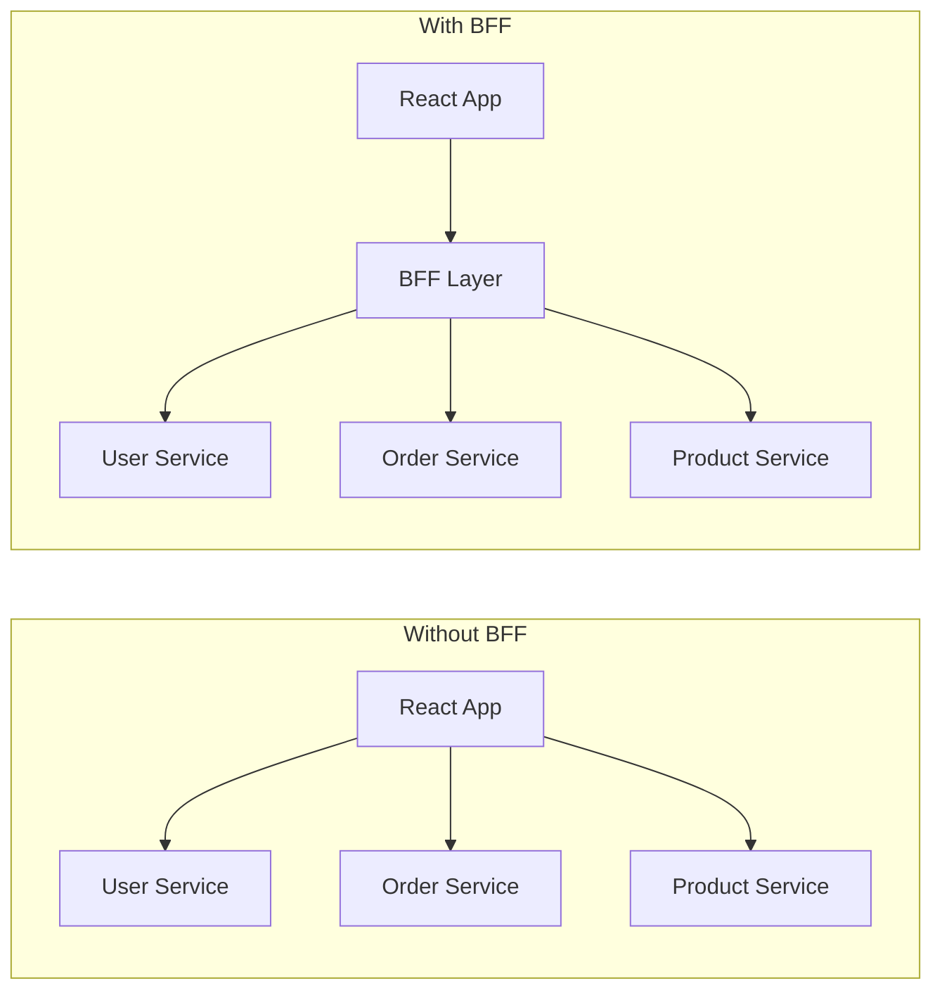

# The BFF Pattern: Why Your Frontend Needs Its Own Backend

You know that feeling when your frontend needs data from three different microservices, each with its own authentication scheme, response format, and error handling convention? So your React component ends up making three fetch calls, merging the results, handling three different error shapes, and transforming the data into whatever shape your UI actually needs?

That's the problem the backend for frontend pattern solves. And once you get it, you'll wonder why you ever let your frontend talk directly to backend services.

## What a BFF Actually Does

A Backend for Frontend is a lightweight server layer that sits between your frontend and your backend services. It's not a general-purpose API  it's purpose-built for a single frontend application. Its job is simple:

1. **Aggregate** data from multiple backend services into a single response
2. **Transform** data into the exact shape the frontend needs
3. **Handle authentication** so the frontend doesn't deal with tokens for internal services
4. **Shield** the frontend from backend complexity  service discovery, retries, circuit breaking



Without a BFF, the frontend is doing all the heavy lifting  making multiple requests, handling partial failures, transforming data. With a BFF, the frontend makes one request and gets exactly what it needs.

Here's a concrete example. Say your dashboard shows the logged-in user's name, their recent orders, and product recommendations. Without a BFF:

```tsx
// Without BFF  the frontend does all the work
'use client'

import { useEffect, useState } from 'react'

export function Dashboard() {
  const [data, setData] = useState(null)
  const [loading, setLoading] = useState(true)

  useEffect(() => {
    async function loadDashboard() {
      const [userRes, ordersRes, recsRes] = await Promise.all([
        fetch('https://user-service.internal/api/users/me', {
          headers: { Authorization: `Bearer ${getServiceToken('user')}` },
        }),
        fetch('https://order-service.internal/api/orders?limit=5', {
          headers: { Authorization: `Bearer ${getServiceToken('order')}` },
        }),
        fetch('https://rec-service.internal/api/recommendations', {
          headers: { Authorization: `Bearer ${getServiceToken('rec')}` },
        }),
      ])

      // Handle three different error shapes...
      // Transform three different response formats...
      // Merge everything together...
    }
    loadDashboard()
  }, [])

  // ...render
}
```

That's a lot of service-specific knowledge leaking into your frontend. Three different auth tokens. Three different URL patterns. Three different error formats. And if any service changes its API, you're updating frontend code.

## Next.js API Routes as a BFF

Here's the thing  if you're using Next.js, you already have a BFF. You just might not be using it that way.

Next.js API routes (or Route Handlers in App Router) run on the server. They have access to environment variables, can make internal service calls, and return exactly the data your frontend needs. That's a BFF.

```typescript
// app/api/dashboard/route.ts  your BFF endpoint
import { NextResponse } from 'next/server'
import { auth } from '@/auth'

export async function GET() {
  const session = await auth()
  if (!session) {
    return NextResponse.json({ error: 'Unauthorized' }, { status: 401 })
  }

  // All service calls happen server-side with internal auth
  const [user, orders, recommendations] = await Promise.all([
    fetchUserService(session.user.id),
    fetchOrderService(session.user.id, { limit: 5 }),
    fetchRecommendationService(session.user.id),
  ])

  // Transform into exactly what the frontend needs
  return NextResponse.json({
    displayName: `${user.firstName} ${user.lastName}`,
    recentOrders: orders.map(order => ({
      id: order.id,
      total: formatCurrency(order.totalCents),
      status: order.fulfillmentStatus,
      date: order.createdAt,
    })),
    recommendations: recommendations.slice(0, 4).map(rec => ({
      id: rec.productId,
      name: rec.productName,
      imageUrl: rec.thumbnailUrl,
      price: formatCurrency(rec.priceCents),
    })),
  })
}

async function fetchUserService(userId: string) {
  const res = await fetch(`${process.env.USER_SERVICE_URL}/users/${userId}`, {
    headers: { 'X-Internal-Auth': process.env.INTERNAL_SERVICE_KEY! },
  })
  return res.json()
}

async function fetchOrderService(userId: string, opts: { limit: number }) {
  const res = await fetch(
    `${process.env.ORDER_SERVICE_URL}/orders?userId=${userId}&limit=${opts.limit}`,
    { headers: { 'X-Internal-Auth': process.env.INTERNAL_SERVICE_KEY! } }
  )
  return res.json()
}

async function fetchRecommendationService(userId: string) {
  const res = await fetch(
    `${process.env.REC_SERVICE_URL}/recommendations/${userId}`,
    { headers: { 'X-Internal-Auth': process.env.INTERNAL_SERVICE_KEY! } }
  )
  return res.json()
}
```

Now your frontend component is dead simple:

```tsx
'use client'

import useSWR from 'swr'

export function Dashboard() {
  const { data, isLoading } = useSWR('/api/dashboard', fetcher)

  if (isLoading) return <DashboardSkeleton />

  return (
    <div>
      <h1>Welcome, {data.displayName}</h1>
      <RecentOrders orders={data.recentOrders} />
      <Recommendations items={data.recommendations} />
    </div>
  )
}
```

One request. One response shape. The frontend doesn't know or care that three services are involved.

If you're building these kinds of API endpoints and testing them with cURL, [SnipShift's cURL to Code converter](https://snipshift.dev/curl-to-code) can turn your curl commands into typed fetch calls  helpful when you're writing the BFF layer and need to codify those internal service calls. For more on structuring your API responses properly, check out our [REST API naming conventions guide](/blog/rest-api-naming-conventions).

## tRPC as a Type-Safe BFF

If you want to take the BFF pattern further, tRPC is sort of the ultimate version of it. tRPC gives you end-to-end type safety between your frontend and your BFF  no code generation, no schema files, just TypeScript.

```typescript
// server/routers/dashboard.ts
import { router, protectedProcedure } from '../trpc'

export const dashboardRouter = router({
  getDashboard: protectedProcedure.query(async ({ ctx }) => {
    const [user, orders, recs] = await Promise.all([
      ctx.userService.getUser(ctx.session.userId),
      ctx.orderService.getRecentOrders(ctx.session.userId, 5),
      ctx.recService.getRecommendations(ctx.session.userId),
    ])

    return {
      displayName: `${user.firstName} ${user.lastName}`,
      recentOrders: orders.map(formatOrder),
      recommendations: recs.slice(0, 4).map(formatRecommendation),
    }
  }),
})
```

```tsx
// On the frontend  fully typed, autocomplete just works
'use client'

import { trpc } from '@/lib/trpc'

export function Dashboard() {
  const { data, isLoading } = trpc.dashboard.getDashboard.useQuery()
  //     ^? { displayName: string, recentOrders: Order[], recommendations: Rec[] }

  if (isLoading) return <DashboardSkeleton />

  return (
    <div>
      <h1>Welcome, {data.displayName}</h1>
      {/* data.recentOrders is fully typed  autocomplete works */}
      <RecentOrders orders={data.recentOrders} />
    </div>
  )
}
```

Change the return shape on the server, and TypeScript immediately tells you which frontend components need updating. No runtime surprises. No API documentation to keep in sync.

For generating TypeScript types from your API responses  whether you're using tRPC or plain REST  [SnipShift's JSON to TypeScript converter](https://snipshift.dev/json-to-typescript) can turn a sample response into a proper interface in seconds.

## When to Skip the BFF

The backend for frontend pattern isn't always the right call. Skip it when:

- **You have a single backend API** that already returns data in the shape your frontend needs. Adding a BFF in front of one API is just adding a proxy for no reason.
- **Your backend team can shape APIs for the frontend.** If you have a collaborative backend team that's willing to add frontend-friendly endpoints, you don't need an intermediary.
- **You're building a simple CRUD app.** If every page maps to one database query, the BFF layer is pure overhead.
- **You're using GraphQL.** GraphQL already lets the frontend request exactly the data it needs in one query. GraphQL is, in a sense, a built-in BFF.

| Scenario | Use a BFF? | Why |
|----------|-----------|-----|
| Multiple microservices, one frontend | **Yes** | Aggregate + transform |
| Single API, complex auth | **Maybe** | Only if auth is messy |
| Single monolith API | **No** | Just call it directly |
| GraphQL backend | **No** | GraphQL already solves this |
| Mobile + web sharing backend APIs | **Yes** | Each client gets its own BFF |
| Next.js with Server Components | **Maybe** | Server Components can be the BFF |

### The Server Components Angle

One more thing worth mentioning: if you're using Next.js with Server Components, your Server Components are kind of a BFF already. They run on the server, can fetch from internal services, and return exactly the HTML the client needs. You might not need a separate API route at all.

```tsx
// This Server Component IS the BFF
export default async function Dashboard() {
  const [user, orders] = await Promise.all([
    fetchUserService(getUserId()),
    fetchOrderService(getUserId()),
  ])

  return (
    <div>
      <h1>Welcome, {user.name}</h1>
      <OrderList orders={orders} />
    </div>
  )
}
```

No API route. No client-side fetching. The Server Component aggregates, transforms, and renders  all on the server. It's the thinnest possible BFF.

For more on how this works, check out our post on [server components vs client components in Next.js](/blog/server-vs-client-components-nextjs). And for understanding HTTP status codes your BFF should return, our [HTTP status codes guide](/blog/http-status-codes-explained) covers the ones that actually matter.

The BFF pattern is one of those architectural ideas that sounds fancy but is really just good engineering: give each frontend a backend that speaks its language. Whether that's a Next.js API route, a tRPC router, or a Server Component  the principle is the same. Keep your frontend simple. Let the server do the hard work. Explore more tools at [SnipShift.dev](https://snipshift.dev).
