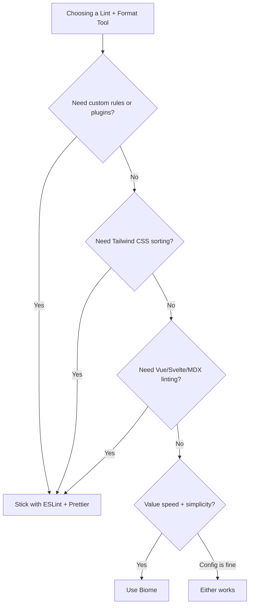

# Biome vs ESLint + Prettier: Should You Switch in 2026?

I'm going to be upfront  I switched one of my projects to Biome six months ago, and I've been quietly annoyed about it ever since. Not because Biome is bad. It's actually excellent at what it does. But the decision to switch is more complicated than "it's faster, just use it."

If you've seen the benchmarks and you're tempted, keep reading. I'll give you the honest picture  the good, the gaps, and whether switching actually makes sense for your team right now.

## What Biome Actually Is

Biome is a single tool that does linting AND formatting, written in Rust. It replaces both ESLint and Prettier with one binary, one config file, and one command. The project started as Rome (founded by the creator of Babel), went through some turbulence, and re-emerged as Biome under a new team.

The promise: faster linting, faster formatting, simpler config, one tool instead of two.

```json
// biome.json  one config for everything
{
  "$schema": "https://biomejs.dev/schemas/1.9.4/schema.json",
  "organizeImports": {
    "enabled": true
  },
  "formatter": {
    "indentStyle": "space",
    "indentWidth": 2,
    "lineWidth": 100
  },
  "linter": {
    "enabled": true,
    "rules": {
      "recommended": true,
      "correctness": {
        "noUnusedVariables": "error",
        "noUnusedImports": "error"
      },
      "suspicious": {
        "noExplicitAny": "warn"
      }
    }
  }
}
```

Compare that to the typical ESLint + Prettier setup  `.eslintrc.js`, `.prettierrc`, `eslint-config-prettier` to avoid conflicts, maybe `eslint-plugin-prettier` to run them together, a handful of plugins... it's a lot of config surface area. The setup guide for ESLint + Prettier + TypeScript in 2026 is still unreasonably long.

## Speed: The Headline Number

The benchmarks are real. Biome is dramatically faster.

| Operation | ESLint + Prettier | Biome |
|-----------|------------------|-------|
| Lint 1,000 files | ~8.2s | ~0.3s |
| Format 1,000 files | ~4.5s | ~0.1s |
| Lint + Format combined | ~12.7s | ~0.35s |
| Watch mode re-check | ~1.2s | ~0.02s |

That's not a typo. Biome is 25-40x faster depending on the operation. On my project with about 400 TypeScript files, `biome check` finishes before I can switch windows. ESLint + Prettier took about 6 seconds.

Does this speed difference matter? For CI, absolutely  shaving 10 seconds off every pipeline run adds up. For local development with watch mode, it makes lint feedback feel instant rather than "wait a beat." For pre-commit hooks, it means developers don't start resenting the hook.

```bash
# Pre-commit hook with Biome  nobody complains about this
biome check --staged --write

# Pre-commit hook with ESLint + Prettier  people disable this
eslint --fix $(git diff --staged --name-only)
prettier --write $(git diff --staged --name-only)
```

## Rule Coverage: Where It Gets Complicated

Here's the thing about ESLint  it has thousands of rules across hundreds of plugins. `eslint-plugin-react`, `eslint-plugin-react-hooks`, `@typescript-eslint`, `eslint-plugin-import`, `eslint-plugin-jsx-a11y`, `eslint-plugin-tailwindcss`... the ecosystem is massive.

Biome covers the core rules well. It includes equivalents for most `eslint:recommended` rules, many `@typescript-eslint` rules, React rules, import sorting, and accessibility checks. For a typical React + TypeScript project, Biome covers maybe 80-85% of what you'd get from a standard ESLint config.

But that missing 15-20% might include rules your team cares about. Here's what Biome doesn't have (as of early 2026):

- **No plugin system**  you can't write custom rules (yet, it's on the roadmap)
- **No `eslint-plugin-tailwindcss`** equivalent  no Tailwind class sorting or validation
- **Limited `@typescript-eslint` coverage**  the most common rules are there, but advanced type-aware linting is partial
- **No `eslint-plugin-testing-library`**  no Testing Library best-practice enforcement
- **No custom parsers**  ESLint can lint Vue SFCs, Svelte, MDX. Biome handles JS/TS/JSX/TSX/JSON/CSS



## The Migration Path

Biome provides a migration command that converts your existing ESLint config:

```bash
# Generate biome.json from your existing ESLint config
biome migrate eslint --write

# Check what rules map and which ones don't
biome migrate eslint --dry-run
```

It won't be a perfect 1:1 migration. Some rules don't have Biome equivalents, and some Biome rules don't have ESLint equivalents. But it gets you 80% there, and the output tells you what's missing so you can make informed decisions about what to drop.

> **Warning:** If your team has spent months fine-tuning an ESLint config with custom rules and specific overrides, don't expect a seamless migration. Budget time for reviewing and testing the Biome config against your codebase.

## Formatting: Prettier Compatibility

Biome's formatter is *almost* identical to Prettier. Almost. There are subtle differences in how it handles certain edge cases  long ternary expressions, some JSX formatting, trailing commas in specific contexts. For most codebases, you won't notice. But if you have a strict "our code must be byte-for-byte identical to Prettier output" requirement, you'll find differences.

Biome has a `biome rage` command (yes, really) that dumps diagnostic info, and the team actively tracks Prettier compatibility. They're aiming for near-parity, and they're close  but "near" isn't "exact."

## The Honest Recommendation

Here's how I'd think about this decision:

**Switch to Biome** if:
- You're starting a new project and want simple setup
- Your team uses React + TypeScript without heavy plugin dependencies
- CI speed matters and you're tired of ESLint being the slowest step
- You don't need custom ESLint rules or Tailwind class sorting
- You want one tool instead of managing ESLint + Prettier compatibility

**Stay with ESLint + Prettier** if:
- You depend on specific ESLint plugins (Tailwind, Testing Library, import resolution, etc.)
- You need type-aware linting rules from `@typescript-eslint`
- You have custom ESLint rules your team has written
- Your current setup works fine and the speed difference doesn't bother you
- You're working with Vue, Svelte, or other non-React frameworks

**The hybrid approach**  and this is what I ended up doing  use Biome for formatting only (replace Prettier) and keep ESLint for linting. You get Biome's speed for the formatting step, keep all your ESLint plugins, and reduce config complexity slightly. It's not as clean as going all-in on Biome, but it's pragmatic.

```bash
# Hybrid: Biome formats, ESLint lints
biome format --write .
eslint --fix .
```

If you already have a working ESLint + Prettier setup, check out our [ESLint + Prettier + TypeScript setup guide](/blog/eslint-prettier-typescript-setup)  that setup is still the most common and well-supported approach. Biome is the future, probably, but the present still belongs to ESLint's ecosystem.

And if your linting adventures are part of a broader TypeScript migration, [DevShift's JS to TypeScript converter](https://devshift.dev/js-to-ts) can handle the type conversion while you sort out the tooling  one less thing to do manually.

The tooling space moves fast. Biome's plugin system is on the roadmap, and once it lands, the gap with ESLint narrows significantly. Keep an eye on it. But don't rip out a working setup just because the benchmarks look impressive  that's how you end up spending a sprint on build tooling instead of shipping features. Ask me how I know.
