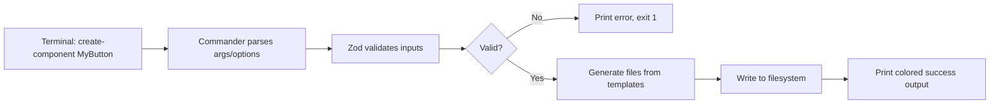

# How to Build a CLI Tool with TypeScript and Commander.js

I've published a handful of CLI tools over the years  internal dev tools, code generators, deployment helpers  and the stack I keep coming back to is TypeScript + Commander.js. It's not the only option (yargs, oclif, and citty all have their fans), but Commander hits the sweet spot between simplicity and capability. You can go from zero to a published npm package in under an hour.

This guide walks through building a real CLI tool from scratch. Not a toy "hello world"  an actual file scaffolding tool with options, validation, colored output, and everything you need to ship it on npm.

## Project Setup

Start with the basics:

```bash
mkdir create-component && cd create-component
npm init -y
npm install commander
npm install -D typescript @types/node tsup
```

Set up a `tsconfig.json`:

```json
{
  "compilerOptions": {
    "target": "ES2022",
    "module": "Node16",
    "moduleResolution": "Node16",
    "outDir": "dist",
    "rootDir": "src",
    "strict": true,
    "esModuleInterop": true,
    "skipLibCheck": true,
    "declaration": true
  },
  "include": ["src"]
}
```

And update `package.json`:

```json
{
  "name": "create-component",
  "version": "1.0.0",
  "type": "module",
  "bin": {
    "create-component": "./dist/index.js"
  },
  "files": ["dist"],
  "scripts": {
    "build": "tsup src/index.ts --format esm --dts",
    "dev": "tsup src/index.ts --format esm --watch"
  }
}
```

The `bin` field is what makes your tool executable as a command. When someone runs `npx create-component`, npm looks here to find the entry point.

## The CLI Entry Point

Create `src/index.ts`. This is where Commander.js defines your command structure:

```typescript
#!/usr/bin/env node

import { Command } from "commander";

const program = new Command();

program
  .name("create-component")
  .description("Scaffold React components with TypeScript boilerplate")
  .version("1.0.0");

program
  .argument("<name>", "Component name (PascalCase)")
  .option("-d, --directory <path>", "Output directory", "./src/components")
  .option("-s, --style <type>", "Styling approach", "css-modules")
  .option("--no-test", "Skip test file generation")
  .option("--no-story", "Skip Storybook story generation")
  .action(async (name: string, options) => {
    await createComponent(name, options);
  });

program.parse();
```

That `#!/usr/bin/env node` shebang on line 1 is critical  without it, your OS won't know to run this file with Node.js. Easy to forget, impossible to debug when you do.

## Input Validation with Zod

Commander gives you the raw arguments. But "raw arguments" from a terminal are about as trustworthy as user input from a form  validate everything. Zod makes this clean:

```bash
npm install zod
```

```typescript
import { z } from "zod";

const OptionsSchema = z.object({
  directory: z.string().min(1, "Directory path cannot be empty"),
  style: z.enum(["css-modules", "tailwind", "styled-components", "none"], {
    errorMap: () => ({
      message: "Style must be: css-modules, tailwind, styled-components, or none",
    }),
  }),
  test: z.boolean(),
  story: z.boolean(),
});

const ComponentNameSchema = z
  .string()
  .regex(/^[A-Z][a-zA-Z0-9]*$/, "Component name must be PascalCase (e.g., MyButton)");

type Options = z.infer<typeof OptionsSchema>;

function validateInputs(
  name: string,
  rawOptions: Record<string, unknown>
): { name: string; options: Options } {
  const nameResult = ComponentNameSchema.safeParse(name);
  if (!nameResult.success) {
    console.error(`Error: ${nameResult.error.issues[0].message}`);
    process.exit(1);
  }

  const optionsResult = OptionsSchema.safeParse(rawOptions);
  if (!optionsResult.success) {
    console.error(`Error: ${optionsResult.error.issues[0].message}`);
    process.exit(1);
  }

  return { name: nameResult.data, options: optionsResult.data };
}
```

I used to validate CLI arguments with hand-written if/else chains. Then I spent 2 hours debugging a case where someone passed `--style "CSS-Modules"` (capital letters) and the template engine silently generated broken output. Zod catches that stuff in one line.

## Colored Output with picocolors

For terminal output, I used to use `chalk`  and it's still fine  but **picocolors** is 14x smaller and has no dependencies. For a CLI tool, bundle size matters:

```bash
npm install picocolors
```

```typescript
import pc from "picocolors";

function log(message: string): void {
  console.log(message);
}

function success(message: string): void {
  console.log(pc.green(`✓ ${message}`));
}

function error(message: string): void {
  console.error(pc.red(`✗ ${message}`));
}

function info(message: string): void {
  console.log(pc.cyan(`ℹ ${message}`));
}

function warn(message: string): void {
  console.log(pc.yellow(`⚠ ${message}`));
}
```

| Library | Size | Dependencies | ESM | CJS |
|---|---|---|---|---|
| **picocolors** | ~2.6 KB | 0 | Yes | Yes |
| **chalk** | ~44 KB | 0 (v5+) | Yes (v5+) | v4 only |
| **kleur** | ~4.4 KB | 0 | Yes | Yes |
| **colorette** | ~3.2 KB | 0 | Yes | Yes |

Honestly, any of these work. I pick picocolors because it's the smallest and I've never needed chalk's extra features (like hex colors or RGB) in a CLI tool.

## The Core Logic

Now the actual file generation. This is the meat of the tool:

```typescript
import { mkdir, writeFile } from "node:fs/promises";
import { join } from "node:path";

async function createComponent(
  rawName: string,
  rawOptions: Record<string, unknown>
): Promise<void> {
  const { name, options } = validateInputs(rawName, rawOptions);
  const componentDir = join(options.directory, name);

  info(`Creating component ${pc.bold(name)} in ${componentDir}`);

  // Create the directory
  await mkdir(componentDir, { recursive: true });

  // Generate component file
  const componentContent = generateComponent(name, options.style);
  await writeFile(join(componentDir, `${name}.tsx`), componentContent);
  success(`Created ${name}.tsx`);

  // Generate style file (if applicable)
  if (options.style !== "none") {
    const styleFile = getStyleFileName(name, options.style);
    const styleContent = generateStyleFile(name, options.style);
    await writeFile(join(componentDir, styleFile), styleContent);
    success(`Created ${styleFile}`);
  }

  // Generate test file
  if (options.test) {
    const testContent = generateTest(name);
    await writeFile(join(componentDir, `${name}.test.tsx`), testContent);
    success(`Created ${name}.test.tsx`);
  }

  // Generate story file
  if (options.story) {
    const storyContent = generateStory(name);
    await writeFile(join(componentDir, `${name}.stories.tsx`), storyContent);
    success(`Created ${name}.stories.tsx`);
  }

  // Generate barrel export
  await writeFile(
    join(componentDir, "index.ts"),
    `export { default } from './${name}';\nexport type { ${name}Props } from './${name}';\n`
  );
  success("Created index.ts");

  log("");
  success(pc.bold(`Component ${name} created successfully!`));
  info(`Location: ${componentDir}`);
}
```

And the template generators:

```typescript
function generateComponent(name: string, style: string): string {
  const styleImport =
    style === "css-modules"
      ? `import styles from './${name}.module.css';\n`
      : style === "tailwind"
        ? ""
        : style === "styled-components"
          ? `import { styled } from 'styled-components';\n`
          : "";

  return `${styleImport}
export interface ${name}Props {
  children?: React.ReactNode;
  className?: string;
}

export default function ${name}({ children, className }: ${name}Props) {
  return (
    <div className={${style === "css-modules" ? `styles.root` : `className`}}>
      {children}
    </div>
  );
}
`;
}

function generateTest(name: string): string {
  return `import { render, screen } from '@testing-library/react';
import ${name} from './${name}';

describe('${name}', () => {
  it('renders children', () => {
    render(<${name}>Hello</${name}>);
    expect(screen.getByText('Hello')).toBeInTheDocument();
  });
});
`;
}

function generateStory(name: string): string {
  return `import type { Meta, StoryObj } from '@storybook/react';
import ${name} from './${name}';

const meta: Meta<typeof ${name}> = {
  title: 'Components/${name}',
  component: ${name},
};

export default meta;
type Story = StoryObj<typeof ${name}>;

export const Default: Story = {
  args: {
    children: '${name} content',
  },
};
`;
}

function getStyleFileName(name: string, style: string): string {
  switch (style) {
    case "css-modules": return `${name}.module.css`;
    case "tailwind": return "";
    case "styled-components": return `${name}.styled.ts`;
    default: return `${name}.css`;
  }
}

function generateStyleFile(name: string, style: string): string {
  if (style === "css-modules") {
    return `.root {\n  /* ${name} styles */\n}\n`;
  }
  if (style === "styled-components") {
    return `import { styled } from 'styled-components';\n\nexport const Root = styled.div\`\n  /* ${name} styles */\n\`;\n`;
  }
  return "";
}
```

## How It All Fits Together



## Bundling with tsup

You could use `tsc` to compile, but **tsup** (built on esbuild) is faster and bundles everything into a single file  which means faster startup times for your CLI:

```typescript
// tsup.config.ts
import { defineConfig } from "tsup";

export default defineConfig({
  entry: ["src/index.ts"],
  format: ["esm"],
  dts: true,
  clean: true,
  target: "node18",
  banner: {
    // tsup strips the shebang by default  add it back
    js: "#!/usr/bin/env node",
  },
});
```

Build and test locally:

```bash
npm run build
node dist/index.js MyButton --style tailwind --no-story
```

You should see colored output in your terminal and a fresh `MyButton` directory in `./src/components/`.

For local testing as a global command:

```bash
npm link
create-component TestCard -d ./tmp
```

`npm link` creates a symlink so you can run your CLI as if it were globally installed. Useful for testing the full experience before publishing.

## Publishing to npm

Once you're happy with the tool:

```bash
# Make sure you're logged in
npm login

# Bump version (follows semver)
npm version patch

# Build and publish
npm run build
npm publish
```

Before publishing, double-check your `package.json`:

```json
{
  "name": "create-component",
  "version": "1.0.1",
  "type": "module",
  "bin": {
    "create-component": "./dist/index.js"
  },
  "files": ["dist"],
  "engines": {
    "node": ">=18"
  },
  "keywords": ["cli", "react", "component", "scaffold", "typescript"]
}
```

The `files` array is important  it tells npm to only publish the `dist` folder, not your source code, tests, or config files. The `engines` field warns users if they're on an older Node version.

> **Tip:** If you're converting an existing JavaScript CLI to TypeScript, [SnipShift's JS to TS converter](https://snipshift.dev/js-to-ts) can handle the initial type annotations  especially useful for Commander option types and callback signatures that are tedious to type manually.

## Adding Subcommands

As your CLI grows, you'll want subcommands. Commander makes this clean:

```typescript
program
  .command("create")
  .argument("<name>", "Component name")
  .option("-d, --directory <path>", "Output directory", "./src/components")
  .action(async (name, options) => {
    await createComponent(name, options);
  });

program
  .command("list")
  .description("List all generated components")
  .option("-d, --directory <path>", "Components directory", "./src/components")
  .action(async (options) => {
    await listComponents(options.directory);
  });

program
  .command("delete")
  .argument("<name>", "Component name to delete")
  .option("-d, --directory <path>", "Components directory", "./src/components")
  .option("-f, --force", "Skip confirmation prompt", false)
  .action(async (name, options) => {
    await deleteComponent(name, options);
  });
```

Now your users can run `create-component create MyButton`, `create-component list`, or `create-component delete OldWidget --force`. Each subcommand has its own arguments, options, and action handler.

## Error Handling and Exit Codes

Good CLI tools communicate through exit codes, not just text. Here's a pattern I use:

```typescript
async function main(): Promise<void> {
  try {
    program.parse();
  } catch (err) {
    if (err instanceof Error) {
      error(err.message);
    } else {
      error("An unexpected error occurred");
    }
    process.exit(1);
  }
}

main();
```

| Exit Code | Meaning |
|---|---|
| `0` | Success (default when process ends normally) |
| `1` | General error (invalid input, file not found, etc.) |
| `2` | Misuse of command (wrong arguments) |

Commander handles exit code `2` automatically for missing required arguments. For everything else, catch errors and exit with `1`.

## Testing Your CLI

You can test Commander-based CLIs programmatically:

```typescript
import { execSync } from "node:child_process";

describe("create-component CLI", () => {
  it("creates component files", () => {
    execSync("node dist/index.js TestWidget -d ./tmp", {
      encoding: "utf-8",
    });

    // Verify files exist
    expect(existsSync("./tmp/TestWidget/TestWidget.tsx")).toBe(true);
    expect(existsSync("./tmp/TestWidget/index.ts")).toBe(true);
  });

  it("rejects invalid component names", () => {
    expect(() => {
      execSync("node dist/index.js my-button -d ./tmp", {
        encoding: "utf-8",
      });
    }).toThrow();
  });
});
```

Running the actual binary in tests catches integration issues that unit tests miss  like the shebang being stripped, or the `bin` path being wrong.

## Wrapping Up

Building a CLI tool with TypeScript and Commander is one of those things that's way more approachable than it looks. The whole stack  Commander for argument parsing, Zod for validation, picocolors for output, tsup for bundling  fits together cleanly and gives you a professional-grade tool.

For more TypeScript project setup patterns, check out our guide on [ESLint + Prettier + TypeScript setup](/blog/eslint-prettier-typescript-setup). And if you're building Node.js tools more broadly, our [Node.js project structure guide](/blog/node-js-project-structure) covers how to organize larger projects.

The best CLI tools feel invisible  they do exactly what you expect, give clear feedback when something's wrong, and don't make you read a man page to get started. Commander + TypeScript gets you there with remarkably little code.
