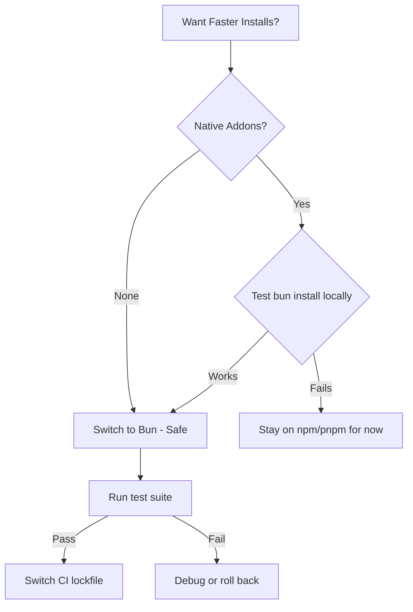

# How to Use Bun as a Package Manager (Instead of npm)

I switched a production monorepo from npm to Bun's package manager about eight months ago. The install step in CI went from 47 seconds to 6. That's not a typo. I ran the benchmark three times because I didn't believe it the first time.

Bun started as a JavaScript runtime, but its built-in package manager has become one of the most compelling reasons to adopt it  even if you're not ready to switch your entire runtime. You can use **Bun as a package manager** while still running your code with Node.js. The two concerns are completely separate.

If you've been wondering whether it's worth replacing npm (or pnpm, or yarn) with Bun, this post covers everything: speed, compatibility, lockfile format, workspaces, and the gotchas I've actually hit.

## The Speed Difference Is Real

Let's start with what everyone wants to know. Here's a rough comparison installing a typical Next.js project's dependencies (~800 packages) on a clean cache:

| Package Manager | Cold Install | Warm Install (cached) |
|----------------|-------------|----------------------|
| **npm** | ~35s | ~12s |
| **pnpm** | ~15s | ~4s |
| **yarn (v4)** | ~18s | ~5s |
| **Bun** | ~4s | ~1s |

These numbers will vary by machine, network, and project size. But the relative order is consistent. Bun is significantly faster than everything else. It's not close.

Why? Bun uses a custom HTTP client written in Zig (the same language the runtime is built in), resolves and downloads packages in parallel, and writes to the filesystem using native system calls instead of going through Node's `fs` module. The architecture is just fundamentally faster for this task.

```bash
# Try it yourself
bun install
```

That's the whole command. If you have a `package.json`, Bun reads it. If you have a `package-lock.json` or `yarn.lock`, Bun can read those too and install accordingly. It's designed to be a drop-in replacement.

## The Lockfile: bun.lockb

Here's one thing that catches people off guard. Bun's lockfile is called `bun.lockb` and it's a **binary file**, not a text file. You can't read it in a diff, and you can't manually edit it.

This is a deliberate design choice. Binary lockfiles are faster to read and write than JSON or YAML. But it means:

- **Git diffs won't show you what changed** in the lockfile. You need to use `bun install --dry-run` or `bun pm ls` to inspect dependency changes.
- **Merging conflicts** on the lockfile can't be resolved manually. You delete `bun.lockb` and re-run `bun install`. In practice, this works fine because Bun regenerates the lockfile deterministically from `package.json`.
- **You should still commit `bun.lockb`** to your repo. It ensures deterministic installs across machines, just like `package-lock.json`.

> **Tip:** If you need a human-readable lockfile for auditing or compliance, you can generate one with `bun install --yarn` which outputs a `yarn.lock` alongside `bun.lockb`. But for day-to-day work, the binary lockfile is fine.

## Compatibility with npm Packages

This was my biggest concern before switching: will everything just work? The answer is mostly yes, with a few caveats.

Bun's package manager is compatible with the npm registry. It reads `package.json`, respects `dependencies`, `devDependencies`, `peerDependencies`, and `optionalDependencies`. It handles `postinstall` scripts, lifecycle hooks, and Git dependencies.

What works identically to npm:

```bash
bun add express           # Same as npm install express
bun add -d vitest         # Same as npm install -D vitest
bun remove lodash         # Same as npm uninstall lodash
bun add express@4.18.0    # Pinned versions work
bun add @types/node       # Scoped packages work
```

The CLI syntax is slightly different  `bun add` instead of `npm install <package>`  but the behavior is the same.

### Where Compatibility Gets Tricky

A handful of packages use postinstall scripts that assume they're running under Node.js or reference Node-specific APIs during installation. Bun handles most of these, but I've hit edge cases with:

- Native modules (like `sharp` or `bcrypt`)  these usually work, but sometimes need Bun-specific pre-built binaries
- Packages that shell out to `npm` or `npx` during postinstall  rare, but it happens
- `node-gyp` rebuilds for some C++ addons  Bun supports this, but it can be slower than expected

For 95% of npm packages, it's seamless. For the remaining 5%, check Bun's GitHub issues before assuming something is broken on your end.

## Workspaces

If you're running a monorepo, Bun supports workspaces with the same `package.json` syntax as npm and yarn:

```json
{
  "name": "my-monorepo",
  "workspaces": [
    "packages/*",
    "apps/*"
  ]
}
```

`bun install` from the root installs dependencies for all workspaces, hoists shared dependencies, and creates symlinks between local packages. It's the same model as npm workspaces, but again  faster.

You can run scripts in specific workspaces with the `--filter` flag:

```bash
bun run --filter '@myorg/api' dev
bun run --filter '@myorg/web' build
```

I've been running a monorepo with 12 packages on Bun workspaces for months. No issues. If your monorepo is already on npm workspaces, the migration is basically just running `bun install` and committing the new lockfile.

For a broader look at monorepo vs polyrepo tradeoffs, check out our [monorepo vs polyrepo comparison](/blog/monorepo-vs-polyrepo).

## .npmrc Equivalent: bunfig.toml

npm uses `.npmrc` for configuration (registry URLs, auth tokens, etc.). Bun uses `bunfig.toml`:

```toml
[install]
# Use a private registry
registry = "https://npm.mycompany.com"

# Scoped registry
[install.scopes]
"@myorg" = "https://npm.mycompany.com"

# Equivalent to npm's save-exact
exact = true
```

If you have a `.npmrc` with a custom registry or auth token, you'll need to create a `bunfig.toml` equivalent. Bun does read `.npmrc` for basic registry and token configuration, but for anything beyond that, `bunfig.toml` is the canonical config.

## trustedDependencies

Bun has a security feature that npm doesn't: **trustedDependencies**. By default, Bun doesn't run postinstall scripts from packages unless you explicitly trust them.

This is actually a good thing. Postinstall scripts are a known supply chain attack vector  a compromised package can run arbitrary code on `npm install`. Bun makes you opt in:

```json
{
  "trustedDependencies": [
    "sharp",
    "esbuild",
    "@prisma/client"
  ]
}
```

When you first run `bun install` on a project and a package has postinstall scripts, Bun will warn you and skip them unless the package is listed in `trustedDependencies`. Add the packages you trust, re-run `bun install`, and you're set.

> **Warning:** Don't blindly add every package to `trustedDependencies`. Only add packages whose postinstall scripts you've reviewed or that are from well-known, trusted maintainers. The whole point is to reduce your attack surface.

## When It's Safe to Switch

Here's my honest assessment after using the **Bun package manager** across several projects:

**Switch now if:**
- You're starting a new project (zero risk)
- Your project has no native Node.js addons or C++ bindings
- Your CI install step is a bottleneck and you want it 5-10x faster
- You're already using Bun as a runtime

**Wait a bit if:**
- You rely heavily on native modules like `sharp`, `canvas`, or `bcrypt`  test locally first
- Your team uses `.npmrc` with complex configuration (auth, multiple registries)
- You're in a regulated environment that requires auditable text-based lockfiles

**Don't switch if:**
- You're using Yarn PnP (Plug'n'Play) and depend on its zero-install feature  Bun doesn't support this
- Your CI/CD pipeline has npm-specific caching that would need reconfiguration

The safest migration path: run `bun install` locally alongside your existing lockfile, verify everything resolves correctly, run your test suite, and then switch CI. Keep your old lockfile around for a week in case you need to roll back.



If you're also thinking about project structure as you set things up, our [Node.js project structure guide](/blog/node-js-project-structure) covers patterns that work well regardless of which package manager you're using. And for understanding the module system differences that sometimes cause install issues, the [CommonJS vs ES Modules breakdown](/blog/commonjs-vs-es-modules-node) is worth a read.

The package manager space has been surprisingly static for years  npm, yarn, pnpm, pick your flavor. Bun is the first option that's made me genuinely reconsider the default. It's not perfect yet, but for most projects, the speed improvement alone makes it worth the switch.
