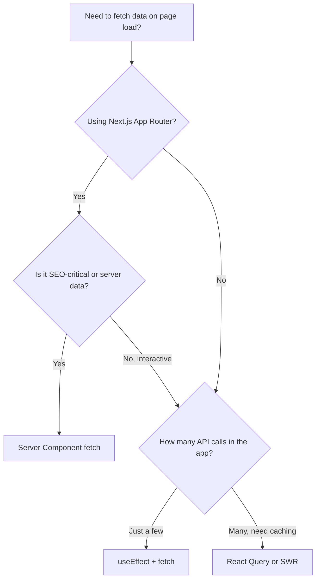

# How to Call an API on Page Load in React (The Right Way in 2026)

"How do I call an API when my component mounts?" might be the most frequently asked React question on the internet. And somehow, half the answers out there are still showing `componentDidMount` in class components. It's 2026  that approach has been effectively dead since hooks landed in React 16.8, which was over seven years ago.

The answer depends on what tools you're using. There are four solid approaches in 2026, ranging from bare-bones to batteries-included. I'll walk you through each one, with TypeScript, and be honest about when each makes sense.

## Quick Overview: Your Options

Before we get into code, here's the landscape at a glance:

| Approach | Client/Server | Caching | Loading States | Best For |
|----------|:------------:|:-------:|:--------------:|----------|
| `useEffect` + `fetch` | Client | Manual | Manual | Simple one-off fetches |
| React Query (`useQuery`) | Client | Built-in | Built-in | Apps with lots of API calls |
| SWR | Client | Built-in | Built-in | Lightweight alternative to React Query |
| Server Component `fetch` | Server | Built-in | N/A (no loading spinner) | Next.js pages, SEO-critical data |



## Approach 1: useEffect + fetch (Still Valid)

This is the foundational pattern. No libraries needed. If you understand this, everything else is just a nicer wrapper around the same idea.

```typescript
import { useState, useEffect } from 'react';

interface User {
  id: string;
  name: string;
  email: string;
}

function UserProfile({ userId }: { userId: string }) {
  const [user, setUser] = useState<User | null>(null);
  const [loading, setLoading] = useState(true);
  const [error, setError] = useState<string | null>(null);

  useEffect(() => {
    const controller = new AbortController();

    async function fetchUser() {
      try {
        setLoading(true);
        setError(null);

        const response = await fetch(`/api/users/${userId}`, {
          signal: controller.signal,
        });

        if (!response.ok) {
          throw new Error(`Failed to fetch: ${response.status}`);
        }

        const data: User = await response.json();
        setUser(data);
      } catch (err) {
        if (err instanceof Error && err.name !== 'AbortError') {
          setError(err.message);
        }
      } finally {
        setLoading(false);
      }
    }

    fetchUser();

    // Cleanup: abort the fetch if the component unmounts
    return () => controller.abort();
  }, [userId]);

  if (loading) return <div>Loading...</div>;
  if (error) return <div>Error: {error}</div>;
  if (!user) return null;

  return (
    <div>
      <h1>{user.name}</h1>
      <p>{user.email}</p>
    </div>
  );
}
```

A few things to notice here:

- **AbortController**  This is critical. Without it, if the component unmounts before the fetch completes, you'll try to call `setState` on an unmounted component. That's a memory leak. The abort controller cancels the in-flight request on cleanup.
- **Three state variables**  `loading`, `error`, and `data`. You're managing all of this yourself. It works, but it's tedious when you have 20 components doing the same thing.
- **The dependency array**  `[userId]` means the effect re-runs whenever `userId` changes. Miss this and you'll get stale data.

This approach is perfectly fine for small apps with a handful of API calls. But the moment you need caching, background refetching, optimistic updates, or pagination  you'll want a library.

> **Warning:** Never call `fetch` directly inside a component body (outside useEffect). It'll fire on every render, hammering your API. The useEffect ensures it runs once on mount, then only when dependencies change.

### Why componentDidMount Is Dead

For anyone still maintaining older code  here's what the class-based version looked like:

```typescript
// The old way. Don't write new code like this.
class UserProfile extends React.Component<Props, State> {
  state = { user: null, loading: true, error: null };

  componentDidMount() {
    fetch(`/api/users/${this.props.userId}`)
      .then((res) => res.json())
      .then((user) => this.setState({ user, loading: false }))
      .catch((error) => this.setState({ error: error.message, loading: false }));
  }

  // Also need componentDidUpdate to handle prop changes
  // Also need componentWillUnmount for cleanup
  // ... it gets messy fast
}
```

The functional version with hooks is shorter, handles cleanup better, and doesn't split related logic across three lifecycle methods. There's no reason to write class components for new React code. If you're converting class components to functional hooks, [SnipShift's JS to TypeScript converter](https://snipshift.dev/js-to-ts) can handle the transformation  including typing the state and props interfaces.

## Approach 2: React Query / TanStack Query (The Power Tool)

React Query (now called TanStack Query) is what I reach for on any project with more than a couple API calls. It handles caching, background refetching, retries, pagination, and stale-while-revalidate out of the box.

Same component, but with React Query:

```typescript
import { useQuery } from '@tanstack/react-query';

interface User {
  id: string;
  name: string;
  email: string;
}

async function fetchUser(userId: string): Promise<User> {
  const response = await fetch(`/api/users/${userId}`);
  if (!response.ok) throw new Error(`Failed to fetch: ${response.status}`);
  return response.json();
}

function UserProfile({ userId }: { userId: string }) {
  const { data: user, isLoading, error } = useQuery({
    queryKey: ['user', userId],
    queryFn: () => fetchUser(userId),
  });

  if (isLoading) return <div>Loading...</div>;
  if (error) return <div>Error: {error.message}</div>;
  if (!user) return null;

  return (
    <div>
      <h1>{user.name}</h1>
      <p>{user.email}</p>
    </div>
  );
}
```

Look at how much less code that is. No `useState` for three different state variables. No `useEffect`. No AbortController (React Query handles cancellation internally). No manual `try/catch/finally`.

But the real magic is what you get for free:

- **Caching**  If another component also fetches `['user', userId]`, it gets the cached result instantly
- **Background refetch**  When the user refocuses the tab, stale data is silently refreshed
- **Retry**  Failed requests are retried 3 times by default
- **Deduplication**  Multiple components requesting the same data at the same time result in a single network request

You need a `QueryClientProvider` at the root of your app, but that's a one-time setup:

```typescript
import { QueryClient, QueryClientProvider } from '@tanstack/react-query';

const queryClient = new QueryClient({
  defaultOptions: {
    queries: {
      staleTime: 60 * 1000, // Data stays fresh for 1 minute
      retry: 2,
    },
  },
});

function App() {
  return (
    <QueryClientProvider client={queryClient}>
      <YourApp />
    </QueryClientProvider>
  );
}
```

## Approach 3: SWR (The Lightweight Alternative)

SWR, made by the Vercel team, is a lighter alternative to React Query. It does less  no mutations API, no devtools  but if all you need is data fetching with caching, it's great.

```typescript
import useSWR from 'swr';

interface User {
  id: string;
  name: string;
  email: string;
}

const fetcher = async (url: string): Promise<User> => {
  const res = await fetch(url);
  if (!res.ok) throw new Error('Fetch failed');
  return res.json();
};

function UserProfile({ userId }: { userId: string }) {
  const { data: user, error, isLoading } = useSWR(
    `/api/users/${userId}`,
    fetcher
  );

  if (isLoading) return <div>Loading...</div>;
  if (error) return <div>Error: {error.message}</div>;
  if (!user) return null;

  return (
    <div>
      <h1>{user.name}</h1>
      <p>{user.email}</p>
    </div>
  );
}
```

SWR's API is slightly simpler than React Query  the key is the URL itself, and the fetcher is separate. For straightforward GET requests, this simplicity is nice. But if you need mutations, infinite scrolling, or advanced caching strategies, React Query gives you more tools.

My honest take: if you're starting a new project and you're not sure which one to pick, go with React Query. It handles more use cases, and you won't outgrow it. SWR is a fine choice too  this isn't a hill I'd die on.

## Approach 4: Server Component Fetch (Best for Next.js)

If you're using Next.js with the App Router, you have a fundamentally different option: skip the client entirely and call your API on the server during rendering. No loading spinners, no client-side JavaScript for the fetch, and the data is available immediately in the HTML.

```typescript
// app/users/[id]/page.tsx  This is a Server Component by default
interface User {
  id: string;
  name: string;
  email: string;
}

async function getUser(id: string): Promise<User> {
  const res = await fetch(`https://api.example.com/users/${id}`, {
    next: { revalidate: 60 }, // Cache for 60 seconds
  });

  if (!res.ok) throw new Error('Failed to fetch user');
  return res.json();
}

export default async function UserPage({
  params,
}: {
  params: Promise<{ id: string }>;
}) {
  const { id } = await params;
  const user = await getUser(id);

  return (
    <div>
      <h1>{user.name}</h1>
      <p>{user.email}</p>
    </div>
  );
}
```

Notice  no hooks, no state, no effects. The component is `async`. It awaits the data directly. This works because Server Components run on the server, not in the browser. The HTML that reaches the user already has the data baked in.

This is hands down the best approach for:
- SEO-critical pages (search engines see the content immediately)
- Data that doesn't need to update on the client after initial load
- Reducing client-side JavaScript bundle size

But it doesn't replace client-side fetching entirely. If you need real-time updates, user interactions that trigger new fetches, or optimistic UI  you still need `useQuery` or `useEffect` in a client component.

> **Tip:** You can combine both  use a Server Component for the initial page load, and client components with React Query for interactive parts of the page. That's the pattern I use most in Next.js apps.

## TypeScript: Typing Your Loading/Error/Data States

One more thing that's worth getting right  the TypeScript pattern for handling all three states. A common mistake is having `data` typed as `User | null` and forgetting that `loading` and `error` states mean you can't safely access `data.name` without a check.

Here's a clean discriminated union pattern:

```typescript
type AsyncState<T> =
  | { status: 'loading'; data: null; error: null }
  | { status: 'error'; data: null; error: Error }
  | { status: 'success'; data: T; error: null };

function useAsyncData<T>(fetcher: () => Promise<T>): AsyncState<T> {
  const [state, setState] = useState<AsyncState<T>>({
    status: 'loading',
    data: null,
    error: null,
  });

  useEffect(() => {
    const controller = new AbortController();

    fetcher()
      .then((data) => setState({ status: 'success', data, error: null }))
      .catch((error) => {
        if (error.name !== 'AbortError') {
          setState({ status: 'error', data: null, error });
        }
      });

    return () => controller.abort();
  }, []);

  return state;
}
```

With this pattern, TypeScript narrows the type for you:

```typescript
function UserProfile() {
  const state = useAsyncData(() => fetchUser('123'));

  switch (state.status) {
    case 'loading':
      return <Spinner />;
    case 'error':
      return <ErrorMessage error={state.error} />; // error is Error, not null
    case 'success':
      return <div>{state.data.name}</div>; // data is User, not null
  }
}
```

No more `if (data)` checks scattered everywhere. The discriminated union guarantees that when `status` is `'success'`, `data` is not null.

## What I'd Actually Use in 2026

If you asked me today: a Next.js app with Server Components for initial page data, plus React Query for any client-side interactivity. That covers 99% of use cases. For a Vite/SPA project without server rendering, React Query alone is the answer.

Plain `useEffect` + `fetch` is fine for learning React or for a component that makes one API call and doesn't need caching. But the moment your app grows, you'll wish you had React Query's caching layer. I've been on teams that tried to build their own caching on top of `useEffect`, and it always ends up being a worse version of React Query.

For a deeper look at handling loading and error states across your app, check out our guide on [React loading and error state patterns](/blog/react-loading-error-states-pattern). And if your API calls are failing and you're not sure why, [handling API errors in JavaScript](/blog/handle-api-errors-javascript) covers the debugging side of things.

If you're also thinking about what happens on the server side  how Server Components and client components relate in Next.js  our post on [server vs client components](/blog/server-vs-client-components-nextjs) breaks it down with practical examples.
