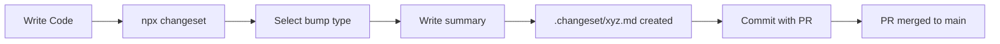
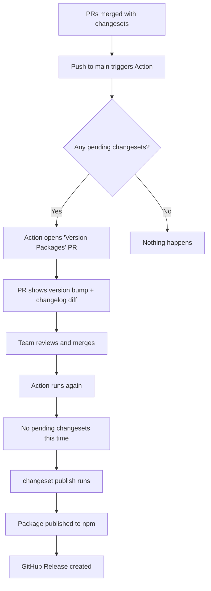

# How to Set Up Changesets for Versioning and Changelogs

Here's a scenario I've lived through more than once: someone on the team pushes a fix, bumps the version in `package.json` manually, forgets to update the changelog, publishes to npm, and then three other PRs merge with conflicting version bumps. Now nobody knows what version we're actually on, the changelog is two releases behind, and the intern is asking why `npm install` gives them a different version than what's in the README.

Changesets fixes all of this. It's a tool by the Atlassian team (the folks behind the Atlassian Design System) that decouples "describing a change" from "releasing a version." You describe what changed when you write the code, and the version bump + changelog happen later  automatically.

I've used both Changesets and semantic-release on production projects. Here's why I reach for Changesets every time now, and how to set it up from scratch.

## Install and Initialize

```bash
npm install --save-dev @changesets/cli
npx changeset init
```

This creates a `.changeset/` directory at your project root with two files:

```
.changeset/
├── config.json
└── README.md
```

The `config.json` is where the interesting stuff lives:

```json
{
  "$schema": "https://unpkg.com/@changesets/config@3.1.1/schema.json",
  "changelog": "@changesets/cli/changelog",
  "commit": false,
  "fixed": [],
  "linked": [],
  "access": "public",
  "baseBranch": "main",
  "updateInternalDependencies": "patch",
  "ignore": []
}
```

Key settings to tweak right away:

- **`access`**  Set to `"public"` for public npm packages. Scoped packages (`@org/name`) default to restricted on npm, and this tells Changesets to publish with `--access public`.
- **`baseBranch`**  Your main branch name. Usually `"main"`.
- **`commit`**  Set to `true` if you want Changesets to auto-commit when running `changeset version`. I leave it `false` so I can review before committing.

## The Workflow: Adding Changesets to PRs

The core idea is dead simple. When you make a change that should affect the published version, you run:

```bash
npx changeset
```

It asks two questions:

1. **Which packages are affected?** (In a single-package repo, it auto-selects yours)
2. **Is this a major, minor, or patch change?**

Then it opens your editor so you can write a summary. The result is a markdown file dropped into `.changeset/`:

```markdown
---
"my-awesome-lib": minor
---

Added `retry` option to the HTTP client with configurable backoff strategy
```

You commit this file alongside your code changes. That's it. The changeset file is just a declaration: "this PR includes a minor change to `my-awesome-lib`."



> **Tip:** Make adding a changeset part of your PR checklist. Some teams enforce it with a CI check  if a PR modifies source files but doesn't include a changeset file, the check fails. The `changeset status` command helps here.

## Version Bumping and Changelog Generation

When you're ready to release, run:

```bash
npx changeset version
```

This does three things in one shot:

1. **Reads all pending changeset files** in `.changeset/`
2. **Bumps the version** in `package.json`  if there are multiple changesets, it picks the highest bump type (e.g., if you have one patch and one minor, the version gets a minor bump)
3. **Generates a CHANGELOG.md entry** by stitching together all the summaries

After running it, you'll see changes to `package.json` (new version) and `CHANGELOG.md` (new entry). The consumed changeset files get deleted.

Your `CHANGELOG.md` ends up looking something like:

```markdown
# my-awesome-lib

## 1.3.0

### Minor Changes

- Added `retry` option to the HTTP client with configurable backoff strategy

### Patch Changes

- Fixed timeout calculation when custom headers are present
- Updated error messages to include request URL
```

Clean, readable, automatically generated from the summaries you wrote during development. No more "Updated changelog" commits where someone copy-pastes git log output.

## GitHub Actions: Fully Automated Releases

Here's where Changesets really shines. With the official GitHub Action, your release workflow becomes completely hands-off.

Create `.github/workflows/release.yml`:

```yaml
name: Release

on:
  push:
    branches: [main]

concurrency: ${{ github.workflow }}-${{ github.ref }}

jobs:
  release:
    name: Release
    runs-on: ubuntu-latest
    permissions:
      contents: write
      pull-requests: write
      id-token: write
    steps:
      - uses: actions/checkout@v4

      - uses: actions/setup-node@v4
        with:
          node-version: 20
          registry-url: "https://registry.npmjs.org"

      - run: npm ci

      - name: Create Release Pull Request or Publish
        id: changesets
        uses: changesets/action@v1
        with:
          publish: npm run release
        env:
          GITHUB_TOKEN: ${{ secrets.GITHUB_TOKEN }}
          NPM_TOKEN: ${{ secrets.NPM_TOKEN }}
          NODE_AUTH_TOKEN: ${{ secrets.NPM_TOKEN }}
```

Add a `release` script to `package.json`:

```json
{
  "scripts": {
    "build": "tsup",
    "release": "npm run build && changeset publish"
  }
}
```

### How the Automation Works

Here's the flow once this is set up:



The "Version Packages" PR is the clever part. It accumulates all pending changesets into a single PR that shows you exactly what version bump will happen and what the changelog will look like. You review it, merge it, and the Action publishes automatically.

No one on the team needs npm credentials locally. No one runs `npm publish` manually. The entire release process is a PR merge.

> **Warning:** Don't forget to add your `NPM_TOKEN` as a repository secret in GitHub. Generate a **Granular Access Token** on npmjs.com with publish permissions for your package. Classic tokens work too but granular ones are more secure.

## Monorepo Support

Changesets was literally designed for monorepos. If you're using a workspace setup (npm workspaces, pnpm workspaces, yarn workspaces), Changesets handles it natively.

When you run `npx changeset` in a monorepo, it asks which *packages* are affected:

```
Which packages would you like to include?
  ◯ @myorg/core
  ◯ @myorg/utils
  ◯ @myorg/cli
```

You select the relevant ones and assign bump types individually. The `linked` and `fixed` config options let you control version relationships:

- **`fixed`**  Packages that always share the same version. If one bumps, they all bump.
- **`linked`**  Packages whose versions move together, but only when one of them has a changeset. Less aggressive than `fixed`.

```json
{
  "fixed": [["@myorg/core", "@myorg/utils"]],
  "linked": [["@myorg/cli", "@myorg/core"]]
}
```

Most monorepo setups I've worked with use `linked` for packages that have runtime dependencies on each other, and leave unrelated packages independent.

## Changesets vs semantic-release

I get asked about this a lot, so here's my honest take:

| Feature | Changesets | semantic-release |
|---------|-----------|-----------------|
| **Version determination** | Developer chooses (major/minor/patch) | Automatic from commit messages |
| **Commit convention required** | No | Yes (Conventional Commits) |
| **Changelog quality** | Human-written summaries | Auto-generated from commits |
| **Monorepo support** | First-class, built-in | Via plugins, more complex |
| **Review before release** | Yes (Version Packages PR) | No (publishes on merge) |
| **Learning curve** | Low | Medium |
| **Flexibility** | Very flexible | More opinionated |

My take: **semantic-release** is great if your team already follows Conventional Commits religiously and you want zero human involvement in versioning. But in my experience, commit messages are a terrible proxy for version bumps. "fix: update readme typo" shouldn't bump a version at all, and "feat: completely rewrite the API" is obviously a major, not a minor  but semantic-release would make it a minor because there's no `BREAKING CHANGE` footer.

Changesets lets developers explicitly say "this is a patch" or "this is a major" at the time they make the change, when the context is fresh. And the human-written summaries produce significantly better changelogs than auto-generated commit lists.

That said, semantic-release has a much larger ecosystem of plugins (Slack notifications, release notes, etc.), and it's the default choice for many open-source projects. Both tools are solid  I just find Changesets to be a better fit for the teams I've worked with.

## Adding a CI Check for Missing Changesets

To enforce that every meaningful PR includes a changeset, add a check to your CI:

```yaml
name: Changeset Check

on:
  pull_request:
    branches: [main]

jobs:
  changeset-check:
    runs-on: ubuntu-latest
    steps:
      - uses: actions/checkout@v4
        with:
          fetch-depth: 0

      - uses: actions/setup-node@v4
        with:
          node-version: 20

      - run: npm ci

      - name: Check for changesets
        run: npx changeset status --since=origin/main
```

This will fail if there are code changes but no changeset file. PRs that are purely internal (CI config, docs, tests) can be exempted by adding an empty changeset:

```bash
npx changeset --empty
```

This creates a changeset file that explicitly says "no version bump needed"  which is different from forgetting to add one.

## Quick Setup Checklist

If you want the shortest path from zero to automated releases:

1. `npm install --save-dev @changesets/cli`
2. `npx changeset init`
3. Set `"access": "public"` in `.changeset/config.json` (for public packages)
4. Add the GitHub Action from above
5. Add `NPM_TOKEN` to your repo secrets
6. Add `"release": "npm run build && changeset publish"` to scripts

That's maybe 15 minutes of setup, and you never think about versioning again.

For the complete package build-and-publish workflow that pairs with this Changesets setup, check out our guide on [publishing a TypeScript npm package in 2026](/blog/publish-typescript-npm-package-2026). And if you need to convert JavaScript utility code to TypeScript before packaging it up, [SnipShift's JS to TypeScript converter](https://snipshift.dev/js-to-ts) can save you a bunch of manual typing  literally.
