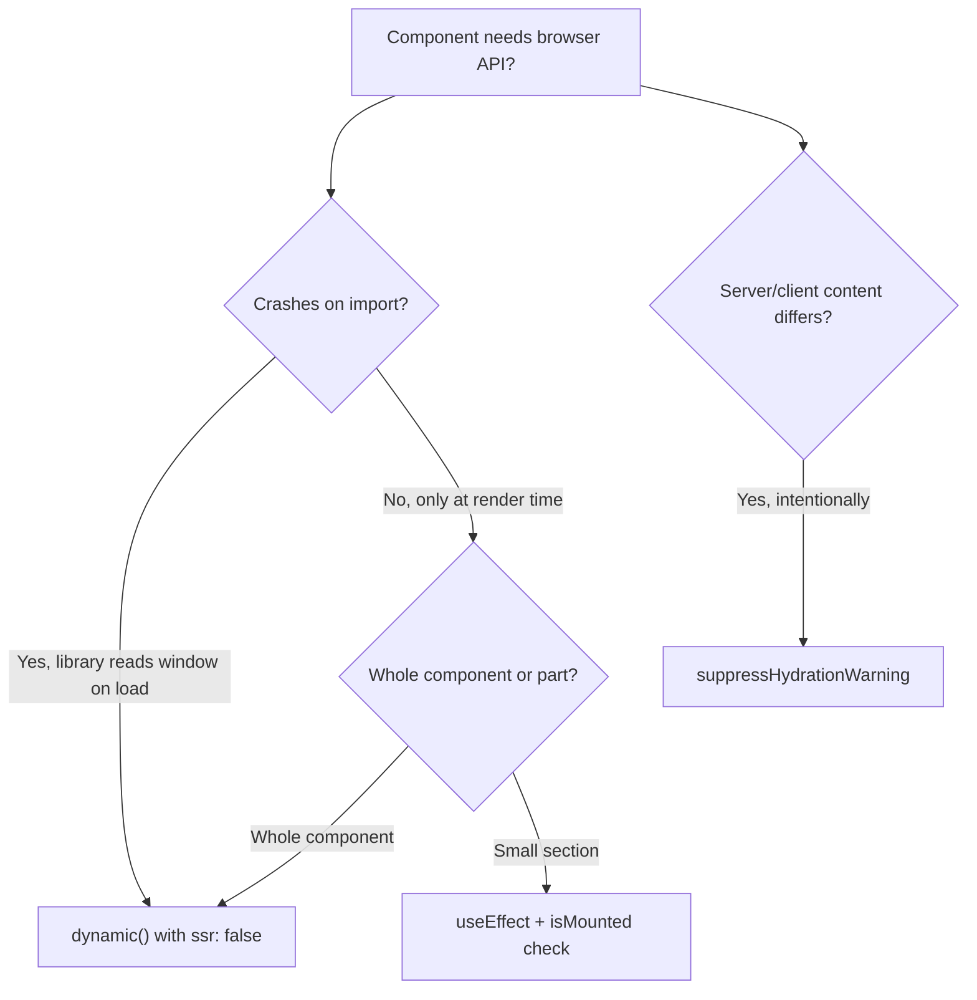

# How to Render a Component Only on the Client in Next.js (No SSR)

Some components just don't work on the server. A chart library that reads `window.innerWidth`. A map component that needs the DOM. An editor that accesses `document.createElement` on import. You drop it into your Next.js page and get hit with `ReferenceError: window is not defined`.

The fix is to render the component only on the client  skip SSR entirely. There are three approaches in Next.js, and each fits a different situation. Here's when to use which.

## Approach 1: Dynamic Import with `ssr: false`

This is the cleanest solution and the one I reach for first. Next.js provides `dynamic()` which lets you lazy-load a component and opt out of server-side rendering:

```typescript
import dynamic from 'next/dynamic';

const Chart = dynamic(() => import('@/components/chart'), {
  ssr: false,
  loading: () => <div className="h-[400px] animate-pulse bg-gray-100 rounded" />,
});

export default function AnalyticsPage() {
  return (
    <div>
      <h1>Analytics</h1>
      <Chart data={chartData} />
    </div>
  );
}
```

What happens here:
1. During SSR, Next.js skips the `Chart` component entirely and renders the `loading` fallback instead
2. On the client, after hydration, React lazy-loads the chart component and renders it
3. The chart code never touches the server  no `window is not defined` errors

This approach is best when:
- The entire component (or the library it uses) requires browser APIs
- You want a loading placeholder during the import
- The component is heavy and you want to code-split it anyway

### Typing Dynamic Imports

If your dynamic component has props, TypeScript infers them from the import:

```typescript
import dynamic from 'next/dynamic';

interface MapProps {
  center: { lat: number; lng: number };
  zoom: number;
  markers: Array<{ lat: number; lng: number; label: string }>;
}

const InteractiveMap = dynamic<MapProps>(
  () => import('@/components/interactive-map'),
  { ssr: false }
);

// TypeScript enforces the props
<InteractiveMap center={{ lat: 51.5, lng: -0.1 }} zoom={12} markers={[]} />
```

## Approach 2: useEffect + useState Mount Check

Sometimes you don't need to dynamically import anything  you just need to conditionally render a piece of JSX that uses browser APIs. A simple mount check works:

```typescript
'use client';

import { useState, useEffect } from 'react';

function BrowserOnlyContent() {
  const [isMounted, setIsMounted] = useState(false);

  useEffect(() => {
    setIsMounted(true);
  }, []);

  if (!isMounted) {
    return <div className="h-20 animate-pulse bg-gray-100 rounded" />;
  }

  // Safe to use browser APIs here
  const screenWidth = window.innerWidth;
  const userAgent = navigator.userAgent;

  return (
    <div>
      <p>Screen width: {screenWidth}px</p>
      <p>Browser: {userAgent}</p>
    </div>
  );
}
```

On the server, `isMounted` is `false`, so the component renders a placeholder. On the client, the `useEffect` fires, sets `isMounted` to `true`, and the browser-dependent code runs.

You can extract this into a reusable hook:

```typescript
function useIsMounted(): boolean {
  const [mounted, setMounted] = useState(false);

  useEffect(() => {
    setMounted(true);
  }, []);

  return mounted;
}

// Usage
function ClientOnlyWidget() {
  const isMounted = useIsMounted();

  if (!isMounted) return <Skeleton />;

  return <div>Current URL: {window.location.href}</div>;
}
```

This approach is best when:
- You only need to gate a small part of a component
- The component itself doesn't crash on import  only certain code paths need the browser
- You want more control over the mounting logic

The downside compared to `dynamic()` is that the component code is still included in the server bundle  it just doesn't execute the browser-dependent branch. With `dynamic({ ssr: false })`, the code isn't even loaded on the server.

## Approach 3: suppressHydrationWarning

This one is different  it doesn't prevent SSR. Instead, it tells React to not warn when the server-rendered HTML doesn't match the client-rendered HTML. Use this for content that intentionally differs between server and client.

```typescript
function CurrentTime() {
  return (
    <time suppressHydrationWarning>
      {new Date().toLocaleTimeString()}
    </time>
  );
}
```

Without `suppressHydrationWarning`, React would complain because the time rendered on the server is different from the time on the client (because, well, time passed). With the attribute, React renders the server version, then silently replaces it with the client version after hydration.

This is appropriate for:
- Timestamps and dates
- Randomly generated content (IDs, shuffled lists)
- Locale-dependent formatting that might differ between server and client

It's NOT appropriate for components that crash on the server. If a library throws when `window` is undefined, `suppressHydrationWarning` won't help  the error happens before React even gets to the hydration step.

> **Warning:** Don't use `suppressHydrationWarning` as a band-aid for hydration mismatches you don't understand. It silences the warning, but the mismatch still exists. Only use it when the mismatch is intentional. For debugging real hydration issues, check out our guide on [fixing hydration mismatches in Next.js](/blog/fix-hydration-mismatch-nextjs).

## Real Use Cases

Here's what I've used each approach for in production projects:



**Charts and data visualization**  Almost every chart library (Recharts, Chart.js, D3 when used with DOM manipulation) needs `dynamic({ ssr: false })`. They measure container dimensions on initialization, which requires the DOM.

**Maps**  Leaflet, Mapbox GL, Google Maps  all need the browser. Dynamic import, always.

**Rich text editors**  TipTap, Slate, Draft.js, Monaco Editor  same story. These libraries access `document` on import.

**Browser storage display**  Showing values from `localStorage` or `sessionStorage`. The `useEffect` mount check is enough here since the component itself doesn't crash.

**Feature detection**  Checking `navigator.mediaDevices` for camera access, `window.matchMedia` for theme preferences, `navigator.clipboard` for clipboard API support. Mount check works.

## A Practical Comparison

| Approach | SSR Output | Client Bundle | Library Crashes on Server? | Use For |
|----------|-----------|---------------|:-------------------------:|---------|
| `dynamic({ ssr: false })` | Loading fallback | Lazy-loaded | Handled | Heavy libs needing browser |
| `useEffect` + mount check | Placeholder | Included | You must guard yourself | Small browser API usage |
| `suppressHydrationWarning` | Server-rendered | Included | Not handled | Intentional mismatches only |

## Common Mistakes

**Mistake 1: Using `typeof window !== 'undefined'` at the module level**

```typescript
// This doesn't work as expected in Next.js
const isClient = typeof window !== 'undefined';

function MyComponent() {
  if (!isClient) return null; // This might still run server code paths
  // ...
}
```

This check runs at module evaluation time. In some bundling scenarios, `window` might be defined or undefined in unexpected ways. The `useEffect` pattern is more reliable because `useEffect` is guaranteed to only run on the client.

**Mistake 2: Wrapping a Server Component with dynamic**

If you're in the App Router and you `dynamic()` import a component that doesn't have `'use client'` at the top, it's still a Server Component. `ssr: false` only makes sense for client components. Make sure the imported component has the `'use client'` directive.

**Mistake 3: Not providing a loading fallback**

Without a fallback, the user sees nothing where the component will eventually appear, and then it pops in  a jarring layout shift that hurts CLS (Core Web Vitals). Always provide a skeleton or placeholder that matches the expected dimensions of the final component.

```typescript
const HeavyEditor = dynamic(() => import('@/components/editor'), {
  ssr: false,
  loading: () => (
    <div
      className="border rounded bg-gray-50 animate-pulse"
      style={{ height: '500px' }} // Match expected editor height
    />
  ),
});
```

## When You Don't Need Any of This

Quick sanity check  if your component doesn't access `window`, `document`, `navigator`, or any browser-only API, you don't need to disable SSR. React components that just render JSX based on props work fine on the server. Don't add `dynamic({ ssr: false })` out of habit  it delays the component render and hurts initial page load.

And if you're confused about when a component runs on the server vs the client in Next.js, our guide on [server vs client components](/blog/server-vs-client-components-nextjs) clears that up. For Next.js middleware and what it can do at the edge, check out [Next.js middleware capabilities and limitations](/blog/nextjs-middleware-capabilities-limitations).

The browser and the server are different environments. When your component needs the browser, tell Next.js  and it'll handle the rest.
