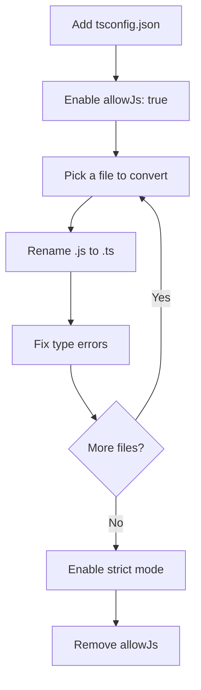

# How to Convert JavaScript to TypeScript (Without Losing Your Mind)

You just inherited a 40,000-line JavaScript codebase. Your tech lead wants it in TypeScript by Q3. And the original developer? Left the company six months ago with zero documentation.

If that sounds familiar, you're not alone. I've been through this exact scenario three times now  twice at startups, once at a mid-size company with a codebase that made me question my career choices. And every single time, the process of converting JavaScript to TypeScript felt like defusing a bomb while someone kept adding new wires.

But here's the thing nobody tells you upfront: it doesn't have to be painful. The teams that struggle with TypeScript migration are almost always the ones that try to do everything at once. The ones that succeed? They have a system. And that's what I'm going to walk you through today  the actual, practical approach to convert JavaScript to TypeScript without burning out your team or breaking production.

## The Two Approaches: Big Bang vs File-by-File

Before you touch a single file, you need to make a decision that'll shape the next few weeks (or months) of your life. There are really only two ways to go about this.

### The Big Bang Approach

This is the "rename everything to `.ts` on a Friday afternoon and fix errors until Monday" strategy. I've seen exactly one team pull this off successfully  and they had a 3,000-line codebase with great test coverage.

For everyone else? Don't do this.

The big bang approach means:
- Rename all `.js` files to `.ts` at once
- Fix every single type error before merging
- Block all other feature work until the migration is done

It sounds efficient in theory. In practice, you end up with a 47,000-line diff that no one can review, merge conflicts from hell, and a team that hates TypeScript before they've even learned it.

### The File-by-File Approach (Do This One)

This is the one that actually works. You convert files one at a time  or in small batches  while the rest of the codebase stays in JavaScript. TypeScript is designed for exactly this scenario. You can have `.ts` and `.js` files living side by side in the same project, and the compiler handles it just fine.

Here's what the file-by-file approach looks like:

1. Add TypeScript to your project alongside JavaScript
2. Configure your `tsconfig.json` to allow JS files
3. Pick a file, rename it from `.js` to `.ts`
4. Fix the type errors in that file
5. Commit and move on
6. Repeat until done

The beauty of this approach is that you can ship features while migrating. No big scary branch. No merge conflict apocalypse. Just steady progress.



## Setting Up Your tsconfig.json for Migration

Your `tsconfig.json` is the control center for your entire migration. Get this wrong, and you'll either see zero type errors (useless) or ten thousand type errors (overwhelming). Here's the configuration I start with on every migration:

```json
{
  "compilerOptions": {
    "target": "ES2020",
    "module": "ESNext",
    "lib": ["ES2020", "DOM", "DOM.Iterable"],
    "allowJs": true,
    "checkJs": false,
    "outDir": "./dist",
    "rootDir": "./src",
    "strict": false,
    "noImplicitAny": false,
    "esModuleInterop": true,
    "skipLibCheck": true,
    "forceConsistentCasingInFileNames": true,
    "resolveJsonModule": true,
    "declaration": true,
    "declarationMap": true,
    "sourceMap": true
  },
  "include": ["src/**/*"],
  "exclude": ["node_modules", "dist"]
}
```

The two critical settings here are `allowJs: true` and `strict: false`. The first one lets JavaScript and TypeScript files coexist. The second one keeps the compiler from screaming at you about every possible type issue on day one.

I know what you're thinking  "but isn't the whole point of TypeScript to be strict?" Yes. Eventually. But trying to go strict on a codebase that's never had types is like trying to run a marathon when you haven't jogged in three years. You'll hurt yourself.

> **Tip:** Set `checkJs: false` initially. If you turn it on, TypeScript will try to type-check your JavaScript files too, and you'll get buried in errors for files you haven't even started migrating yet.

## Which Files to Convert First

This is where most guides just say "start anywhere!" and leave you staring at your `src/` directory with decision paralysis. Here's a more practical order that I've used on multiple projects:

### Tier 1: Utility Files and Constants

Start with files that have no dependencies  or only depend on external packages. Think:
- Config files
- Helper/utility functions
- Constants and enums
- Pure data transformation functions

These files are usually small, have clear inputs and outputs, and give you quick wins. Nothing builds momentum like converting five utility files in an afternoon and seeing zero runtime issues.

```typescript
// Before: utils/formatDate.js
export function formatDate(date, format) {
  // ... formatting logic
}

// After: utils/formatDate.ts
export function formatDate(date: Date, format: string): string {
  // ... formatting logic (unchanged)
}
```

### Tier 2: Data Models and Types

Next up, create your type definitions. This is where TypeScript starts paying dividends. Define interfaces for your core data structures  the user object, the API response shapes, your database models.

```typescript
// types/user.ts
export interface User {
  id: string;
  email: string;
  name: string;
  role: 'admin' | 'editor' | 'viewer';
  createdAt: Date;
  preferences?: UserPreferences;
}

export interface UserPreferences {
  theme: 'light' | 'dark';
  notifications: boolean;
  language: string;
}
```

Once you have your core types defined, every subsequent file conversion gets easier because you're importing real types instead of making them up as you go.

### Tier 3: Services and API Layers

Now convert your API calls, database queries, and business logic. These are the files where TypeScript provides the most value  when you know that `fetchUser()` returns a `Promise<User>` instead of `Promise<any>`, you catch bugs that would've taken hours to debug at runtime.

### Tier 4: Components and Views

If you're working with React, Vue, or another component framework, save the UI layer for last. Components tend to be the most tangled files in any codebase, and by the time you get to them, you'll have typed versions of all the data they consume.

## Handling the `any` Type (Your Temporary Best Friend)

Let's talk about `any`. In a perfect world, you'd never use it. In the real world of migrating a JavaScript codebase, `any` is the pressure valve that keeps the whole project from exploding.

Here's my rule: **use `any` as a stepping stone, never as a destination.**

When you're converting a file and you hit a type that would take 20 minutes to figure out, slap an `any` on it and move on. But  and this is important  leave a comment:

```typescript
// TODO: Type this properly  it's the response shape from the legacy billing API
const billingData: any = await fetchBillingHistory(userId);
```

That `TODO` comment is a promise to your future self. And you can track these. A quick grep for `TODO.*any` tells you exactly how much type debt you're carrying at any point in the migration.

Some teams I've worked with use a stricter version of this  they create a custom type alias:

```typescript
// types/migration.ts
/**
 * Temporary type used during JS-to-TS migration.
 * Grep for MigrationAny to find all instances that need proper typing.
 */
export type MigrationAny = any;
```

Then instead of raw `any`, they use `MigrationAny` everywhere. It makes the migration debt visible and searchable. Kind of clever, honestly.

> **Warning:** Don't let `any` types pile up indefinitely. Set a team rule  maybe every sprint includes converting 5 `any` types to proper types. Otherwise they'll still be there a year from now. Trust me on this.

## Common Gotchas That'll Trip You Up

I've hit every single one of these. Hopefully you can skip the debugging sessions I couldn't.

### Gotcha 1: Implicit `any` in Function Parameters

This is the most common error you'll see. In JavaScript, function parameters don't need types. In TypeScript, they do (once you turn on `noImplicitAny`, at least).

```javascript
// JavaScript  totally fine
function greet(name) {
  return `Hello, ${name}!`;
}
```

```typescript
// TypeScript  error: Parameter 'name' implicitly has an 'any' type
function greet(name) {
  return `Hello, ${name}!`;
}

// Fixed
function greet(name: string): string {
  return `Hello, ${name}!`;
}
```

### Gotcha 2: Object Shapes Without Interfaces

In JavaScript, you just... make objects. In TypeScript, if you pass an object to a function, the compiler needs to know what shape it is.

```typescript
// This won't work without an interface
function processUser(user) {
  console.log(user.name); // What's 'user'? TypeScript doesn't know
}

// Define the shape first
interface UserInput {
  name: string;
  email: string;
}

function processUser(user: UserInput) {
  console.log(user.name); // Now TypeScript knows exactly what 'user' is
}
```

### Gotcha 3: Third-Party Libraries Without Types

Not every npm package ships with TypeScript types. When you import a library and get a "Could not find a declaration file" error, you have three options:

1. **Install the `@types` package**  `npm install @types/lodash --save-dev`
2. **Create a declaration file**  If no `@types` package exists, create a `declarations.d.ts`:

```typescript
// declarations.d.ts
declare module 'some-untyped-library' {
  export function doSomething(input: string): void;
  // Add more declarations as needed
}
```

3. **Use the nuclear option**  `declare module 'some-untyped-library'` without any exports. This gives you `any` for everything. Not great, but it unblocks you.

### Gotcha 4: Dynamic Property Access

JavaScript is incredibly forgiving with object property access. TypeScript is not.

```typescript
const config: Record<string, unknown> = loadConfig();

// JavaScript would be fine with this
const value = config.someProperty.nestedProperty;

// TypeScript wants you to check first
const value = (config.someProperty as Record<string, unknown>)?.nestedProperty;
```

This gets annoying fast, but it's actually catching real bugs. How many times have you hit "Cannot read property of undefined" in production? That's exactly what TypeScript is preventing here.

### Gotcha 5: Enum vs Union Types

If you're coming from JavaScript, you might be tempted to use TypeScript enums for everything. But in many cases, string union types are simpler and produce cleaner output:

```typescript
// Enum approach (generates runtime JavaScript)
enum Status {
  Active = 'active',
  Inactive = 'inactive',
  Pending = 'pending'
}

// Union type approach (zero runtime cost)
type Status = 'active' | 'inactive' | 'pending';
```

I generally prefer union types unless I specifically need the runtime enum object. It's one less thing to reason about.

## Strictness Levels: A Gradual Ramp-Up

Here's the progression I recommend. Each level builds on the last, and you should be comfortable at one level before moving to the next.

| Level | Settings | What It Catches |
|-------|----------|----------------|
| 1. Baseline | `strict: false`, `allowJs: true` | Syntax errors, basic type mismatches |
| 2. No Implicit Any | `noImplicitAny: true` | Missing parameter types, untyped variables |
| 3. Strict Null Checks | `strictNullChecks: true` | Null/undefined access, missing optional chaining |
| 4. Full Strict | `strict: true` | Everything  bind/call/apply types, class property initialization, etc. |

Going from level 1 to level 4 in one shot is the #1 mistake I see teams make. Each level introduces a wave of new errors. If you jump straight to `strict: true` on a codebase with thousands of files, you'll see error counts in the tens of thousands. That's demoralizing, and demoralized teams abandon migrations.

Instead, once all your files are converted to `.ts`, turn on `noImplicitAny` first. Fix those errors. Then turn on `strictNullChecks`. Fix those errors. Then  and only then  flip the full `strict: true` flag.

## Automating What You Can

You don't have to do all of this by hand. There are tools that can handle the tedious parts of converting JavaScript to TypeScript.

For quick one-off conversions or when you want to see what properly typed TypeScript looks like for a specific snippet, [SnipShift's JS to TypeScript converter](https://snipshift.dev/js-to-ts) is genuinely useful. Paste your JavaScript on the left, get typed TypeScript on the right. It uses AI to infer proper interfaces instead of just throwing `any` everywhere  which is what most basic converters do.

For project-wide automation, a few tools worth knowing:

- **ts-migrate** (from Airbnb)  Converts an entire project to TypeScript by adding `any` types everywhere. It's a starting point, not a finish line.
- **TypeStat**  Automatically infers types by analyzing your code and tests. Surprisingly good for utility functions.
- **codemods with jscodeshift**  If you have repetitive patterns to convert, write a codemod. It's a time investment upfront, but it pays off on large codebases.

> **Tip:** Automated tools are great for the mechanical parts  renaming files, adding basic type annotations  but they can't replace human judgment for complex business logic types. Use them as a first pass, then review everything.

## Tracking Migration Progress

On larger projects, you need a way to track how far along the migration is. Here's a dead-simple script I've used on multiple projects:

```bash
#!/bin/bash
# migration-progress.sh

JS_COUNT=$(find src -name "*.js" -not -path "*/node_modules/*" | wc -l)
TS_COUNT=$(find src -name "*.ts" -o -name "*.tsx" -not -path "*/node_modules/*" | wc -l)
TOTAL=$((JS_COUNT + TS_COUNT))
PERCENT=$((TS_COUNT * 100 / TOTAL))

echo "Migration Progress: $PERCENT%"
echo "  TypeScript files: $TS_COUNT"
echo "  JavaScript files: $JS_COUNT"
echo "  Total: $TOTAL"
```

Run this in CI and track it over time. There's something deeply satisfying about watching that percentage tick up week after week. Some teams even put it in their Slack channel  nothing motivates a team like a visible progress bar.

You can also track `any` count:

```bash
ANY_COUNT=$(grep -r ": any" src --include="*.ts" --include="*.tsx" | wc -l)
echo "Remaining 'any' types: $ANY_COUNT"
```

## The Migration Checklist

Before I wrap up, here's the checklist I use on every TypeScript migration. Print it out, tape it to your monitor, whatever works:

**Setup Phase:**
- [ ] Add TypeScript as a dev dependency
- [ ] Create `tsconfig.json` with relaxed settings
- [ ] Ensure build pipeline handles `.ts` files
- [ ] Set `allowJs: true` and `strict: false`

**Conversion Phase:**
- [ ] Convert utility/helper files first
- [ ] Define core interfaces and types
- [ ] Convert services and API layers
- [ ] Convert components and views last
- [ ] Use `any` with TODO comments when stuck
- [ ] Run tests after every batch of conversions

**Hardening Phase:**
- [ ] Enable `noImplicitAny`
- [ ] Enable `strictNullChecks`
- [ ] Replace all `MigrationAny` / temporary `any` types
- [ ] Enable full `strict: true`
- [ ] Remove `allowJs` flag
- [ ] Celebrate

## What About Testing During Migration?

One question I get a lot: "Do I need to rewrite my tests in TypeScript too?"

Short answer: not immediately. If you're using Jest, it works fine with a mix of `.js` and `.ts` test files. Convert your source code first, then migrate tests later. But here's the thing  once your source is typed, your tests actually become easier to write because your IDE autocompletes everything.

If you're curious about specific patterns for typing React components during migration, check out our guide on [JSX to TSX conversion](/blog/jsx-to-tsx-react-typescript)  it covers props interfaces, event handlers, and all the React-specific typing patterns.

And if you're dealing with a really large codebase (50k+ lines), we've written a detailed case study on [migrating a large JavaScript codebase to TypeScript](/blog/large-typescript-migration) that covers team coordination, timeline planning, and the tooling that makes it manageable.

## The Honest Truth About TypeScript Migration

Converting JavaScript to TypeScript isn't technically hard. The types are learnable. The tooling is mature. The compiler errors are (usually) helpful.

What makes it hard is the discipline. It's a marathon, not a sprint. You'll have days where you convert ten files before lunch and feel like a TypeScript god. And you'll have days where a single file with deeply nested callbacks and dynamic property access takes the entire afternoon.

The teams that succeed are the ones that commit to steady progress over perfection. Convert a few files each sprint. Track your progress. Don't let `any` types accumulate. And gradually increase strictness as your team's comfort grows.

Six months from now, you'll open a file, see full type safety and IDE autocomplete for everything, and wonder how you ever wrote JavaScript without it. That moment makes the whole migration worth it.

If you want to speed things up, try [converting a few files with SnipShift](https://snipshift.dev/js-to-ts) to see what the typed version should look like  it's a great way to learn TypeScript patterns while migrating.

For a step-by-step migration framework you can follow sprint by sprint, check out our [TypeScript Migration Strategy](/blog/typescript-migration-strategy) guide next. And if you're still on the fence about whether the migration is worth the effort, [here's why every JavaScript project should adopt TypeScript in 2026](/blog/why-use-typescript-2026).
