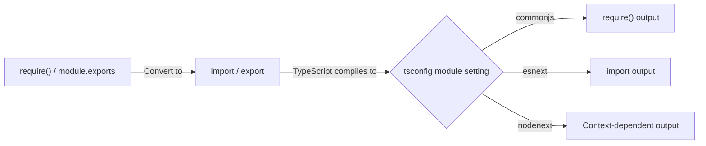

# How to Convert require() to import in TypeScript

If you're migrating a Node.js codebase to TypeScript, one of the first things you'll hit is the module system. Your JavaScript files are full of `require()` and `module.exports`. TypeScript wants `import` and `export`. And the conversion isn't always as simple as find-and-replace.

I've done this conversion on three different Node.js projects, and there are a few patterns that cover about 95% of the cases you'll encounter. Here's how to convert require to import in TypeScript  the quick version, with the gotchas you need to watch for.

## CommonJS vs ES Modules: The Quick Version

**CommonJS** is what Node.js has used since the beginning:

```javascript
// Importing
const express = require('express');
const { readFile } = require('fs');
const utils = require('./utils');

// Exporting
module.exports = { createApp, startServer };
module.exports.helper = helperFunction;
```

**ES Modules** is the modern standard that TypeScript uses:

```typescript
// Importing
import express from 'express';
import { readFile } from 'fs';
import utils from './utils';

// Exporting
export { createApp, startServer };
export function helper() { /* ... */ }
```

TypeScript compiles ES Module syntax down to whatever your `tsconfig.json` targets  CommonJS, ESNext, or something else. So you write `import`/`export`, and TypeScript handles the rest.



## The Conversion Patterns

### Pattern 1: Default Import

```javascript
// CommonJS
const express = require('express');
```

```typescript
// ES Module
import express from 'express';
```

This works when the package has a default export. Most npm packages do. Make sure you have `"esModuleInterop": true` in your `tsconfig.json`  without it, you'd need the uglier `import * as express from 'express'` syntax.

### Pattern 2: Named Imports (Destructured require)

```javascript
// CommonJS
const { readFile, writeFile } = require('fs');
const { Router } = require('express');
```

```typescript
// ES Module
import { readFile, writeFile } from 'fs';
import { Router } from 'express';
```

This is the cleanest conversion  almost 1:1. Destructured `require` maps directly to named imports.

### Pattern 3: Full Module Import

```javascript
// CommonJS
const path = require('path');
// Used as: path.join(), path.resolve()
```

```typescript
// ES Module  two options

// Option A: Default import (with esModuleInterop)
import path from 'path';

// Option B: Namespace import
import * as path from 'path';
```

Both work. I prefer Option A because it's cleaner, but Option B is technically more "correct" for modules that don't have a real default export. If you run into issues with Option A, try Option B.

### Pattern 4: module.exports to export

```javascript
// CommonJS  single default export
module.exports = function createApp() {
  // ...
};
```

```typescript
// ES Module
export default function createApp() {
  // ...
}
```

```javascript
// CommonJS  multiple named exports
module.exports = {
  createApp,
  startServer,
  DEFAULT_PORT,
};
```

```typescript
// ES Module
export { createApp, startServer, DEFAULT_PORT };

// Or export each one individually (often cleaner):
export function createApp() { /* ... */ }
export function startServer() { /* ... */ }
export const DEFAULT_PORT = 3000;
```

I generally prefer individual `export` declarations over a single `export {}` block. It makes it clear at a glance which functions are exported without scrolling to the bottom of the file.

### Pattern 5: Mixed exports (the tricky one)

Some CommonJS files do both `module.exports` and `module.exports.something`:

```javascript
// CommonJS  mixed pattern
function createApp() { /* ... */ }
createApp.defaultConfig = { port: 3000 };
module.exports = createApp;
```

This pattern doesn't have a clean ES Module equivalent. The closest is:

```typescript
// ES Module
function createApp() { /* ... */ }

// Attach the property for backward compat
createApp.defaultConfig = { port: 3000 };

export default createApp;
```

Or better yet, refactor it:

```typescript
export function createApp() { /* ... */ }
export const defaultConfig = { port: 3000 };
```

> **Tip:** If you encounter this mixed pattern a lot, it's a sign the original code was using CommonJS-specific tricks. Take the opportunity to clean up the API when converting  it's one of the benefits of migration.

## Handling Dynamic require()

This is the one case where the conversion gets genuinely tricky. CommonJS `require()` is dynamic  you can call it anywhere, conditionally, with computed paths:

```javascript
// Dynamic require  CommonJS allows this
const plugin = require(`./plugins/${pluginName}`);

// Conditional require
let sharp;
try {
  sharp = require('sharp');
} catch {
  sharp = null; // Optional dependency
}
```

ES Modules don't support this with `import` statements (they must be at the top level with static paths). Instead, use dynamic `import()`:

```typescript
// Dynamic import  returns a Promise
const plugin = await import(`./plugins/${pluginName}`);

// Conditional import
let sharp: typeof import('sharp') | null;
try {
  sharp = await import('sharp');
} catch {
  sharp = null;
}
```

The key difference: `import()` is asynchronous. It returns a `Promise`. If your code was synchronous before, you'll need to make the containing function `async`. This can cascade  one dynamic require can force several functions up the call chain to become async.

| CommonJS | ES Module | Notes |
|----------|-----------|-------|
| `require('x')` | `import x from 'x'` | Static, top of file |
| `const { a } = require('x')` | `import { a } from 'x'` | Named import |
| `require('./x.json')` | `import x from './x.json'` | Enable `resolveJsonModule` |
| `require(dynamicPath)` | `await import(dynamicPath)` | Async, returns Promise |
| `module.exports = x` | `export default x` | Default export |
| `module.exports.a = x` | `export const a = x` | Named export |
| `exports.a = x` | `export const a = x` | Named export (shorthand) |

## The esModuleInterop Flag

This `tsconfig.json` flag is crucial for migration. Without it, you'd need to write:

```typescript
// Without esModuleInterop
import * as express from 'express';
import * as React from 'react';
```

With it enabled:

```typescript
// With esModuleInterop
import express from 'express';
import React from 'react';
```

Always enable this. There's virtually no reason not to. Add it to your `tsconfig.json`:

```json
{
  "compilerOptions": {
    "esModuleInterop": true,
    "allowSyntheticDefaultImports": true
  }
}
```

`allowSyntheticDefaultImports` is technically a separate flag, but `esModuleInterop` implies it. I like being explicit about both.

## JSON Imports

If your code does `const config = require('./config.json')`, enable `resolveJsonModule`:

```json
{
  "compilerOptions": {
    "resolveJsonModule": true
  }
}
```

Then:

```typescript
import config from './config.json';
// TypeScript automatically types this based on the JSON content!
// config.port is number, config.host is string, etc.
```

This is actually one of the nicest TypeScript features  it reads your JSON file and generates types from it automatically. No interface needed.

## Automating the Conversion

For a large codebase, manually converting every `require` to `import` is tedious. You have a few options:

1. **Your IDE's refactoring tools.** VS Code can often auto-fix `require` to `import`  right-click on the `require` statement and look for "Convert to ES Module."

2. **[SnipShift's converter](https://snipshift.dev/js-to-ts)** handles require-to-import conversion along with the rest of the JS-to-TS migration. Paste your CommonJS file, get back an ES Module TypeScript file.

3. **Codemods** with `jscodeshift`  useful if you have hundreds of files to convert and want a fully automated approach.

For most projects, the IDE's built-in refactoring is enough. For large projects, a codemod pays for itself quickly.

## Quick Checklist

Before you start converting:

- [ ] Enable `esModuleInterop: true` in tsconfig
- [ ] Enable `resolveJsonModule: true` if you import JSON files
- [ ] Set `module` to `"ESNext"` or `"NodeNext"` in tsconfig
- [ ] Convert `require()` → `import` (static imports first)
- [ ] Convert `module.exports` → `export` / `export default`
- [ ] Convert dynamic `require()` → `await import()` (handle async)
- [ ] Run tests after each batch of conversions

The module conversion is usually one of the first steps in a TypeScript migration, and once it's done, everything else gets easier. For the full migration process  including typing, strictness levels, and project setup  check out our [complete JavaScript to TypeScript conversion guide](/blog/convert-javascript-to-typescript).
