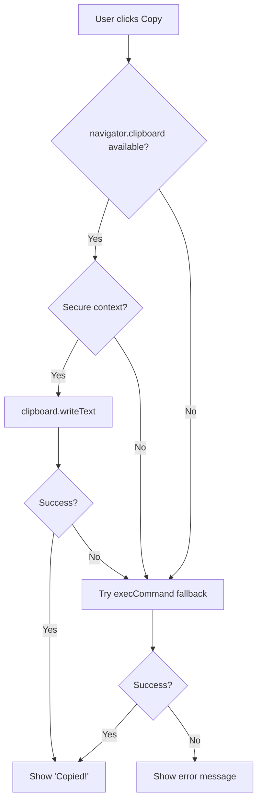

# How to Implement Copy to Clipboard in React (With Fallback)

Copy to clipboard sounds like it should be a one-liner. And with the modern Clipboard API, it almost is. But then you test it in an iframe, or over HTTP in development, or in a slightly older browser  and it silently fails.

I've shipped copy-to-clipboard in probably a dozen projects, and the version I keep coming back to handles the happy path, the fallback, the permissions edge case, and gives the user feedback with a "Copied!" state that auto-resets. Here's how to build it from scratch  and then wrap it in a clean custom hook.

## The Modern Way: navigator.clipboard

The Clipboard API is the right approach for modern browsers. It's async, promise-based, and works in all current browsers (Chrome, Firefox, Safari, Edge):

```typescript
async function copyToClipboard(text: string): Promise<boolean> {
  try {
    await navigator.clipboard.writeText(text);
    return true;
  } catch (err) {
    console.error('Clipboard API failed:', err);
    return false;
  }
}
```

Simple. But there's a catch  `navigator.clipboard` requires a **secure context** (HTTPS or localhost). If your site is served over plain HTTP, or the code runs inside certain iframes, the API isn't available and you'll get an error. Some browsers also require the document to be focused.

That's where the fallback comes in.

## The Fallback: document.execCommand (Old Browsers)

For environments where the Clipboard API isn't available, the classic `execCommand('copy')` approach still works. It's been deprecated for years, but browsers still support it because so much of the web relies on it.

```typescript
function fallbackCopyToClipboard(text: string): boolean {
  const textArea = document.createElement('textarea');

  // Make the textarea invisible but part of the document
  textArea.value = text;
  textArea.style.position = 'fixed';
  textArea.style.left = '-9999px';
  textArea.style.top = '-9999px';
  textArea.style.opacity = '0';

  document.body.appendChild(textArea);
  textArea.focus();
  textArea.select();

  let success = false;
  try {
    success = document.execCommand('copy');
  } catch (err) {
    console.error('execCommand copy failed:', err);
  }

  document.body.removeChild(textArea);
  return success;
}
```

It's ugly  creating a hidden textarea, selecting its content, and executing a copy command. But it works in edge cases where the modern API doesn't.

## Combined: Copy with Automatic Fallback

Here's the combined version that tries the modern API first and falls back gracefully:

```typescript
async function copyWithFallback(text: string): Promise<boolean> {
  // Try the modern Clipboard API first
  if (navigator.clipboard && window.isSecureContext) {
    try {
      await navigator.clipboard.writeText(text);
      return true;
    } catch {
      // Fall through to fallback
    }
  }

  // Fallback for older browsers or insecure contexts
  return fallbackCopyToClipboard(text);
}
```



## The Custom Hook: useCopyToClipboard

Now let's wrap this into a proper React hook with a "copied" state that auto-resets after a timeout. This is the version I actually use in production:

```typescript
import { useState, useCallback, useRef } from 'react';

interface UseCopyToClipboardReturn {
  copied: boolean;
  copy: (text: string) => Promise<boolean>;
  error: string | null;
}

function useCopyToClipboard(
  resetDelay: number = 2000
): UseCopyToClipboardReturn {
  const [copied, setCopied] = useState(false);
  const [error, setError] = useState<string | null>(null);
  const timeoutRef = useRef<ReturnType<typeof setTimeout> | null>(null);

  const copy = useCallback(
    async (text: string): Promise<boolean> => {
      // Clear any existing timeout
      if (timeoutRef.current) {
        clearTimeout(timeoutRef.current);
      }

      setError(null);

      let success = false;

      // Try modern Clipboard API
      if (navigator.clipboard && window.isSecureContext) {
        try {
          await navigator.clipboard.writeText(text);
          success = true;
        } catch (err) {
          // Will try fallback below
        }
      }

      // Fallback
      if (!success) {
        try {
          const textArea = document.createElement('textarea');
          textArea.value = text;
          textArea.style.position = 'fixed';
          textArea.style.left = '-9999px';
          textArea.style.opacity = '0';
          document.body.appendChild(textArea);
          textArea.select();
          success = document.execCommand('copy');
          document.body.removeChild(textArea);
        } catch (err) {
          setError('Failed to copy to clipboard');
          return false;
        }
      }

      if (success) {
        setCopied(true);
        timeoutRef.current = setTimeout(() => {
          setCopied(false);
        }, resetDelay);
      } else {
        setError('Copy command failed');
      }

      return success;
    },
    [resetDelay]
  );

  return { copied, copy, error };
}
```

A few things to notice about this hook:

- **`copied` auto-resets**  After `resetDelay` milliseconds (default 2 seconds), `copied` flips back to `false`. Your button goes from "Copied!" back to "Copy" automatically.
- **`timeoutRef`**  We track the timeout so we can clear it if the user clicks copy again before it resets. Without this, rapid clicks cause weird timing issues.
- **`error` state**  If both the modern API and the fallback fail (rare but possible  usually a permissions issue), the hook reports why.

## Using the Hook in a Component

Here's a typical copy button using the hook:

```typescript
function CopyButton({ text }: { text: string }) {
  const { copied, copy, error } = useCopyToClipboard();

  return (
    <div>
      <button
        onClick={() => copy(text)}
        className={`px-3 py-1.5 rounded text-sm font-medium transition-colors ${
          copied
            ? 'bg-green-100 text-green-800'
            : 'bg-gray-100 text-gray-700 hover:bg-gray-200'
        }`}
      >
        {copied ? 'Copied!' : 'Copy'}
      </button>
      {error && <p className="text-red-500 text-xs mt-1">{error}</p>}
    </div>
  );
}
```

And a code block with a copy button  the kind you'd see on a docs site or tool like [SnipShift](https://snipshift.dev/js-to-ts):

```typescript
function CodeBlock({ code, language }: { code: string; language: string }) {
  const { copied, copy } = useCopyToClipboard(3000);

  return (
    <div className="relative group">
      <pre className="p-4 bg-gray-900 rounded-lg overflow-x-auto">
        <code className={`language-${language}`}>{code}</code>
      </pre>
      <button
        onClick={() => copy(code)}
        className="absolute top-2 right-2 opacity-0 group-hover:opacity-100
                   transition-opacity px-2 py-1 bg-gray-700 text-white
                   rounded text-xs"
      >
        {copied ? 'Copied!' : 'Copy'}
      </button>
    </div>
  );
}
```

## Handling Permissions

In some browsers (notably Firefox), `navigator.clipboard.writeText` requires the user to have recently interacted with the page. Calling it from a `setTimeout` or a background process might fail with a permissions error.

The general rule: always trigger clipboard writes from a direct user interaction  a click handler, a keyboard shortcut. Don't try to copy something automatically when a page loads or when an async operation completes.

```typescript
// Good: Direct user interaction
<button onClick={() => copy(text)}>Copy</button>

// Bad: No direct user interaction
useEffect(() => {
  // This might fail with a permissions error in some browsers
  navigator.clipboard.writeText(generatedCode);
}, [generatedCode]);
```

If you absolutely need to copy without a direct click (rare, but it happens), the `execCommand` fallback is more permissive about this  but that's a hack, not a pattern to rely on.

> **Tip:** When a copy operation fails silently, it's usually because the document isn't focused (user switched tabs) or the clipboard write wasn't triggered by a user gesture. Always provide visual feedback so the user knows whether the copy worked.

## Why Not Use a Library?

You could install `copy-to-clipboard` from npm or use `react-copy-to-clipboard`. They're fine. But the entire implementation is about 30 lines of code  and now you understand exactly what's happening under the hood. One fewer dependency, zero magic.

If you're building a lot of custom hooks like this and want to make sure your TypeScript return types are right, check out our guide on [typing custom hook returns in TypeScript](/blog/type-custom-hook-return-typescript). And for more React + TypeScript patterns with event handlers (like the `onClick` in the copy button), see [React TypeScript event handlers](/blog/react-typescript-event-handlers).

Clipboard access is one of those APIs that seems like it should "just work"  and it mostly does, as long as you handle the edge cases. The hook above does exactly that.
