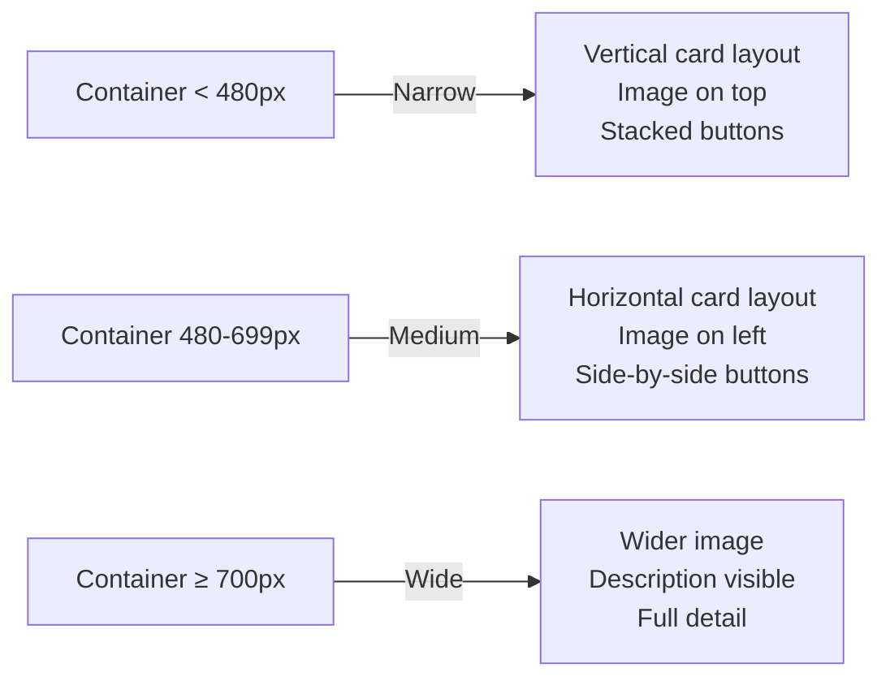

# CSS Container Queries: The Feature That Changes Everything

For years, we've been hacking around the same fundamental problem: media queries respond to the **viewport**, but components live inside **containers**. A card component doesn't care about the browser window size  it cares about how much space *it* has.

I can't count how many times I've built a responsive card that looks great in the main content area but completely breaks when someone drops it into a sidebar. The card doesn't know it's in a sidebar. Media queries can't tell it. So you end up writing `.sidebar .card` overrides, or passing size props through JavaScript, or doing some other awkward workaround.

CSS container queries fix this. For real. And now that browser support has caught up, there's no reason not to use them.

## What Container Queries Actually Solve

Here's the core problem, visualized:

```
Viewport: 1200px wide
┌──────────────────────────────────────────────────┐
│ ┌────────────────────────────┐ ┌──────────────┐  │
│ │     Main Content (800px)   │ │ Sidebar      │  │
│ │                            │ │ (350px)      │  │
│ │  ┌──────────────────────┐  │ │              │  │
│ │  │  Card looks great ✓  │  │ │ ┌──────────┐ │  │
│ │  └──────────────────────┘  │ │ │ Same card │ │  │
│ │                            │ │ │ BROKEN ✗  │ │  │
│ └────────────────────────────┘ │ └──────────┘ │  │
│                                └──────────────┘  │
└──────────────────────────────────────────────────┘
```

With media queries, both cards get the same styles because the viewport is the same. With container queries, each card responds to **its parent container's size**. The sidebar card knows it's in a 350px container and adjusts accordingly.

## The Syntax

Container queries have two parts: declaring a containment context on the parent, and writing `@container` rules for the children.

### Step 1: Define the Container

```css
.card-wrapper {
  container-type: inline-size;
  container-name: card;
}
```

- **`container-type: inline-size`**  tells the browser to track this element's inline size (width in horizontal writing modes) for container queries. This is the most common value.
- **`container-name: card`**  gives the container a name so you can target it specifically. Optional, but useful when you have nested containers.

You can also use the shorthand:

```css
.card-wrapper {
  container: card / inline-size;
}
```

### Step 2: Query the Container

```css
@container card (min-width: 500px) {
  .card {
    display: grid;
    grid-template-columns: 200px 1fr;
    gap: 1rem;
  }
}

@container card (max-width: 499px) {
  .card {
    display: flex;
    flex-direction: column;
  }

  .card-image {
    aspect-ratio: 16 / 9;
    width: 100%;
  }
}
```

Look familiar? It should  the syntax is intentionally similar to `@media`. But instead of querying the viewport, you're querying the nearest ancestor with `container-type` set.

If you skip the container name, the query matches the **nearest containment context**:

```css
@container (min-width: 500px) {
  /* Matches whatever the closest container ancestor is */
}
```

## container-type Values

| Value | What It Does | When to Use |
|-------|-------------|-------------|
| `inline-size` | Enables queries on the inline axis (width) | Most common  90% of use cases |
| `size` | Enables queries on both inline and block axes | When you need height-based queries too |
| `normal` | Default  no containment | Element is not a query container |

A heads up: `container-type: size` establishes containment on both axes, which means the element can't derive its height from its children anymore. This can cause the element to collapse to zero height unless you explicitly set a height. For this reason, `inline-size` is almost always what you want.

## Container Query Units

This is a feature that kind of flew under the radar. Container queries come with their own length units:

```css
.card-title {
  font-size: clamp(1rem, 3cqi, 1.5rem);
}
```

| Unit | Meaning |
|------|---------|
| `cqw` | 1% of container's width |
| `cqh` | 1% of container's height |
| `cqi` | 1% of container's inline size |
| `cqb` | 1% of container's block size |
| `cqmin` | Smaller of `cqi` and `cqb` |
| `cqmax` | Larger of `cqi` and `cqb` |

These are incredibly useful for fluid typography and spacing that scales with the container, not the viewport. If you're into that sort of thing, our post on [responsive CSS without media queries](/blog/responsive-css-without-media-queries) covers `clamp()` and fluid sizing in depth.

## Real-World Example: A Product Card

Let me show you a practical component that adapts to its container. This is based on a pattern from a project I worked on last year.

```css
.product-grid {
  container-type: inline-size;
  container-name: products;
}

.product-card {
  display: flex;
  flex-direction: column;
  border: 1px solid #e2e8f0;
  border-radius: 0.5rem;
  overflow: hidden;
}

.product-image {
  width: 100%;
  aspect-ratio: 4 / 3;
  object-fit: cover;
}

.product-info {
  padding: 1rem;
}

.product-actions {
  display: flex;
  flex-direction: column;
  gap: 0.5rem;
  padding: 0 1rem 1rem;
}

/* When container is wide enough, go horizontal */
@container products (min-width: 480px) {
  .product-card {
    flex-direction: row;
  }

  .product-image {
    width: 200px;
    aspect-ratio: 1;
  }

  .product-actions {
    flex-direction: row;
    margin-top: auto;
  }
}

/* When container is really wide, add more detail */
@container products (min-width: 700px) {
  .product-image {
    width: 280px;
  }

  .product-description {
    display: block; /* Hidden by default */
  }
}
```



Drop this card into a full-width content area? It goes horizontal with all the details. Drop it into a 300px sidebar? It stacks vertically and hides the description. Same component, zero parent-specific overrides.

## Container Queries vs Media Queries

Let me be clear  container queries don't replace media queries. They solve different problems.

| Aspect | Media Queries | Container Queries |
|--------|--------------|-------------------|
| **Responds to** | Viewport size | Container size |
| **Best for** | Page-level layout changes | Component-level adaptation |
| **Reusability** | Components tied to viewport context | Components work anywhere |
| **Nesting** | N/A  viewport is global | Can nest containers |
| **Units** | `vw`, `vh`, `vmin`, `vmax` | `cqw`, `cqh`, `cqi`, `cqb` |

My rule of thumb: use media queries for macro layout  sidebar shows/hides, nav collapses to hamburger, grid columns change. Use container queries for micro layout  how a card, widget, or component arranges its own internals.

In practice, most projects need both. The page layout responds to the viewport with media queries (or better yet, with CSS Grid's `auto-fill`  [no media queries needed](/blog/responsive-css-without-media-queries)). Individual components respond to their containers.

## Browser Support

As of early 2026, `@container` queries with `container-type: inline-size` are supported in all major browsers  Chrome, Firefox, Safari, and Edge. Global support sits around 93-95%, which is solid for progressive enhancement.

Container query units (`cqi`, `cqw`, etc.) have slightly lower but still strong support. The newer container style queries (`@container style(--theme: dark)`) are more experimental  Chrome has them, but Firefox and Safari are still working on full support.

> **Tip:** For older browser fallback, your base styles (outside `@container` rules) should be the mobile/narrow layout. Container queries then enhance for wider containers. This way, unsupported browsers get the compact layout, which is usually a reasonable default.

## Common Gotchas

A few things that tripped me up when I first started using container queries:

**1. Container can't size itself based on its children.** When you set `container-type: inline-size`, the browser needs to know the container's size *before* laying out children. So the container's width must come from its own context (parent, grid track, explicit width), not from its content.

**2. You can't query a container from within itself.** The `@container` rules apply to *descendants* of the container, not the container element itself.

**3. Named vs unnamed queries.** If you have nested containers and don't name them, `@container` will match the nearest ancestor container. This can cause confusing behavior. Name your containers when nesting.

## Putting It Into Practice

If you're converting existing CSS that uses media queries for component-level responsiveness, container queries are a natural upgrade. And if you're migrating those styles to Tailwind, [SnipShift's CSS to Tailwind converter](https://snipshift.dev/css-to-tailwind) supports container query classes too  Tailwind v3.2+ has `@container` support built in.

Container queries fundamentally shift how we think about responsive design. Instead of asking "how wide is the screen?", you ask "how wide is my space?" And that question leads to components that are genuinely portable  drop them anywhere, and they just work.

Pair container queries with the [CSS `:has()` selector](/blog/css-has-selector-guide) and [custom properties for theming](/blog/css-custom-properties-guide), and you've got a toolkit that handles things we used to need JavaScript for. Modern CSS is kind of incredible.

For more CSS tools and developer utilities, visit [SnipShift.dev](https://snipshift.dev).
