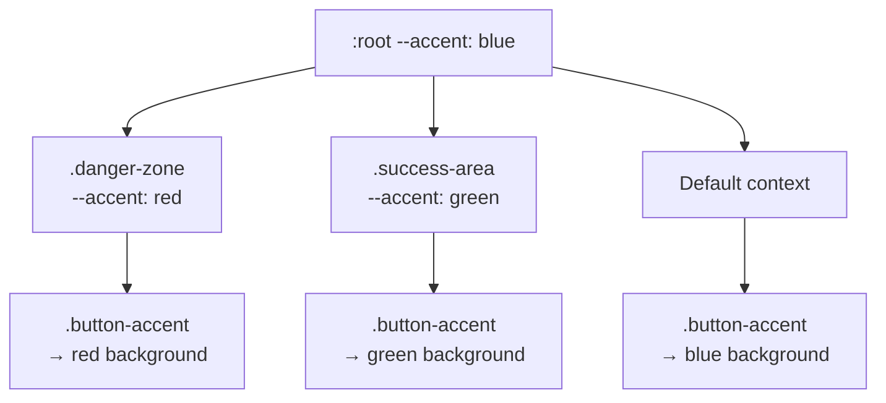

# CSS Custom Properties (Variables): The Complete Guide

I'll be honest  when CSS custom properties first shipped, I thought they were just a native version of Sass variables. Define a value once, reuse it everywhere, done.

I was wrong. CSS custom properties are fundamentally different from preprocessor variables, and once that clicks, they unlock patterns that Sass literally can't do. They cascade. They inherit. They can be changed at runtime with JavaScript. They can be scoped to specific elements. They're reactive.

This is the guide I wish I'd had when I started using them seriously about four years ago.

## The Basics: Syntax and Scoping

Define a custom property with `--` prefix, use it with `var()`:

```css
:root {
  --color-primary: #3b82f6;
  --color-text: #1e293b;
  --spacing-md: 1rem;
  --font-body: 'Inter', system-ui, sans-serif;
}

.button {
  background-color: var(--color-primary);
  color: white;
  padding: var(--spacing-md);
  font-family: var(--font-body);
}
```

`:root` is the most common place to define them  it targets the `<html>` element, so the variables are available everywhere via inheritance. But you can define them on *any* selector.

### Scoped Variables

This is where custom properties start to separate from Sass variables:

```css
.card {
  --card-padding: 1.5rem;
  --card-radius: 0.5rem;
  padding: var(--card-padding);
  border-radius: var(--card-radius);
}

.card.compact {
  --card-padding: 0.75rem;
  --card-radius: 0.25rem;
  /* No need to redeclare padding or border-radius */
}
```

When you change the variable's value on `.card.compact`, every property that references it updates automatically. You're not overriding the styles  you're changing the input, and the output follows. This is a subtle but powerful distinction.

## Fallback Values

The second argument to `var()` is a fallback:

```css
.element {
  color: var(--text-color, #333);
  padding: var(--element-padding, var(--spacing-md, 1rem));
}
```

The fallback kicks in when the variable isn't defined in the current cascade. You can even nest `var()` calls  the second example tries `--element-padding`, then falls back to `--spacing-md`, then to `1rem`.

> **Tip:** Fallbacks are great for component libraries. Ship components with sensible defaults, but let consumers override them by defining the variables in their own CSS.

## Cascading and Inheritance: The Superpower

Here's what Sass can't do. Custom properties follow the CSS cascade and inheritance rules, which means you can override them at any level of the DOM:

```css
:root {
  --accent: #3b82f6;  /* Blue globally */
}

.danger-zone {
  --accent: #ef4444;  /* Red in this section */
}

.success-area {
  --accent: #22c55e;  /* Green here */
}

/* This button uses whatever --accent is in its context */
.button-accent {
  background: var(--accent);
  color: white;
}
```

Same button component, three different colors, zero additional CSS rules for the button itself. The button just reads from its context. Drop it inside `.danger-zone` and it's red. Drop it inside `.success-area` and it's green. This is how theming should work.



## Theming with Custom Properties

This is probably the most common real-world use. Define your design tokens as custom properties, then swap entire themes by overriding a handful of variables.

```css
:root {
  /* Light theme (default) */
  --bg-primary: #ffffff;
  --bg-secondary: #f8fafc;
  --text-primary: #0f172a;
  --text-secondary: #64748b;
  --border-color: #e2e8f0;
  --shadow: 0 1px 3px rgba(0, 0, 0, 0.1);
}

[data-theme="dark"] {
  --bg-primary: #0f172a;
  --bg-secondary: #1e293b;
  --text-primary: #f1f5f9;
  --text-secondary: #94a3b8;
  --border-color: #334155;
  --shadow: 0 1px 3px rgba(0, 0, 0, 0.4);
}
```

Every component in your app that uses these variables automatically adapts when the `data-theme` attribute changes. No class toggling on individual elements, no duplicated rulesets.

If you want a full implementation with JavaScript toggle and system preference detection, check out our guide on [building a dark mode toggle with CSS and JavaScript](/blog/dark-mode-toggle-css-javascript).

## Using calc() with Custom Properties

Custom properties work beautifully with `calc()` for derived values:

```css
:root {
  --base-size: 1rem;
  --scale-ratio: 1.25;
}

.text-sm { font-size: calc(var(--base-size) / var(--scale-ratio)); }
.text-base { font-size: var(--base-size); }
.text-lg { font-size: calc(var(--base-size) * var(--scale-ratio)); }
.text-xl { font-size: calc(var(--base-size) * var(--scale-ratio) * var(--scale-ratio)); }
```

Change `--base-size` or `--scale-ratio`, and your entire type scale recalculates. This is the same concept behind fluid typography systems  define the inputs, let CSS compute the outputs.

You can build responsive spacing systems the same way:

```css
:root {
  --space-unit: 0.25rem;
}

.p-1 { padding: var(--space-unit); }
.p-2 { padding: calc(var(--space-unit) * 2); }
.p-4 { padding: calc(var(--space-unit) * 4); }
.p-8 { padding: calc(var(--space-unit) * 8); }
```

## Animating Custom Properties

You can transition and animate custom properties, but there's a catch  you need to tell the browser the type with `@property`:

```css
@property --gradient-angle {
  syntax: "<angle>";
  initial-value: 0deg;
  inherits: false;
}

.gradient-border {
  --gradient-angle: 0deg;
  border: 3px solid transparent;
  background:
    linear-gradient(white, white) padding-box,
    linear-gradient(var(--gradient-angle), #3b82f6, #8b5cf6) border-box;
  transition: --gradient-angle 0.5s;
}

.gradient-border:hover {
  --gradient-angle: 180deg;
}
```

Without `@property`, the browser doesn't know that `--gradient-angle` is an angle and can't interpolate it. The `@property` rule is what makes smooth transitions possible for custom properties.

> **Warning:** `@property` support is solid in Chrome and Edge but was only recently added in Firefox and Safari. Test in your target browsers before relying on it for critical animations.

## JavaScript Access

Reading and writing custom properties from JavaScript is simple:

```javascript
// Read a custom property value
const root = document.documentElement;
const primaryColor = getComputedStyle(root)
  .getPropertyValue('--color-primary')
  .trim();

// Set a custom property value
root.style.setProperty('--color-primary', '#8b5cf6');

// Set on a specific element
const card = document.querySelector('.card');
card.style.setProperty('--card-padding', '2rem');

// Remove an inline custom property
card.style.removeProperty('--card-padding');
```

This JavaScript bridge is what makes custom properties genuinely reactive. You can update a single variable and watch the whole UI respond  perfect for user preferences, dynamic themes, scroll-driven effects, or anything that needs runtime style changes.

A team I worked with used this pattern to let users customize their dashboard: color picker → `setProperty` → entire UI updates. No class toggling, no style recalculation beyond what CSS handles natively.

## Practical Pattern: Component API

One pattern I've grown to love is treating custom properties as a component's public API:

```css
.alert {
  --alert-bg: var(--color-info-bg, #eff6ff);
  --alert-border: var(--color-info-border, #3b82f6);
  --alert-text: var(--color-info-text, #1e40af);

  background: var(--alert-bg);
  border-left: 4px solid var(--alert-border);
  color: var(--alert-text);
  padding: 1rem 1.25rem;
  border-radius: 0.375rem;
}

.alert-danger {
  --alert-bg: #fef2f2;
  --alert-border: #ef4444;
  --alert-text: #991b1b;
}

.alert-success {
  --alert-bg: #f0fdf4;
  --alert-border: #22c55e;
  --alert-text: #166534;
}
```

The base `.alert` class defines the structure and pulls colors from custom properties with fallbacks. Variants just change the variables. It's clean, it's maintainable, and it makes it trivially easy to add new variants.

If you're working with this kind of CSS and want to convert it to Tailwind utility classes, [SnipShift's CSS to Tailwind converter](https://snipshift.dev/css-to-tailwind) preserves custom property references in the output  so you don't lose your variable-based theming.

## Media Queries + Custom Properties

Here's a pattern that's underused. You can redefine custom properties inside media queries to create responsive design tokens:

```css
:root {
  --content-width: 100%;
  --grid-columns: 1;
  --heading-size: 1.5rem;
}

@media (min-width: 768px) {
  :root {
    --content-width: 720px;
    --grid-columns: 2;
    --heading-size: 2rem;
  }
}

@media (min-width: 1200px) {
  :root {
    --content-width: 1140px;
    --grid-columns: 3;
    --heading-size: 2.5rem;
  }
}
```

Now every component that uses these variables adapts to breakpoints automatically. You're writing your responsive logic once, at the token level, instead of scattering media queries across dozens of component files. I adopted this pattern about two years ago and it cut our responsive CSS in half. For even more modern approaches, take a look at our post on [responsive CSS without media queries](/blog/responsive-css-without-media-queries) using `clamp()` and intrinsic sizing.

## Common Mistakes

**1. Using custom properties as a Sass replacement.** If you just need build-time constants, a preprocessor is fine. Custom properties shine when you need runtime flexibility  theming, responsive values, JS interaction. Don't add the overhead of `var()` everywhere if you're never going to change the values.

**2. Forgetting that invalid values don't trigger fallbacks.** If `--color` is set to `banana`, `var(--color)` returns `banana`  it doesn't fall back. The fallback only applies when the variable is *not defined at all*. This trips people up.

**3. Not providing fallbacks in shared components.** If your component assumes `--color-primary` exists but a consumer doesn't define it, the property is invalid and the declaration is ignored entirely. Always provide fallbacks in components that might be used outside your design system.

## Custom Properties Are CSS's Best Feature

I don't say that lightly. Custom properties changed how I write CSS more than Flexbox did, more than Grid did. The ability to create dynamic, contextual, themeable styles with zero JavaScript dependency (until you need runtime changes) is transformative.

Combine them with [CSS container queries](/blog/css-container-queries-guide) for component-level responsiveness and the [`:has()` selector](/blog/css-has-selector-guide) for parent-aware styling, and you've got a CSS feature set that handles things we needed entire JavaScript libraries for just a few years ago.

For more CSS tools and developer converters, browse the collection at [SnipShift.dev](https://snipshift.dev).
