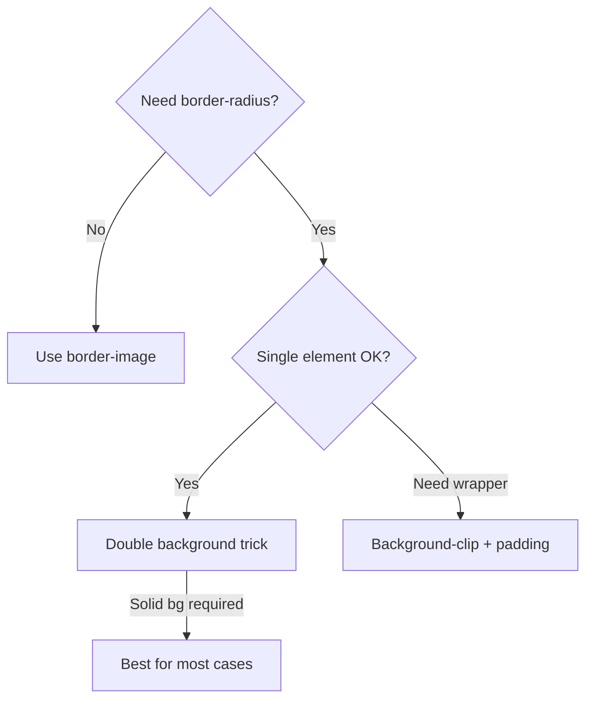

# How to Create a CSS Gradient Border (Not as Simple as You'd Think)

You'd think applying a gradient to a border would be one line of CSS. It's not. There's no `border-color: linear-gradient(...)`  that just doesn't work. The `border-color` property only accepts solid colors.

I've run into this on probably a dozen projects. Cards with gradient outlines, buttons with shimmering borders, input fields with validation-state gradients. Every time, the approach depends on whether you need rounded corners or not. That single requirement changes everything.

Here's every method, what it's good for, and which one you should probably use.

## Method 1: `border-image` (Simple, No Rounded Corners)

The most "official" CSS approach. The `border-image` property was literally designed for this.

```css
.gradient-border {
  border: 3px solid;
  border-image: linear-gradient(135deg, #667eea, #764ba2) 1;
}
```

Clean, concise. But there's a dealbreaker for most designs  **`border-image` doesn't work with `border-radius`**. Your gradient border will always have square corners. If you add `border-radius: 8px`, it simply gets ignored.

| Pros | Cons |
|------|------|
| Simple syntax | No `border-radius` support |
| No extra elements needed | Limited gradient control |
| Works in all browsers | Square corners only |

**Use this when:** You genuinely want sharp corners. Think data tables, code blocks, or brutalist design.

## Method 2: Background-Clip + Padding (Supports Border-Radius)

This is the workhorse method. Instead of styling the actual border, you fake it using a gradient background that peeks out from behind the element's content area.

```css
.gradient-border-rounded {
  /* The gradient is the background */
  background: linear-gradient(135deg, #667eea, #764ba2);

  /* An inner background covers the content area */
  /* The gradient shows through the "gap" as a border */
  padding: 3px;          /* This is your border width */
  border-radius: 12px;
}

.gradient-border-rounded > .inner {
  background: white;     /* or your bg color */
  border-radius: 9px;    /* outer radius minus padding */
  padding: 16px;
}
```

This works, but it requires a wrapper element. The outer div has the gradient, the inner div covers most of it, leaving just the border-width visible around the edges.

**The problem:** You need two elements. And if your background isn't a solid color  say you're on a textured or image background  matching the inner background gets tricky.

## Method 3: The `background` Double-Layer Trick (Single Element)

Here's my preferred approach. It uses two background layers on a single element  no extra markup needed.

```css
.gradient-border-clean {
  border: 3px solid transparent;
  border-radius: 12px;
  background:
    linear-gradient(white, white) padding-box,
    linear-gradient(135deg, #667eea, #764ba2) border-box;
}
```

What's happening here:
- The first background (`linear-gradient(white, white)`) fills the **padding box**  everything inside the border
- The second background (your actual gradient) fills the **border box**  including the border area
- The border is set to `transparent`, so the gradient shows through it
- `border-radius` works perfectly

This is the cleanest solution. One element, no wrapper, rounded corners. The only trade-off is that the inner background has to be a solid color specified in the gradient (that `white, white` part).

> **Tip:** If your page background isn't white, change both color stops in the first gradient to match. For a dark theme, you'd use `linear-gradient(#1a1a1a, #1a1a1a) padding-box`.

Here's a quick comparison of all three methods:



## Method 4: Pseudo-Element with Mask

For situations where none of the above work  maybe you need a semi-transparent background, or you need the gradient border on an element that already has complex background layers  you can use a pseudo-element.

```css
.gradient-border-pseudo {
  position: relative;
  border-radius: 12px;
  /* your regular background */
}

.gradient-border-pseudo::before {
  content: '';
  position: absolute;
  inset: 0;
  border-radius: inherit;
  padding: 3px;                    /* border width */
  background: linear-gradient(135deg, #667eea, #764ba2);
  mask:
    linear-gradient(#fff 0 0) content-box,
    linear-gradient(#fff 0 0);
  mask-composite: exclude;         /* subtract inner from outer */
  -webkit-mask:
    linear-gradient(#fff 0 0) content-box,
    linear-gradient(#fff 0 0);
  -webkit-mask-composite: xor;
  pointer-events: none;
}
```

This uses CSS masking to punch a hole in the pseudo-element, leaving only the border-width visible. It's the most flexible approach  works with any background, any opacity, any content behind it.

But it's also the most verbose, and `mask-composite` still needs the `-webkit-` prefix in Safari. Use it when the simpler methods don't fit.

## Tailwind Implementation

Tailwind doesn't have built-in gradient border utilities, but you can use arbitrary values or a custom class. Here's the double-background approach in Tailwind:

```html
<div class="rounded-xl border-[3px] border-transparent
  bg-[linear-gradient(white,white)_padding-box,linear-gradient(135deg,#667eea,#764ba2)_border-box]">
  <p class="p-4">Content with a gradient border</p>
</div>
```

The arbitrary value syntax gets long, so I'd extract it into a utility in your CSS:

```css
@layer utilities {
  .border-gradient {
    border: 3px solid transparent;
    background:
      linear-gradient(white, white) padding-box,
      linear-gradient(135deg, #667eea, #764ba2) border-box;
  }
}
```

Then just use `class="border-gradient rounded-xl"` in your markup. Much cleaner.

If you've got existing CSS with gradient borders and want to see what Tailwind classes match, [SnipShift's CSS to Tailwind converter](https://snipshift.dev/css-to-tailwind) can help with the translation. You can also convert gradient CSS rules into JSON for CSS-in-JS libraries using the [CSS to JSON tool](https://snipshift.dev/css-to-json).

## When to Use SVG Instead

Sometimes CSS isn't the right tool. If you need:
- Animated gradient borders (rotating, pulsing)
- Complex shapes (not just rectangles)
- Gradient borders on text

SVG or canvas might serve you better. An SVG `<rect>` with a gradient `<stroke>` gives you precise control over animation and shape. For animated gradient borders specifically, I'd look at SVG with a `<linearGradient>` and CSS `@keyframes` rotating the gradient angle.

## Which Method Should You Use?

For 90% of cases, **Method 3** (double background) is the answer. It's one element, supports border-radius, and works in all modern browsers. The only thing it can't do is transparent inner backgrounds  if you need that, go with Method 4 (the mask approach).

And skip `border-image` unless you actively want square corners. I know it seems like the "right" way, but the border-radius limitation makes it a non-starter for most modern UI designs.

For more CSS techniques and conversions, check out our guides on [text truncation with ellipsis](/blog/css-truncate-text-ellipsis-multiline) and [equal-height grid items](/blog/css-grid-equal-height-items)  or explore all the [CSS tools on SnipShift](https://snipshift.dev).
