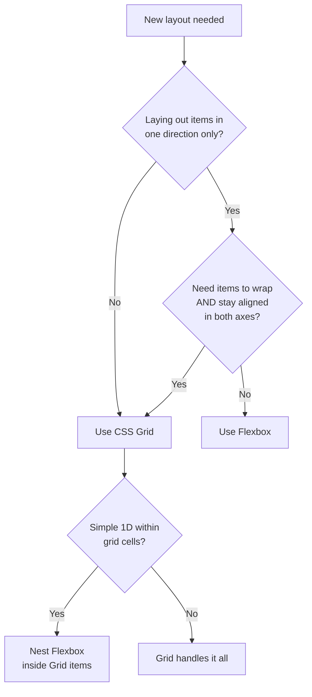

# CSS Grid vs Flexbox: When to Use Which (With Visual Examples)

Every few months, someone on my team asks: "Should I use Grid or Flexbox for this?" And every time, I give the same answer  it depends on what you're building.

That's not a cop-out. CSS Grid and Flexbox solve genuinely different problems, and the "which one should I use" question has a real answer once you understand the core difference. I've been building layouts with both for years now, and the mental model I use is dead simple. Let me walk you through it.

## The One Rule That Clears Up 90% of the Confusion

Here's the short version:

- **Flexbox** is for laying out items in **one direction**  a row OR a column.
- **CSS Grid** is for laying out items in **two directions**  rows AND columns simultaneously.

That's it. That's the mental model. One dimension vs two dimensions.

```
Flexbox (1D):
┌──────┐ ┌──────┐ ┌──────┐ ┌──────┐
│ Item │ │ Item │ │ Item │ │ Item │
└──────┘ └──────┘ └──────┘ └──────┘
← ─ ─ ─ ─ ─ one axis ─ ─ ─ ─ ─ →

CSS Grid (2D):
┌──────┐ ┌──────┐ ┌──────┐
│ Item │ │ Item │ │ Item │
├──────┤ ├──────┤ ├──────┤
│ Item │ │ Item │ │ Item │
├──────┤ ├──────┤ ├──────┤
│ Item │ │ Item │ │ Item │
└──────┘ └──────┘ └──────┘
← ─ ─ two axes ─ ─ →
         ↕
```

Now, Flexbox *can* wrap items into multiple rows. And Grid *can* be used for single-row layouts. So why does this distinction matter?

Because of how they handle alignment. With Flexbox, items in the second row don't know anything about items in the first row  they just flow independently. With Grid, every item snaps to a shared coordinate system. Columns stay aligned. Rows stay aligned. The whole layout is coherent.

## Flexbox: Where It Shines

Flexbox is your go-to for component-level layouts where items flow in a single direction. Think navigation bars, button groups, card footers, form rows  anything where you're distributing space along one axis.

### Navigation Bar

```css
.navbar {
  display: flex;
  justify-content: space-between;
  align-items: center;
  padding: 1rem 2rem;
}

.nav-links {
  display: flex;
  gap: 1.5rem;
}
```

```
┌─────────────────────────────────────────────┐
│ Logo          Home  About  Blog     Sign In │
└─────────────────────────────────────────────┘
```

This is textbook Flexbox. You've got items flowing left to right, you want `space-between` to push the logo and sign-in button to opposite ends, and `align-items: center` to vertically center everything. Grid would be overkill here.

### Card Footer with Pushed Actions

One of my favorite Flexbox patterns  and one I use in almost every project:

```css
.card {
  display: flex;
  flex-direction: column;
  height: 100%;
}

.card-body {
  flex: 1; /* Takes up all available space */
}

.card-footer {
  display: flex;
  justify-content: flex-end;
  gap: 0.5rem;
}
```

The `flex: 1` on `.card-body` pushes the footer to the bottom of the card regardless of content height. This pattern is surprisingly hard to do without Flexbox  you'd need absolute positioning or some other hack.

### Centering Content

Yeah, the classic. Flexbox made centering a solved problem:

```css
.centered {
  display: flex;
  justify-content: center;
  align-items: center;
  min-height: 100vh;
}
```

If centering is all you need, check out our full breakdown of [every centering method in CSS](/blog/center-div-css-every-method)  there are more options than you'd think.

## CSS Grid: Where It Shines

Grid is the layout engine for page-level structure and any component that needs items aligned across both axes. Dashboards, image galleries, form layouts, magazine-style pages  these are Grid territory.

### Page Layout

```css
.page {
  display: grid;
  grid-template-columns: 250px 1fr;
  grid-template-rows: auto 1fr auto;
  grid-template-areas:
    "sidebar header"
    "sidebar main"
    "sidebar footer";
  min-height: 100vh;
}

.header  { grid-area: header; }
.sidebar { grid-area: sidebar; }
.main    { grid-area: main; }
.footer  { grid-area: footer; }
```

```
┌──────────┬──────────────────────────┐
│          │         Header           │
│          ├──────────────────────────┤
│ Sidebar  │                          │
│          │         Main             │
│          │                          │
│          ├──────────────────────────┤
│          │         Footer           │
└──────────┴──────────────────────────┘
```

Try doing that with Flexbox. You'd need nested flex containers, and the sidebar spanning all three rows? That's a headache. Grid handles it with named areas  readable, maintainable, and honestly kind of elegant.

### Responsive Card Grid

Here's a pattern I reach for constantly:

```css
.card-grid {
  display: grid;
  grid-template-columns: repeat(auto-fill, minmax(300px, 1fr));
  gap: 1.5rem;
}
```

One line of CSS and you've got a responsive grid that adjusts column count based on available space. No media queries. No JavaScript. The cards stay perfectly aligned in both directions. If you want more tricks like this, I wrote about [responsive CSS without media queries](/blog/responsive-css-without-media-queries)  it's wild how much modern CSS can do.

### Dashboard Layout

```css
.dashboard {
  display: grid;
  grid-template-columns: repeat(4, 1fr);
  grid-template-rows: auto auto 1fr;
  gap: 1rem;
}

/* Span a widget across multiple cells */
.widget-wide {
  grid-column: span 2;
}

.widget-tall {
  grid-row: span 2;
}

.widget-featured {
  grid-column: span 2;
  grid-row: span 2;
}
```

Dashboards almost always need Grid. Widgets span different numbers of columns and rows, and everything needs to stay aligned on the same grid lines. Flexbox can't do this  items would just flow and wrap without any awareness of each other's positions.

## The Decision Flowchart

Here's how I decide which to use on any given component:



The key question is that second diamond: if items wrap, do they need to stay aligned across rows? If yes, that's Grid. If items just flow and wrap independently  like tags in a tag cloud  Flexbox with `flex-wrap: wrap` is fine.

## When to Combine Both

Here's the thing nobody tells you: the best layouts usually use **both**. Grid for the macro layout, Flexbox for the micro layout inside each cell.

```css
/* Grid for the overall page structure */
.app-layout {
  display: grid;
  grid-template-columns: 280px 1fr 320px;
  grid-template-rows: 64px 1fr;
  min-height: 100vh;
}

/* Flexbox for the header contents */
.header {
  grid-column: 1 / -1;  /* Span full width */
  display: flex;
  align-items: center;
  justify-content: space-between;
  padding: 0 1.5rem;
}

/* Flexbox for sidebar navigation items */
.sidebar-nav {
  display: flex;
  flex-direction: column;
  gap: 0.25rem;
}

/* Grid for the main content's card layout */
.content-cards {
  display: grid;
  grid-template-columns: repeat(auto-fill, minmax(250px, 1fr));
  gap: 1rem;
}

/* Flexbox inside each card */
.card {
  display: flex;
  flex-direction: column;
}

.card-actions {
  margin-top: auto;  /* Push to bottom */
  display: flex;
  gap: 0.5rem;
}
```

This nesting pattern  Grid at the page level, Flexbox inside components, sometimes Grid again for card grids  is how most production apps I've worked on are structured. Don't feel like you need to pick one.

## Quick Comparison

| Feature | Flexbox | CSS Grid |
|---------|---------|----------|
| **Direction** | One axis (row or column) | Two axes (rows and columns) |
| **Content vs Layout** | Content drives size | Layout drives size |
| **Best for** | Components, single-row/col | Page layouts, aligned grids |
| **Item placement** | Sequential flow | Explicit row/col placement |
| **Overlap** | Not supported | Items can overlap cells |
| **Named areas** | Not available | `grid-template-areas` |
| **Gap support** | `gap` works | `gap` works |
| **Responsive** | Wrap + flex-basis | auto-fill/auto-fit + minmax |
| **Browser support** | 99%+ | 98%+ |

## Performance: Does It Matter?

I've seen this question come up in code reviews. Short answer: the performance difference between Grid and Flexbox is negligible for nearly every real-world use case. Browsers have optimized both layout algorithms extensively.

That said, there are a couple of edge cases worth knowing:

- **Deeply nested flex containers** (think 10+ levels deep) can cause layout recalculation performance issues. But if you've got 10 levels of nested Flexbox, you've got bigger problems than performance.
- **Large grids with many items** (hundreds of cells) can be slightly slower than equivalent flex layouts during initial render. But we're talking milliseconds.

Pick the right tool based on the layout problem, not performance. If you're optimizing CSS layout performance, you're probably optimizing the wrong thing.

## Browser Support in 2026

Both CSS Grid and Flexbox have excellent browser support at this point. Flexbox has been universally supported for years. Grid is at about 98% global support  the holdouts are very old browser versions that represent a tiny fraction of traffic.

The newer Grid features like `subgrid` have broader support now too. Subgrid lets a child grid inherit track sizing from its parent grid, which solves the "cards with aligned content" problem beautifully. If you haven't tried it yet, it's worth exploring.

> **Tip:** If you're converting CSS layouts to Tailwind utility classes, [SnipShift's CSS to Tailwind converter](https://snipshift.dev/css-to-tailwind) can handle both Grid and Flexbox properties  just paste your CSS and it generates the right utility classes.

## Real Talk: My Defaults

After years of building layouts, here's what I default to:

1. **Page-level layout?** Grid. Always. Named areas make it readable, and the two-dimensional control is exactly what you need.
2. **Navigation, toolbars, button groups?** Flexbox. Single row of items, distribute space, done.
3. **Card grid?** Grid with `auto-fill` and `minmax`. The responsive behavior is unbeatable.
4. **Content inside cards?** Flexbox with `flex-direction: column` and `margin-top: auto` for pushed footers.
5. **Centering something?** Flexbox for most cases, Grid with `place-items: center` if I'm feeling fancy.

And when I need to convert these layouts to CSS-in-JS objects for a React project, [SnipShift's CSS to JSON converter](https://snipshift.dev/css-to-json) saves me a bunch of manual reformatting.

The bottom line is this: CSS Grid and Flexbox aren't competing technologies. They're complementary. Grid gives you the blueprint for where things go. Flexbox handles how items within those spaces are distributed. Learn both, use both, and stop worrying about picking the "right" one  because for any non-trivial layout, the answer is probably both.

If you're looking to modernize your layouts further, check out [CSS container queries](/blog/css-container-queries-guide)  they let components respond to their container's size instead of the viewport, which changes how you think about responsive design entirely.

And for more layout tools and converters, browse the full collection at [SnipShift.dev](https://snipshift.dev).
