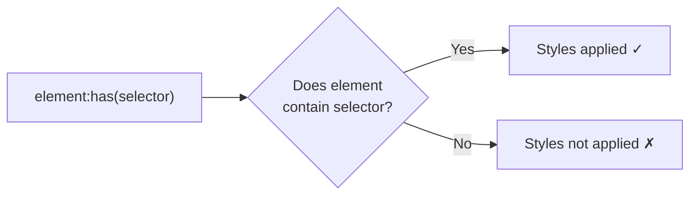

# CSS :has() Selector: The Parent Selector CSS Finally Got

For as long as I've been writing CSS  and that's been a while  the number one feature request was a parent selector. "I want to style a parent based on its children." Couldn't be done. Not in CSS1, not in CSS2, not in CSS3. You had to reach for JavaScript or add classes manually.

Then `:has()` shipped. And honestly, it does way more than just parent selection. It's a relational selector  it lets you select elements based on what they *contain*, what *follows* them, or what *state* their descendants are in. It's one of those features where once you start using it, you keep finding new use cases.

## The Syntax

`:has()` takes a selector list as its argument. It matches an element if any of the selectors in the list match relative to that element:

```css
/* Select a .card that contains an img */
.card:has(img) {
  grid-template-rows: auto 1fr;
}

/* Select a .card that does NOT contain an img */
.card:not(:has(img)) {
  grid-template-rows: 1fr;
}

/* Select a label that has a required input inside it */
label:has(input:required) {
  font-weight: 600;
}
```

The way I think about it: `:has()` is a conditional. "Select this element IF it has a descendant/sibling matching this selector."



## Use Case 1: Form Validation Styling

This is where `:has()` really clicked for me. Style form groups based on the state of their inputs  without JavaScript:

```css
/* Highlight the entire form group when input is focused */
.form-group:has(input:focus) {
  border-color: #3b82f6;
  box-shadow: 0 0 0 3px rgba(59, 130, 246, 0.1);
}

/* Show error state on the form group when input is invalid */
.form-group:has(input:invalid:not(:placeholder-shown)) {
  border-color: #ef4444;
}

/* Show success state when valid */
.form-group:has(input:valid:not(:placeholder-shown)) {
  border-color: #22c55e;
}

/* Style the label based on input state */
.form-group:has(input:focus) label {
  color: #3b82f6;
  transform: translateY(-2px);
}
```

The `:not(:placeholder-shown)` part is key  it prevents the validation styles from showing on empty fields. The user only sees the error state after they've typed something. This used to require event listeners and class toggling. Now it's pure CSS.

```css
/* Disable the submit button until the form is valid */
form:has(:invalid) button[type="submit"] {
  opacity: 0.5;
  pointer-events: none;
}
```

One line disables the submit button when *any* field in the form is invalid. That's wild. Try doing that without JavaScript.

## Use Case 2: Empty States

Style containers differently when they're empty or when specific children are missing:

```css
/* Show an empty state message */
.todo-list:not(:has(.todo-item)) .empty-message {
  display: block;
}

.todo-list:has(.todo-item) .empty-message {
  display: none;
}

/* Adjust layout when there's only one child */
.grid:has(> :nth-child(1):last-child) {
  /* Only one item  center it instead of grid */
  display: flex;
  justify-content: center;
}
```

That last one is particularly useful  detecting that a container has exactly one child and switching layout behavior. A team I worked with used this pattern for a dashboard where single-widget panels should center their content while multi-widget panels use grid layout.

## Use Case 3: Adjacent Sibling Logic

`:has()` combined with sibling selectors lets you create contextual relationships between elements:

```css
/* Style a heading differently when followed by a subtitle */
h1:has(+ .subtitle) {
  margin-bottom: 0.25rem;
}

h1:not(:has(+ .subtitle)) {
  margin-bottom: 1.5rem;
}

/* Adjust image spacing when followed by a caption */
figure:has(figcaption) img {
  border-radius: 0.5rem 0.5rem 0 0;
}

figure:not(:has(figcaption)) img {
  border-radius: 0.5rem;
}
```

The `+` combinator inside `:has()` checks for an adjacent sibling. So `h1:has(+ .subtitle)` means "an h1 that is immediately followed by a .subtitle." This is context-aware spacing without any utility classes or JavaScript.

## Use Case 4: Conditional Component Styling

```css
/* Card with an image gets a different layout than card without */
.card:has(.card-image) {
  display: grid;
  grid-template-columns: 200px 1fr;
}

.card:not(:has(.card-image)) {
  display: flex;
  flex-direction: column;
}

/* Navigation with a search bar gets extra padding */
.nav:has(.search-input) {
  padding-right: 2rem;
}

/* Table rows containing a checkbox get a highlight on hover */
tr:has(input[type="checkbox"]:checked) {
  background-color: #eff6ff;
}
```

That last one  highlighting table rows with checked checkboxes  is something I've seen implemented with JavaScript event handlers dozens of times. With `:has()`, it's one CSS rule.

## Use Case 5: Page-Level Conditional Styles

`:has()` isn't limited to components. You can use it on `body` or `html` for page-level conditions:

```css
/* When the modal is open, prevent body scroll */
body:has(.modal.open) {
  overflow: hidden;
}

/* Dark mode based on a toggle checkbox */
html:has(#dark-mode-toggle:checked) {
  --bg: #0f172a;
  --text: #f1f5f9;
}

/* Adjust page layout when sidebar is collapsed */
body:has(.sidebar.collapsed) .main-content {
  grid-column: 1 / -1;
}
```

The dark mode toggle example is particularly neat  we cover a full implementation with persistence and system preference detection in our [dark mode toggle guide](/blog/dark-mode-toggle-css-javascript). And for more on the custom properties that power theming, check out our [CSS custom properties guide](/blog/css-custom-properties-guide).

## Browser Support

As of early 2026, `:has()` is supported in all major browsers  Chrome, Edge, Firefox, and Safari. Firefox was the last major browser to ship support, but it's been stable since Firefox 121. Global support is around 94-95%, which is strong enough for progressive enhancement.

| Browser | Support Since |
|---------|--------------|
| Chrome | 105 (Aug 2022) |
| Edge | 105 (Aug 2022) |
| Safari | 15.4 (Mar 2022) |
| Firefox | 121 (Dec 2023) |

> **Tip:** For the small percentage of browsers without `:has()` support, your fallback is whatever styles apply *without* the `:has()` rules. Design your base styles as the fallback, and use `:has()` as the enhancement. The page should still function  just without the contextual styling improvements.

## Performance Considerations

There's been some concern about `:has()` performance since it's technically an "upward" selector  the browser needs to evaluate descendants to determine if the parent matches. In practice, browsers have implemented `:has()` with specific optimizations, and for typical use cases, the performance impact is negligible.

That said, a few guidelines:

- **Avoid overly broad selectors inside `:has()`**. `div:has(span)` on a large DOM is slower than `.card:has(.badge)`. Be specific.
- **Avoid deeply nested `:has()` chains**. `a:has(b:has(c:has(d)))` forces the browser to walk down multiple levels for every candidate element.
- **Don't worry about it for normal use**. Styling a form group based on its input state? A card based on its contents? Totally fine. Browser engines are smart.

## Quick Reference

```css
/* Parent has child */
.parent:has(.child) { }

/* Parent has direct child */
.parent:has(> .child) { }

/* Element followed by sibling */
.element:has(+ .sibling) { }

/* Element has any sibling after it */
.element:has(~ .sibling) { }

/* Negated  parent does NOT have child */
.parent:not(:has(.child)) { }

/* Multiple conditions (OR) */
.parent:has(.a, .b) { }

/* Multiple conditions (AND) */
.parent:has(.a):has(.b) { }

/* State-based */
.parent:has(input:checked) { }
.parent:has(input:focus) { }
.parent:has(input:invalid) { }
```

If you're working with `:has()` selectors and want to convert your CSS to Tailwind, [SnipShift's CSS to Tailwind converter](https://snipshift.dev/css-to-tailwind) can map many `:has()` patterns to Tailwind's `has-[]` variants  especially the form state and child presence checks.

The `:has()` selector fills the biggest gap CSS ever had. Combined with [container queries](/blog/css-container-queries-guide) for responsive components and modern layout techniques like [CSS Grid](/blog/css-grid-vs-flexbox-when-to-use), we're at a point where CSS alone handles things that used to require significant JavaScript. And that's better for performance, accessibility, and maintainability.

For more developer tools and converters, visit [SnipShift.dev](https://snipshift.dev).
