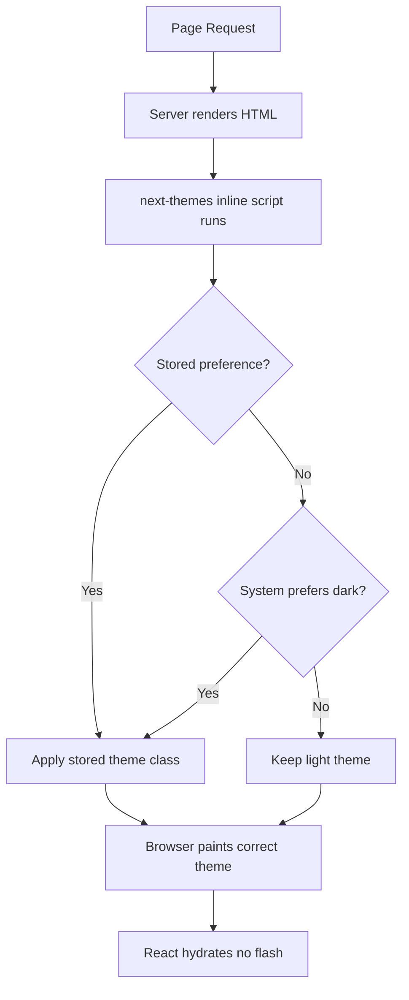

# How to Add Dark Mode to a Next.js App with Tailwind (next-themes)

Dark mode is one of those features that users absolutely expect now. I added it to a side project last year as an afterthought, and it became the most-mentioned thing in user feedback  not the feature itself, but the fact that it worked smoothly. People notice when it's done right, and they really notice when it's done wrong (looking at you, blinding white flash on page load).

The Next.js + Tailwind + next-themes stack is the setup I reach for every time. It handles system preferences, manual toggle, persistence, and  crucially  no flash of wrong theme on initial load. The whole thing takes about 10 minutes.

## Install next-themes

```bash
npm install next-themes
```

That's the only dependency. next-themes is tiny (~2KB), handles all the edge cases around SSR hydration, and works with both the App Router and Pages Router.

## Configure Tailwind for Class-Based Dark Mode

By default, Tailwind uses the `prefers-color-scheme` media query for dark mode. But we want class-based dark mode so next-themes can control it. Update your Tailwind config:

```typescript
// tailwind.config.ts
import type { Config } from "tailwindcss";

const config: Config = {
  content: [
    "./src/**/*.{js,ts,jsx,tsx,mdx}",
    "./app/**/*.{js,ts,jsx,tsx,mdx}",
  ],
  darkMode: "class", // This is the key line
  theme: {
    extend: {},
  },
  plugins: [],
};

export default config;
```

The `darkMode: "class"` setting tells Tailwind to apply dark variants when a `dark` class is present on a parent element (usually `<html>`), instead of relying on the OS preference directly. next-themes manages adding and removing that class.

## Set Up the ThemeProvider

Wrap your app with next-themes' `ThemeProvider`. In the App Router, this goes in your root layout:

```tsx
// app/layout.tsx
import { ThemeProvider } from "next-themes";
import "./globals.css";

export default function RootLayout({
  children,
}: {
  children: React.ReactNode;
}) {
  return (
    <html lang="en" suppressHydrationWarning>
      <body>
        <ThemeProvider
          attribute="class"
          defaultTheme="system"
          enableSystem
          disableTransitionOnChange
        >
          {children}
        </ThemeProvider>
      </body>
    </html>
  );
}
```

A few important details here:

- **`attribute="class"`**  tells next-themes to add a `dark` class to `<html>`, which is exactly what Tailwind expects
- **`defaultTheme="system"`**  respects the user's OS preference on first visit
- **`enableSystem`**  reacts to OS preference changes in real-time
- **`suppressHydrationWarning`**  prevents React's hydration mismatch warning (next-themes injects a script that sets the theme before React hydrates, which React doesn't know about)
- **`disableTransitionOnChange`**  optional, but prevents a flash of transition animation when the theme switches

> **Tip:** The `suppressHydrationWarning` goes on `<html>`, not on `<body>`. I've seen this mistake in a few tutorials and it causes the exact hydration warning it's supposed to prevent.

## Build the Theme Toggle Component

Now for the toggle. This needs to be a client component since it uses React state and the `useTheme` hook:

```tsx
"use client";
import { useTheme } from "next-themes";
import { useEffect, useState } from "react";

export function ThemeToggle() {
  const { theme, setTheme } = useTheme();
  const [mounted, setMounted] = useState(false);

  // Avoid hydration mismatch by only rendering after mount
  useEffect(() => {
    setMounted(true);
  }, []);

  if (!mounted) {
    // Return a placeholder with the same dimensions to avoid layout shift
    return <div className="h-9 w-9" />;
  }

  return (
    <button
      onClick={() => setTheme(theme === "dark" ? "light" : "dark")}
      className="rounded-lg p-2 hover:bg-gray-100 dark:hover:bg-gray-800
                 transition-colors"
      aria-label="Toggle theme"
    >
      {theme === "dark" ? (
        <SunIcon className="h-5 w-5 text-yellow-500" />
      ) : (
        <MoonIcon className="h-5 w-5 text-gray-700" />
      )}
    </button>
  );
}

// Simple inline SVG icons  or use your icon library
function SunIcon({ className }: { className?: string }) {
  return (
    <svg className={className} fill="none" viewBox="0 0 24 24" stroke="currentColor">
      <path strokeLinecap="round" strokeLinejoin="round" strokeWidth={2}
        d="M12 3v1m0 16v1m9-9h-1M4 12H3m15.364 6.364l-.707-.707M6.343 6.343l-.707-.707m12.728 0l-.707.707M6.343 17.657l-.707.707M16 12a4 4 0 11-8 0 4 4 0 018 0z" />
    </svg>
  );
}

function MoonIcon({ className }: { className?: string }) {
  return (
    <svg className={className} fill="none" viewBox="0 0 24 24" stroke="currentColor">
      <path strokeLinecap="round" strokeLinejoin="round" strokeWidth={2}
        d="M20.354 15.354A9 9 0 018.646 3.646 9.003 9.003 0 0012 21a9.003 9.003 0 008.354-5.646z" />
    </svg>
  );
}
```

That `mounted` check is critical. Without it, the server renders one icon and the client might render a different one  React throws a hydration mismatch error and your console fills up with warnings. It's the single most common mistake I see with next-themes.

## Avoiding the Flash of Wrong Theme

This is the thing that separates a good dark mode from a bad one. Without next-themes, here's what happens:

1. Server renders HTML with light theme (or no theme)
2. Browser paints the light theme
3. JavaScript loads, reads localStorage, sees the user prefers dark
4. Page flashes from light to dark

next-themes fixes this by injecting a tiny inline script into `<head>` that runs before the browser paints. It reads the stored preference and applies the `dark` class immediately. No flash.



This is why `attribute="class"` and `suppressHydrationWarning` are both necessary. The script sets the class before React knows about it, and the warning suppression tells React that's okay.

## Using Dark Mode in Your Components

With everything wired up, using dark mode in your components is just Tailwind's `dark:` prefix:

```tsx
export function Card({ title, description }: { title: string; description: string }) {
  return (
    <div className="rounded-xl border border-gray-200 bg-white p-6
                    dark:border-gray-700 dark:bg-gray-900
                    transition-colors duration-200">
      <h2 className="text-lg font-semibold text-gray-900 dark:text-white">
        {title}
      </h2>
      <p className="mt-2 text-gray-600 dark:text-gray-400">
        {description}
      </p>
    </div>
  );
}
```

If you've got existing CSS that you're converting to Tailwind classes, [SnipShift's CSS to Tailwind converter](https://snipshift.dev/css-to-tailwind) can handle the translation  including generating the `dark:` variants where appropriate.

For a deeper look at CSS theming with custom properties, our [dark mode toggle with CSS and JavaScript guide](/blog/dark-mode-toggle-css-javascript) covers the vanilla approach. And if you want to understand `dark:` variants better, our [CSS custom properties guide](/blog/css-custom-properties-guide) explains the underlying mechanics.

## A Three-Theme Toggle (Light / Dark / System)

Some apps offer all three options. Here's a slightly fancier toggle:

```tsx
"use client";
import { useTheme } from "next-themes";
import { useEffect, useState } from "react";

export function ThemeSelector() {
  const { theme, setTheme } = useTheme();
  const [mounted, setMounted] = useState(false);

  useEffect(() => setMounted(true), []);
  if (!mounted) return null;

  const options = [
    { value: "light", label: "Light" },
    { value: "dark", label: "Dark" },
    { value: "system", label: "System" },
  ] as const;

  return (
    <div className="flex gap-1 rounded-lg bg-gray-100 p-1 dark:bg-gray-800">
      {options.map((option) => (
        <button
          key={option.value}
          onClick={() => setTheme(option.value)}
          className={`rounded-md px-3 py-1.5 text-sm font-medium transition-colors
            ${theme === option.value
              ? "bg-white text-gray-900 shadow dark:bg-gray-700 dark:text-white"
              : "text-gray-600 hover:text-gray-900 dark:text-gray-400 dark:hover:text-white"
            }`}
        >
          {option.label}
        </button>
      ))}
    </div>
  );
}
```

| Approach | Pros | Cons |
|----------|------|------|
| Two-state toggle (light/dark) | Simple, familiar | Ignores system preference after first toggle |
| Three-state (light/dark/system) | Full control, respects OS | Slightly more complex UI |

I usually go with the three-state option. The "System" choice is genuinely useful  I set most apps to system and only override when an app's dark mode is particularly bad.

## That's the Whole Setup

The Next.js + Tailwind + next-themes combo is about as smooth as dark mode gets in the React ecosystem. The library handles all the tricky parts  SSR, hydration, flash prevention, system preference detection  and you just write `dark:` variants in your Tailwind classes.

Quick checklist before you ship: set `darkMode: "class"` in Tailwind config, wrap with `ThemeProvider` using `attribute="class"`, add `suppressHydrationWarning` to `<html>`, and always check `mounted` before rendering theme-dependent UI in client components. Get those four right and everything else just works.

Check out more tools for your frontend workflow at [SnipShift](https://snipshift.dev).
