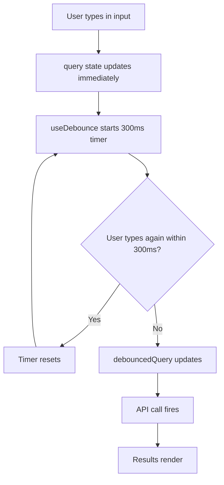

# How to Debounce Input in React with TypeScript (Custom Hook)

Every search input you've ever built has the same problem. User types "react debounce hook"  and your app fires off seven API calls, one for each keystroke. Your network tab looks like a war zone, your API rate limit is crying, and half those responses come back out of order anyway.

I've shipped this exact bug more times than I'd like to admit. The fix is **debouncing**  waiting until the user stops typing before actually doing anything  and in React with TypeScript, the cleanest way to do it is a custom hook. Let me show you the one I've been using across projects for the last couple of years.

## The useDebounce Hook

Here's the full implementation. It's surprisingly short:

```typescript
import { useState, useEffect } from "react";

function useDebounce<T>(value: T, delay: number): T {
  const [debouncedValue, setDebouncedValue] = useState<T>(value);

  useEffect(() => {
    // Set a timer to update the debounced value after the delay
    const timer = setTimeout(() => {
      setDebouncedValue(value);
    }, delay);

    // Cancel the timer if value changes or component unmounts
    return () => {
      clearTimeout(timer);
    };
  }, [value, delay]);

  return debouncedValue;
}

export default useDebounce;
```

The generic `<T>` is doing the heavy lifting here. This hook works with strings, numbers, objects  whatever you pass in. TypeScript infers the type from the `value` argument, so you get full type safety without having to manually annotate anything at the call site.

And the cleanup function  that `return () => clearTimeout(timer)`  is the piece that actually makes debouncing work. Every time `value` changes, React tears down the previous effect (canceling the old timer) before running the new one. So if a user types five characters in quick succession, only the last timer survives.

## Using It with a Search Input

Here's where it gets practical. A search component that debounces API calls:

```typescript
import { useState, useEffect } from "react";
import useDebounce from "./useDebounce";

interface SearchResult {
  id: number;
  title: string;
}

function SearchInput() {
  const [query, setQuery] = useState("");
  const [results, setResults] = useState<SearchResult[]>([]);
  const [isLoading, setIsLoading] = useState(false);

  // Only update debouncedQuery 300ms after the user stops typing
  const debouncedQuery = useDebounce(query, 300);

  useEffect(() => {
    if (!debouncedQuery.trim()) {
      setResults([]);
      return;
    }

    const controller = new AbortController();
    setIsLoading(true);

    fetch(`/api/search?q=${encodeURIComponent(debouncedQuery)}`, {
      signal: controller.signal,
    })
      .then((res) => res.json())
      .then((data: SearchResult[]) => {
        setResults(data);
        setIsLoading(false);
      })
      .catch((err) => {
        if (err.name !== "AbortError") {
          setIsLoading(false);
        }
      });

    // Cancel in-flight request if debouncedQuery changes
    return () => controller.abort();
  }, [debouncedQuery]);

  return (
    <div>
      <input
        type="text"
        value={query}
        onChange={(e) => setQuery(e.target.value)}
        placeholder="Search..."
      />
      {isLoading && <p>Loading...</p>}
      <ul>
        {results.map((item) => (
          <li key={item.id}>{item.title}</li>
        ))}
      </ul>
    </div>
  );
}
```

Notice the `AbortController`  that's an important detail people often miss. Even with debouncing, if the user types something, pauses (triggering the fetch), then types again quickly, you can end up with stale responses. The abort controller cancels any in-flight request when the debounced value changes.

## How the Flow Works



The input stays responsive because `query` updates on every keystroke  the user sees their text instantly. But `debouncedQuery` only catches up once they pause. That separation is the whole trick.

## useDebounce vs lodash.debounce

You might be wondering  why not just use `lodash.debounce`? It's a fair question. I used to reach for lodash every time, but there are some real tradeoffs.

| | `useDebounce` hook | `lodash.debounce` |
|---|---|---|
| **Bundle size** | 0 KB (it's your own code) | ~1.5 KB (just debounce) or ~70 KB (full lodash) |
| **React integration** | Works naturally with state/effects | Needs `useCallback` + `useRef` to avoid stale closures |
| **Cleanup** | Automatic via effect cleanup | Manual  you have to call `.cancel()` in a `useEffect` return |
| **TypeScript** | Generic types flow through | Good types, but more ceremony wrapping it in a hook |
| **Approach** | Debounces the *value* | Debounces the *function call* |

The key difference is conceptual. `useDebounce` debounces a **value**  you pass in a rapidly changing value and get back a slow-moving one. `lodash.debounce` debounces a **function**  you wrap a callback and it limits how often that callback executes.

For search inputs and most React use cases, debouncing the value is cleaner. It composes better with `useEffect` and you don't have to wrestle with stale closures.

But if you're debouncing something like a window resize handler or a scroll listener  where there's no "value" to debounce, just a callback  `lodash.debounce` (or its lighter cousin `debounce` from `lodash-es`) is still the right tool.

If you're converting JavaScript utility code that uses lodash to TypeScript, [SnipShift's JS to TypeScript converter](https://snipshift.dev/js-to-ts) can handle the type annotations for you  including properly typing debounced callbacks.

## What About useDeferredValue?

React 18 introduced `useDeferredValue`, and I see people ask whether it replaces debouncing. Short answer: **no**, they solve different problems.

```typescript
import { useDeferredValue, useState } from "react";

function SearchWithDeferred() {
  const [query, setQuery] = useState("");
  const deferredQuery = useDeferredValue(query);

  // deferredQuery updates at a lower priority, not after a fixed delay
  return <SearchResults query={deferredQuery} />;
}
```

`useDeferredValue` tells React "this value is low priority  update it when you have time." It's about **rendering priority**, not about reducing API calls. If you're filtering a local list and the re-render is expensive, `useDeferredValue` is great. But if you need to avoid hammering an API endpoint, you still need debouncing. The timer-based delay is the whole point.

Here's my rule of thumb: if the expensive thing is a **render**, use `useDeferredValue`. If the expensive thing is a **side effect** (API call, analytics event, localStorage write), use `useDebounce`.

## A More Advanced Version: useDebounceCallback

Sometimes you do want to debounce a function, not a value. Here's a hook for that:

```typescript
import { useCallback, useRef, useEffect } from "react";

function useDebouncedCallback<T extends (...args: any[]) => void>(
  callback: T,
  delay: number
): T {
  const callbackRef = useRef(callback);
  const timerRef = useRef<ReturnType<typeof setTimeout>>();

  // Keep the callback ref fresh
  useEffect(() => {
    callbackRef.current = callback;
  }, [callback]);

  // Cleanup on unmount
  useEffect(() => {
    return () => {
      if (timerRef.current) clearTimeout(timerRef.current);
    };
  }, []);

  return useCallback(
    ((...args: Parameters<T>) => {
      if (timerRef.current) clearTimeout(timerRef.current);
      timerRef.current = setTimeout(() => {
        callbackRef.current(...args);
      }, delay);
    }) as T,
    [delay]
  );
}
```

This is the pattern you'd use for event handlers  resize, scroll, or any situation where you're debouncing the *action* rather than the *input state*. The `callbackRef` trick avoids the stale closure problem that makes lodash.debounce painful in React.

> **Tip:** For most form inputs and search bars, stick with the simpler `useDebounce` value hook. Only reach for `useDebouncedCallback` when you're working with event listeners or imperative APIs.

## Picking the Right Delay

One thing nobody talks about: what delay should you actually use? It depends on the context.

- **Search inputs hitting an API:** 300-500ms. Users expect a slight pause before results appear.
- **Filter/autocomplete on local data:** 150-200ms. Local filtering is fast, so you can be more responsive.
- **Form validation:** 500-800ms. You don't want to show "invalid email" while someone's still typing their address.
- **Analytics events:** 1000ms+. These aren't user-facing, so be generous.

I usually start with 300ms and adjust based on how the interaction *feels*. There's no science to it  just try it and see if the UI feels sluggish or twitchy, then dial it in.

## Wrapping Up

The `useDebounce` hook is one of those utilities I copy into every new React TypeScript project. It's simple, generic, handles cleanup automatically, and composes cleanly with the rest of your React code.

If you're working with a JavaScript codebase that already has debounce logic and you're migrating to TypeScript, tools like [SnipShift's converter](https://snipshift.dev/js-to-ts) can help you add proper generic types without rewriting everything from scratch. And if you're interested in more TypeScript patterns for React, check out our guide on [typing React hooks](/blog/typescript-react-hooks-types) or [common TypeScript mistakes to avoid](/blog/common-typescript-mistakes).

The full hook is about 15 lines of code. No dependencies, full type safety, proper cleanup. Sometimes the best solution really is the simplest one.
