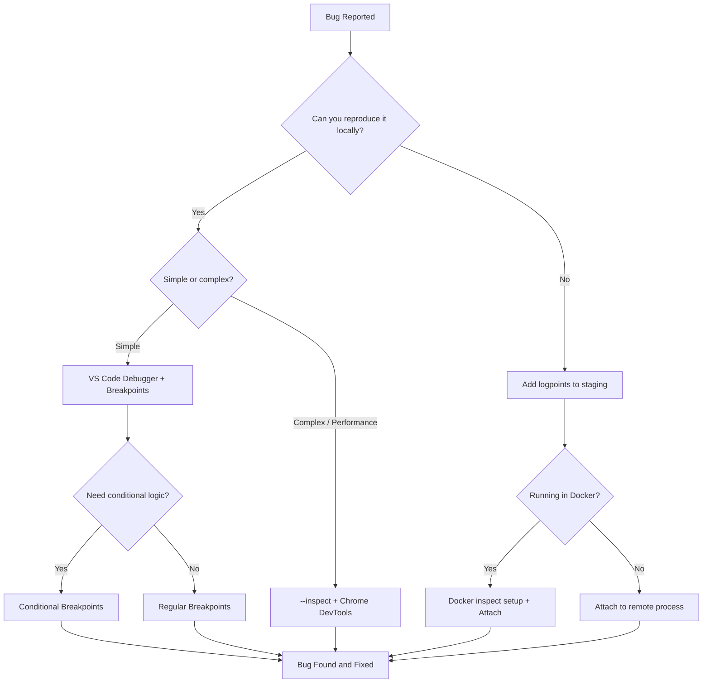

# How to Debug Node.js Applications (5 Techniques Beyond console.log)

I'll be honest  I spent the first two years of my career sprinkling `console.log` everywhere like it was seasoning. Variable not what I expected? `console.log`. API response looks weird? `console.log`. Entire object dumped to the terminal in a wall of unreadable text? You guessed it. And sure, it works. But it's the duct tape of debugging. When you need to debug a Node.js application properly  especially one that's grown past a few hundred lines  you need real tools.

So here are five techniques I actually use now. Not theoretical stuff from docs I skimmed once. These are battle-tested methods that have saved me hours of frustration when trying to debug Node.js application issues in production-like environments.

## 1. The --inspect Flag and Chrome DevTools for Node.js

This one blew my mind when I first discovered it. You can connect Chrome DevTools  the same ones you use for frontend work  directly to a running Node.js process. And it's absurdly easy to set up.

Start your app with the `--inspect` flag:

```bash
node --inspect server.js
```

You'll see output like this:

```
Debugger listening on ws://127.0.0.1:9229/some-uuid
For help, see: https://nodejs.org/en/docs/inspector
```

Now open Chrome and navigate to `chrome://inspect`. Click "Open dedicated DevTools for Node." That's it. You're connected.

What makes node inspect Chrome DevTools so powerful is that you get the full debugging experience  the Sources panel for stepping through code, the Console for evaluating expressions in the current scope, the Memory panel for tracking down leaks, and the Performance panel for profiling. It's the same interface millions of developers already know.

If you want the debugger to pause on the very first line of your application (useful when the bug happens during startup), use `--inspect-brk` instead:

```bash
node --inspect-brk server.js
```

> **Tip:** If you're running your app with `nodemon` during development, you can pass the inspect flag through: `nodemon --inspect server.js`. The debugger will reconnect automatically when your app restarts after file changes.

I use this approach when I need to profile memory usage or track down performance issues. The Chrome DevTools memory snapshot feature alone has saved me countless hours. If you've ever dealt with memory problems, check out our guide on [finding and fixing JavaScript memory leaks](/blog/javascript-memory-leak-find-fix)  it pairs perfectly with this technique.

## 2. VS Code Debugger Setup with launch.json

If you're already writing code in VS Code  and statistically, you probably are  then the built-in debugger is the most productive way to debug Node.js application code day-to-day. No context switching. No separate browser window. Everything right there in your editor.

The magic lives in a file called `launch.json` inside a `.vscode` folder at your project root. Here's a configuration I use on almost every project:

```json
{
  "version": "0.2.0",
  "configurations": [
    {
      "type": "node",
      "request": "launch",
      "name": "Debug Server",
      "program": "${workspaceFolder}/src/server.js",
      "restart": true,
      "console": "integratedTerminal",
      "env": {
        "NODE_ENV": "development",
        "DEBUG": "app:*"
      }
    },
    {
      "type": "node",
      "request": "launch",
      "name": "Debug Current File",
      "program": "${file}",
      "console": "integratedTerminal"
    },
    {
      "type": "node",
      "request": "attach",
      "name": "Attach to Process",
      "port": 9229,
      "restart": true
    }
  ]
}
```

The first configuration launches your server with the debugger attached. The second  and this is the one I reach for most often  debugs whatever file you currently have open. Super handy for testing utility functions or running a quick script. The third attaches to an already-running process (useful when combined with the `--inspect` flag from technique #1).

The vscode Node debugger has gotten remarkably good over the past couple of years. Auto-attach is worth mentioning here too. Open your VS Code settings and search for "Auto Attach." Set it to "smart" and VS Code will automatically attach the debugger whenever you run a Node.js process from the integrated terminal. No `launch.json` needed for simple cases.

> **Tip:** If your project uses TypeScript, add `"sourceMaps": true` and `"outFiles": ["${workspaceFolder}/dist/**/*.js"]` to your launch configuration. VS Code will map the compiled JavaScript back to your TypeScript source files, so you can set breakpoints directly in your `.ts` files.

## 3. Breakpoints  Regular and Conditional

Breakpoints are the bread and butter of real debugging. But most people only use the basic kind  click the gutter, execution pauses. That's fine, but conditional breakpoints are where things get interesting.

### Regular Breakpoints

In VS Code, click the left margin next to a line number. A red dot appears. Run with the debugger, and execution pauses right there. You can inspect variables, evaluate expressions, and step through code line by line. Nothing revolutionary, but infinitely better than `console.log` because you see *everything* in scope  not just the one variable you thought to log.

### Conditional Breakpoints

Right-click the gutter and select "Add Conditional Breakpoint." Now you can specify an expression. The debugger will only pause when that expression evaluates to `true`.

This is a game-changer when you're debugging a loop that runs 10,000 times but only fails on iteration 7,342. Instead of stepping through every iteration or adding `if (i === 7342) console.log(...)`, you just set a conditional breakpoint with `i === 7342` and go get coffee.

Here are some conditional breakpoints I use constantly:

- `user.id === "abc-123"`  pause only for a specific user
- `response.status >= 400`  catch error responses
- `items.length > 100`  find unexpectedly large payloads
- `err !== null`  pause only when there's an actual error

You can also set **hit count breakpoints**  pause after the breakpoint has been hit N times. Right-click the gutter, choose "Add Conditional Breakpoint," then switch the dropdown from "Expression" to "Hit Count." Type `50` and the debugger pauses on the 50th hit. I use this when I suspect something accumulates over time.

And there's the **debugger statement**  you can drop `debugger;` directly into your code, and any attached debugger will pause there. I know, I know, it feels dirty. But sometimes you need a quick breakpoint in code that's deep in `node_modules` or in a dynamically loaded file where clicking the gutter isn't practical. Just don't commit it. Please.

> **Warning:** Forgetting a `debugger;` statement in production code will not crash your app, but it will cause the V8 engine to deoptimize that function. If you use them, add a linting rule to catch stray `debugger` statements before they ship.

## 4. Logpoints  Non-Invasive Logging Without Code Changes

Logpoints are, in my opinion, the most underrated debugging feature in VS Code. They're like `console.log` statements that you don't have to write  or clean up afterward.

Right-click the gutter in VS Code and select "Add Logpoint." Instead of pausing execution like a breakpoint, a logpoint logs a message to the debug console. You wrap expressions in curly braces, and they get evaluated and printed.

For example, a logpoint message like:

```
User {user.name} requested {req.path}  status: {res.statusCode}
```

...will output something like:

```
User Alice requested /api/users  status: 200
```

Why is this better than `console.log`? A few reasons:

1. **No code changes.** You don't modify a single line. No git diff noise, no accidental commits of debug logging.
2. **No restarts.** Add or remove logpoints while the app is running. The debugger handles it.
3. **Easy cleanup.** Close the debug session and they're gone. Or remove them with a click.

I use logpoints heavily when debugging API endpoints. Speaking of APIs  if you're testing endpoints during debugging, [SnipShift's cURL to Code converter](https://devshift.dev/curl-to-code) can turn your curl commands into fetch or axios code instantly. Beats hand-writing request boilerplate when you're already knee-deep in a debugging session.

Logpoints also combine well with conditional breakpoints. You can set a logpoint that only fires under certain conditions, giving you targeted logging without any code changes. It's `console.log` without the guilt.

## 5. Debugging Node.js in Docker Containers

This is where things get tricky  and where most developers go back to `console.log` out of frustration. But once you set it up, being able to debug Docker Node.js apps with a real debugger changes everything.

The key insight: you need to expose the debug port from the container and tell Node.js to listen on `0.0.0.0` instead of `127.0.0.1` (since the container's localhost is not your host's localhost).

Here's a `docker-compose.yml` that makes it work:

```yaml
services:
  api:
    build:
      context: .
      dockerfile: Dockerfile
    ports:
      - "3000:3000"
      - "9229:9229"
    volumes:
      - ./src:/app/src
    command: node --inspect=0.0.0.0:9229 src/server.js
    environment:
      - NODE_ENV=development
      - DATABASE_URL=postgres://user:pass@db:5432/myapp
    depends_on:
      - db

  db:
    image: postgres:16
    environment:
      POSTGRES_USER: user
      POSTGRES_PASSWORD: pass
      POSTGRES_DB: myapp
    ports:
      - "5432:5432"
```

The critical pieces are:

- `--inspect=0.0.0.0:9229` in the command  this makes the debugger listen on all interfaces, not just the container's loopback
- Port mapping `9229:9229`  this exposes the debug port to your host machine

Now update your VS Code `launch.json` to attach:

```json
{
  "type": "node",
  "request": "attach",
  "name": "Attach to Docker",
  "port": 9229,
  "localRoot": "${workspaceFolder}/src",
  "remoteRoot": "/app/src",
  "restart": true
}
```

The `localRoot` and `remoteRoot` properties tell VS Code how to map file paths between your machine and the container. Without these, breakpoints won't hit because VS Code can't match the container's `/app/src/server.js` to your local `./src/server.js`.

> **Warning:** Never expose the debug port (`9229`) in production. The inspector protocol gives full access to your application  anyone who can reach that port can execute arbitrary code. Only map it in development compose files, and use separate compose configs for production.

If you're new to Docker Compose, our [Docker Compose beginner's guide](/blog/docker-compose-beginners-guide) covers the fundamentals. The debugging setup above builds on those basics.

## Debugging Workflow at a Glance

Here's how I think about choosing a debugging approach  it depends on where the bug lives and how reproducible it is:



| Technique | Best For | Setup Effort | Learning Curve |
|-----------|----------|-------------|----------------|
| Chrome DevTools (`--inspect`) | Memory profiling, performance | Low | Medium |
| VS Code Debugger | Daily development, stepping through code | Low | Low |
| Conditional Breakpoints | Bugs in loops, specific user/data issues | None (once debugger is set up) | Low |
| Logpoints | Tracing execution flow, API debugging | None | Very Low |
| Docker Debugging | Containerized apps, environment-specific bugs | Medium | Medium |

## Putting It All Together

The real power comes from combining these techniques. Here's my typical workflow when something breaks:

1. **Start with logpoints** to trace the execution path without modifying code. Figure out *where* things go wrong.
2. **Set a conditional breakpoint** at the suspicious location to pause only when the bad data appears.
3. **Inspect the call stack and variables** in VS Code to understand *why* it's wrong.
4. If it's a performance issue, switch to **Chrome DevTools via --inspect** and use the profiler.
5. If the bug only appears in the containerized environment, set up the **Docker debugging** configuration.

I've watched junior developers spend 45 minutes adding `console.log` statements, restarting the server, reading output, adding more logs, restarting again  over and over. And I get it. That's how I used to work too. But learning these five techniques  really learning them, not just reading about them  cut my debugging time in half. Maybe more.

If your app is feeling sluggish and you're not sure whether it's a debugging issue or a broader performance problem, our [React debugging checklist](/blog/react-app-slow-debugging-checklist) covers the frontend side of performance investigation. And for the full suite of developer tools  converters, formatters, testers  [SnipShift](https://devshift.dev) has you covered.

The `console.log` isn't going anywhere. I still use it for quick sanity checks. But it shouldn't be your *only* tool. You wouldn't use a hammer for every home repair. Same idea here.

So pick one technique from this list  just one  and try it on your current project this week. My recommendation? Start with logpoints. They're the easiest win, and once you see how much cleaner they are than scattered `console.log` calls, you'll wonder why you didn't switch sooner.
