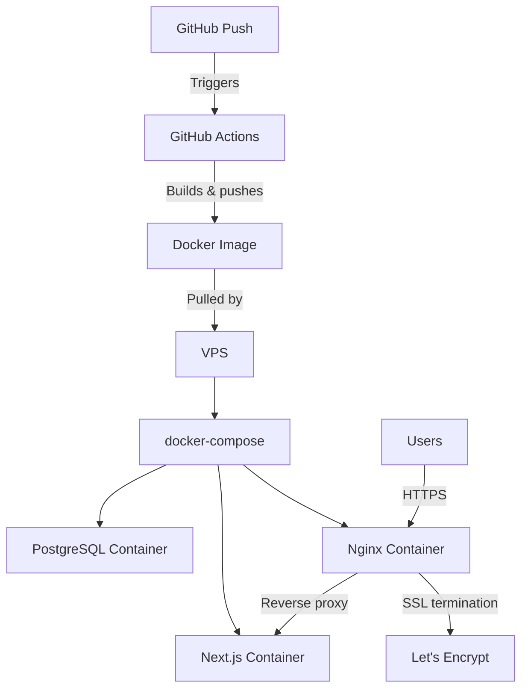

# How to Deploy a Next.js App to a VPS with Docker (Not Vercel)

Look, Vercel is great. I've used it for years. But at some point  maybe when your bill hits $200/month for what's essentially a Node.js server, or when you need a database on the same machine, or when your compliance team says "no third-party hosting"  you're going to want to deploy Next.js on your own VPS.

I've done this migration for three different projects. The first time was rough. The second time was better. By the third time, I had a setup that works reliably and costs about $10/month on a basic VPS. Here's that setup.

## The Architecture

Before we get into files, here's what we're building:



Users hit nginx, which terminates SSL and proxies to your Next.js container. Postgres runs alongside in its own container. GitHub Actions handles building and deploying on every push to main.

## The Dockerfile

Next.js has a `standalone` output mode that bundles everything into a minimal folder  no `node_modules` needed. This is the key to keeping your Docker image small.

First, enable standalone output in your Next.js config:

```javascript
// next.config.js
/** @type {import('next').NextConfig} */
const nextConfig = {
  output: "standalone",
};

module.exports = nextConfig;
```

Now the Dockerfile:

```dockerfile
# Stage 1: Install dependencies
FROM node:20-alpine AS deps
WORKDIR /app
COPY package.json package-lock.json ./
RUN npm ci --ignore-scripts

# Stage 2: Build the application
FROM node:20-alpine AS builder
WORKDIR /app
COPY --from=deps /app/node_modules ./node_modules
COPY . .

# Set build-time environment variables
ARG DATABASE_URL
ENV DATABASE_URL=$DATABASE_URL

RUN npm run build

# Stage 3: Production runner
FROM node:20-alpine AS runner
WORKDIR /app

ENV NODE_ENV=production
ENV PORT=3000

# Create non-root user
RUN addgroup --system --gid 1001 nodejs && \
    adduser --system --uid 1001 nextjs

# Copy standalone output
COPY --from=builder /app/.next/standalone ./
COPY --from=builder /app/.next/static ./.next/static
COPY --from=builder /app/public ./public

USER nextjs
EXPOSE 3000

CMD ["node", "server.js"]
```

A few things to note about this Dockerfile:

- **Multi-stage build**  the final image only has the standalone output, no dev dependencies, no source code. My images come out around 150MB, compared to 1GB+ if you just copy everything.
- **Non-root user**  always run as a non-root user in production. It's a basic security practice that's easy to forget.
- **`npm ci --ignore-scripts`**  faster and more deterministic than `npm install`, and skipping scripts avoids potential issues in the build environment.

> **Tip:** Add a `.dockerignore` file to keep your build context small. At minimum, ignore `node_modules`, `.next`, `.git`, and `.env*` files.

```
node_modules
.next
.git
.env*
*.md
.vscode
```

## Docker Compose Setup

Create a `docker-compose.yml` that runs Next.js alongside Postgres:

```yaml
# docker-compose.yml
version: "3.8"

services:
  app:
    build:
      context: .
      args:
        DATABASE_URL: postgresql://postgres:${POSTGRES_PASSWORD}@db:5432/${POSTGRES_DB}
    ports:
      - "3000:3000"
    environment:
      - DATABASE_URL=postgresql://postgres:${POSTGRES_PASSWORD}@db:5432/${POSTGRES_DB}
      - NEXTAUTH_SECRET=${NEXTAUTH_SECRET}
      - NEXTAUTH_URL=${NEXTAUTH_URL}
    depends_on:
      db:
        condition: service_healthy
    restart: unless-stopped

  db:
    image: postgres:16-alpine
    environment:
      - POSTGRES_USER=postgres
      - POSTGRES_PASSWORD=${POSTGRES_PASSWORD}
      - POSTGRES_DB=${POSTGRES_DB}
    volumes:
      - postgres_data:/var/lib/postgresql/data
    healthcheck:
      test: ["CMD-SHELL", "pg_isready -U postgres"]
      interval: 5s
      timeout: 5s
      retries: 5
    restart: unless-stopped

  nginx:
    image: nginx:alpine
    ports:
      - "80:80"
      - "443:443"
    volumes:
      - ./nginx/nginx.conf:/etc/nginx/nginx.conf:ro
      - certbot_data:/etc/letsencrypt:ro
      - certbot_www:/var/www/certbot:ro
    depends_on:
      - app
    restart: unless-stopped

  certbot:
    image: certbot/certbot
    volumes:
      - certbot_data:/etc/letsencrypt
      - certbot_www:/var/www/certbot
    entrypoint: "/bin/sh -c 'trap exit TERM; while :; do certbot renew; sleep 12h & wait $${!}; done;'"

volumes:
  postgres_data:
  certbot_data:
  certbot_www:
```

Create a `.env` file on your VPS (never commit this):

```bash
POSTGRES_PASSWORD=a-very-strong-password-here
POSTGRES_DB=myapp
NEXTAUTH_SECRET=generate-with-openssl-rand-base64-32
NEXTAUTH_URL=https://yourdomain.com
```

If you're managing a bunch of environment variables across development, staging, and production, [SnipShift's Env to Types converter](https://snipshift.dev/env-to-types) can generate TypeScript types from your `.env` files  so you get autocomplete and type safety when accessing `process.env`. For more patterns on env file management, check our [managing multiple env files guide](/blog/manage-multiple-env-files).

## Nginx Reverse Proxy Configuration

Create the nginx config:

```nginx
# nginx/nginx.conf
events {
    worker_connections 1024;
}

http {
    # Redirect HTTP to HTTPS
    server {
        listen 80;
        server_name yourdomain.com;

        # Let's Encrypt challenge
        location /.well-known/acme-challenge/ {
            root /var/www/certbot;
        }

        location / {
            return 301 https://$host$request_uri;
        }
    }

    # HTTPS server
    server {
        listen 443 ssl;
        server_name yourdomain.com;

        ssl_certificate /etc/letsencrypt/live/yourdomain.com/fullchain.pem;
        ssl_certificate_key /etc/letsencrypt/live/yourdomain.com/privkey.pem;

        # SSL settings
        ssl_protocols TLSv1.2 TLSv1.3;
        ssl_ciphers HIGH:!aNULL:!MD5;
        ssl_prefer_server_ciphers on;

        # Proxy to Next.js
        location / {
            proxy_pass http://app:3000;
            proxy_http_version 1.1;
            proxy_set_header Upgrade $http_upgrade;
            proxy_set_header Connection 'upgrade';
            proxy_set_header Host $host;
            proxy_set_header X-Real-IP $remote_addr;
            proxy_set_header X-Forwarded-For $proxy_add_x_forwarded_for;
            proxy_set_header X-Forwarded-Proto $scheme;
            proxy_cache_bypass $http_upgrade;
        }

        # Cache static assets
        location /_next/static {
            proxy_pass http://app:3000;
            proxy_cache_valid 200 365d;
            add_header Cache-Control "public, max-age=31536000, immutable";
        }
    }
}
```

## Setting Up SSL with Let's Encrypt

This is a chicken-and-egg situation: nginx needs SSL certificates to start, but certbot needs nginx running to get certificates. Here's the workaround:

**Step 1:** Temporarily comment out the HTTPS server block in nginx.conf and the SSL-related lines. Start with just HTTP:

```bash
docker compose up -d nginx
```

**Step 2:** Run certbot to get your initial certificate:

```bash
docker compose run --rm certbot certonly \
  --webroot \
  --webroot-path=/var/www/certbot \
  -d yourdomain.com \
  --email you@email.com \
  --agree-tos \
  --no-eff-email
```

**Step 3:** Uncomment the HTTPS block in nginx.conf and restart:

```bash
docker compose restart nginx
```

The certbot container in our docker-compose handles auto-renewal  it checks every 12 hours. Let's Encrypt certificates expire after 90 days, so this is important.

> **Warning:** Make sure your domain's DNS A record points to your VPS IP address before running certbot. If DNS isn't propagated yet, certbot will fail and you might hit rate limits on retries.

## GitHub Actions CI/CD Pipeline

This is what ties everything together. On every push to `main`, GitHub Actions builds your Docker image, pushes it to a registry, and deploys to your VPS.

```yaml
# .github/workflows/deploy.yml
name: Deploy to VPS

on:
  push:
    branches: [main]

jobs:
  deploy:
    runs-on: ubuntu-latest
    steps:
      - uses: actions/checkout@v4

      - name: Set up Docker Buildx
        uses: docker/setup-buildx-action@v3

      - name: Login to GitHub Container Registry
        uses: docker/login-action@v3
        with:
          registry: ghcr.io
          username: ${{ github.actor }}
          password: ${{ secrets.GITHUB_TOKEN }}

      - name: Build and push Docker image
        uses: docker/build-push-action@v5
        with:
          context: .
          push: true
          tags: ghcr.io/${{ github.repository }}:latest
          cache-from: type=gha
          cache-to: type=gha,mode=max
          build-args: |
            DATABASE_URL=${{ secrets.DATABASE_URL }}

      - name: Deploy to VPS
        uses: appleboy/ssh-action@v1
        with:
          host: ${{ secrets.VPS_HOST }}
          username: ${{ secrets.VPS_USER }}
          key: ${{ secrets.VPS_SSH_KEY }}
          script: |
            cd /opt/myapp
            docker compose pull app
            docker compose up -d app
            docker image prune -f
```

You'll need to add these secrets in your GitHub repo settings:
- `VPS_HOST`  your server's IP or domain
- `VPS_USER`  SSH username (not root, please)
- `VPS_SSH_KEY`  private SSH key for deployment

The `docker image prune -f` at the end cleans up old images so your VPS doesn't fill up over time. I once ran out of disk space on a $5 VPS because I forgot this step  40+ stale images, each 150MB.

If you're new to GitHub Actions, our [GitHub Actions first workflow guide](/blog/github-actions-first-workflow) covers the basics.

## Environment Variables on the VPS

On your VPS, create a `.env` file at your deployment path (e.g., `/opt/myapp/.env`):

```bash
# Database
POSTGRES_PASSWORD=strong-random-password
POSTGRES_DB=myapp

# App
NEXTAUTH_SECRET=another-strong-random-secret
NEXTAUTH_URL=https://yourdomain.com
DATABASE_URL=postgresql://postgres:strong-random-password@db:5432/myapp
```

> **Tip:** Use `openssl rand -hex 32` to generate random passwords and secrets. Don't reuse passwords across environments. And whatever you do, don't put production secrets in your GitHub Actions workflow file  use GitHub Secrets.

For more on typing your environment variables in TypeScript so you get autocomplete and catch missing variables at build time, check out our [type process.env in TypeScript guide](/blog/type-process-env-typescript).

## First Deployment Checklist

Here's my pre-deployment checklist. I run through this every time:

| Step | Command / Action | Why |
|------|-----------------|-----|
| Point DNS | A record → VPS IP | Required for SSL |
| SSH to VPS | `ssh user@your-vps` | Verify access |
| Install Docker | Follow Docker's official guide | Engine + Compose |
| Clone/upload project | `git clone` or `scp` | Get your code there |
| Create `.env` | `nano /opt/myapp/.env` | Production secrets |
| Initial build | `docker compose up -d --build` | First build takes a while |
| Get SSL cert | Run certbot command above | One-time setup |
| Enable HTTPS in nginx | Uncomment SSL block, restart | Enable HTTPS |
| Test | Visit `https://yourdomain.com` | Verify everything works |
| Set up GitHub Actions | Add secrets, push to main | Automate future deploys |

## Monitoring and Logs

Once deployed, you'll want to keep an eye on things:

```bash
# View logs for all services
docker compose logs -f

# View just the Next.js app logs
docker compose logs -f app

# Check container resource usage
docker stats

# Restart a specific service
docker compose restart app
```

I also recommend setting up a simple health check endpoint in your Next.js app:

```typescript
// app/api/health/route.ts
import { NextResponse } from "next/server";

export async function GET() {
  return NextResponse.json({
    status: "ok",
    timestamp: new Date().toISOString(),
  });
}
```

Then you can use any uptime monitoring service (UptimeRobot, Betterstack, even a cron job that curls the endpoint) to alert you if something goes down.

## The Cost Comparison

This is the part that usually seals the deal:

| | Vercel Pro | VPS (Hetzner/DigitalOcean) |
|---|---|---|
| Monthly cost | $20+/seat + usage | $5-10/month flat |
| Database | Separate service ($20+) | Included (same machine) |
| Bandwidth | Metered after limits | 2-20TB included |
| Custom domain SSL | Included | Free (Let's Encrypt) |
| Control | Limited | Full root access |
| Scaling | Automatic ($$) | Manual (add containers/servers) |

For a solo developer or small team, a $10/month VPS gives you more than enough power to run a Next.js app with a database, and you own the entire stack. The trade-off is you're responsible for updates, security patches, and uptime  but if you're the kind of developer reading this article, that's probably fine.

One thing I want to be honest about: this setup isn't zero-maintenance. You'll need to update your base Docker images periodically for security patches, monitor disk usage (Postgres logs and Docker layers add up), and keep an eye on Let's Encrypt renewal. But compared to the $200+/month I was spending on Vercel + a managed database, the 30 minutes of monthly maintenance is a trade I'd make every time.

For more on Docker fundamentals, our [Docker Compose beginner's guide](/blog/docker-compose-beginners-guide) covers the basics of multi-container apps. And if you're setting up your Node.js project structure alongside this deployment, our [Node.js project structure guide](/blog/node-js-project-structure) has opinions I mostly agree with. Check out more developer tools at [SnipShift](https://snipshift.dev).
