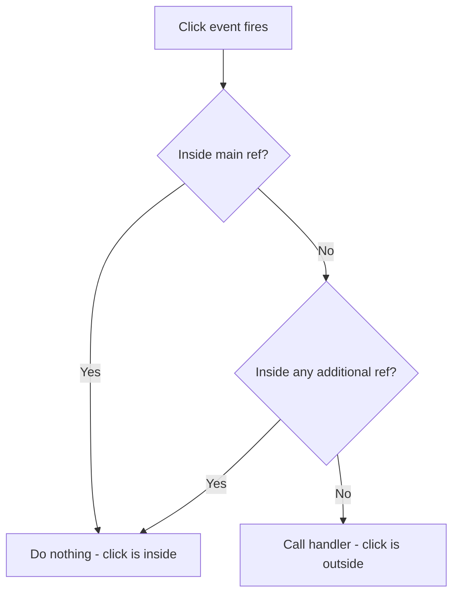

# How to Detect Click Outside a Component in React (Custom Hook)

You've built a dropdown menu. The user opens it, and now they click somewhere else on the page. The dropdown should close. This is such a common pattern  dropdowns, modals, popovers, autocomplete lists, context menus  and yet React doesn't ship a built-in way to detect click outside a component.

The solution is a custom hook using `useRef` and `useEffect`. I've refined this hook across a bunch of projects, and the version below handles the edge cases that simpler implementations miss  like portal-rendered content and mobile touch events.

## The Basic Approach

The core idea: attach a `mousedown` event listener to `document`, and check whether the click target is inside your component's DOM node. If it's outside, call a callback.

```typescript
import { useEffect, useRef, type RefObject } from 'react';

function useClickOutside<T extends HTMLElement>(
  handler: () => void
): RefObject<T | null> {
  const ref = useRef<T | null>(null);

  useEffect(() => {
    function handleClickOutside(event: MouseEvent) {
      if (ref.current && !ref.current.contains(event.target as Node)) {
        handler();
      }
    }

    document.addEventListener('mousedown', handleClickOutside);

    return () => {
      document.removeEventListener('mousedown', handleClickOutside);
    };
  }, [handler]);

  return ref;
}
```

Usage is clean:

```typescript
function Dropdown() {
  const [isOpen, setIsOpen] = useState(false);

  const dropdownRef = useClickOutside<HTMLDivElement>(() => {
    setIsOpen(false);
  });

  return (
    <div ref={dropdownRef}>
      <button onClick={() => setIsOpen(!isOpen)}>Menu</button>
      {isOpen && (
        <ul className="absolute mt-1 bg-white border rounded shadow-lg">
          <li>Option 1</li>
          <li>Option 2</li>
          <li>Option 3</li>
        </ul>
      )}
    </div>
  );
}
```

Attach the ref to the container element, pass a close handler, and the hook takes care of the rest. When the user clicks anywhere outside that `div`, `setIsOpen(false)` fires.

### Why mousedown Instead of click?

You might wonder why we listen for `mousedown` instead of `click`. Two reasons:

1. **Timing**  `mousedown` fires before `click`. This means the outside click handler runs before any `onClick` handlers inside the component. With `click`, you can get race conditions where the dropdown toggle button's `onClick` fires after the outside click handler, immediately reopening the dropdown.

2. **Drag interactions**  If a user starts a click inside the component (mousedown) and releases outside (mouseup), a `click` event fires on the element where the mouse was released. Using `mousedown` avoids false positives from this drag scenario.

## Adding Mobile Touch Support

`mousedown` doesn't fire on mobile. You need `touchstart` as well:

```typescript
function useClickOutside<T extends HTMLElement>(
  handler: () => void
): RefObject<T | null> {
  const ref = useRef<T | null>(null);

  useEffect(() => {
    function handleClickOutside(event: MouseEvent | TouchEvent) {
      if (ref.current && !ref.current.contains(event.target as Node)) {
        handler();
      }
    }

    document.addEventListener('mousedown', handleClickOutside);
    document.addEventListener('touchstart', handleClickOutside);

    return () => {
      document.removeEventListener('mousedown', handleClickOutside);
      document.removeEventListener('touchstart', handleClickOutside);
    };
  }, [handler]);

  return ref;
}
```

Same logic, two event listeners. Cleanup removes both. Mobile users can now tap outside a dropdown and it closes properly.

## Handling Portals

Here's where it gets tricky. If your dropdown renders via a React portal  say it's appended to `document.body` to avoid overflow clipping  the portal content is outside the ref'd container in the DOM tree, even though it's logically "inside" the component.

```typescript
// The dropdown menu is rendered in a portal  it's a child of <body>,
// not a child of the div with the ref. So ref.current.contains()
// returns false, and the click handler fires incorrectly.
function Dropdown() {
  const [isOpen, setIsOpen] = useState(false);
  const dropdownRef = useClickOutside<HTMLDivElement>(() => setIsOpen(false));

  return (
    <div ref={dropdownRef}>
      <button onClick={() => setIsOpen(!isOpen)}>Menu</button>
      {isOpen && createPortal(
        <ul className="dropdown-menu">...</ul>,
        document.body  // This is outside the ref's DOM tree!
      )}
    </div>
  );
}
```

The fix: support multiple refs. One for the trigger, one for the portal content:

```typescript
import { useEffect, useRef, type RefObject } from 'react';

function useClickOutside<T extends HTMLElement>(
  handler: () => void,
  ...additionalRefs: RefObject<HTMLElement | null>[]
): RefObject<T | null> {
  const ref = useRef<T | null>(null);

  useEffect(() => {
    function handleClickOutside(event: MouseEvent | TouchEvent) {
      const target = event.target as Node;

      // Check the main ref
      if (ref.current?.contains(target)) return;

      // Check additional refs (portal containers, etc.)
      for (const additionalRef of additionalRefs) {
        if (additionalRef.current?.contains(target)) return;
      }

      // Click was outside all refs
      handler();
    }

    document.addEventListener('mousedown', handleClickOutside);
    document.addEventListener('touchstart', handleClickOutside);

    return () => {
      document.removeEventListener('mousedown', handleClickOutside);
      document.removeEventListener('touchstart', handleClickOutside);
    };
  }, [handler, ...additionalRefs]);

  return ref;
}
```

Now you can handle portals:

```typescript
function DropdownWithPortal() {
  const [isOpen, setIsOpen] = useState(false);
  const menuRef = useRef<HTMLUListElement | null>(null);

  const triggerRef = useClickOutside<HTMLDivElement>(
    () => setIsOpen(false),
    menuRef // Also consider clicks inside the portal as "inside"
  );

  return (
    <div ref={triggerRef}>
      <button onClick={() => setIsOpen(!isOpen)}>Menu</button>
      {isOpen && createPortal(
        <ul ref={menuRef} className="dropdown-menu">
          <li>Option 1</li>
          <li>Option 2</li>
        </ul>,
        document.body
      )}
    </div>
  );
}
```

Clicks inside either the trigger container or the portal menu are treated as "inside." Only clicks outside both close the dropdown.



## TypeScript: Generic Ref Typing

Notice the generic `<T extends HTMLElement>` on the hook. This lets the caller specify exactly what kind of element the ref attaches to:

```typescript
// For a div container
const ref = useClickOutside<HTMLDivElement>(() => close());

// For a form
const ref = useClickOutside<HTMLFormElement>(() => close());

// For a nav element
const ref = useClickOutside<HTMLElement>(() => close());
```

The constraint `T extends HTMLElement` ensures you can only pass DOM element types  not `string` or `number` or something that doesn't have a `contains` method.

If you're working with `forwardRef` and need to pass this ref through to a child component, our guide on [React forwardRef with TypeScript](/blog/react-forwardref-typescript) covers the typing patterns. And for a deeper look at typing event handlers (like the `mousedown` event in this hook), check out [React TypeScript event handlers](/blog/react-typescript-event-handlers).

## The Complete, Production-Ready Hook

Here's the final version with everything included  mobile support, portal handling, and proper TypeScript:

```typescript
import { useEffect, useRef, useCallback, type RefObject } from 'react';

function useClickOutside<T extends HTMLElement>(
  handler: () => void,
  ...additionalRefs: RefObject<HTMLElement | null>[]
): RefObject<T | null> {
  const ref = useRef<T | null>(null);

  // Stabilize the handler reference
  const handlerRef = useRef(handler);
  handlerRef.current = handler;

  useEffect(() => {
    function listener(event: MouseEvent | TouchEvent) {
      const target = event.target as Node;

      if (ref.current?.contains(target)) return;

      for (const additionalRef of additionalRefs) {
        if (additionalRef.current?.contains(target)) return;
      }

      handlerRef.current();
    }

    document.addEventListener('mousedown', listener);
    document.addEventListener('touchstart', listener);

    return () => {
      document.removeEventListener('mousedown', listener);
      document.removeEventListener('touchstart', listener);
    };
  }, [...additionalRefs]);

  return ref;
}

export { useClickOutside };
```

One last detail  `handlerRef`. By storing the handler in a ref, we avoid adding `handler` to the useEffect dependency array. This means the effect doesn't re-run when the parent re-renders with a new closure (which happens every render unless the parent wraps the callback in `useCallback`). It's a subtle optimization, but it prevents unnecessary listener detach/reattach cycles.

## When to Reach for a Library Instead

This hook handles the vast majority of click-outside scenarios. But if you're building something complex  like nested popovers where clicking a parent popover shouldn't close the child  you might want a library like `@floating-ui/react` that handles all of this plus positioning, focus trapping, and accessibility.

For a simple dropdown, modal dismiss, or sidebar close? The hook above is all you need. It's 25 lines of code, zero dependencies, and you understand every line of it. That's kind of the whole point of building custom hooks  you keep the magic visible.

If you're building custom hooks like this across your project and converting them from JavaScript, [SnipShift's converter](https://snipshift.dev/js-to-ts) can help type the generics and ref types correctly. And for more custom hook patterns, our post on [typing custom hook returns in TypeScript](/blog/type-custom-hook-return-typescript) is a solid next read.
