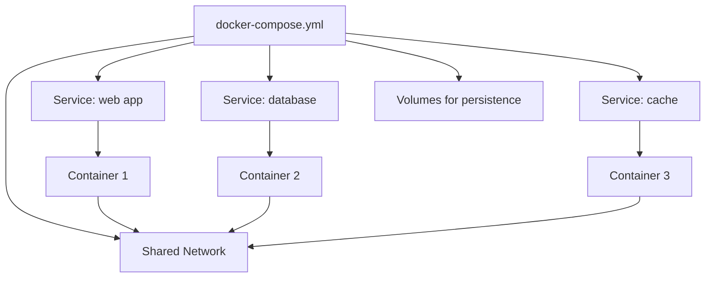

# Docker Compose Explained: A Beginner's Guide with Examples

I remember the first time someone told me to "just spin it up with Docker Compose." I nodded, opened a terminal, and had absolutely no idea what to type. The docs were dense, every tutorial assumed I already knew what a "service" was in this context, and I spent two hours debugging a YAML indentation error that turned out to be a single misplaced space.

If that sounds familiar, this guide is for you. I'm going to walk through **docker compose explained** from the ground up  what it actually is, how the YAML file works, and how to build real configurations you'd actually use at work. No hand-waving, no "just trust me" abstractions.

By the end, you'll be able to write a `docker-compose.yml` from scratch, understand every line in someone else's, and run multi-container setups like Node.js with Postgres or Next.js with Redis without breaking a sweat.

## What Is Docker Compose, Really?

Docker by itself lets you run one container at a time. That's fine when you're playing around with a single app. But real projects don't work that way. Your average web app has at least a server, a database, and maybe a cache or a message queue. Running `docker run` commands for each one  with all the flags for ports, volumes, networks, and environment variables  gets old fast.

Docker Compose is a tool that lets you define **all those containers in one YAML file** and manage them with a single command. Instead of five separate `docker run` invocations with 20 flags each, you write a `docker-compose.yml` and run `docker compose up`. Done.

Think of it this way: Docker is like hiring individual contractors. Docker Compose is like having a general contractor who coordinates the whole team.

Here's the mental model that helped me most:



One file defines everything. One command runs everything. One command stops everything. That's the pitch.

## The Anatomy of a docker-compose.yml File

Let's look at the simplest possible Compose file and build from there:

```yaml
services:
  web:
    image: node:20-alpine
    ports:
      - "3000:3000"
    working_dir: /app
    volumes:
      - ./:/app
    command: npm start
```

That's it. That's a valid Docker Compose file. Let's break down what each part means.

### The `services` Block

Everything in Docker Compose revolves around **services**. A service is basically a container definition  it tells Compose what image to use, what ports to expose, what command to run, and so on.

In the example above, we have one service called `web`. The name is arbitrary  you could call it `app` or `frontend` or `potato`. But pick something meaningful, because you'll reference it in other parts of the config and in commands like `docker compose logs web`.

### Images vs. Build

You can either pull a pre-built image or build your own from a Dockerfile:

```yaml
services:
  # Option 1: Use a pre-built image
  db:
    image: postgres:16-alpine

  # Option 2: Build from a Dockerfile
  api:
    build:
      context: .
      dockerfile: Dockerfile
    ports:
      - "4000:4000"
```

I use `image` for databases and third-party services, and `build` for my own application code. Pretty standard pattern.

### Ports

The `ports` mapping follows the format `HOST:CONTAINER`. So `"3000:3000"` means "map port 3000 on my machine to port 3000 inside the container." You can also map to a different port:

```yaml
ports:
  - "8080:3000"  # Access on localhost:8080, runs on 3000 inside
```

One gotcha that tripped me up early on: if you only need containers to talk to **each other** (not the outside world), you don't need `ports` at all. Containers on the same Docker network can reach each other by service name. More on that in a minute.

### Volumes  Persisting Data

Volumes are how you keep data alive between container restarts. Without volumes, every time you stop a container, its data vanishes. That's fine for your app server (it's stateless anyway), but very much not fine for your database.

There are two types you'll use regularly:

```yaml
services:
  db:
    image: postgres:16-alpine
    volumes:
      # Named volume  Docker manages the storage location
      - pgdata:/var/lib/postgresql/data

  web:
    build: .
    volumes:
      # Bind mount  maps a host directory into the container
      - ./src:/app/src
      - ./package.json:/app/package.json

volumes:
  pgdata:  # Declare the named volume
```

**Named volumes** (like `pgdata`) are managed by Docker and persist even when containers are removed. Use these for database data.

**Bind mounts** (like `./src:/app/src`) map a folder on your machine directly into the container. Use these for development so your code changes show up in the container without rebuilding.

> **Tip:** During development, bind-mount your source code but use named volumes for `node_modules`. This avoids the classic "my host's node_modules overwrites the container's" problem. Here's the trick:

```yaml
volumes:
  - ./:/app
  - /app/node_modules  # Anonymous volume  prevents overwrite
```

## Networks  How Containers Talk to Each Other

Here's something that confused me for way too long: Docker Compose **automatically creates a network** for your services. If you have a `web` service and a `db` service, the web container can reach the database at `db:5432`. No extra configuration needed.

The service name becomes the hostname. So in your Node.js app, your database connection string would be:

```javascript
// The hostname is the service name from docker-compose.yml
const connectionString = 'postgresql://user:password@db:5432/myapp';
```

You only need to define custom networks when you want isolation between groups of services:

```yaml
services:
  frontend:
    build: ./frontend
    networks:
      - front-tier

  api:
    build: ./api
    networks:
      - front-tier
      - back-tier

  db:
    image: postgres:16-alpine
    networks:
      - back-tier

networks:
  front-tier:
  back-tier:
```

In this setup, `frontend` can talk to `api`, and `api` can talk to `db`, but `frontend` **cannot** reach `db` directly. That's a solid security pattern for production-like environments.

## Environment Variables  The Config Glue

Almost every real-world Compose file uses environment variables. You have several options:

### Inline in the YAML

```yaml
services:
  api:
    image: node:20-alpine
    environment:
      - NODE_ENV=production
      - DATABASE_URL=postgresql://user:pass@db:5432/myapp
      - REDIS_URL=redis://cache:6379
```

### From an .env File

```yaml
services:
  api:
    image: node:20-alpine
    env_file:
      - .env
      - .env.local
```

I strongly prefer the `.env` file approach for anything beyond two or three variables. Keeps the YAML clean and lets you gitignore sensitive values.

And honestly, once your `.env` files start growing, you'll want proper type safety for those variables. If you're working in TypeScript, [SnipShift's Env to Types tool](https://snipshift.dev/env-to-types) can generate TypeScript types or Zod schemas from your `.env` file  so you catch missing or mistyped environment variables at build time instead of at 2am in production.

If you're juggling `.env.development`, `.env.production`, and `.env.test`, check out our guide on [managing multiple env files for different environments](/blog/manage-multiple-env-files)  it covers dotenv-flow, env-cmd, and how it all ties into Docker Compose.

### Variable Substitution

Docker Compose supports variable substitution from your shell or a `.env` file in the project root:

```yaml
services:
  db:
    image: postgres:${POSTGRES_VERSION:-16}-alpine
    environment:
      POSTGRES_PASSWORD: ${DB_PASSWORD:?Database password is required}
```

The `:-` syntax provides a default value. The `:?` syntax throws an error if the variable isn't set. Really useful for catching misconfiguration early.

## Real-World Pattern #1: Node.js + Postgres

Enough theory. Let's build something you'd actually use. Here's a complete Compose file for a Node.js API with PostgreSQL:

```yaml
services:
  api:
    build:
      context: .
      dockerfile: Dockerfile
    ports:
      - "4000:4000"
    environment:
      DATABASE_URL: postgresql://appuser:secretpass@db:5432/myapp
      NODE_ENV: development
    volumes:
      - ./src:/app/src
      - /app/node_modules
    depends_on:
      db:
        condition: service_healthy
    restart: unless-stopped

  db:
    image: postgres:16-alpine
    environment:
      POSTGRES_USER: appuser
      POSTGRES_PASSWORD: secretpass
      POSTGRES_DB: myapp
    ports:
      - "5432:5432"
    volumes:
      - pgdata:/var/lib/postgresql/data
      - ./init.sql:/docker-entrypoint-initdb.d/init.sql
    healthcheck:
      test: ["CMD-SHELL", "pg_isready -U appuser -d myapp"]
      interval: 5s
      timeout: 5s
      retries: 5

volumes:
  pgdata:
```

A few things worth calling out:

**`depends_on` with `condition: service_healthy`**  This is the modern way to handle service ordering. Without the health check condition, Docker just waits for the container to *start*, not for Postgres to actually be ready to accept connections. I've seen so many people get bitten by race conditions here. The `healthcheck` on the `db` service combined with the condition on `api` means your app won't start until Postgres is genuinely ready.

**`restart: unless-stopped`**  Your app crashes? It comes back automatically. You explicitly stop it? It stays stopped. Good default for development.

**The `init.sql` mount**  Postgres runs any `.sql` files in `/docker-entrypoint-initdb.d/` on first startup. Perfect for seeding tables or creating extensions.

## Real-World Pattern #2: Next.js + Redis

Here's another combo I use constantly  a Next.js app with Redis for caching or session storage:

```yaml
services:
  app:
    build:
      context: .
      dockerfile: Dockerfile
    ports:
      - "3000:3000"
    environment:
      REDIS_URL: redis://cache:6379
      NEXT_PUBLIC_API_URL: http://localhost:3000/api
    volumes:
      - ./src:/app/src
      - ./public:/app/public
      - /app/node_modules
      - /app/.next
    depends_on:
      - cache

  cache:
    image: redis:7-alpine
    ports:
      - "6379:6379"
    volumes:
      - redis-data:/data
    command: redis-server --appendonly yes --maxmemory 256mb --maxmemory-policy allkeys-lru

volumes:
  redis-data:
```

Notice the `--appendonly yes` flag on Redis  that enables persistence so your cached data survives restarts. The `--maxmemory-policy allkeys-lru` part tells Redis to evict the least-recently-used keys when it hits the memory limit. These are production-sensible defaults that most tutorials skip.

Also notice I'm excluding `/app/.next` from the bind mount. The Next.js build output can be huge and causes performance issues on macOS when bind-mounted. Let Docker handle that directory.

## The Essential Commands

Here's a quick reference table of the commands you'll use daily:

| Command | What It Does |
|---------|-------------|
| `docker compose up` | Start all services (foreground) |
| `docker compose up -d` | Start all services (background/detached) |
| `docker compose down` | Stop and remove containers |
| `docker compose down -v` | Stop, remove containers AND volumes |
| `docker compose logs -f` | Follow logs from all services |
| `docker compose logs -f api` | Follow logs from one service |
| `docker compose ps` | List running services |
| `docker compose exec api sh` | Open a shell in a running container |
| `docker compose build` | Rebuild images |
| `docker compose up --build` | Rebuild and start (my most-used combo) |
| `docker compose restart api` | Restart a single service |

The two I reach for most are `docker compose up --build -d` (rebuild and run in background) and `docker compose logs -f api` (watch my app's output).

> **Warning:** Be careful with `docker compose down -v`. The `-v` flag removes **named volumes** too  meaning your database data gets wiped. I've lost dev data this way more times than I care to admit. Use it intentionally, not habitually.

## Common Patterns and Tips

### Using Profiles for Optional Services

Sometimes you want services that only run in certain scenarios  like a database admin tool or a test runner:

```yaml
services:
  api:
    build: .
    ports:
      - "4000:4000"

  db:
    image: postgres:16-alpine

  # Only runs when you explicitly request it
  pgadmin:
    image: dpage/pgadmin4
    profiles:
      - debug
    ports:
      - "5050:80"
    environment:
      PGADMIN_DEFAULT_EMAIL: admin@local.dev
      PGADMIN_DEFAULT_PASSWORD: admin
```

Run `docker compose up` and only `api` and `db` start. Run `docker compose --profile debug up` and `pgadmin` joins the party too.

### Extending Configs with Multiple Files

For dev vs. production differences, you can layer Compose files:

```yaml
# docker-compose.yml (base)
services:
  api:
    build: .
    environment:
      NODE_ENV: production
```

```yaml
# docker-compose.override.yml (dev overrides  loaded automatically)
services:
  api:
    volumes:
      - ./src:/app/src
    environment:
      NODE_ENV: development
      DEBUG: "true"
    ports:
      - "4000:4000"
      - "9229:9229"  # Node.js debugger
```

Docker Compose automatically merges `docker-compose.yml` with `docker-compose.override.yml`. No extra flags needed. This is one of those features that's been there forever but somehow half the developers I meet don't know about it.

### Wait, the YAML Is Wrong!

If you're new to YAML  and let's be honest, Docker Compose YAML files are where a lot of people first encounter YAML in anger  you're going to hit indentation issues. YAML is whitespace-sensitive, and a single wrong space can change the entire meaning of your file.

When you're stuck debugging a Compose file, sometimes it helps to convert it to JSON to see the actual structure. [SnipShift's YAML to JSON converter](https://snipshift.dev/yaml-to-json) is handy for this  paste your YAML, see the JSON tree, and spot where the nesting went wrong.

For a deeper understanding of YAML itself, check out our [YAML syntax complete guide](/blog/yaml-syntax-complete-guide). It covers all the gotchas  the Norway problem, boolean strings, multiline syntax  that trip people up in Compose files.

## Docker Compose in 2026: What's Changed

A quick note if you're coming from older tutorials: the `docker-compose` command (with a hyphen) has been replaced by `docker compose` (with a space) as a subcommand of Docker CLI. They do the same thing, but the old standalone binary is deprecated. If you see `docker-compose` in a tutorial, just mentally replace it with `docker compose`.

Also, you no longer need the `version: "3.8"` line at the top of your Compose file. It was deprecated in Docker Compose v2. A lot of older tutorials and Stack Overflow answers still include it. It won't break anything if you leave it in, but it does nothing  so I leave it out for clarity.

## Putting It All Together

Here's my recommended starter template  the one I actually copy-paste when bootstrapping new projects:

```yaml
services:
  app:
    build:
      context: .
      target: development
    ports:
      - "${PORT:-3000}:3000"
    env_file:
      - .env
    volumes:
      - ./src:/app/src
      - /app/node_modules
    depends_on:
      db:
        condition: service_healthy
    restart: unless-stopped

  db:
    image: postgres:16-alpine
    env_file:
      - .env
    ports:
      - "5432:5432"
    volumes:
      - pgdata:/var/lib/postgresql/data
    healthcheck:
      test: ["CMD-SHELL", "pg_isready -U $${POSTGRES_USER} -d $${POSTGRES_DB}"]
      interval: 10s
      timeout: 5s
      retries: 5

volumes:
  pgdata:
```

It's not fancy. It doesn't try to do everything. But it covers 80% of what I need for a typical web project, and I can extend it from there.

Docker Compose is one of those tools that seems intimidating until you actually sit down and use it. The YAML is just a description of what you want, and Docker handles the rest. Start with one service, get it working, add a database, get that working, then layer on whatever else you need.

The best way to learn is to take an existing project  something you're already running locally with `npm run dev` and a separate database  and convert it to a Compose setup. You'll hit a few snags, Google a few error messages, and by the end of it you'll wonder why you didn't do it sooner.

And if you're spending time manually writing or converting between YAML and JSON for your config files, [SnipShift's converter tools](https://snipshift.dev) can save you the headache  especially when you're wrangling Compose files, CI configs, and Kubernetes manifests all in the same week.
