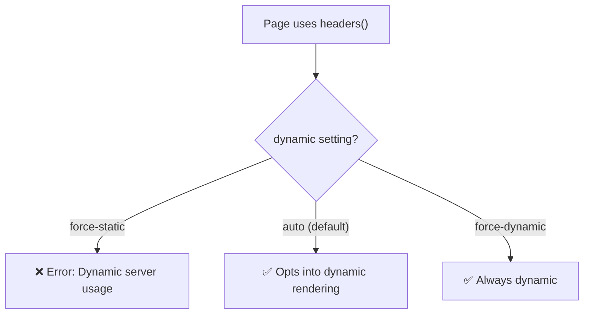

# How to Fix 'Cannot Read Headers in Server Component' in Next.js

You're trying to read a request header or a cookie in your Next.js Server Component, and you get hit with an error that says something like:

```
Error: headers() can only be used in a Server Component or Route Handler
```

Or maybe the more cryptic variant:

```
Error: Dynamic server usage: headers
```

The frustrating part? You *are* in a Server Component. At least, you think you are. So what gives?

I've debugged this error in three different projects now, and it almost always comes down to one of a few specific situations. Let me walk through the causes and fixes.

## Where `headers()` and `cookies()` Actually Work

First, let's be clear about where these functions are valid:

```tsx
import { headers, cookies } from 'next/headers'
```

These work in:
- **Server Components** (`page.tsx`, server-only components)
- **Route Handlers** (`route.ts`)
- **Middleware** (`middleware.ts`)
- **Server Actions** (functions marked with `'use server'`)

They do NOT work in:
- Client Components (anything with `'use client'`)
- `next.config.js`
- Static generation contexts where Next.js expects a static page

Here's a basic working example:

```tsx
// app/dashboard/page.tsx (Server Component  this works fine)
import { headers, cookies } from 'next/headers'

export default async function DashboardPage() {
  const headersList = await headers()
  const cookieStore = await cookies()

  const authToken = headersList.get('authorization')
  const theme = cookieStore.get('theme')?.value || 'light'

  return (
    <div className={theme}>
      <h1>Dashboard</h1>
      <p>Auth: {authToken ? 'Logged in' : 'Not logged in'}</p>
    </div>
  )
}
```

> **Tip:** In recent Next.js versions, `headers()` and `cookies()` return Promises. You need to `await` them. If you're getting type errors, this might be the issue  you might be on a newer version than your tutorial was written for.

## Cause #1: You're Accidentally in a Client Component

This is the most common cause by far. Your file doesn't have `'use client'` at the top, but it's *imported into* a file that does.

Remember: `'use client'` creates a **boundary**. Everything imported below it becomes a Client Component  even if those files don't have the directive themselves.

```tsx
// components/layout-wrapper.tsx
'use client'  // ← This makes everything it imports a Client Component

import { DashboardHeader } from './dashboard-header'  // ← Now a Client Component!
```

```tsx
// components/dashboard-header.tsx
// No 'use client' here, but it doesn't matter  it's imported
// into a Client Component, so it IS a Client Component
import { headers } from 'next/headers'

export function DashboardHeader() {
  const h = await headers()  // ❌ FAILS  this is actually a Client Component
  // ...
}
```

**Fix:** Check your import chain. Trace where your component is imported from and make sure no ancestor has `'use client'`. If you need header data in a Client Component, read it in a Server Component and pass it down as a prop.

## Cause #2: The `layout.tsx` Gotcha

Here's one that burned me. You try to read `headers()` in a `layout.tsx`, and it works... sometimes. Other times it doesn't, or you get strange caching behavior.

The issue is that `layout.tsx` **does not re-render on navigation**. Layouts are persistent  they stay mounted across page transitions within the same route segment. So if you read `headers()` in a layout, you get the headers from the *first* request, not subsequent navigations.

```tsx
// app/layout.tsx
import { headers } from 'next/headers'

export default async function RootLayout({ children }: { children: React.ReactNode }) {
  const headersList = await headers()
  const locale = headersList.get('accept-language')  // Only read on FIRST request

  return (
    <html lang={locale?.split(',')[0]}>
      <body>{children}</body>
    </html>
  )
}
```

This won't cause an error, but it can cause stale data. The layout caches on the first render and won't re-execute `headers()` on subsequent soft navigations.

**Fix:** If you need per-request header data, read it in `page.tsx` instead of `layout.tsx`. Or move the header-dependent logic into a Server Component that's rendered fresh per page.

## Cause #3: Dynamic Rendering Conflict

`headers()` is a **dynamic function**. Calling it opts the page out of static generation. But what if you've explicitly configured the page for static rendering?

```tsx
// ❌ This conflicts  you're saying "be static" but using a dynamic function
export const dynamic = 'force-static'

import { headers } from 'next/headers'

export default async function Page() {
  const h = await headers()  // 💥 Conflict!
}
```

Next.js can't statically generate a page that reads request headers  headers don't exist at build time. You'll get an error about dynamic server usage.

**Fix:** Remove `force-static` or don't use `headers()`. If you need partial static behavior, move the header-dependent logic into a separate Server Component and use the composition pattern.



## Cause #4: The Request Waterfall Issue

This isn't an error, but it's a performance problem worth knowing about. When multiple Server Components in the same render tree call `headers()` or `cookies()`, they create a **request waterfall**  each one reads headers sequentially, not in parallel.

```tsx
// Both of these call headers()  they execute sequentially, not parallel
async function UserNav() {
  const h = await headers()
  const userId = h.get('x-user-id')
  const user = await getUser(userId!)
  return <nav>{user.name}</nav>
}

async function NotificationBell() {
  const h = await headers()
  const userId = h.get('x-user-id')
  const count = await getUnreadCount(userId!)
  return <span>🔔 {count}</span>
}
```

**Fix:** Read headers once in a parent component and pass the values down as props:

```tsx
// app/dashboard/page.tsx
import { headers } from 'next/headers'

export default async function DashboardPage() {
  const h = await headers()
  const userId = h.get('x-user-id')!

  // Now pass userId down  no redundant headers() calls
  return (
    <div>
      <UserNav userId={userId} />
      <NotificationBell userId={userId} />
    </div>
  )
}
```

## Quick Diagnostic Checklist

If you're hitting this error, check these in order:

1. **Is the file (or any of its parents) marked `'use client'`?** If yes, that's your problem. Move header reading to a Server Component above the client boundary.

2. **Are you `await`-ing the result?** In newer Next.js versions, `headers()` returns a Promise. Forgetting `await` gives confusing errors.

3. **Is the route set to `force-static`?** Remove it or restructure your component tree.

4. **Are you in `layout.tsx`?** It works, but the data might be stale on soft navigations. Consider reading headers in `page.tsx` instead.

5. **Are you importing from `next/headers`?** Double-check  I've seen people accidentally import from the wrong package.

For more context on the `'use client'` boundary and how it affects which code runs where, check out [understanding 'use server' vs 'use client' directives](/blog/nextjs-use-server-vs-use-client). And if you're interested in what middleware can and can't do with headers, the post on [Next.js middleware capabilities and limitations](/blog/nextjs-middleware-capabilities-limitations) covers that in detail.

If you're converting existing JavaScript components to TypeScript during this kind of refactor, [SnipShift's JS to TypeScript converter](https://snipshift.dev/js-to-ts) can speed things up  it'll properly type your `headers()` and `cookies()` return values so you catch these issues at compile time rather than runtime.

The headers error is one of those Next.js moments that feels like a bug but is actually the framework trying to tell you something about your component boundaries. Once you understand where Server Components end and Client Components begin, the fix is usually a 2-minute restructure  not a rewrite.
