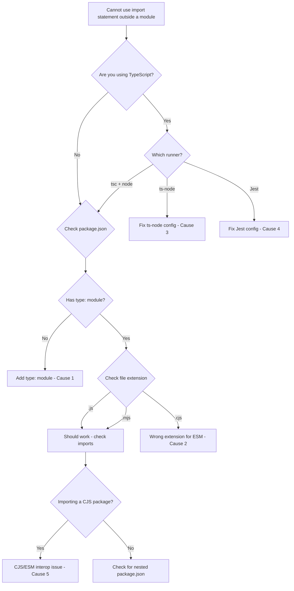

# Fix: 'Cannot Use Import Statement Outside a Module' in Node.js

You're staring at this:

```
SyntaxError: Cannot use import statement outside a module
```

And you're annoyed. You *know* your code is fine. You've used `import` in a hundred other projects. But Node.js just doesn't care about your feelings  it sees an `import` statement in a file it considers CommonJS, and it bails.

I've hit this error more times than I'd like to admit. A team I worked with once lost half a day to it during a migration from `require()` to ES Modules. The root cause was a single missing line in `package.json`. That's the thing about this error  it's almost always a configuration issue, not a code issue.

Let me walk you through every cause, so you can fix it in minutes instead of hours.

## Quick Diagnosis: Which Fix Do You Need?

Before we get into the details, here's a decision tree to figure out which cause applies to your situation:



## Cause 1: Missing `"type": "module"` in package.json

This is the cause about 80% of the time. And it's the easiest fix.

By default, Node.js treats `.js` files as **CommonJS**. That means `require()` works, but `import` doesn't. If you want to use `import`/`export` syntax, you have to explicitly tell Node your project uses ES Modules.

**The fix:**

Open your `package.json` and add the `type` field:

```json
{
  "name": "my-project",
  "version": "1.0.0",
  "type": "module",
  "scripts": {
    "start": "node src/index.js"
  }
}
```

That's it. One line: `"type": "module"`. Now every `.js` file in your project is treated as an ES Module.

> **Warning:** Adding `"type": "module"` affects *all* `.js` files in your package. If you have any files still using `require()`, they'll break with `ReferenceError: require is not defined`. You'll need to either convert them to `import` syntax or rename them to `.cjs`. Our [JS to TypeScript converter](https://snipshift.dev/js-to-ts) can help automate that conversion if you're doing it at scale.

**But what if you don't want the whole project to be ESM?** That's where file extensions come in.

## Cause 2: Wrong File Extension

Node.js uses file extensions as a per-file override for the module system. This is something a lot of developers don't realize  the extension isn't just cosmetic.

Here's the full breakdown:

| Extension | Module System | When to Use |
|-----------|---------------|-------------|
| `.js` | Determined by `"type"` in package.json | Default for most projects |
| `.mjs` | Always ES Modules | When you want ESM in a CJS project |
| `.cjs` | Always CommonJS | When you want CJS in an ESM project |
| `.ts` | Determined by tsconfig + runner | TypeScript source files |
| `.mts` | Always ES Modules (TypeScript) | TypeScript ESM source files |
| `.cts` | Always CommonJS (TypeScript) | TypeScript CJS source files |

So if you don't want to change your `package.json`, you can rename your file from `app.js` to `app.mjs`:

```bash
mv src/index.js src/index.mjs
node src/index.mjs
```

Node will treat `.mjs` files as ES Modules regardless of what `package.json` says. This is useful when you want to introduce ESM to a project gradually  one file at a time  without flipping a global switch.

My honest take: just set `"type": "module"` and be done with it. Using `.mjs` everywhere feels clunky, and most modern tooling expects ESM these days. But `.mjs` is handy for one-off scripts in an otherwise CommonJS project.

For a deeper comparison of the two module systems, check out our guide on [CommonJS vs ES Modules in Node.js](/blog/commonjs-vs-es-modules-node).

## Cause 3: ts-node Configuration Issues

If you're running TypeScript with `ts-node`, this error is incredibly common. And it's confusing because you might think "I have TypeScript configured correctly  why is Node complaining about `import`?"

Here's what's happening: `ts-node` compiles your TypeScript to JavaScript on the fly, and the *compiled output* needs to match what Node expects. If your `tsconfig.json` emits CommonJS but your project expects ESM (or vice versa), you'll get this error.

**Fix for ESM projects (with `"type": "module"` in package.json):**

```json
// tsconfig.json
{
  "compilerOptions": {
    "module": "ESNext",
    "moduleResolution": "bundler",
    "esModuleInterop": true,
    "target": "ES2022"
  },
  "ts-node": {
    "esm": true
  }
}
```

The critical piece is `"esm": true` inside the `ts-node` block. Without it, ts-node defaults to CommonJS transpilation even in an ESM project.

**Running ts-node with ESM:**

```bash
# Use the --esm flag
ts-node --esm src/index.ts

# Or use the ESM loader (Node 18+)
node --loader ts-node/esm src/index.ts
```

**Fix for CJS projects (no `"type": "module"`):**

```json
// tsconfig.json
{
  "compilerOptions": {
    "module": "commonjs",
    "moduleResolution": "node",
    "esModuleInterop": true,
    "target": "ES2022"
  }
}
```

With `"module": "commonjs"`, ts-node compiles your `import` statements into `require()` calls, and Node is happy. This is actually the path of least resistance if you're just running scripts locally and don't care about shipping ESM.

> **Tip:** If you're migrating from `require()` to `import`, we have a dedicated guide on [converting require to import in TypeScript](/blog/convert-require-to-import-typescript) that covers all the edge cases.

## Cause 4: Jest Configuration Issues

Jest and ES Modules have had a rocky relationship. By default, Jest uses its own module system that understands CommonJS but needs extra configuration for ESM.

**Option A: Use ts-jest with CommonJS (easiest)**

This is what most teams do. Let `ts-jest` handle the transpilation and don't worry about ESM in your test runner:

```javascript
// jest.config.js (or jest.config.ts)
export default {
  preset: 'ts-jest',
  testEnvironment: 'node',
  transform: {
    '^.+\\.tsx?$': ['ts-jest', {
      useESM: false,
      tsconfig: 'tsconfig.json'
    }]
  }
};
```

**Option B: Use Jest with ESM support (experimental)**

If you really need native ESM in Jest, you can enable it  but fair warning, it's still flagged as experimental even in 2026:

```javascript
// jest.config.js
export default {
  preset: 'ts-jest/presets/default-esm',
  testEnvironment: 'node',
  extensionsToTreatAsEsm: ['.ts'],
  transform: {
    '^.+\\.tsx?$': ['ts-jest', {
      useESM: true
    }]
  }
};
```

Then run Jest with the VM modules flag:

```bash
NODE_OPTIONS='--experimental-vm-modules' npx jest
```

**Option C: Switch to Vitest**

I'm going to be opinionated here  if you're starting a new project in 2026 and ESM is important to you, just use Vitest. It handles ES Modules natively with zero configuration headaches. A team I worked with switched from Jest to Vitest specifically because of ESM issues, and the migration took less than an afternoon.

```javascript
// vitest.config.ts
import { defineConfig } from 'vitest/config';

export default defineConfig({
  test: {
    environment: 'node',
    globals: true
  }
});
```

No flags. No experimental features. It just works.

## Cause 5: CommonJS Module Trying to Import ESM

This one is subtle and often shows up when you're mixing module systems  either within your own project or when consuming a third-party package that's ESM-only.

**The rule:** CommonJS can't `require()` an ES Module. But ES Modules *can* `import` CommonJS.

So if you have a CJS file trying to use a package that ships only ESM, you'll hit errors. This has become more common as popular packages  like `node-fetch` v3, `chalk` v5, and `got` v12+  have gone ESM-only.

**Fix 1: Switch your project to ESM**

The cleanest solution. Add `"type": "module"` to `package.json` and convert your `require()` calls to `import`. Use our [JS to TypeScript converter](https://snipshift.dev/js-to-ts) on [SnipShift.dev](https://snipshift.dev) to handle the syntax conversion automatically.

**Fix 2: Use dynamic `import()` in CommonJS**

If you can't switch to ESM, you can use the dynamic `import()` function  it works in CommonJS files:

```javascript
// This works in a CJS file
async function main() {
  const { default: fetch } = await import('node-fetch');
  const response = await fetch('https://api.example.com/data');
  console.log(await response.json());
}

main();
```

The catch is that `import()` is asynchronous, so you'll need to wrap your code in an async function. It's not pretty, but it works.

**Fix 3: Pin the older CJS version of the package**

Sometimes you just need to ship. If a package recently went ESM-only and you're stuck in CommonJS land, you can pin the last version that supported CJS:

```bash
# node-fetch v2 is CommonJS, v3+ is ESM-only
npm install node-fetch@2
```

This is a band-aid, not a long-term solution. But it buys you time.

## The Full File Extension vs Module System Reference

Here's a comprehensive table that ties everything together  the interaction between `package.json`, file extensions, and what Node actually does:

| `"type"` in package.json | File Extension | Module System Used | `import` works? | `require()` works? |
|---------------------------|----------------|--------------------|------------------|---------------------|
| `"module"` | `.js` | ESM | Yes | No |
| `"module"` | `.cjs` | CommonJS | No | Yes |
| `"module"` | `.mjs` | ESM | Yes | No |
| `"commonjs"` (or absent) | `.js` | CommonJS | No | Yes |
| `"commonjs"` (or absent) | `.cjs` | CommonJS | No | Yes |
| `"commonjs"` (or absent) | `.mjs` | ESM | Yes | No |

The pattern is simple once you see it: `.mjs` is *always* ESM, `.cjs` is *always* CommonJS, and `.js` follows whatever `"type"` says (defaulting to CommonJS if `"type"` is missing).

## Still Stuck?

If none of the above fixes your issue, here are a couple of less common causes to check:

- **Nested `package.json` files.** Node resolves the *nearest* `package.json` when determining the module type. If a subdirectory has its own `package.json` without `"type": "module"`, files in that directory default back to CommonJS. This catches people off guard in monorepos.
- **Bundler misconfiguration.** If you're using webpack, esbuild, or Rollup, the error might be coming from your build tool rather than Node itself. Check your bundler's module settings.
- **Old Node.js version.** ES Module support was stabilized in Node 14. If you're somehow still running Node 12 or earlier  first, please upgrade  you'll need the `--experimental-modules` flag.

## Wrapping Up

The "cannot use import statement outside a module" error always comes down to one thing: Node.js thinks your file is CommonJS, but you're using ESM syntax. The fix is making Node recognize your file as an ES Module  whether that's through `package.json`, file extensions, or tool-specific configuration.

My recommendation for new projects in 2026: set `"type": "module"` in your `package.json` from day one, use `.js` extensions, and don't look back. The ecosystem has mostly caught up, and the tooling headaches are way less painful than they were even two years ago.

And if you're converting an older project from CommonJS to modern imports, [SnipShift's JS to TypeScript converter](https://snipshift.dev/js-to-ts) can handle the `require()` to `import` syntax conversion for you  so you can focus on fixing the config rather than rewriting every file by hand.
