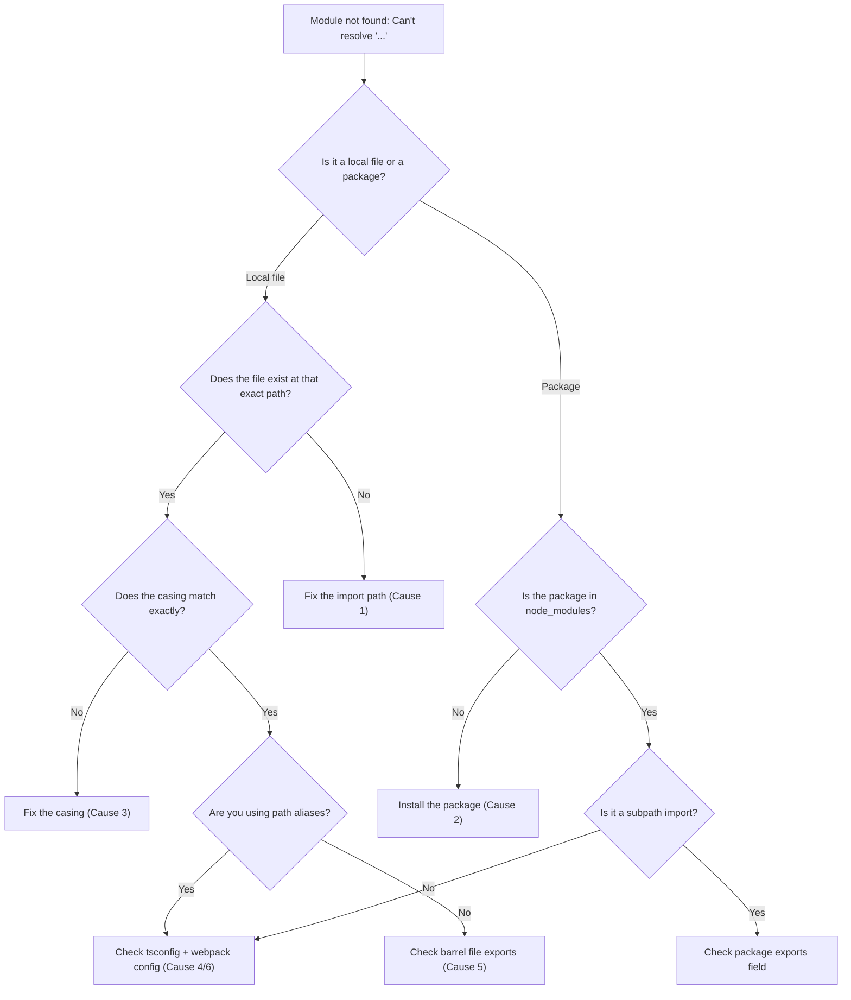

# Fix: 'Module Not Found: Can't Resolve' in Next.js / Webpack

You're running `next dev` or kicking off a production build, and the terminal spits this out:

```
Module not found: Can't resolve './components/Header'
```

Or maybe it's a package:

```
Module not found: Can't resolve 'lodash/debounce'
```

Either way, your build is dead. And the frustrating part? This error has at least six completely different root causes. The message is always the same unhelpful line  Webpack just tells you it can't find the thing, not *why* it can't find the thing.

I've hit every single one of these over the years. A team I worked with once lost half a day to the case-sensitivity variant (more on that below). So here's the full breakdown  every cause I've encountered, how to diagnose it, and how to fix it fast.

## Diagnostic Flowchart

Before we get into details, here's a quick decision tree you can follow:



## Quick Reference: Common Causes and Fixes

| # | Cause | Typical Error | Fix |
|---|-------|--------------|-----|
| 1 | Wrong import path | `Can't resolve './components/Hedaer'` | Fix the typo or relative path |
| 2 | Missing package | `Can't resolve 'framer-motion'` | `npm install framer-motion` |
| 3 | Case sensitivity | `Can't resolve './Components/Header'` | Match the exact filename casing |
| 4 | tsconfig paths not in webpack | `Can't resolve '@/lib/utils'` | Align `tsconfig.json` paths with Next.js or add webpack aliases |
| 5 | Barrel file issues | `Can't resolve` on a re-exported module | Fix the barrel `index.ts` or import directly |
| 6 | Missing resolve alias in next.config.js | `Can't resolve 'shared-utils'` | Add a `webpack.resolve.alias` entry |

Now let's walk through each one.

## 1. Wrong Import Path

This is the most common cause, and honestly, it's just a typo or a wrong relative path. It happens to everyone.

```typescript
// ❌ The file is actually at ./components/Header.tsx
import Header from './component/Header';
```

The fix is obvious once you see it. But when you've got 50 files open and you're refactoring folder structure, these sneak in constantly.

**How to catch it quickly:**

- Hover over the import in VS Code  if it's red-underlined, the path is wrong
- Use auto-import (Ctrl+Space) instead of typing paths manually
- After moving files, run `next build` to catch any broken paths across the whole project

```typescript
// ✅ Correct path
import Header from './components/Header';
```

> **Tip:** If you're migrating a JS project to TypeScript, broken import paths are one of the most common issues. [SnipShift's JS-to-TS converter](https://snipshift.dev/js-to-ts) can help you catch these during conversion.

One thing that trips people up  if you're importing from a file without an extension, Webpack resolves `.js`, `.jsx`, `.ts`, `.tsx` in order. But if your file has a non-standard extension or is sitting inside a folder that *also* has an `index` file, you might be pulling in the wrong module entirely.

## 2. Missing Package (Not Installed)

You cloned a repo and forgot `npm install`. Or someone on your team added a dependency and you pulled their code without reinstalling. Or  and this is the one that gets me  you installed the package in the wrong workspace of a monorepo.

```
Module not found: Can't resolve 'framer-motion'
```

**The fix:**

```bash
npm install framer-motion
```

**But also check these:**

- Did you install it as a `devDependency` when it needs to be a regular `dependency`? In Next.js, anything imported in your components needs to be in `dependencies`, not `devDependencies`, for production builds to work.
- Are you in a monorepo? Make sure the package is installed in the right workspace. With pnpm workspaces, a package installed at the root isn't automatically available to all packages.
- Did your `node_modules` get corrupted? When in doubt: `rm -rf node_modules package-lock.json && npm install`. Nuclear option, but it works.

```bash
# The nuclear option
rm -rf node_modules package-lock.json
npm install
```

## 3. Case Sensitivity  The Deployment Gotcha

This one is sneaky, and it's my personal pick for the most frustrating variant. Here's why: macOS and Windows file systems are case-*insensitive* by default. Linux is case-*sensitive*. So this import works perfectly on your Mac:

```typescript
import Button from './components/button'; // file is actually Button.tsx
```

Runs fine locally. Tests pass. You push to CI or deploy to Vercel  and it explodes. Because the Linux build server sees `button` and `Button` as two completely different things.

A team I worked with had this exact problem. Everything green locally, every deploy failing. It took us way too long to realize the issue was a single lowercase `b`.

**How to prevent it:**

- Use a linter rule. The `import/no-unresolved` rule from `eslint-plugin-import` can catch this.
- Run `git config core.ignorecase false` in your repo so Git tracks case changes.
- Name your files consistently. I like kebab-case for everything (`header.tsx`, `user-profile.tsx`)  it eliminates the problem entirely because there are no capital letters to get wrong.

```bash
# Tell Git to stop ignoring case changes
git config core.ignorecase false
```

> **Warning:** If you're renaming a file just to fix casing (e.g., `button.tsx` to `Button.tsx`), Git on macOS might not detect the change. Use `git mv` instead: `git mv button.tsx Button.tsx`.

## 4. tsconfig Paths Not Matched by Webpack

You set up beautiful path aliases in your `tsconfig.json`:

```json
{
  "compilerOptions": {
    "baseUrl": ".",
    "paths": {
      "@/*": ["src/*"],
      "@components/*": ["src/components/*"]
    }
  }
}
```

TypeScript is happy. Your IDE is happy. But Webpack? Webpack doesn't read your `tsconfig.json` by default. It has its own module resolution system.

The good news: **Next.js does handle this automatically**  as long as you're using the built-in `@/*` path alias pattern and your `tsconfig.json` is in the project root. Next.js reads your tsconfig paths and configures Webpack for you.

But if it's not working, check these:

1. Make sure `baseUrl` is set in `tsconfig.json`
2. Restart the dev server after changing `tsconfig.json`  Next.js reads it at startup
3. If you have a custom Webpack config, you might be overriding the automatic resolution

For custom Webpack setups outside of Next.js, you'll need `tsconfig-paths-webpack-plugin`:

```bash
npm install --save-dev tsconfig-paths-webpack-plugin
```

```javascript
// webpack.config.js
const TsconfigPathsPlugin = require('tsconfig-paths-webpack-plugin');

module.exports = {
  resolve: {
    plugins: [new TsconfigPathsPlugin()]
  }
};
```

For a deeper look at configuring path aliases and making them work across your toolchain, check out our [guide to tsconfig paths and import aliases](/blog/tsconfig-paths-import-alias).

## 5. Barrel File Issues

Barrel files  those `index.ts` files that re-export everything from a folder  are convenient, but they can cause subtle "module not found" errors.

```typescript
// src/components/index.ts (the barrel file)
export { Header } from './Header';
export { Footer } from './Footer';
// Oops, forgot to export Sidebar
```

Now somewhere else:

```typescript
import { Sidebar } from '@/components'; // Module not found!
```

The barrel file exists. The `Sidebar` component exists. But the barrel doesn't re-export it, so Webpack can't resolve the import.

**Other barrel file problems:**

- **Circular dependencies.** If `ComponentA` imports from the barrel, and the barrel imports `ComponentA`, you've got a circular reference. Webpack sometimes handles this gracefully. Sometimes it doesn't, and you get a cryptic module-not-found error instead of a useful circular dependency warning.
- **Performance.** Barrel files can pull in your entire component library even when you only need one thing. This isn't a "module not found" problem, but it's worth mentioning  if you're seeing slow builds, barrel files might be the culprit.

**My take:** I've gone back and forth on barrel files over the years. These days, I mostly avoid them in application code and only use them in library packages where the public API surface is intentional. For app code, direct imports are clearer and create fewer problems.

```typescript
// Instead of importing from the barrel:
import { Sidebar } from '@/components';

// Import directly:
import { Sidebar } from '@/components/Sidebar';
```

## 6. next.config.js Resolve Aliases

Sometimes you need Webpack-level aliases that go beyond what tsconfig paths give you. Maybe you're aliasing a package to a different version, mocking a module for tests, or pointing to a shared library outside your project root.

In Next.js, you can do this in `next.config.js`:

```javascript
// next.config.js
/** @type {import('next').NextConfig} */
const nextConfig = {
  webpack: (config) => {
    config.resolve.alias = {
      ...config.resolve.alias,
      'shared-utils': require.resolve('../shared/utils'),
      // Or replace a heavy package with a lighter alternative
      'moment': 'dayjs',
    };
    return config;
  },
};

module.exports = nextConfig;
```

A few gotchas here:

- **Always spread the existing aliases** (`...config.resolve.alias`). If you overwrite the object entirely, you'll blow away Next.js's built-in aliases and break everything.
- **Remember that this only affects the Webpack build.** Your IDE and TypeScript compiler won't know about these aliases. You'll probably want matching entries in `tsconfig.json` too.
- **`resolve.modules`** is another option  you can add directories to the module search path:

```javascript
config.resolve.modules = [
  ...config.resolve.modules,
  path.resolve(__dirname, 'src'),
];
```

This lets you import from `src/` without relative paths, though honestly, tsconfig paths are a cleaner solution for this in most cases.

## Debugging Tips That Apply to All Cases

When you're stuck and none of the above seems to apply, here are some general debugging strategies:

**1. Check the exact error message.** Webpack tells you the file it was trying to import *from* and the module it couldn't resolve. Read both carefully.

```
Module not found: Can't resolve './utils' in '/Users/you/project/src/components'
```

This tells you it's looking for a `utils` file inside `src/components/`. Is that where you expected it to look?

**2. Clear all caches.**

```bash
rm -rf .next node_modules/.cache
npm run dev
```

Next.js and Webpack both cache aggressively. A stale cache can make you think a fix didn't work when it actually did.

**3. Check your file extensions.** If you recently [converted JavaScript files to TypeScript](/blog/fix-cannot-find-module-typescript), you might have imports pointing to `.js` files that are now `.ts` or `.tsx`. Webpack's resolve config determines which extensions it tries automatically.

**4. Look at `resolve.extensions` in your Webpack config.** By default, Next.js resolves `.tsx`, `.ts`, `.jsx`, `.js`, `.json`, and more. But if you've customized this, you may have accidentally dropped one.

## When You're Migrating JS to TS

A huge number of "module not found" errors happen during JavaScript-to-TypeScript migrations. You're renaming `.js` files to `.ts`, moving things around, adding path aliases  it's a recipe for broken imports.

If you're in the middle of a migration, [SnipShift's JS-to-TS converter](https://snipshift.dev/js-to-ts) can help you convert files while keeping your imports intact. It handles the syntax transformation so you can focus on fixing the type errors instead of chasing down broken module paths.

And if you're setting up TypeScript for the first time in an existing project, make sure your module resolution is configured correctly from the start. Our post on [fixing "cannot find module" in TypeScript](/blog/fix-cannot-find-module-typescript) covers the TypeScript-specific side of this problem in detail.

---

The "module not found" error is one of those things that looks simple but has a surprisingly long list of causes. The good news is that once you've seen each variant a couple of times, you'll be able to diagnose it in seconds just from the error message and context. Bookmark this page, and next time Webpack yells at you, check the flowchart first  it'll save you time.

Got a variant I didn't cover? Hit us up on [SnipShift](https://snipshift.dev)  we're always adding to these guides.
